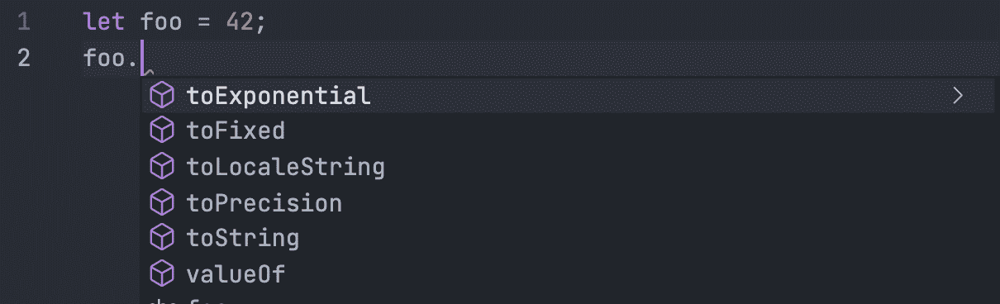

# 利用 JSDoc 注释标签充分利用 VSCode 的智能感知

> 原文：<https://javascript.plainenglish.io/how-to-utilise-jsdoc-comment-tags-so-that-visual-studio-code-intellisense-works-great-f3b2ce2ba276?source=collection_archive---------4----------------------->

JSDoc 是 JavaScript 代码注释的标准。让我们了解如何利用这一点，使其在 VSCode 的智能感知中发挥巨大作用。

# JavaScript 中的类型

JavaScript 是一种松散类型的动态语言。JavaScript 中的变量并不直接与任何特定的值类型相关联，任何变量都可以被赋予(和重新赋予)所有类型的值:

# VSCode 中的智能感知

Visual Studio 代码的智能感知只有在理解您的代码的`type`时才能工作。

在上面的例子中，在你写完第一行之后，`let foo = 42;`它会向你展示一个数字的方法:

但是如果你分配一个 JSON，它将保存许多属性，比如`id`、`createdOn`等等，那该怎么办呢？

它也运行良好。但是，你的变量不太可能通过初始化来保存值。因此，现在如果您检查空白 JSON，IntelliSense 将停止工作，因为现在 VSCode 不知道类型。

如果没有适当的智能感知，我们经常会打错字，调用不存在的方法，甚至试图通过随机猜测来访问对象的属性。

为了处理这种(以及更复杂的)场景，并确保智能感知在这些场景中正常工作，我们将使用 [JSDoc](https://jsdoc.app/) 的`@param`、`@type`和`@typedef`块标签。

# JSDoc 来拯救

JSDoc 附带了许多标签。你可以在网站上找到他们:[https://jsdoc.app/](https://jsdoc.app/)。

但是在本文中，我们将重点关注以下 3 个标签:

> *`*@param*`*标签提供了函数参数的名称、类型和描述。**
> 
> **`*@param*`*标签要求您指定正在记录的参数的名称。还可以包括参数的类型(用花括号括起来)和参数的描述。***

**让我们看一些例子。**

**在上面的代码之后，每当您试图调用`sayHello`时，VSCode 的 IntelliSense 都会工作得很好:**

****

**你可以在 https://jsdoc.app/tags-param.html#examples 看更多的例子。**

> ***`*@type*`*标签允许你提供一个类型表达式，标识一个符号可能包含的值的类型，或一个函数返回的值的类型。您还可以使用许多其他 JSDoc 标记来包含类型表达式，例如* `*@param*` *标记。****
> 
> ***一个类型表达式可以包含一个符号的 JSDoc namepath(例如，*`*myNamespace.MyClass*`*)；一个内置的 JavaScript 类型(例如*`*string*`*)；或者这些的组合。可以使用任何* [*Google 闭包编译器类型表达式*](https://github.com/google/closure-compiler/wiki/Annotating-JavaScript-for-the-Closure-Compiler#type-expressions) *，以及 JSDoc 特有的其他几种格式。***

**让我们来看一个例子:**

**对于上面的代码，键入`foo.`将加载所有`Array`的属性和方法:**

****

**更多例子在[https://jsdoc.app/tags-type.html#examples](https://jsdoc.app/tags-type.html#examples)**

> ***`*@typedef*`*标签对于记录自定义类型很有用，尤其是当你希望重复引用它们的时候。然后，这些类型可以在其他需要类型的标记中使用，如* `*@type*` *或* `*@param*` *。****

**这个标签真的很有帮助，它帮助我们塑造任何复杂的类型。让我们看一个例子。**

**此示例定义了一个更复杂的类型，一个具有多个属性的对象，并设置了它的命名路径，以便它将与使用该类型的类一起显示。因为类型定义实际上不是由函数公开的，所以习惯上将类型定义记录为内部成员。**

**下面是上述代码的分解:**

**第一行:**

1.  **我们首先指出我们想要使用`@typedef`标签创建一个定制类型。**
2.  **然后我们表示这将是一个`Object`。您还可以使用原始日期类型创建一个更简单的自定义类型，例如，`string`或`number`。**
3.  **最后，我们将这种类型命名为`Toast`。**

**现在，由于`Toast`将会是一个`Object`，在其余的注释中，我们使用`@property`标签定义了它的`properties`将会是什么。点击可以了解更多`@property`标签[。](https://jsdoc.app/tags-property.html)**

**现在，如果您尝试调用`showToast`，VSCode 将发挥它的魔力:**

****

**但这还不够。在实际场景中，您将在不同的文件中生成`Toast`并从那里调用`showToast`。可以在其他文件中导出和导入`showToast`，但是`Toast`类型定义呢？**

**您也可以像从另一个模块导入绑定一样导入类型定义。但是由于类型是在注释中创建的，您需要在注释中导入它们:**

**只是强调一下，下面是我们如何导入`Toast`类型定义的:**

**你可以在 https://jsdoc.app/tags-typedef.html 了解更多关于`@typedef`的信息。**

# **奖金**

**通过在函数声明前键入`/**`快速创建函数的 JSDoc 注释，并选择 JSDoc 注释片段建议:**

****

# **结论**

**我们了解了 JSDoc 块标签`@param`、`@type`和`@typedef`如何帮助我们最大限度地利用 VSCode 的智能感知并更快地编码，同时避免不必要的问题。**

**就是这样！感谢阅读。请在评论区告诉我你的想法和反馈。**

**是的，永远相信自己。🌅**

****

**约书亚·厄尔在 [Unsplash](https://unsplash.com/s/photos/faith?utm_source=unsplash&utm_medium=referral&utm_content=creditCopyText) 上拍摄的照片**

***原载于*[*https://blog . shhdharmen . me*](https://blog.shhdharmen.me/how-to-utilise-jsdoc-comment-tags-so-that-visual-studio-code-intellisense-works-great)**

***更多内容请看*[***plain English . io***](http://plainenglish.io/)**