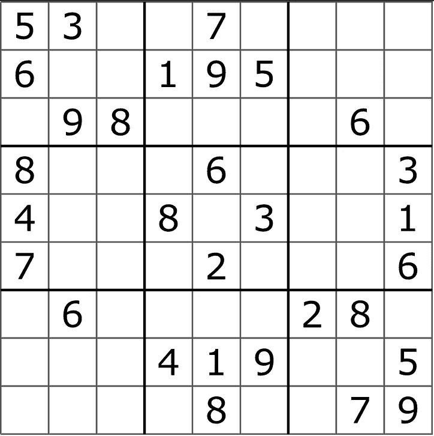
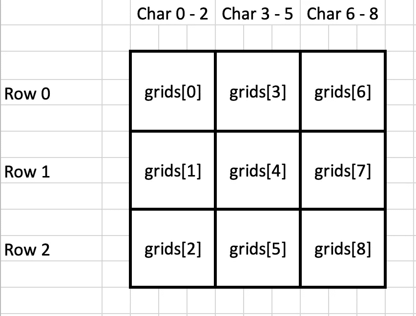
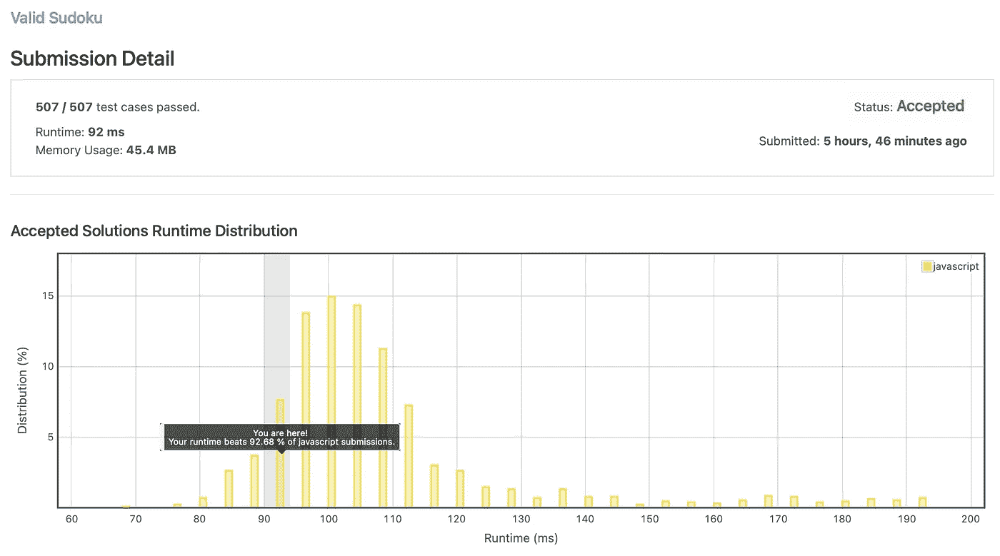

# 用 JavaScript 验证数独板:深潜

> 原文：<https://javascript.plainenglish.io/how-to-validate-a-sudoku-board-a-deep-dive-72d94d292cb3?source=collection_archive---------7----------------------->


Photo by [Markus Winkler](https://unsplash.com/@markuswinkler?utm_source=unsplash&utm_medium=referral&utm_content=creditCopyText) on [Unsplash](https://unsplash.com/s/photos/puzzle?utm_source=unsplash&utm_medium=referral&utm_content=creditCopyText)

有时，我喜欢在网上查看一些编码挑战，看看我是否能找到问题的解决方案。

最近，我遇到了一个练习题，目标是确定数独板是否有效。这正合我的胃口，因为我喜欢数独和一个很好的挑战。这些挑战可以成为学习新技能甚至准备面试的绝佳资源。我将回顾如何理解这些问题，提供一个详细解释的解决方案，并以一些额外的资源结束。

# 概观

*   理解问题
*   解答—行、列和网格
*   结论和附加资源

# 理解问题

这无疑是开发解决方案最重要的部分。如果你没有完全理解这个问题，你就不能完全找到解决这个问题的方法。

对于如何理解这些问题，我有一套体系。

*   不要立即开始编写代码或思考解决方案。至少把问题慢慢读两遍。
*   输入——它们是什么？它们如何与你正在使用的语言相对应？
*   边缘案例——您可能没有涵盖的场景有哪些？你能针对边缘情况进行测试吗？
*   输出—将输入转换为期望的输出需要什么？需要什么类型的操作？

## 问题是



By Tim Stellmach, Wikimedia Commons

*   每一行必须包含数字 1-9，不能有重复的数字
*   每列必须包含数字 1-9，不能有重复的数字
*   每个 3x3 网格必须包含数字 1–9，不能有重复的数字

棋盘(输入)是一个数组的数组。每个数组包含行的“数字”,空格用“.”表示。

```
[["5","3",".",".","7",".",".",".","."],["6",".",".","1","9","5",".",".","."],[".","9","8",".",".",".",".","6","."],["8",".",".",".","6",".",".",".","3"],["4",".",".","8",".","3",".",".","1"],["7",".",".",".","2",".",".",".","6"],[".","6",".",".",".",".","2","8","."],[".",".",".","4","1","9",".",".","5"],[".",".",".",".","8",".",".","7","9"]]
```

如果板是有效的，输出应该是指示`true`的布尔值，否则它应该返回`false`。

# 解决办法

所以分解这个过程。

**输入—** 我们可以看问题，看到一个数组的数组。这非常适合 JavaScript，因为我们可以利用像`filter()`这样的内置操作，并且我们可以只用数组来完成大部分工作。

**输出—** 我们只需要一个布尔型的输出，它很容易返回一个简单的真或假。我们还可以利用这个简单的输出来分而治之地进行验证。例如，如果行有效，则返回 true。如果第*行和第*列有效，则返回 true。当然，最后，如果行、列*和*网格是有效的，那么整个棋盘也是有效的。这是我们将要采取的方法。

## 行

验证行是最容易验证的，也是最容易开始的。

```
var isValidSudoku = function (board) {
  const validated = []; board.forEach((row) => {
    // filter out empty spaces
    const digits = row.filter((character) => character !== '.');
    const isValid = digits.length === [...new Set(digits)].length; validated.push(isValid);
  }); return validated.every((value) => value === true);
};
```

虽然这看起来相当简单明了，但是让我们来分析一下到底发生了什么。

1.  我们创建一个空数组，最终将保存九个布尔值(每行一个)
2.  首先，我们过滤掉空格，因为我们不关心它们，我们只想要数字。
3.  检查`digits`的长度是否等于一套新`digits`的长度。如果长度相同，则为真，该行有效。
4.  然后，我们将该值推送到`validated`数组。
5.  如果`validated`数组中的所有值都为真，那么这些行是有效的。

## 列

现在已经验证了这些行，我们已经完成了三分之一。列是要验证的下一个业务顺序，但是它们稍微复杂一些。

```
const validate = (array) => {
  // filter out empty spaces
  const digits = array.filter((character) => character !== '.');
  return digits.length === [...new Set(digits)].length;
};var isValidSudoku = function (board) {
  const validated = []; board.forEach((row, rowIndex) => {
    //rows
    validated.push(validate(row)); //columns
    const column = [];
    for (let columnIndex = 0; columnIndex < board.length; columnIndex++) {
      column.push(board[columnIndex][rowIndex]);
    } validated.push(validate(column));
  }); return validated.every((value) => value === true);
};
```

1.  首先，我们将过滤和比较(验证)移到了它自己的`validate`函数中。我们将对行、列和网格使用这个函数，您很快就会看到。
2.  创建一个`column`数组，其中 for 循环将使用行和列索引将值推入列数组。
3.  一旦`column`有了所有的值，就使用`validate`函数对其进行验证，并将其推入到验证过的数组中。
4.  如果`validated`数组中的所有值都为真，则行和列有效。

这让我们几乎一路验证电路板。然而，我们仍然需要验证网格。

## 网格

我们现在已经验证了数独棋盘三分之二的场景。现在，验证数独板最困难的部分是 3x3 网格。

```
// validate function from previous code block removed for easier readingvar isValidSudoku = function (board) {
  const [validated, grids] = [[], []]; board.forEach((row, rowIndex) => {
    // rows
    validated.push(validate(row)); // columns
    const column = [];
    for (let columnIndex = 0; columnIndex < board.length; columnIndex++) {
      column.push(board[columnIndex][rowIndex]);
    }
    validated.push(validate(column)); //grids
    grids.push([]);
  }); //grids
  board.forEach((row, rowIndex) => {
    row.forEach((character, charIndex) => {
      let gridRow = 0;
      if (rowIndex >= 3 && rowIndex <= 5) {
        gridRow = 1;
      } else if (rowIndex >= 6 && rowIndex <= 8) {
        gridRow = 2;
      } if (charIndex >= 3 && charIndex <= 5) {
        gridRow += 3;
      } else if (charIndex >= 6 && charIndex <= 8) {
        gridRow += 6;
      } grids[gridRow].push(character);
    });
  }); grids.forEach((grid) => {
    validated.push(validate(grid));
  }); return validated.every((value) => value === true);
};
```

1.  第一步是使用数组析构将一个空数组赋给`validated`和`grids`变量。
2.  在一行的每次迭代中，我们将一个空数组推入到`grids`数组中。
3.  现在最困难的部分是填充这些网格阵列。一个视觉可能会有很大帮助，这是下面。因此，如果`charIndex`在 0 和 2 之间，我们不会给`girdRow`变量添加任何值。然而，如果`charIndex`在 3 和 5 之间，那么这些值在新的列中，并且`gridRow`的值应该增加 3。同样的想法也适用于当`charIndex`在 6 和 8 之间时，它在最后一列，gridRow 应该增加 6。



4.现在我们可以迭代`grids`中的每个数组，并将验证过的数组推送到`validated`数组

5.如果`validated`数组中的所有值都为真，那么行、列和网格都有效。

这就结束了整个解决方案。我们已经解决了每种情况，验证了行、列、网格，并确定了整个棋盘是否有效。

# 结论和附加资源

我希望您学到了一些关于如何应对这些类型的编码挑战的有价值的东西。如果你想看看这个特别的挑战，你可以在 [LeetCode](https://leetcode.com/problems/valid-sudoku/) 上查看。LeetCode 将为您提供运行时和内存使用的分析，并与其他用户提交的数据进行比较。上面的解决方案非常高效，比其他 92.86%的 JavaScript 提交都要快。



这段代码也可以在我的 [GitHub 库](https://github.com/tengel92/Medium)上找到。可以拉回购运行`npm install`。安装完依赖项后，您可以查看`valid-sudoku.js`并使用`npm run js:sudoku`运行该文件。下面是一个 GitHub 要点，包含了我们在文章中讨论过的代码。

[*更多内容看 plainenglish.io*](http://plainenglish.io/)