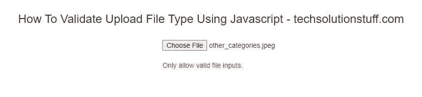

# 如何使用 JavaScript 验证上传文件类型

> 原文：<https://javascript.plainenglish.io/how-to-validate-upload-file-type-using-javascript-2fdfd25c8e79?source=collection_archive---------6----------------------->


Photo by [Clem Onojeghuo](https://unsplash.com/@clemono?utm_source=medium&utm_medium=referral) on [Unsplash](https://unsplash.com?utm_source=medium&utm_medium=referral)

今天，我们将看到如何使用 JavaScript 验证上传文件类型。在这里，我们可以很容易地检查所选择的文件扩展名与允许的文件扩展名。我们可以使用 jQuery 中的文件上传验证来限制用户只上传允许的文件类型。

Laravel 在控制器中提供内置的文件类型验证，但它只在服务器端工作。这意味着我们可以在表单提交后收到确认信息。在这里，我将给出一个例子，在使用 JavaScript 向表单提交数据之前检查文件类型。目前，我们只检查特定的文件扩展名，如。txt“，”。csv”等。或者您可以使用所有文件类型，如“image/*”。

```
<!DOCTYPE html>
<html>
<head>
  <meta charset="utf-8">
  <meta http-equiv="X-UA-Compatible" content="IE=edge">
  <title>File upload type validation in javascript - techsolutionstuff.com</title>
  <link href="https://stackpath.bootstrapcdn.com/bootstrap/3.4.1/css/bootstrap.min.css" rel="stylesheet">
  <script src="https://code.jquery.com/jquery-3.5.1.min.js"></script>  
</head>
<body>
  <h3 style="text-align: center;">File upload type validation in javascript - techsolutionstuff.com</h3>
  <div class="col-md-6 col-md-offset-5"><br>
  <input type="file" name="file"  id="filesizecheck"><br>
  <span id="error-message" class="validation-error-label"></span>
  </div>
</body>
</html>
<script type="text/javascript">
  $(document).ready(function(){
    $('#filesizecheck').on('change',function(){
      myfiles = $(this).val();
      var ext = myfiles.split('.').pop();
      if(ext == "txt" || ext == "png"){
        $('#error-message').css("display","none");
      }else{
        $('#error-message').html("Only allow valid file inputs.");
        $('#error-message').css("display","block");
        $('#error-message').css("color","red");
      }
    });
  });
</script>
```

您将得到如下图所示的输出。



How To Validate Upload File Type Using Javascript

**您可能还会喜欢:**

[***阅读:如何使用 JavaScript***](https://techsolutionstuff.com/post/how-to-validate-max-file-size-using-javascript) 验证最大文件大小】

[***另请阅读:如何在 Laravel 8***](https://techsolutionstuff.com/post/how-to-integrate-paypal-payment-gateway-in-laravel-8) 中集成 Paypal 支付网关

[***阅读:如何在 Laravel***](https://techsolutionstuff.com/post/how-to-create-dynamic-pie-chart-in-laravel) 中创建动态饼图

*更多内容看* [*说白了就是*](http://plainenglish.io/) *。报名参加我们的* [*免费周报在这里*](http://newsletter.plainenglish.io/) *。*