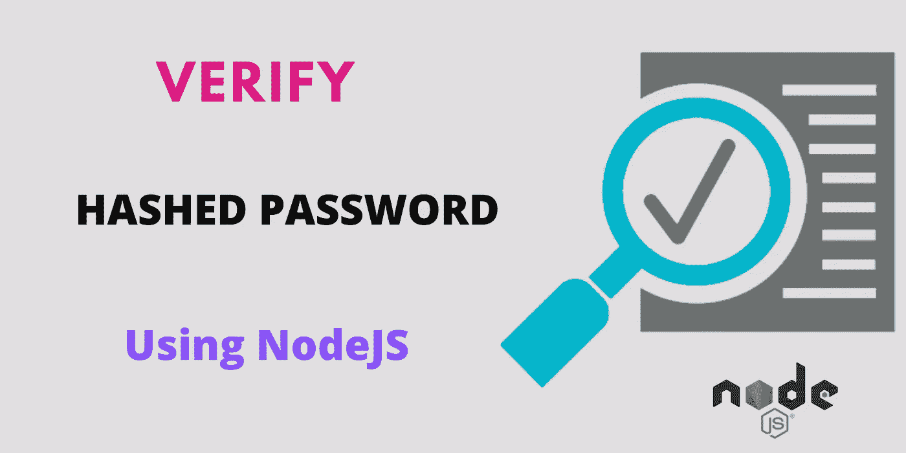

# 如何在 Node.js 和 MySQL 中验证哈希密码

> 原文：<https://javascript.plainenglish.io/how-to-verify-hashed-passwords-in-nodejs-and-mysql-26fedcfee01f?source=collection_archive---------5----------------------->

## 在 MySQL 数据库中存储单向散列密码，并使用 Node.js 进行验证



## **如何在数据库中存储密码**

首先，我们将了解如何在数据库中存储密码？。然后，我们将了解如何验证单向散列密码。不要在密码字段中存储纯文本。这是一个危险的问题。这造成了许多问题。开发人员、数据库管理员等。能够访问数据库的人能够看到用户密码，如果他们愿意，他们可以做一些非法活动。这是第一个问题。所以不要以纯文本的形式存储密码。

接下来，假设如果您的数据库遭到破坏/黑客攻击，那么黑客能够看到用户密码，如果您没有以加密格式存储密码，他们将滥用用户信息。如果密码是加密格式的，那么就没有必要担心这个问题。为什么？因为解密单向散列密码是一个非常繁忙的过程。

我们能解密单向散列密码吗？。

**是的，我们可以**。

然而，要解密一个密码，你需要更多的时间。这是一场关于安全的大辩论。没必要在这里争论。我们继续话题。我们可以在更短的时间内保护数据库，并要求我们的用户更改密码。所以，如果你使用加密密码，这个大问题就解决了。

> 因此，加密密码并将其存储在数据库中。不要在密码字段中存储纯文本。

**bcrypt** 算法主要用于密码的单向散列(加密)。在本教程中，我们将看到如何生成单向散列密码，并使用 **NodeJS** 验证它们。

如果您不知道如何使用 NodeJS 创建一个 **REST API** ，那么请访问下面的链接。

[](https://medium.com/javascript-in-plain-english/create-rest-api-using-nodejs-and-mysql-from-scratch-d1844601e21) [## 从头开始使用 NodeJS 和 MySQL 创建 REST API

### 从头开始使用 MySQL 的 CRUD 示例

medium.com](https://medium.com/javascript-in-plain-english/create-rest-api-using-nodejs-and-mysql-from-scratch-d1844601e21) 

## **安装 Bcrypt**

在 nodejs 项目中使用下面的命令安装 bcrypt 库。

```
npm i bcryptjs
```

## **生成单向散列密码**

**第 1 行:**导入 **bcryptjs** 包。

**第 3 行:**使用 **hashSync()** 创建一个单向散列密码。这里 10 是盐的大小。你可以使用任何尺寸。假人就是这里的密码。

> 请注意，每次它都会为相同的密码生成一个新的哈希。

## **验证单向散列密码**

**第 1 行:**使用 **compareSync()** 函数验证生成的单向散列。这里，第一个参数是您的密码，第二个参数是已经保存的单向散列。

> *请注意，请始终使用 compareSync()函数来验证密码。* ***不为密码生成哈希并与相等的运算符(==)*** *)进行比较。为什么？因为 bcrypt 每次都会为相同的密码生成不同的散列。因此，如果使用等号(==)运算符，旧哈希和新哈希不匹配。*

## **使用 NodeJS API 验证单向散列密码**

在这里，我给出了使用 NodeJS api 并从 MySQL 数据库获取密码的 bcrypt 验证的完整实现。

这是一个 GET 方法。所以你可以在本地使用下面的链接查看。

```
[http://localhost:3000/veify_password?password=dummy&username=raja](http://localhost:3000/veify_password?password=dummy&username=raja)
```

**完整源代码:**

```
[https://github.com/bharathirajatut/angular-examples/tree/master/nodejs-hashing-passwords](https://github.com/bharathirajatut/angular-examples/tree/master/nodejs-hashing-passwords)
```

**总结:**

在本教程中，您学习了

1.  为什么我们需要以加密格式存储密码？
2.  什么算法最适合加密密码？。
3.  如何使用 bcrypt 生成单向散列密码？。
4.  如何使用 bcrypt 验证单向散列密码？。
5.  用 MySQL 创建了一个 NodeJS API。

仅此而已。希望你喜欢这个教程。

敬请关注更多文章。

感谢您的阅读。

**Bcryptjs 包链接:**

[](https://www.npmjs.com/package/bcryptjs) [## bcryptjs

### JavaScript 中优化的 bcrypt，零依赖性。与 node.js 上的 C++ bcrypt 绑定兼容，也可以工作…

www.npmjs.com](https://www.npmjs.com/package/bcryptjs)