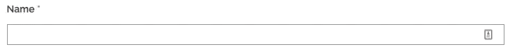
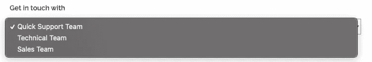
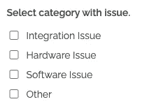
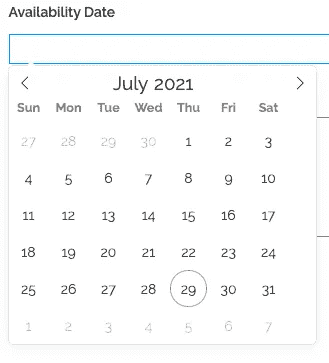

# 如何在 Cypress 中使用输入字段

> 原文：<https://javascript.plainenglish.io/how-to-work-with-input-fields-in-cypress-b1c7c22a1156?source=collection_archive---------0----------------------->


[https://youtu.be/1QuFU3IJ3Es](https://youtu.be/1QuFU3IJ3Es)

在本教程中，我们将学习如何在 Cypress 中使用不同类型的表单输入字段，如文本输入、下拉菜单、复选框、日期选择器和文本区域。

# 文本输入



name input field

要在文本输入元素中输入内容，只需使用`type`命令。这是代码的样子—

```
cy.get("#name").type("Automation Bro");
```

`type`命令也可以使用特殊字符，如`{enter}` `{backspace}`等。你可以在这里找到完整的列表[。](https://docs.cypress.io/api/commands/type#Arguments)

**文本区**使用`type`命令也可以类似地工作。

# 下拉菜单



Dropdown menu

使用下拉菜单，您必须从列表中选择一个特定的选项。例如，从上面的列表中选择第二个选项，我们将这样做-

```
cy.get("#dropdown").select("Technical Team");
```

使用`select`，您可以选择下拉选项`value`或文本本身来选择项目。

# 复选框



Checkbox

复选框类似于下拉菜单，你可以处理多个选项，但不像下拉菜单，你也可以选择多个选项。让我们来看看样本代码—

```
cy.get("#checkboxlist input").check([ "Integration Issue", "Software Issue",]);
```

您可以使用`check`命令并传入一个包含所有需要检查的选项的数组。同样，您也可以反过来取消选中选项。

# 日期选择器



Date Picker

日期选择器会根据开发人员的实现方式而有所不同，在上面的例子中，您首先需要单击空的输入字段，然后单击您想要选择的日期。

```
cy.get("#dateinput").click();cy.get(".dayContainer span:nth-child(15)").click();
```

在上面的代码中，我从所有日期选项中选择了第 15 个选项，这样做是为了保持选择的动态性，而不管它是几月。基于实现是如何完成的，还有许多其他的自动化方法。

**观看下面的视频，了解如何在 Cypress 中使用输入字段的更多信息—**

[https://youtu.be/1QuFU3IJ3Es](https://youtu.be/1QuFU3IJ3Es)

感谢阅读！

*更多内容看* [***说白了. io***](http://plainenglish.io/)