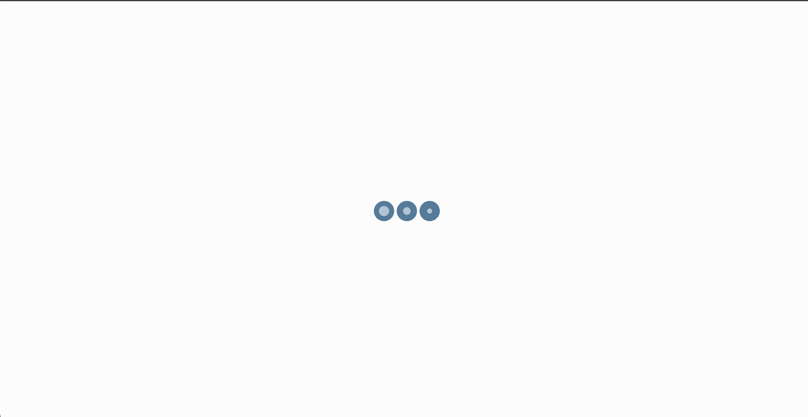

# 如何使用 Angular Nebular UI 库并使用简单的闪屏

> 原文：<https://javascript.plainenglish.io/how-to-work-with-the-angular-nebular-ui-library-and-use-a-simple-splash-screen-3dd0d1790478?source=collection_archive---------4----------------------->

## 在某些情况下，闪屏成为一种必需品，所以我想用一种非常简单的方式来展示它，我将谈论我喜欢使用 Angular 的 Nebular UI 库。



你好，今天我们将检查 Angular 11 的基本闪屏用法和星云主题用法。

我们的主要议题是:

*   创建角度项目
*   将 Nebular 添加到现有项目中
*   添加闪屏
*   最后使用 Nebular 的卡片组件。

首先，需要创建一个有角度的项目

```
ng new splashScreen
```

接下来，打开项目目录

```
ng add @nebular/theme
```

你可以在 [**Nebular 的 doc**](https://akveo.github.io/nebular/docs/guides/install-nebular#manually) 中按照这些步骤操作。由于您使用 Angular CLI 添加了 Nebular，它将为您完成这里的步骤，但值得一试。

下一步是创建主页和闪屏组件。在这一步，我们需要为 Home 组件创建一个模块。转到`src/app`文件夹。

为家；

```
ng generate module home 
```

或者

```
ng g m home
```

之后，

```
ng generate component home 
```

或者

```
ng g c home 
```

对于闪屏；

```
ng g c splashScreen
```

迄今为止，我们已经建立了必要的结构。我们将 HomeComponent 文件导入到 HomeModule 文件中。现在让我们将 HomeModule 文件导入到 AppModule 文件中。

如你所见，我们在 HomeModule 和 AppModule 文件中导入了 Nebular 组件。如果进口货有缺陷，我们的货物就会出差错。html 文件。值得注意的是，随着项目的增长，这种情况会变得更加复杂。

现在是时候创建一个闪屏了。然后我们将继续 HomeComponent。

*对于闪屏设计，我得到了* [*CSS CIRCLES 加载动画*](https://freefrontend.com/css-loaders/) *的帮助。*

对于**splash-screen.component.html**文件；

```
<div class=”splash-screen” *ngIf=”splash”> <div class=”app” > <div class=”loader”></div> <div class=”loader”></div> <div class=”loader”></div> </div></div>
```

对于 splash-screen.component.scss 文件；

现在，是组件文件的时候了。

```
<div class=”splash-screen” *ngIf=”splash”>
```

对于`*ngIf`我们检查一下，是溅还是不溅。在组件文件中，我设置了一个 5 秒的超时。在`setTimeout()`中，我们在 5 秒后改变`splash`。

因此，在打开过程中，闪屏会出现 5 秒钟，然后我们的页面就会出现。

我们将闪屏添加到 app.component.html 中

```
<nb-layout> <nb-layout-column> <app-splash-screen></app-splash-screen> <router-outlet></router-outlet> </nb-layout-column></nb-layout>
```

对于 app-routing.module.ts 文件；

```
const routes: Routes = [ { path: “home-page”, component: HomeComponent }];
```

因此，当我们的页面打开时，我们的 HomeComponent 就会出现。

现在，是时候改变 HomeComponent 了

之前，我们将使用的 Nebular 组件导入到我们的 HomeModule 文件中。首先，我为这个区域创建一个`div`标签，类名为 card-container。

```
.card-container { display: flex; flex-direction: row; justify-content: space-around;}
```

我将使用 display flex 放置两个电路板组件。

第一个是，`nb-card.`想看看你怎么用。

第二个是，`nb-flip-card.`翻转卡有两个区域，正面和背面。默认情况下，会显示翻转卡的切换按钮。但是我想改变它。为了改变，首先我用这个代码添加了`[showToggleButton]="false"`，切换按钮消失了。我加了`[flipped]="flipped"`来翻牌。

在组件文件中，我被创建了

`flipped: boolean = false;`

```
toggleFlip() { this.flipped = !this.flipped;}
```

这种方法允许我们翻牌。

接下来，我在卡片的页脚添加了一个按钮。

对于页脚样式；

```
.card-footer { display: flex; flex-direction: row; justify-content: space-between;}
```

谢谢你。

你可以从 [GitHub 链接](https://github.com/besteenurk/splash-screen-angular)获得该项目的源代码。

[](https://bestte.medium.com/membership) [## 用我的推荐链接加入媒体

### 作为一个媒体会员，你的会员费的一部分会给你阅读的作家，你可以完全接触到每一个故事…

bestte.medium.com](https://bestte.medium.com/membership) [](/how-to-use-angular-component-styles-with-special-selectors-dc877514372c) [## 如何将角度组件样式与特殊选择器一起使用

### 在具有独立样式文件的组件的基础上，将样式添加到您的 Angular 应用程序有助于您创建一个更…

javascript.plainenglish.io](/how-to-use-angular-component-styles-with-special-selectors-dc877514372c) [](/how-to-use-angulars-attribute-directives-in-your-class-hierarchy-d3a1d0adac32) [## 如何在类层次结构中使用 Angular 的属性指令

### 使用 Angular CLI 构建属性指令

javascript.plainenglish.io](/how-to-use-angulars-attribute-directives-in-your-class-hierarchy-d3a1d0adac32) [](/how-to-use-sass-and-enjoy-css-with-dynamic-structure-900ea2adddf7) [## 如何使用 Sass，享受动态结构的 CSS

### 由于 CSS 是一个静态结构，我们必须不断重复代码。我们给 CSS 代码带来了动态结构…

javascript.plainenglish.io](/how-to-use-sass-and-enjoy-css-with-dynamic-structure-900ea2adddf7) [](/how-to-use-the-composition-api-to-get-data-from-service-with-vue-js-4da1eca19ad6) [## 如何使用组合 API 通过 Vue.js 从服务中获取数据

### 通过使用组合 API 而不是选项 API，可以使服务结构更加可用。

javascript.plainenglish.io](/how-to-use-the-composition-api-to-get-data-from-service-with-vue-js-4da1eca19ad6) 

*更多内容看* [***说白了就是***](http://plainenglish.io/) ***。*** *报名参加我们的**[***免费每周简讯点击这里***](http://newsletter.plainenglish.io/) ***。****