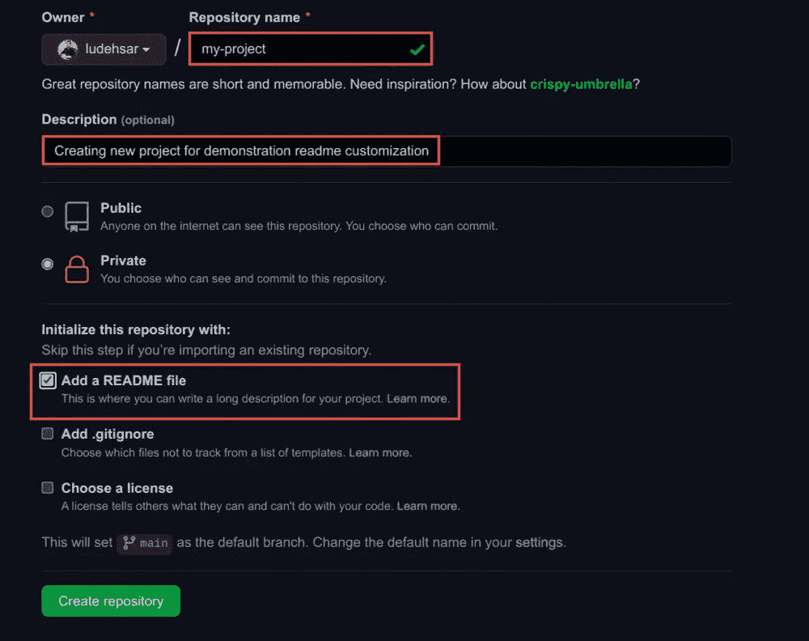
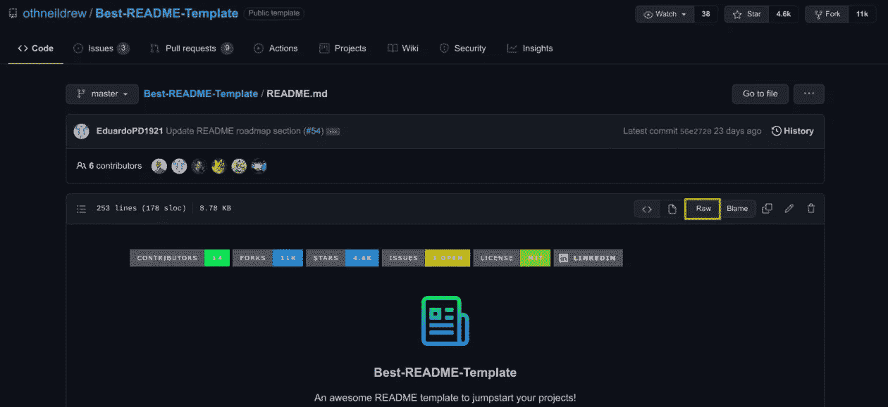
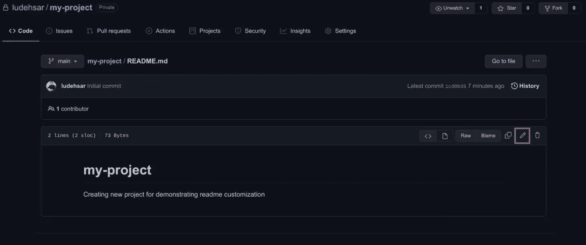
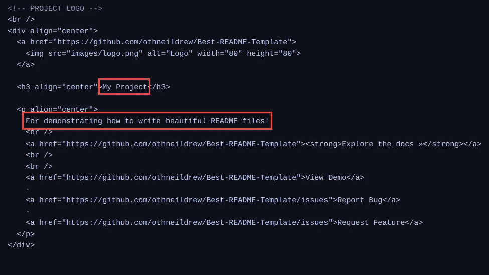
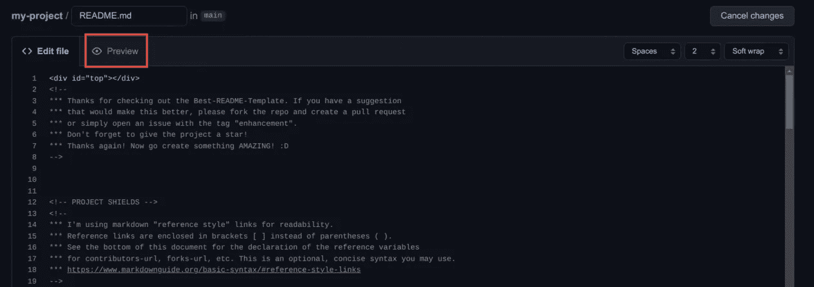
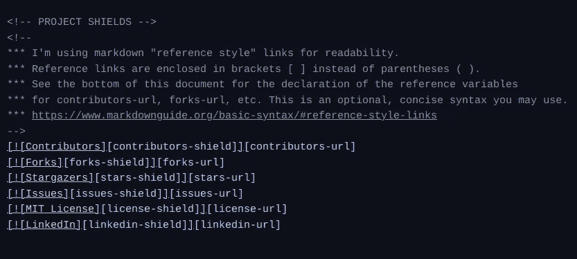
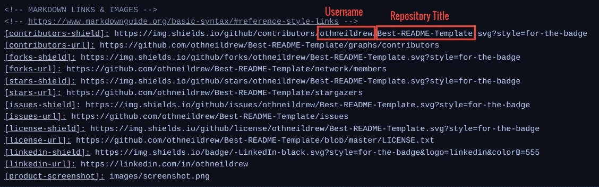
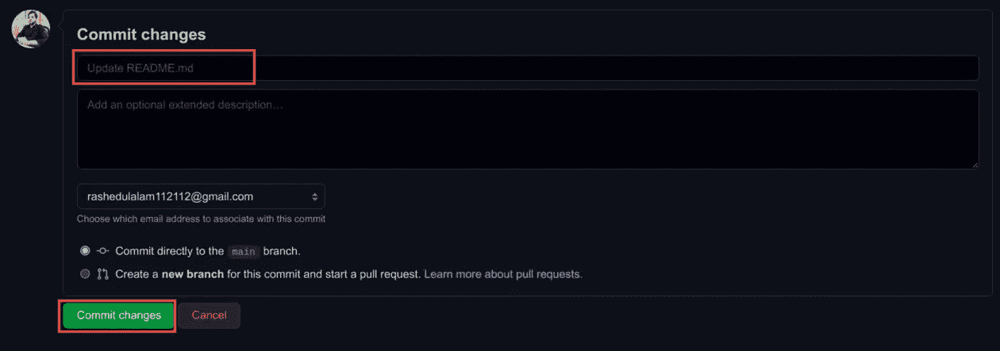

# 如何为您的项目撰写精彩的自述文件

> 原文：<https://javascript.plainenglish.io/how-to-write-a-stunning-readme-for-your-projects-2303bf6827b8?source=collection_archive---------1----------------------->

## 让你的 GitHub 库变得专业


Photo by [Roman Synkevych](https://unsplash.com/@synkevych?utm_source=medium&utm_medium=referral) on [Unsplash](https://unsplash.com?utm_source=medium&utm_medium=referral)

Readme 是你的项目的详细概述，讨论你的项目是什么，如何安装或配置它，如何使用它，作者是谁，以及所有其他相关的东西。

这是对你的项目的第一印象。每当有人点击您的存储库时，他会首先查看自述文件，以了解项目的全部内容。详细的阅读材料总是能给项目留下好印象。

现在，在这篇文章中，我们将看到如何在你的所有项目中创建一个令人惊叹的详细的自述文件。因此，没有进一步的行动，让我们进入正题:

# 为什么需要写自述？

Readmes 帮助人们理解你的项目是关于什么的。

如果你正在开发一个开源项目，Readme 是必不可少的。即使你不做开源，你也应该写一个自述文件，以便这个项目的其他同事能够很好地理解这个项目。

此外，写好的简历可以帮你找到更好的工作。因此，为您的每个项目编写一个更好的自述文件总是很有用的。

# TL；速度三角形定位法(dead reckoning)

Readmes 通常是用 Markdown 语言编写的。所以，写自述文件需要有 markdown 的基础知识。

在这篇文章中，我们还将了解一些基本的降价语法，这些语法是编写更好的自述文件或任何降价文档所需要的:

1.  首先，markdown 语言也支持标记语言。所以，如果你对 HTML 有一点了解，你也可以使用 HTML 语法。
2.  你可以用`#`符号来写标题。hashtags 的数量表示标题的级别。您最多可以使用 6 个标题级别。举个例子，

```
# This is Heading level 1
## This is Heading level 2
### This is Heading level 3
```

3.在段落中添加额外的换行符来分隔段落。举个例子，

```
This is the first paragraph.This is the second paragraph.
```

4.您可以使用`**`换行来加粗文本。例如，`**some text**`会导致**一些文字**。

5.对于斜体文本，仅使用一个`*`来换行。例如，`*some text*`会导致*一些文字*。

6.下面的示例演示了如何添加有序列表:

```
1\. This is ordered list element 1
2\. This is ordered list element 2
3\. This is ordered list element 3
```

您也可以创建一个无序列表，如下所示:

```
- This is unordered list element 1
- This is unordered list element 2
- This is unordered list element 3
```

7.您可以使用以下代码在自述文件中添加图像:

```
 
```

8.您可以使用以下代码添加链接:

```
[Link Text](https://path/to/link) 
```

9.您可以使用以下符号在自述文件中显示代码示例:

```
`This is an inline code````
This is a code block
```
```

这几乎是你为你的项目写阅读材料、投稿或任何其他减价文件所需要知道的全部内容。

现在，我们知道了一些基本的降价语法，让我们深入了解如何为您的项目创建一个漂亮的自述文件。

# 如何撰写更好的自述文件的分步过程

好的一面是，我们不需要从头开始创建自述文件。GitHub 中有如此多的 readme，这将有助于您轻松创建自己的 readme。

[Awesome readme](https://github.com/matiassingers/awesome-readme) 是一个很好的资源，可以找到针对项目的最佳 readme 设计。

我通常在我几乎所有的项目中使用 [Best-Readme-Template](https://github.com/othneildrew/Best-README-Template) ，因为它有许多功能在演示项目时很有用。因此，在本文中，让我们使用这个模板创建一个自述文件。

## 步骤 1:创建 GitHub 存储库

让我们首先通过点击右上角的加号按钮创建一个 GitHub 存储库。给出项目标题、描述，并检查“添加自述文件”。之后，单击“创建存储库”按钮。



Creating a new repository in GitHub

## 步骤 2:在存储库的自述文件中复制自述文件内容

现在，转到 [Best-Readme-Template](https://github.com/othneildrew/Best-README-Template) 存储库，点击`README.md`文件。然后点击“Raw”按钮。



Click on the Raw button

点击 raw 按钮后，复制浏览器中显示的所有文本。然后将它们粘贴到项目的自述文件中。

要粘贴您的自述文件，请单击您的`README.md`文件中的“编辑”图标按钮:



Click on the edit button to edit the README.md

## 步骤 3:根据项目细节更改自述文件

现在，是时候根据项目描述更改`README.md`文件了。让我们从更改项目标题和项目概述开始。



Changing project title and overview

像这样，您应该根据您的项目更改剩余的部分。您可以根据您的项目添加或删除一些部分。

您还应该关注链接和图像，并相应地更改它们。

要预览更改，只需单击预览按钮。



Click on the preview button to see the changes

另一件要注意的事情是，你可以添加定制的屏蔽来表示你的存储库的状态，或者链接到你的 LinkedIn 个人资料。

在您的自述文件模板中，您可以找到如下一些保护:



Project shields

现在，如果您在底部滚动，您可以根据您的项目定制这些盾牌:



Links of the shields: Change your username and repo accordingly

如上图所述，相应地将你的 GitHub 用户名和库 URL 更改为所有链接。然后你会在预览中看到它的神奇之处。

如果你想在你的项目中使用其他的 shields，或者只是想探索它们，请访问 [https://shields.io](https://shields.io/) 。

## 步骤 4:保存并提交这些更改

对自述文件进行更改后，向下滚动到“提交更改”部分，写一条提交消息，然后单击“提交更改”按钮。



Committing the changes

呜-呼！现在，您已经在 GitHub 存储库中创建了一个非常漂亮的自述文件。

# 最后的想法

在本文中，我们看到了如何在我们的存储库中创建一个漂亮的、详细的、有条理的自述文件。

组织良好的阅读材料会给开发者留下最好的印象。它证明了项目是有组织的，有文档记录的，并且维护得很好。

不管怎样，谢谢你看我的文章。祝您愉快！

# 资源

*   [https://github.com/matiassingers/awesome-readme](https://github.com/matiassingers/awesome-readme)
*   https://github.com/othneildrew/Best-README-Template
*   [https://shields.io](https://shields.io/)

*更多内容请看*[*plain English . io*](http://plainenglish.io/)*。在这里注册我们的* [*免费周报*](http://newsletter.plainenglish.io/) *。*