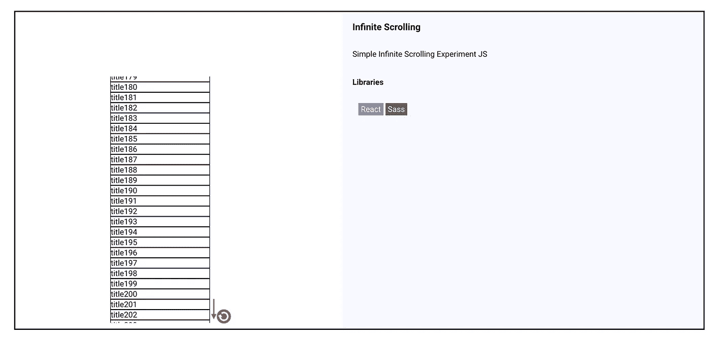
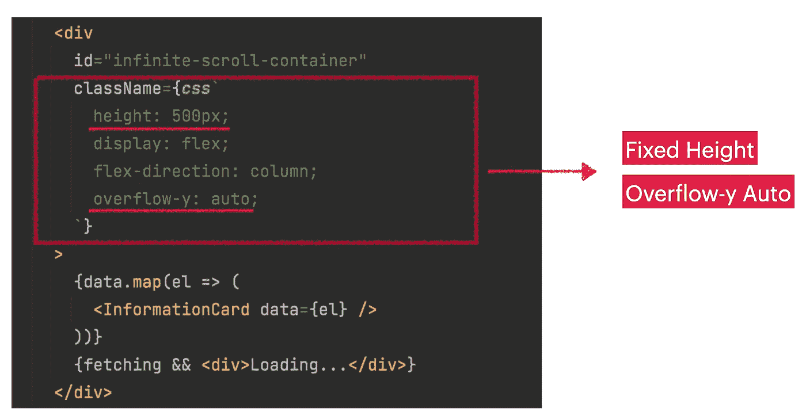
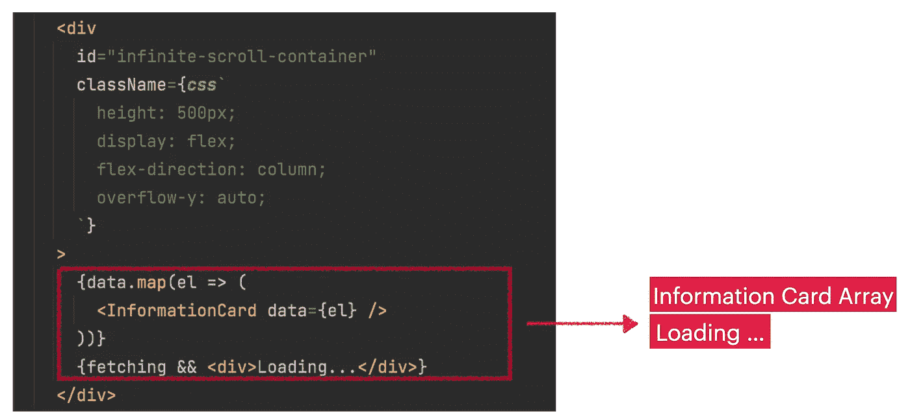
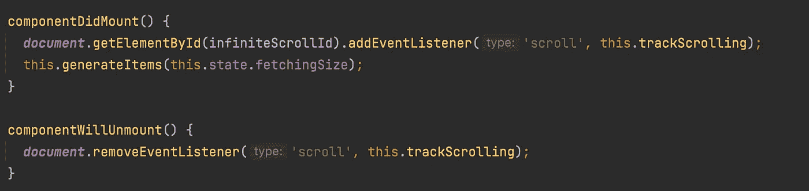
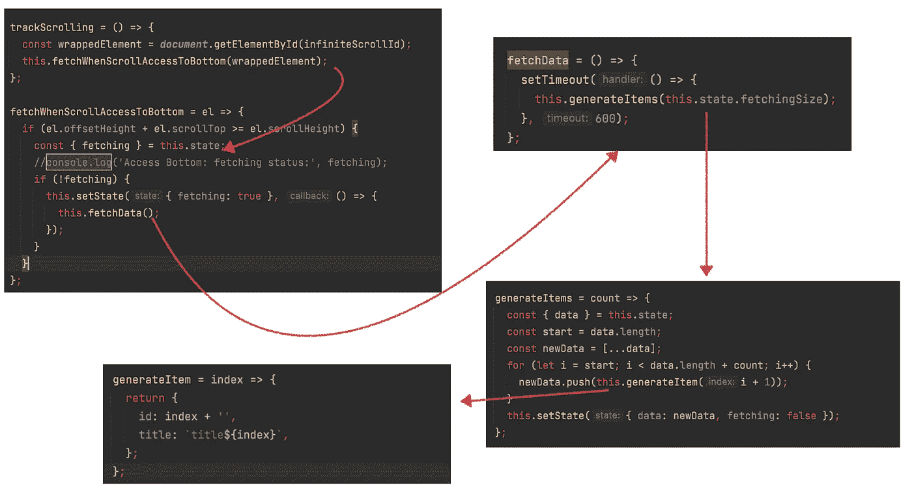
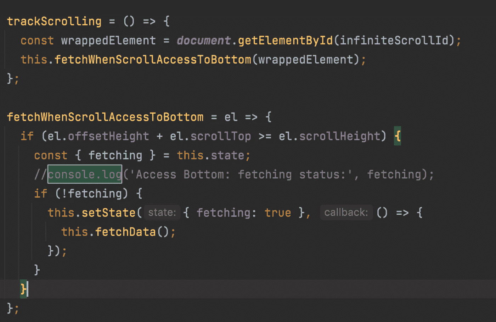
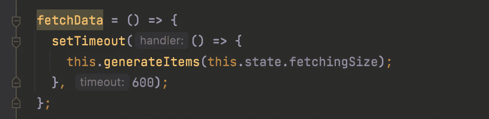

# 如何用 React 写一个无限滚动列表

> 原文：<https://javascript.plainenglish.io/how-to-write-an-infinite-scroll-list-with-react-6565c775aef6?source=collection_archive---------6----------------------->


Photo by [Scott Webb](https://unsplash.com/@scottwebb?utm_source=unsplash&utm_medium=referral&utm_content=creditCopyText) on [Unsplash](https://unsplash.com/s/photos/infinite?utm_source=unsplash&utm_medium=referral&utm_content=creditCopyText)

## 反应发展

## 在这篇文章中，我想告诉你如何用 React 编写无限滚动。

当您不知道页面大小时，无限滚动是合适的。您的项目在流中(例如，时间线)。而唯一的机会就是按顺序展示物品。实现无限滚动是可用性的最佳方式。我写了一个简单的模拟，当用户访问滚动的最后一项时加载新的项目。示例[迷你应用链接](https://onurdayibasi.dev/infinite-scroll/v1)



[https://onurdayibasi.dev/infinite-scroll/v1](https://onurdayibasi.dev/infinite-scroll/v1)

首先，我们需要一个具有固定高度和溢出滚动能力的列表容器。



第二部分是信息卡项目和加载…元素。加载元素仅在提取操作处于活动状态时可见。



# 滚动机制

当组件安装到应用程序时，我们将滚动监听器添加到 ***【无限滚动容器】*** 中，并在卸载元素时移除它。



Scrolling EventListener subscribe/unsubscribe

这里必不可少的部分是“轨道滚动*我们在轨道滚动中会做什么？*

*   *检查您是否访问了滚动区的底部。*
*   *如果访问，则从后端获取新的数据块*
*   *并生成新项目，将其呈现在列表容器中*

**

*track scrolling Algorithm Steps*

# *检查滚动访问最后一个元素*

*我们借助***document . getelementbyid .***获取 DOM 元素，然后计算滚动访问底部。如果滚动访问到底部并且获取错误，那么我们开始获取操作。*

```
*if (el.offsetHeight + el.scrollTop >= el.scrollHeight)* 
```

**

*is Scroll Access To Bottom function*

*然后我编写了一个简单的假获取函数，在等待 0.6 秒后生成新的项目*

**

*fake fetching function*

# *让我们继续阅读😃*

*你可以在这个链接 找到类似的样本和著述 [**。如果你喜欢这个故事。请👏👏和分享。**](https://onurdayibasi.com/react-lab/?6565c775aef6)*

**更多内容请看*[***plain English . io***](http://plainenglish.io/)*