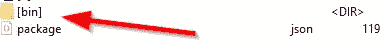

# 如何在不发布到 Git/NPM 的情况下编写 NPM 包

> 原文：<https://javascript.plainenglish.io/how-to-write-an-npm-package-without-publishing-to-git-npm-68068caf466f?source=collection_archive---------5----------------------->


Photo by [Paul Esch-Laurent](https://unsplash.com/@pinjasaur?utm_source=medium&utm_medium=referral) on [Unsplash](https://unsplash.com?utm_source=medium&utm_medium=referral)

想写一个 npm 包而不发布到 npm 或 git？并且能够在项目中使用它？好吧，继续读！

NPM 棒极了，但是如果你只是想做一些原型或者只是测试一些东西的话，这可能有点挑战性。本指南展示了如何手动编写一个包，并且仍然能够在项目中测试/使用它。为此，需要两个 VSCode 实例。一个用于包，一个用于引用包的项目。

这是要编写的包(也就是，最终将在 npm 存储库中结束的东西)。

`demo1`:这是引用`foopackage`的项目。

# 设置“演示 1”

就像平常一样创建项目，如果没有别的克隆[empty](https://github.com/tomnil/emptyts):

```
git clone [https://github.com/tomnil/emptyts](https://github.com/tomnil/emptyts)
ren emptyts demo1
cd demo1
npm install
```

## node_modules 中的占位符

是时候在演示 1 的`node_modules`中为`foo`创建一个占位符了。

```
cd node_modules
mkdir foopackage
cd foopackage
```

接下来，在文件夹的根目录下添加这个名为`package.json`的文件:

```
{
  "name": "foopackage",
  "version": "1.0.0",
  "description": "bar",
  "main": "./bin/index.js"
}
```

# 设置“foopackage”

就像平常一样创建解决方案，如果没有其他的克隆[空](https://github.com/tomnil/emptyts)(再次):

```
git clone [https://github.com/tomnil/emptyts](https://github.com/tomnil/emptyts)
ren emptyts foopackage
cd foopackage
npm install
```

在`index.ts`中写一些有趣的(导出的)代码:

```
export function CheckIsFoo(data: string) : boolean {
    return (data==="foo");
}
```

打开`tsconfig.json`并修改 outdir 以反映(相对)目标路径。`outDir`应该指向**演示 1** 项目的`node_modules`。

同时，确保发出声明，否则将出现错误*`找不到模块' foopackage '或其对应的类型声明`【T25。*

```
"compilerOptions": { "outDir": "../demo1/node_modules/foopackage/bin",
    "declaration": true}
```

编译:

```
tsc -b -w
```

检查 node_modules 文件夹，如果操作正确，就会创建`bin`文件夹，其中会有一个 index.js(和 index.d.ts)



## 自动更新..

通过运行以下命令，设置 tsc 在更改时自动重新编译(从您的`foopackage`文件夹到 **demo1:s** `node_modules`):

```
tsc -b -v -w -i
```

# 从“演示 1”引用“foopackage”

好了，foopackage 的结果放在`node_modules`里面。返回到`demo1`解决方案并打开`package.json`。接下来，在`dependencies`下添加一行`"foopackage": "*"`:

```
"dependencies": {
 **"foopackage": "*"**  }
```

如果现在一切正常，该包可以成功地引用为:

```
import { CheckIsFoo } from 'foopackage';console.log(CheckIsFoo("Bar"));  // Returns false
```

# 发布到 NPM…

如果你决定发布到 npm，有一个指南可以遵循:[https://docs . npmjs . com/creating-and-publishing-scoped-public-packages](https://docs.npmjs.com/creating-and-publishing-scoped-public-packages)

基本上，简短的版本是:

*   修改`tsconfig.json`以将输出文件发送到本地`bin`(而不是 node_modules 的相对路径)
*   创建一个`LICENSE`和`README.md`文件。
*   用所有细节更新 package.json，比如作者、许可证、关键字等等。
*   将您的代码推送到 GitHub(或类似的)中，并使用关于 repo 和 bug 的信息更新 package.json。

```
"repository": {
    "type": "git",
    "url": "git+[https://github.com/](https://github.com/tomnil/runtime-typescript-checker.git)name/xyz.git"
  },
  "bugs": {
    "url": "[https://github.com/](https://github.com/tomnil/runtime-typescript-checker/issues)name[/xyz/issues](https://github.com/tomnil/runtime-typescript-checker/issues)"
  }
```

*   登录 npm(如果需要，创建一个帐户)
*   跑`npm publish --access public`

使用`npm unpublish <packagename> -f`将其删除。阅读更多[https://docs . npmjs . com/un publishing-packages-from-the-registry](https://docs.npmjs.com/unpublishing-packages-from-the-registry)

# 享受

/T

*更多内容请看*[***plain English . io***](http://plainenglish.io/)