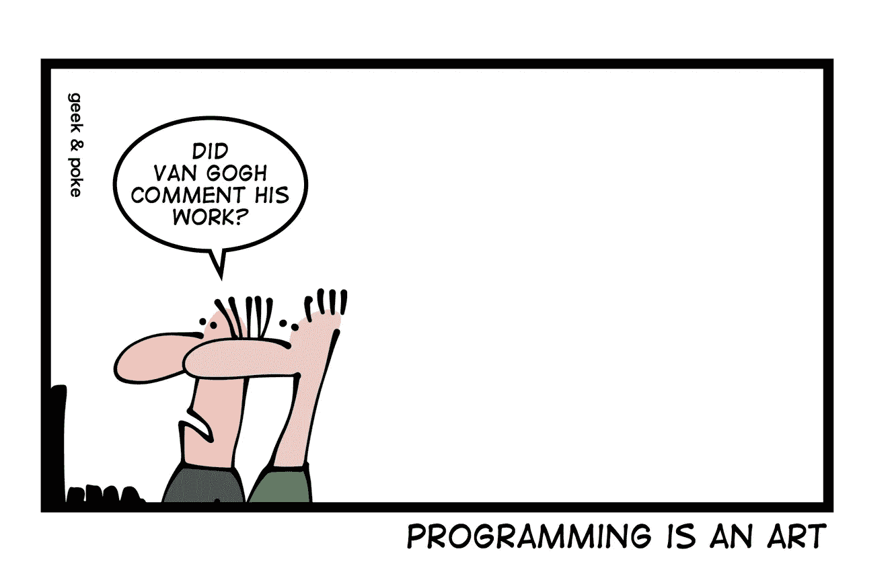
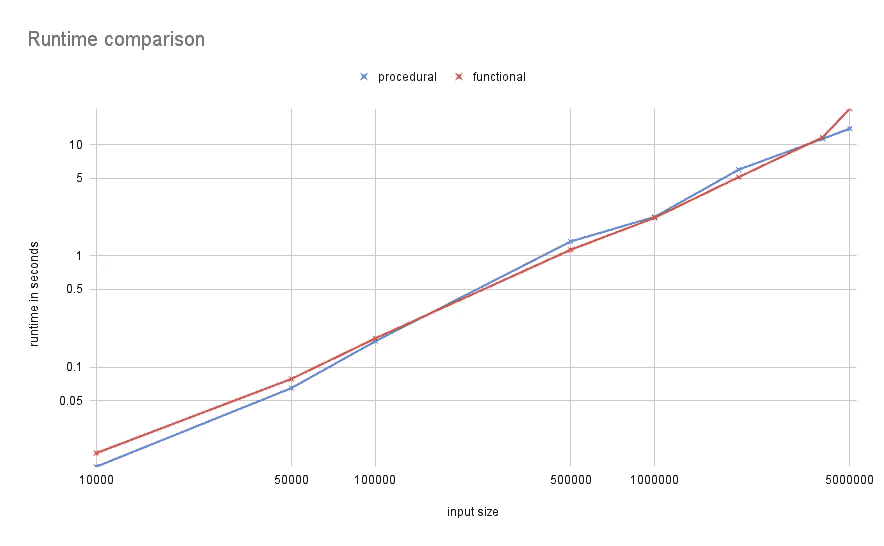

# 如何用函数式编程编写干净的 JavaScript 代码

> 原文：<https://javascript.plainenglish.io/how-to-write-clean-javascript-code-with-functional-programming-54fd60a56074?source=collection_archive---------3----------------------->

## 将您的命令式代码重构为功能性代码，以提高可读性而不牺牲性能。

Cartoon adapted from [geek-and-poke.com](https://geek-and-poke.com/geekandpoke/2013/9/18/the-art-of-programming), Licence [CC-BY-3.0](https://creativecommons.org/licenses/by/3.0/)

我非常支持用函数式的方式编写代码。如果做得正确，它更容易阅读、分解和测试。然而，许多人似乎对此持怀疑态度，并担心其对性能的影响。

所以，让我用一个真实世界的例子，让你相信用功能性风格写作的优势，无论是命令式还是功能性风格。

我不提倡总是写函数代码。有时，让代码围绕对象组织起来是有意义的，有与环境或存储状态交互的副作用。但是这仍然留下了很多使用不可变变量和纯函数来帮助构建代码的机会。

# 现实世界的例子

下面的例子是基于我在工作中遇到的一个类似的问题。我们有一长串带有`id`和`amount`的对象，我们想找到具有相同`id`的实体，并将它们合并成一个实体。

## 程序性解决方案

Procedural solution for finding and merging duplicates

是什么让这成为程序性的？主要思想是，您有一个结果对象，它开始是空的，并不断附加到它上面。此对象是可变的；一个可靠消息告诉我们这个功能不是很有效。

## 功能解决方案

Functional solution for finding and merging duplicates

该解决方案在很大程度上依赖于 [lodash](https://lodash.com/d) 库。它的方法是将所有对象按其 id 分组，并将具有多个对象的任何组合并到一个实体中。为了稍微提高效率，它使用了[链](https://www.geeksforgeeks.org/lodash-_-chain-method/)功能。我稍后会更详细地解释。

这个解决方案中没有变量被重新分配或修改，所以它们都是不可变的。`foreach`已经被`map`所取代，这是另一种典型的功能编程模式。

在第一种观点中，您可能会说功能性解决方案看起来更复杂，但让我解释一下我为什么喜欢它。

# 不可变变量使其更容易阅读

对你来说，这听起来可能令人惊讶，但请耐心听我说。不可变变量使理解变量包含的内容变得容易得多。一个变量只被创建一次，从未被修改过，只有一个地方可以读取，以找出该变量包含的内容。

在过程示例中，根据第 2 行,`result`首先是一个空对象。根据第 10 行，我们将其转换成从 id 到实体的映射，值由输入对象组成。但是根据第 5–8 行，它不仅仅是一个地图，因为值在 id 冲突时被更新。希望您能看到复杂性是如何增加的，即使这个例子相对较小。想象一个更复杂的场景，你在 5-6 个不同的地方写一个对象！如果你所有的变量都是不可变的，那么同样的事情永远不会发生！

# 较小的作用域更容易将代码分解成子函数

函数示例拆分成两个函数，程序代码不是，背后是有原因的！

`map`和`forEach`循环大致相同，它们遍历条目并合并重复项，但是它们的构建方式非常不同。

`forEach`循环的主体更新了`results`，但是这是在函数主体的范围之外定义的。因为循环体随时访问外部作用域中的变量，所以您不能孤立地理解它们。如果您要将循环体重构为一个子函数，您必须将结果对象作为一个[输出变量传递，一个明确的代码味道](https://www.informit.com/articles/article.aspx?p=1382188)。

另一方面，`map`应用了完全没有任何副作用的功能。所有输入都通过值传入，数据流出的唯一方式是通过 return 语句。其他一切都受限于该函数的范围。

正如您所看到的，用函数式风格编写代码可以更容易地将代码分解成子问题，并进一步分解成子函数。

# 更容易测试

我们刚刚确定，功能解决方案可以容纳更小的子功能。因此，我们可以单独测试它们。反过来，这使得覆盖更多的边缘情况变得更容易，并且您对您的代码工作更有信心！

测试更小的子功能也意味着更好的回归测试。特定测试的失败将缩小问题的范围，并且修复将更加简单。

# 它和程序解决方案一样快

对函数式编程的一个常见偏见是，它的性能不如可比较的命令式解决方案。毕竟 C 是最快的语言之一，而且是纯函数式的。

例如，函数式程序确实会有性能损失，因为不可变变量会导致更大的内存占用。这是因为它不是更新内存中的同一个对象，而是重复复制。一个更简单的函数式解决方案可能有用于分组项目的中间对象，并使用更多的内存。

锁链来拯救我们了。不是计算和存储整个中间值集，而是延迟执行。它将计算推迟到`value()`调用，并合并中间步骤以避免构建完整的中间值集。

但是你可以一直争论性能；最简单的方法是运行代码并测量它:

Runtime comparison for the procedural and function solutions

如您所见，对于 10K 和 50K 元素之间的较小输入大小，函数式解决方案稍慢，对于较大的输入大小，函数式解决方案稍快。唯一显著的异常值是 5M 元素，其中功能性代码需要 20 秒，而过程性代码需要 13 秒。

用下面的`--max-old-space-size=2048 --max-semi-space-size=2048`调整 node.js 本身就消除了这种差异。因此，公平地说，既没有性能损失，也没有好处。

# 关于其他语言的注释

我将这个例子和参数基于 node.js 运行的 JavaScript，但是这也适用于其他语言吗？是的，但是有一些限制。

围绕可读性、范围和可测试性的争论几乎适用于任何语言，但是围绕它的语法和支持库当然会有所不同。

当谈到性能的好处或坏处时，它将取决于语言运行时环境的实现细节。当在这里有疑问的时候，你将不得不自己测量它并且做你的研究。

我有 python 背景，这里的最佳实践建议使用列表理解、映射和过滤器，因为这样会快很多。尽管如此，实际的加速往往取决于 python 解释器和运行时的内部细节。

# 最后的想法

希望这些论点能说服你让你的代码更具功能性，即使只是一点点。但是，当然，找到一个简洁的函数表示需要实践、努力，有时还需要不同的思维方式。然而，回报是一个处理问题的新角度。此外，您的代码将变得更具可读性和可测试性，谁不喜欢这样呢？

函数式编程比我在本文中提到的要多得多。这就是为什么我一直称之为功能性风格而不是功能性。我还没有涉及到像作为一级实体的函数、currying 或模式匹配这样的概念。

不幸的是，我也没有教授函数式编程的灵丹妙药。但是，无论是使用 Haskell 这样的全功能语言，还是 Python 和 JavaScript 这样的多范式语言，编写功能更多的代码总是一个好的开始。

附注:我在宣传`lodash`的`_.chain`方法，知道[这篇文章反对使用它](https://medium.com/bootstart/why-using-chain-is-a-mistake-9bc1f80d51ba)。反对它的主要理由是包的大小和构建时间。我一直在 node.js 中使用这个服务器端，它们对我来说都不重要。对于前端代码，这可能更重要。不管怎样，这篇文章深入探讨了一些更函数式的编程概念，值得一读！

*要获得更多关于软件工程的文章，* [***通过我的推荐链接***](https://medium.com/@lucas_sonnabend/membership) *在 Medium 上注册，并查看*[***plain English . io***](http://plainenglish.io/)***。***

*更多内容请看*[***plain English . io***](http://plainenglish.io/)