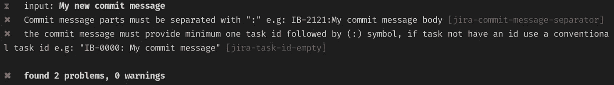

# 如何编写正确的吉拉提交消息

> 原文：<https://javascript.plainenglish.io/how-to-write-correct-jira-commit-messages-d9910f332273?source=collection_archive---------3----------------------->

提交消息的内容真的很重要，尤其是当你的团队使用像吉拉这样的工具时，因为有时代码调试过程会更容易，如果你有更多关于当前代码的信息，像**吉拉任务 id** ，你可以找到验收标准和其他有用的信息。

在这里，我将展示如何在提交之前验证吉拉提交消息。

# 我们开始吧

像往常一样，我们将从安装一些依赖项开始。

`npm i -D @commitlint/cli commitlint-plugin-jira-rules commitlint-config-jira husky`

*   [**【commit lint-config-jira**](https://github.com/Gherciu/commitlint-jira)—是一个推荐的配置，包含吉拉提交消息样式的预配置规则。
*   [**@ commit list/CLI**](https://github.com/conventional-changelog/commitlint)—是一个命令行工具，可以 lint 提交消息。
*   [**husky**](https://github.com/typicode/husky)**—是一个工具，它允许我们轻松地与 Git 挂钩，并在那些阶段运行我们想要的脚本**

**现在我们需要在存储库的根目录下创建一个`commitlint.config.js`文件，在这里我们将配置 Commitlint 以使用吉拉提交消息风格。**

**commitlint.config.js**

**现在，我们需要使用 [**husky**](https://github.com/typicode/husky) 启用并添加一个`commit-msg` git 挂钩，以便在每次尝试提交某个东西时运行 Commitlint。**

**Enabling Git hooks.**

**通过在您的终端 [**中运行这些命令，husky**](https://github.com/typicode/husky) 将启用 Git 钩子并添加`commit-msg`钩子。**

***注:如果有人不想使用* ***哈士奇 v5*** *因为他们现在使用的是临时的* [***奇偶公共许可证***](https://paritylicense.com/) *，下面在* ***【高级用法】*** *一节中你可以阅读如何使用* ***哈士奇 v4。*****

# **现在我们可以使用它了:)**

**让我们提交新文件并测试我们的配置是否有效。**

**`git commit -am"My new commit message"`**

**该命令将在您的终端中显示一些错误，因为该提交消息不符合[**commit list-config-jira 规则**](https://github.com/Gherciu/commitlint-jira#rules-1) **。****

****

**现在让我们再次提交我们的文件，但这次使用正确的提交消息，它遵循[**commit list-config-jira 规则**](https://github.com/Gherciu/commitlint-jira#rules-1) **。****

**`git commit -am"TASK-21: My new commit message"`**

**该命令将显示一条成功消息，如下所示。**

****

**🥳 不错！它像预期的那样工作，所以我们可以将代码推送到远程 Git 服务器。**

# **高级用法🤓**

*   **自定义`commitlint-jira-config`规则。**

**commitlint.config.js**

***现在我们能够提交包含一个* ***【吉拉】任务 id*** *长于* ***10 个字符*** *的消息。***

*   **关闭一个`commitlint-jira-config`规则。**

**commitlint.config.js**

***现在* `*jira-task-id-max-length*` *规则被禁用，永远不会检查提交消息长度。***

*   **如果有人不想使用**哈士奇 v5** ，因为他们现在使用的是 [**奇偶校验公共许可证**](https://paritylicense.com/) ，你可以使用**哈士奇 v4** ，只要将它添加到你的`package.json`中就可以轻松配置**

**package.json**

**感谢阅读。我希望这有所帮助。**