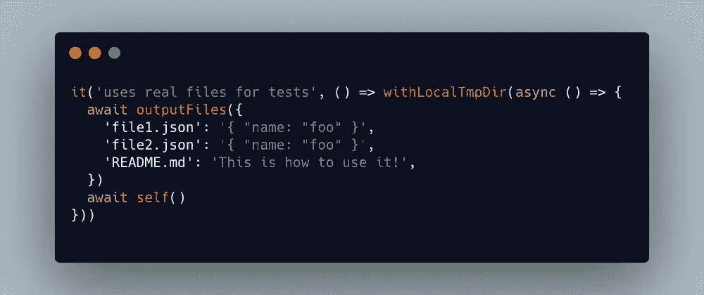

# 如何用真实文件编写基于文件的 JavaScript 测试

> 原文：<https://javascript.plainenglish.io/how-to-write-file-based-tests-with-real-files-d581e2e1d459?source=collection_archive---------14----------------------->

嘿，伙计们，这篇文章是关于为通过读写文件到磁盘来访问文件系统的项目编写测试的。

我过去的许多项目在某种程度上都与文件访问有关。我开始用类似于 [mock-fs](https://github.com/tschaub/mock-fs) 的模仿库进行测试，但是很快发现它们并不适用于所有情况，有时你在内部使用第三方库，你不能轻易模仿。所以我想到了一个不同的解决方案，我现在在大多数项目中使用的是真正的文件。

# 使用-local-tmp-dir 和输出文件

为什么不用真实文件进行测试，而不是嘲讽？我用-local-tmp-dir 构建了一个名为[的 NPM 包，它基本上是在 cwd 中创建一个临时子文件夹，`cd` s 放入其中，运行一个函数，然后`cd` s 返回到先前的 cwd。在这个函数中，你可以创建文件和几乎任何东西，在测试中运行你的单元。之后，文件夹被删除，一切都被清理。实际上，您不仅仅需要将它用于测试，您可以在任何地方使用它，但是它主要用于测试。](https://github.com/dword-design/with-local-tmp-dir)

我还编写了另一个助手包[输出文件](https://github.com/dword-design/output-files)，它通过传递一个对象一次创建一个完整的文件树。这比编写大量的`fs.writeFile`调用来创建许多文件要容易得多。

# 让我们测试一个脚手架工具！

好吧，让我们开始吧！首先，你需要一个测试框架。这里我将使用 [Mocha](https://github.com/mochajs/mocha) ，但是你也可以使用 [Jest](https://github.com/facebook/jest) 或者你选择的任何其他框架。对于断言，我也使用了 [expect](https://github.com/mjackson/expect) 。之后，我们将安装一些编写测试所需的包:

我们将测试一个将配置文件写入磁盘的小型搭建工具。如果文件已经存在，它不会被覆盖。否则，将创建一个默认文件。它如何工作并不重要，重要的是我们如何测试它😀。

# 编写我们的第一个测试

让我们添加一个测试文件:

我们可以通过以下方式运行我们的测试:

`$ mocha index.spec.js`

已经很好了，我们已经测试了搭建工具是否创建了一个`README.md`和一个`.configrc.json`文件，并检查了内容是否正确！

# 预先写文件

让我们添加另一个测试，检查文件是否被保留，如果它们已经存在的话。我们将使用`output-files`来写这些文件。

太好了，这已经是大部分工作了！当然，您现在可以深入细节并编写更多测试，但从技术上讲，这就是它需要的全部。你看，用这些包编写基于文件的测试并不比没有它们多多少工作，你可以用真实的文件进行测试🚀。

# 编写基于 Git 的测试

测试设置实际上打开了另一扇门:使用 Git 存储库进行测试！我知道这听起来有点吓人，但是现在我们可以把文件写到磁盘上进行测试了，为什么不`git init`一个 git 存储库呢？

假设我们的支架工具利用了当前签出的 Git 存储库，并将原始 URL 放入`.configrc.json`文件中。现在，我们可以通过在我们的测试文件夹中实际实例化一个 Git 存储库来测试这是否有效。我们需要另一个运行子进程的包，运行`npm install --save-dev execa`。

不过要小心，如果存储库没有正确初始化，用户用户 Git 配置可能会被覆盖。

# 结论

你看，有很多可能性！🥳，你觉得这个怎么样？请在评论中告诉我！此外，如果你喜欢带有-local-tmp-dir 和[输出文件](https://github.com/dword-design/output-files)的[,给它一颗 GitHub 上的星吧🌟。如果你喜欢我正在做的事情，请在](https://github.com/dword-design/with-local-tmp-dir)[推特](https://twitter.com/seblandwehr)上关注我，或者查看我的[网站](https://sebastianlandwehr.com/)。

*原为发表于*[*sebastianlandwehr.com*](https://sebastianlandwehr.com/blog/how-to-write-file-based-javascript-tests-with-real-files)

*多内容于* [***浅显易懂***](https://plainenglish.io/)