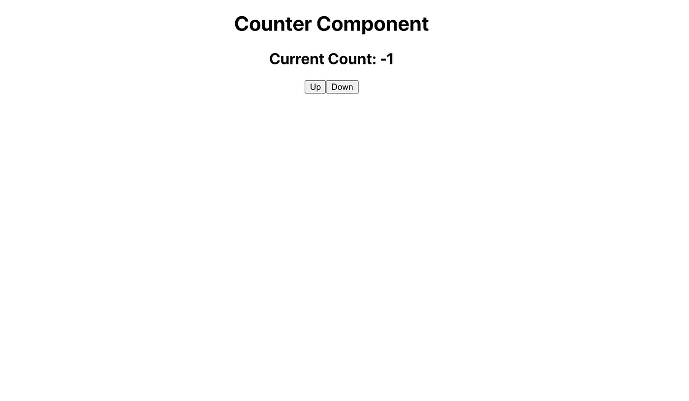

# 使用 Redux 工具包编写更少的 Redux 样板文件

> 原文：<https://javascript.plainenglish.io/how-to-write-less-redux-boilerplate-with-redux-toolkit-691bc753319d?source=collection_archive---------12----------------------->

## 任何 Redux 开发人员的救星

如果您是前端开发人员，您可能已经处理了 Redux 带来的大量膨胀和样板文件。设置动作和缩减器可以产生数百行代码，这些代码相对简单，但却是必要的。


Photo by [Joshua Aragon](https://unsplash.com/@goshua13?utm_source=medium&utm_medium=referral) on [Unsplash](https://unsplash.com?utm_source=medium&utm_medium=referral)

由于这些问题，我暂时转而使用[反冲](https://medium.com/weekly-webtips/recoil-js-high-performance-state-management-for-react-simplified-cb520464a667)，但后来我想起了 Redux Toolkit。

# 什么是 Redux 工具包

[Redux 工具包](https://redux-toolkit.js.org/)为:

> 官方的、固执己见的、包含电池的高效 Redux 开发工具集

有了各种各样的实用程序和稍微优化的框架，它减少了实现 Redux 所必须编写的无用代码量。

更好的是，它得到了 Redux 团队的正式支持，这意味着它只需要一半的代码就能和 Redux 一样好地工作。

有了 Redux Toolkit，就有了一种创建 Redux 逻辑的标准化方法，这种方法简单易用。

# 创建基本应用程序

我们将使用 Redux 工具包编写一个示例应用程序，看看它在实际操作中是如何工作的。您可以在这里看到完成的代码[。](https://github.com/caelinsutch/redux-toolkit-example)

让我们首先设置一个基本的反应应用程序:

```
npx create-react-app my-app
```

接下来，让我们安装 redux 和 redux-toolkit:

```
cd my-app
yarn add redux @reduxjs/toolkit
```

我们将把我们的代码组织成单独的`features`，并编写一个基本的反功能。

让我们运行以下命令来设置我们的功能文件夹:

```
# From Root
cd src
mkdir features
mkdir features/counter
touch features/counter/counter.js
touch features/counter/counter.slice.js
touch store.js
```

让我们添加商店代码:

请注意我们是如何使用由 Redux Toolkit 提供的`configureStore`函数的。

# 配置存储

Redux Toolkit 提供了另一个功能`configureStore`来设置您的 Redux 商店。

```
// Before:const store = createStore(counter)// After:const store = configureStore({
  reducer: counter
})
```

这样做有几个好处:

*   商店设立[反应开发工具](https://github.com/zalmoxisus/redux-devtools-extension)
*   默认情况下会包含一些中间件

接下来，我们将修改`index.js`以在商店中添加我们的 Redux 提供程序。

现在，让我们看看创造我们的`counter`特色。

首先修改`counter.slice.js`

在这里，我们使用`createSlice`功能来创建我们的减速器。让我们讨论一下它实际上是做什么的。

# 创建虱子

Redux Toolkit 有这些概念，称为切片，用于生成缩减器、动作类型和动作创建器。

通过`createSlice`，我们提供了一个具有 reducer 函数的对象，它根据 reducer 函数名生成 action 类型字符串和 creator 函数。

这极大地减少了创建 reducer 的代码量，使它更简单、更易读。

这里我们创建了两个 reducer，一个用于增量，一个用于减量，并导出创建的 reducer 和动作。

太棒了，现在让我们创建计数器组件:

最后，让我们更新`store`来使用这个减速器，然后在我们的`App`中使用`Counter`:

现在，我们应该有一个可以工作的计数器了！你也可以在这里看到完成的应用代码。



Finished App

# 结论

干得好！我们已经创建了一个 React 应用程序，它使用 Redux 和 Redux Toolkit 轻松快速地实现了一个计数器。想了解更多？我强烈推荐 Redux Toolkit 制作的[教程](https://redux-toolkit.js.org/tutorials/intermediate-tutorial)，学习 Redux Toolkit 有多强大！

# 保持联络

有很多内容，我很感谢你读我的。我是加州大学伯克利分校 [MET 项目](https://met.berkeley.edu/)的本科生，也是一名年轻的创业者。我写软件开发、创业和失败(这是我非常擅长的)。你可以在这里注册我的简讯[或者在我的](https://newsletter.cometcode.io/)[网站](https://www.caelinsutch.com/)查看我正在做的事情。

请随时联系我，在 Linkedin 或 Twitter 上联系我，我喜欢听到阅读我文章的人的声音:)