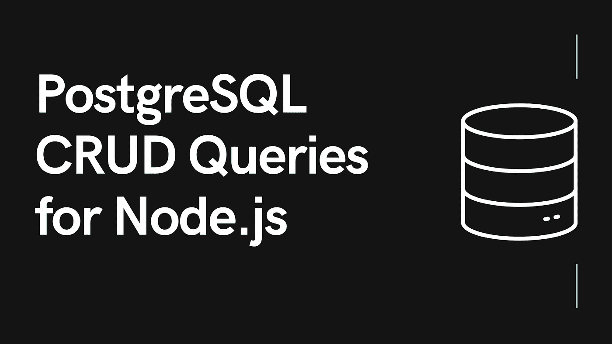
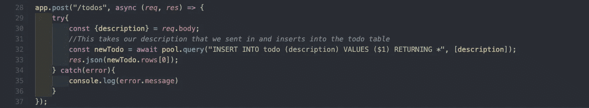
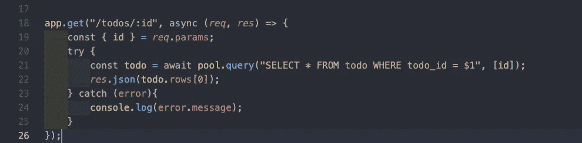
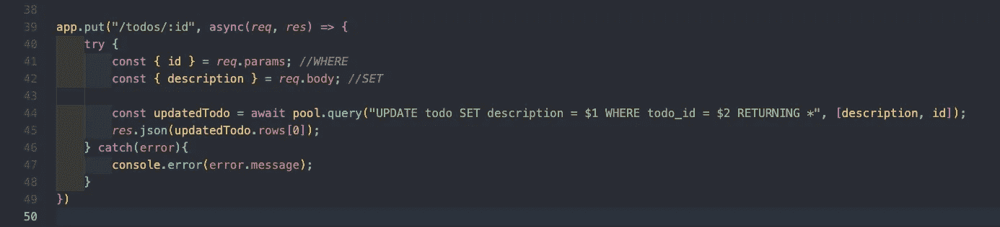
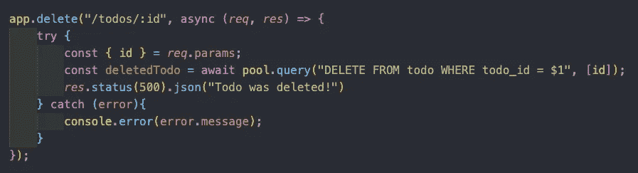

# 如何为 Node.js 编写 PostgreSQL 查询

> 原文：<https://javascript.plainenglish.io/how-to-write-postgresql-queries-for-node-js-714393c3fc04?source=collection_archive---------3----------------------->

## 您可以使用 Node.js 和 PostgreSQL 创建 RESTful api 的四个基本查询



## **简介**

如果你在 Node.js 中编写一个 RESTful api，你必须在关系数据库和非关系数据库之间做出选择。如果您决定选择前者，您将需要知道如何编写基本的 CRUD 查询，以便您的 api 能够以有意义的方式与您的数据库对话。在这篇博客中，我将介绍四个基本查询，您可以使用 Node.js 和 PostgreSQL 来创建 RESTful api。**注意:**本博客假设你已经安装了 Node.js、PostgreSQL 和 pg。

## **查询创建**



这里我们创建了一个路由来处理 post 请求，在这里我们将新数据插入到一个名为“todo”的表中。我们正在创建一个新的 todo，其中我们的描述与用户在请求中输入的描述相同。“$1”充当变量的占位符，让我们可以在查询中插入任何想要的变量。确保写“RETURNING *”，因为这是从查询中接收信息的唯一方式。然后，我们用刚刚更新的数据发送一个 json 响应。

## **代码创建**

```
app.post("/todos", async (*req*, *res*) => {try{const {description} = *req*.body;*//This takes our description that we sent in and inserts into the todo table*const newTodo = await pool.query("INSERT INTO todo (description) VALUES ($1) RETURNING *", [description]);*res*.json(newTodo.rows[0]);} catch(error){console.log(error.message)}});
```

## **查询读取**



这个查询要简单得多。我们从 params 中获取 id，并选择具有该 id 的所有数据。然后，我们发送包含该数据的响应。

## **用于读取的代码**

```
app.get("/todos/:id", async (*req*, *res*) => {const { id } = *req*.params;try {const todo = await pool.query("SELECT * FROM todo WHERE todo_id = $1", [id]);*res*.json(todo.rows[0]);} catch (error){console.log(error.message);}});
```

## **更新查询**



这里我们需要有要更新的 todo 的 id，以及更新后的描述。然后，我们需要用该 id 更新 todo，并将描述设置为等于更新后的描述。再次确保输入 RETURNING *以返回更新的数据。

## **更新代码**

```
app.delete("/todos/:id", async (*req*, *res*) => {try {const { id } = *req*.params;const deleteTodo = await pool.query("DELETE FROM todo WHERE todo_id = $1", [id]);*res*.status(500).json("Todo was deleted!")} catch (error){console.error(error.message);}});
```

## **删除查询**



这里我们只需要我们想要删除的待办事项的 id，并将其从表中删除。在这里，我只是向前端发回一条消息，说 todo 已被删除。

## **删除代码**

```
app.delete("/todos/:id", async (*req*, *res*) => {try {const { id } = *req*.params;const deletedTodo = await pool.query("DELETE FROM todo WHERE todo_id = $1", [id]);*res*.status(500).json("Todo was deleted!")} catch (error){console.error(error.message);}});
```

**来源:**

*更多内容请看*[***plain English . io***](https://plainenglish.io/)