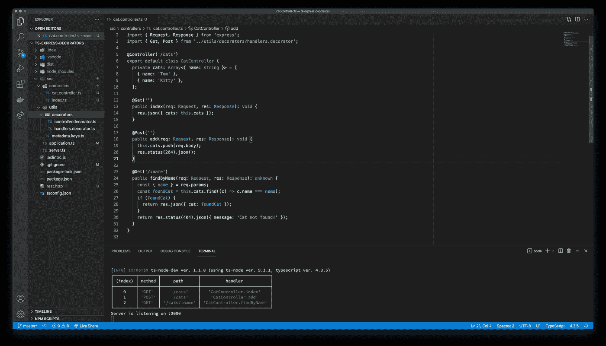

# 如何用 TypeScript 创建快速路由器装饰器

> 原文：<https://javascript.plainenglish.io/how-to-write-simple-router-decorators-for-expressjs-with-typescript-3b8340b4d453?source=collection_archive---------1----------------------->

## 用 TypeScript 装饰器使 Express 服务器路由器更整洁



Express server

让我们看看如何使用 TypeScript decorators 使 express server 路由器更加整洁。

这个故事的目标是展示如何在 express 服务器中创建和使用路由器装饰器。它还需要关于 Express、TypeScript，尤其是 TypeScript decorators 的知识。

我们将使用两种装饰器来创建快速路由器:

*   类装饰器:一个控制器装饰器，处理基本路由器信息，如`path prefix, router-level middleware...`
*   Method decorator:一个处理函数 decorator，它处理路由器的详细信息，如`method, path, handle function...`

# 流动

路由器的所有信息都将存储在**控制器类**的元数据中。这意味着两个 decorators 都将设置写入控制器类。

1.  控制器装饰器是一个类装饰器工厂，它接受一个字符串作为参数。该字符串是路由器的`base path`，它将存储在`BASE_PATH` key 中。
2.  方法装饰器是一个方法装饰器工厂，我们可以通过这个装饰器配置`path`信息。我们将为每个 http 方法创建一个装饰器。通常情况下，每个路由器会有多个处理程序，那么处理程序信息— `path, method, handle function`会存储在一个数组中，这个数组也会存储在控制器类的元数据中，关键字是`routers`。
3.  在我们的 express application init 函数中，我们遍历所有控制器类，获取路由器信息，并将它们注册到我们的 express 服务器。

# 带有 TypeScript 的 Basic Express Server

让我们创建一个简单的 express 服务器:

```
# Init nodejs project
$ npm init -y
$ npm install typescript ts-node-dev @types/express -D
$ npm install express# Init typescript project
$ npx tsc -init
```

我们的`tsconfig.json`看起来会像:

```
{
  "compilerOptions": {
    "target": "ES2018",
    "module": "commonjs",
    "strict": true,
    "esModuleInterop": true,
    "skipLibCheck": true,
    "emitDecoratorMetadata": true,
    "experimentalDecorators": true,
    "rootDir": "./src",
    "outDir": "./dist",
    "forceConsistentCasingInFileNames": true
  }
}
```

> `experimentalDecorators` —启用[对装饰人员的实验支持](https://github.com/tc39/proposal-decorators)
> 
> `emitDecoratorMetadata` —为与模块`[reflect-metadata](https://www.npmjs.com/package/reflect-metadata)`一起工作的装饰者启用发射类型元数据的实验支持。

接下来，创建一个 express 应用程序类。我们将所有的逻辑推送到这个类来创建一个 express 应用程序。

```
// src/application.ts
import express, { Application as ExApplication } from 'express';class Application {
  private readonly _instance: ExApplication; get instance(): ExApplication {
    return this._instance;
  } constructor() {
    this._instance = express();
    this._instance.use(express.json());
    this.registerRouters();
  } private registerRouters() {
    this._instance.get('/', (req, res) => {
      res.json({ message: 'Hello World!' });
    }); // TODO: register routers
  }
}export default new Application();
```

我们只是“公开”了应用程序的一个实例，在整个应用程序中我们只创建了一个应用程序。

现在，我们将应用程序实例注册到一个服务器对象来处理所有 http 请求:

```
// src/server.ts
import application from './application';
import * as http from 'http';const PORT = process.env.PORT || 3000;const server = http.createServer(application.instance);server.listen(PORT, () => {
  console.log(`Server is listening on :${PORT}`);
});
```

这个文件是我们的切入点。您可以通过构建 ts 到 js 文件来启动服务器，然后像普通的 js 文件一样执行`server.js`。或者使用`ts-node`直接执行 ts 文件。在开发时，我建议使用`ts-node-dev`来执行 ts 文件，当我们的项目有任何变化时，自动“重启”我们的应用程序。

```
$ npx ts-node-dev src/server.ts
[INFO] 23:28:23 ts-node-dev ver. 1.1.8 (using ts-node ver. 9.1.1, typescript ver. 4.3.5)

Server is listening on :3000
```

在另一个终端中，尝试访问服务器:

```
$ curl --request GET \
  --url [http://localhost:3000/](http://localhost:3000/) \
  --header 'user-agent: vscode-restclient'# Response
{"message":"Hello World!"}
```

# 快速装修工

我们使用`reflect-metadata`包作为 Polyfill 来扩展对象元数据 API。API 支持保存和检索元数据信息。

```
$ npm install reflect-metadata
```

在入口点文件的开头导入聚合填充— `servert.ts`

```
import 'reflect-metadata';// ...
```

让我们在一个公共文件中定义元数据键，这些键将在许多地方使用。

```
// src/utils/metadata.keys.ts
export enum MetadataKeys {
  BASE_PATH = 'base_path',
  ROUTERS = 'routers',
}
```

现在，我们可以创建第一个装饰器—控制器装饰器:

```
// src/utils/controller.decorator.ts
import { MetadataKeys } from '../metadata.keys';const Controller = (basePath: string): ClassDecorator => {
  return (target) => {
    Reflect.defineMetadata(MetadataKeys.BASE_PATH, basePath, target);
  };
}export default Controller;
```

其实，`Controller`是一家装潢厂。它返回一个类装饰器，并接受`basePath`字符串作为参数。装饰器只是将`basePath`信息加入到`target`——控制器类(原型)中。

方法装饰者会更有逻辑，也更混乱。

```
// src/utils/handlers.decorator.ts
import { MetadataKeys } from '../metadata.keys';export enum Methods {
  GET = 'get',
  POST = 'post',
}export interface IRouter {
  method: Methods;
  path: string;
  handlerName: string | symbol;
}const methodDecoratorFactory = (method: Methods) => {
  return (path: string): MethodDecorator => {
    return (target, propertyKey) => {
      const controllerClass = target.constructor; const routers: IRouter[] =   Reflect.hasMetadata(MetadataKeys.ROUTERS, controllerClass) ?
        Reflect.getMetadata(MetadataKeys.ROUTERS, controllerClass) : []; routers.push({
        method,
        path,
        handlerName: propertyKey,
      }); Reflect.defineMetadata(MetadataKeys.ROUTERS, routers, controllerClass);
    }
  }
}export const Get = methodDecoratorFactory(Methods.GET);
export const Post = methodDecoratorFactory(Methods.POST);
```

`methodDecoratorFactory`返回一个返回方法装饰器的工厂。

我们可以使用第一个工厂，通过提供一个`method`枚举值，为每个 http 方法创建一个方法装饰器。

第二个工厂将`path`值传递给最后一个方法装饰器。作为我们的策略，我们将所有路由器的信息保存在控制器类中。路由器的信息包括:

*   `method` —第一工厂提供。
*   `path` —二厂提供。
*   `handleName` —由方法装饰者提供。

装饰器的`target`是一个“方法”,因为它是方法装饰器的参数。但是，我们需要在类中存储信息，那么`target.constructor`就是最终的**目标**。

我们必须处理装饰者第一次被执行的情况。我们当时要准备一个空数组，然后把第一个路由器信息推送到空数组。在其他情况下，我们只是获取当前的路由器列表，然后将路由器信息附加到这个数组中。最后，只需覆盖`ROUTERS`元数据。

在这个文件中，我只是导出了`Get, Post`decorator 作为例子。

# 应用装饰者

我们将使用 decorators 来创建一些简单的 REST API。

```
// src/controllers/cat.controller.tsimport { Request, Response } from 'express';
import Controller from '../utils/decorators/controller.decorator';
import { Get, Post } from '../utils/decorators/handlers.decorator';@Controller('/cats')
export default class CatController {
  private cats: Array<{ name: string }> = [
    { name: 'Tom' },
    { name: 'Kitty' },
  ]; @Get('')
  public index(req: Request, res: Response): void {
    res.json({ cats: this.cats });
  } @Post('')
  public add(req: Request, res: Response): void {
    this.cats.push(req.body);
    res.status(204).json();
  } @Get('/:name')
  public findByName(req: Request, res: Response): unknown {
    const { name } = req.params;
    const foundCat = this.cats.find((c) => c.name === name);
    if (foundCat) {
      return res.json({ cat: foundCat });
    }
    return res.status(404).json({ message: 'Cat not found!' });
  }
}
```

*   `CatController`类将`/cats`存储为基础路由器
*   `index`函数处理`GET /cats`请求—返回所有的猫
*   `add`函数处理`POST /cats`请求—将一只猫添加到猫列表中
*   `findByName`函数句柄`GET /cats/:name` —根据名字找到一只猫。

然后我们导出一个控制器类列表:

```
// src/controllers/index.tsimport CatController from './cat.controller';export const controllers = [
  CatController,
];
```

现在，回到我们的应用程序类并更新`TODO: register router`区域:

控制器类列表循环:为每个控制器创建一个快速路由器。从控制器类获取路由器信息，并使用该信息创建新的路由器句柄。路由器句柄将如下所示:

```
@Get('/:name')
public findByName(...=>exRouter.get(/:name, controllerInstance.findByName.bind(controllerInstance));
```

我们必须为控制器函数绑定`this`关键字，因为在函数中我们已经使用了`this`关键字，并且我们期望`this`是控制器。

记住将路由器注册到应用程序实例。在该步骤中，将使用`basePath`设置。解释卡特彼勒控制器:

```
[@Controller](http://twitter.com/Controller)('/cats')
export default class CatController {...=>
this._instance.use('/cats', exRouter);
```

`info`变量仅用于打印路由器映射表:

```
$ npx ts-node-dev src/server.ts┌─────────┬───────────────────┬────────────────────────────┐
│ (index) │        api        │          handler           │
├─────────┼───────────────────┼────────────────────────────┤
│    0    │    'GET /cats'    │   'CatController.index'    │
│    1    │   'POST /cats'    │    'CatController.add'     │
│    2    │ 'GET /cats/:name' │ 'CatController.findByName' │
└─────────┴───────────────────┴────────────────────────────┘
Server is listening on :3000
```

仅此而已！

# 结论

这个故事是一个应用 TypeScript decorators 为 express 应用程序创建路由器的例子。你可以基于这个故事开发你的项目，你可以创建一个认证中间件装饰器，在请求体中验证一些东西…也许我的故事会给你一些帮助。

本文使用的源代码发布在 [Github](https://github.com/codetheworld-io/ts-express-decorators) 上。

感谢您的阅读！

*更多内容请看*[***plain English . io***](http://plainenglish.io)