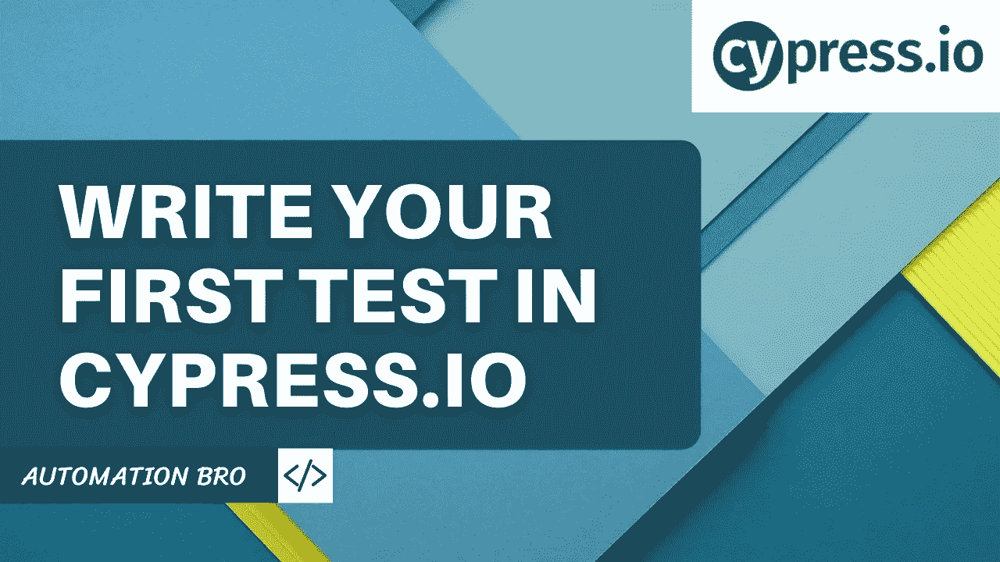
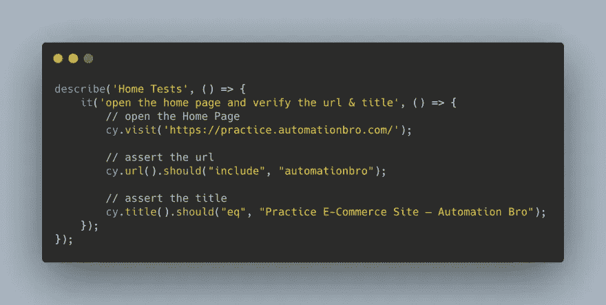
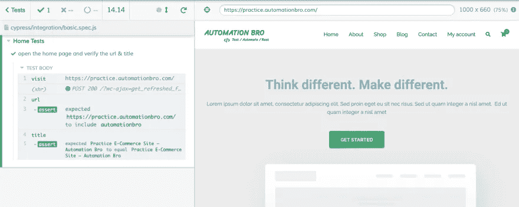

# 如何用 Cypress 编写你的第一个测试

> 原文：<https://javascript.plainenglish.io/how-to-write-your-first-test-in-cypress-28be62dc5d90?source=collection_archive---------19----------------------->



在本教程中，我们将介绍如何用 Cypress 编写您的第一个测试。我们将检查基本的 Cypress 语法，并使用 Cypress 测试运行器运行我们的测试。

## 创建您的 Cypress 测试



*   要访问任何 URL，您可以使用`cy.visit()`命令。
*   Cypress 还提供了各种类型的页面断言，如`cy.url()`和`cy.title()`来断言 URL 和页面标题。

## 在 Cypress 测试运行程序中运行 Cypress 测试

要打开 Cypress 测试运行器，您可以执行下面的命令:

```
npx cypress open
```

一旦 Cypress 测试运行器打开，您就可以执行您的测试，它将显示如下所示的结果:

*   您可以看到下面列出的所有 Cypress 命令，如 visit、URL & title。
*   所有成功的断言将以绿色显示，失败的断言以红色显示。



## 查看下面的视频，了解如何在 Cypress 中创建您的第一个测试:

感谢阅读！

*更多内容尽在*[*plain English . io*](http://plainenglish.io/)