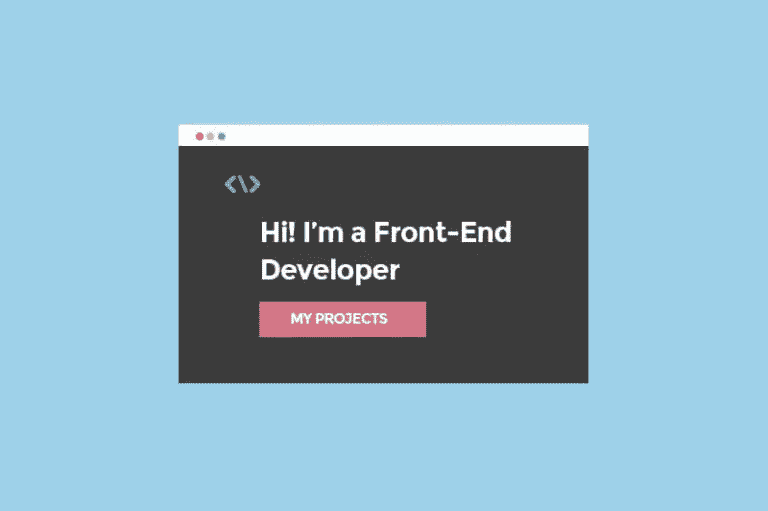
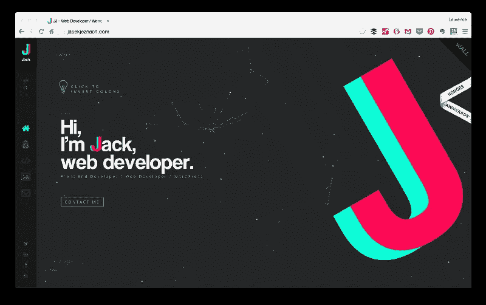
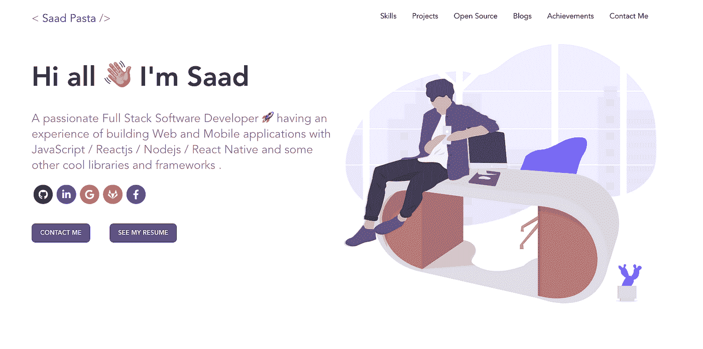
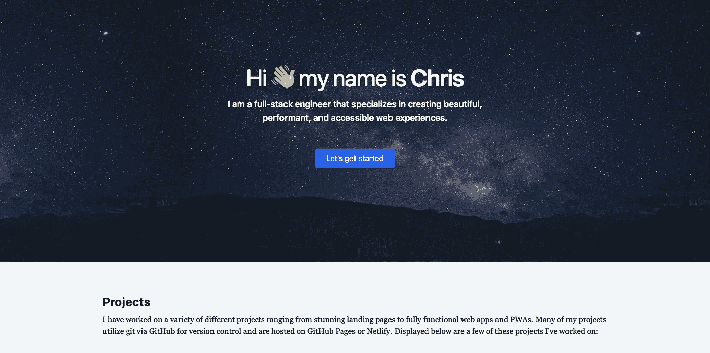

# Web 开发人员如何构建有效的投资组合

> 原文：<https://javascript.plainenglish.io/how-web-developers-can-build-an-effective-portfolio-aed719927589?source=collection_archive---------5----------------------->

## 用现实生活中的开发者投资组合的例子来启发你。

Image Source: [Skillcrush](https://skillcrush.com/blog/front-end-developer-portfolio/)

当开发者为他们的作品集创建一个网站时，他们通常使用设计门户作为灵感的来源。或者，您可以探索网站建设者使用他们的一些模板。

看到其他 web 开发人员的作品集是学习和积累经验的好起点。

但我建议，如果你想要一个五年甚至十年后都好看的东西，那就尽量使用简单的设计。选择简单而实惠的颜色。使用合适大小的可读字体。

您还需要设计一个信息架构:

*   你想在你的文件夹中包含什么信息？
*   你想如何展示这个？
*   一页？
*   多条路线？

在编码之前做出这些决定，你将会节省大量的时间。

## 你应该使用什么技术来建立你的投资组合？

有许多不同的技术可以用来建立你的投资组合。以下是后端和前端开发人员的一些投资组合开发选项。

## 后端开发人员组合

如果您是后端开发人员或不习惯创建用户界面，您有几种方法。

## 使用 CMS

内容管理系统(CMS)管理数字内容的创建和维护。WordPress 是最流行的内容管理系统之一，对于那些不习惯创建自己的用户界面的开发者来说是一个很好的选择。

## 使用简单的 HTML 和 CSS

如果你对 web 开发基础有所了解，一个获得经验的好方法是使用最基本的 HTML 和 CSS 来创建你的网站。

也就是说，你不必使用 JavaScript 来创建一个令人惊叹的投资组合。用户界面设计不会很复杂，即使你的技能和专长不在其中。另外，建立一个 HTML 和 CSS 网站 HTML 和 CSS 网站显示了你在舒适区之外学习的能力。

## 使用 CSS 框架

如果你对基本的 HTML 和 CSS 相当熟悉，但是想要一个更复杂的用户界面，你可以尝试 CSS 框架。CSS 框架使得设计元素更加容易和快速。

重要的是要注意，如果你申请的是前端开发人员的角色前端开发人员的角色，使用 CSS 框架可能不是最好的选择，因为雇主会寻找一个可以自由开发 CSS 的开发人员。但是对于内部开发人员来说，这可能是一个很好的选择。

## 使用网站生成器。

如果你想让你的作品集尽快展示出来，你也可以走使用网站建设者的路线，有很多网站建设者，但他们都是有偿的。

这使得部署您的网站非常快速和容易。您甚至可以集成一个自定义域。

但是，如果你应聘的是前端开发人员的角色前端开发人员的角色，用一个平台来搭建网站可能不是最好的选择。自己创建一个网站。这是展示你技能的最好机会。

## 前端开发人员组合

如果你是一个前端开发人员，有许多选择来建立你的投资组合网站。

## 使用简单的 HTML、CSS 和 JavaScript

一个简单的网站永远不会出错。如果你不想的话，你不需要使你的投资组合架构过于复杂。你从零开始建立网站的事实向潜在雇主表明，你愿意花额外的时间来展示你的技能。

## 使用 JavaScript 框架。

您可能希望将您的作品集作为一种使用框架练习和展示您的 JavaScript 能力的方式。我建议你选择适合你的方法或者你想学的方法！或者哪个适合你要找的工作类型。

通常框架都有现成的模板，可以用来创建一个初始项目。这可以节省您设置环境的大量时间，并省去您自己编写大量代码的麻烦。

## 使用静态站点生成器。

由于采用了流行的框架，如 React、Vue、Angular 等，静态站点生成器在技术行业中越来越突出。

有许多不同的网站生成器。它们提供了许多好处，如图像优化插件、可访问性和移动设备的响应能力等。

再次强调，确保你的代码组织良好且高效。将所有的作品集内容放在一个页面上很简单，但是将内容分成几个部分或者 HTML 页面会有很大的不同。

此外，确保你的 CSS 是干净和有组织的。尝试使用更现代的 CSS 来定位元素(比如 Flexbox 或浮动元素上的 CSS-Grid)。这表明您掌握了这些规范。使用语义正确的 HTML，用定义好的主要部分分层构建，为你的投资组合指出重要的里程碑。

## 现实生活中开发人员投资组合的示例:

**1。Jacekjeznach.com**

**技能:**前端，后端，棱角，反应

Image captured by the author

**2。Developerfolio.js.org**

**技能:**全栈开发者

Image captured by the author

3.portfolio.chrisbrownie.dev

**技能:**全栈工程师

Image captured by the author

## 投资组合应该包含什么？

我们始终建议您在投资组合中包含以下部分:

*   **关于我:**你是谁？你业余时间喜欢做什么？有什么生活中的趣事吗？
*   **工作/项目/技能:**你从事过哪些技术？你创作过哪些项目？
*   **博客:**如果你有博客，就展示它。
*   联系人:雇主将如何联系你？

同样，你可以创建一个登陆页面，重定向到不同的平台(你的社交媒体等。).你的作品集应该尽可能地表现你。没有放之四海而皆准的投资组合。自己创造！

*更多内容尽在*[*plain English . io*](http://plainenglish.io/)