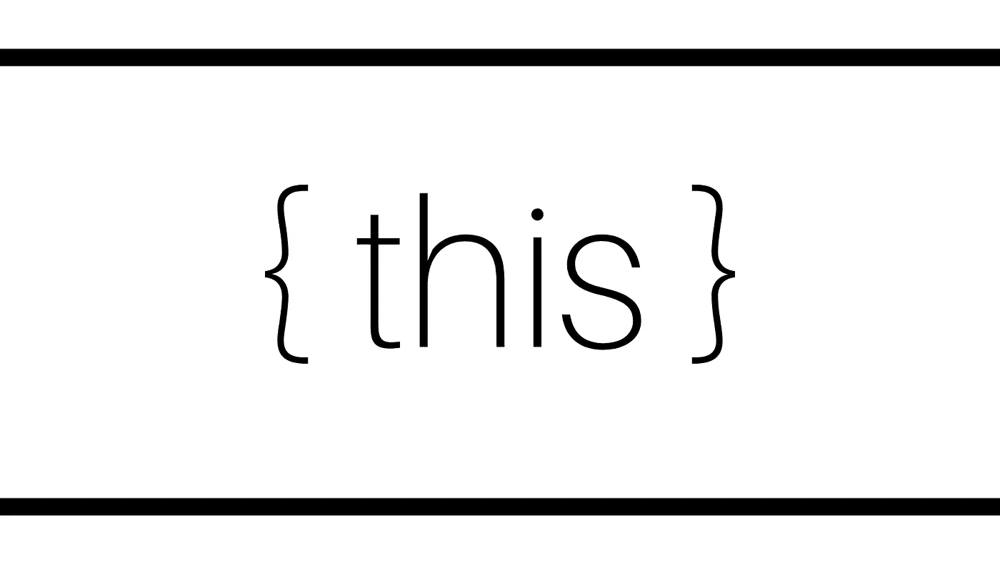
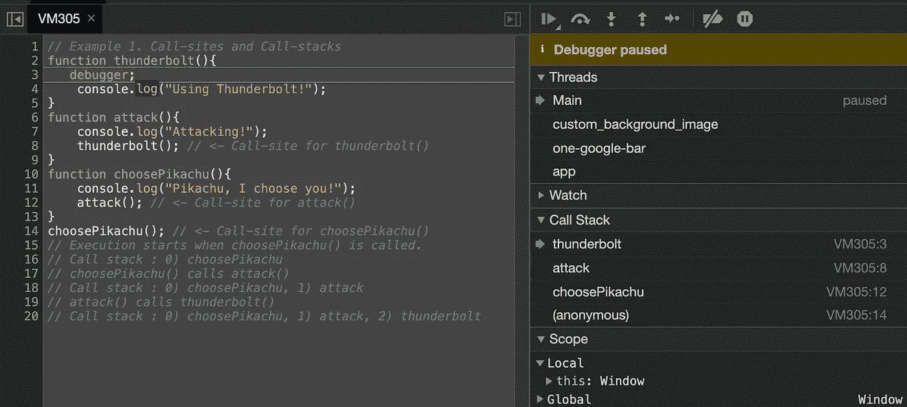

# 你对 JavaScript 中的“this”了解多少？

> 原文：<https://javascript.plainenglish.io/how-well-do-you-know-this-ce4355bc9b?source=collection_archive---------6----------------------->

# “这个”是什么？

用最简单的术语来说，JavaScript 关键字`this`指的是它在运行时所属的对象，这取决于它的**调用点**(它被调用的地方)。

然而，要理解它在任何给定的上下文中所指的内容，需要对一些相关概念有稍微深入的理解，这将在本文中涉及。

首先，`this`可以有以下值，这取决于它被访问的位置:

*   ***默认为*** : `this`指全局对象。
*   ***在一个函数里面*** : `this`是指全局对象。然而在严格模式下，`this`将会是`undefined`。
*   ***里面有一个方法*** : `this`指的是拥有者对象。(方法是属于对象内部的函数。换句话说，它是一个函数，是一个对象的属性。)
*   ***事件中的*** : `this`是指事件被触发的元素。
*   ***内部一个立即被调用的函数表达式(life)***:`this`指全局对象。在严格模式下，`this`将是`undefined`，就像全局上下文中的任何其他函数一样。
*   ***在胖箭头函数*** 内:当胖箭头`()=>`用于定义一个函数时，它不会为`this`创建一个新值，相反，它会一直引用它在函数外引用的同一个对象。

本文希望让您了解这些值是如何分配给`this`的，以及如何利用这些知识来满足我们的需求。

# **调用点和调用栈**

正如上一节所讨论的，我们知道了`this`是为每个函数调用制作的*运行时绑定，这完全取决于它被调用的确切位置。*

*代码中调用相关函数的位置称为**调用点**。理解确定**调用点**对于理解`this`在任何给定的执行点将被绑定到什么是至关重要的。*

*虽然找到 ***调用点*** 通常就像定位函数被调用的位置一样简单，但由于某些编码模式可能会使其模糊不清，所以可能并不总是那么清楚。*

*因此，考虑 ***调用栈*** 是很重要的，它是被调用来让我们进入我们所关心的当前执行阶段的函数栈。*

*让我们举一个简单的例子来说明如何确定 ***调用栈*** 和 ***调用点*** 。*

*1\. Call-sites and Call-stacks*

*通过按顺序跟踪函数调用链，您可以确定**调用栈和调用点。***

## ****确定调用堆栈的提示***

*利用任何现代浏览器开发工具提供的内置 JS 调试器。*

*在任何 JS 代码的执行中，都可以使用关键字 ***调试器*** *，*设置断点，在浏览器中停止该点的执行。*

*比方说，我们在调用`thunderbolt()`时添加了一个断点。*

**

*The **debugger** stops the execution at the custom breakpoint, and the function **call-stack** at that point can be viewed on the right side.*

*在上图中，我们可以看到，在我们提到**调试器**关键字的地方，一调用`thunderbolt()` 就停止了执行。在这一点上，我们不会观察到任何在**调试器**之后的代码的执行(在这种情况下，只有`thunderbolt()` *日志*)。*

*我们现在最感兴趣的是**调用栈**，它清晰地显示在右边，和我们在上面的例子中确定的一样。`(anonymous)` 在栈底，指初始全局调用到`choosePikachu()` *。**

# ***绑定规则为***

*现在我们已经了解了什么是**调用点**和**调用栈**，我们可以了解**调用点**如何决定在执行期间`this`将持有什么。*

*有四个通用规则适用。首先，让我们独立地理解它们*，然后，当多个规则可以应用于**调用点**时，它们的*优先顺序*。**

# **1.默认绑定**

**当没有其他规则适用时，这是默认的总括规则。它来自最常见的函数调用，即独立的函数调用。**

**让我们看看下面的例子。**

**2\. Default Binding**

**在全局作用域中声明的变量`ultraBall`与在同名的全局对象上声明的属性相同。**

**在`getPokemon()`内部，对`this`的引用默认为全局对象。因此，我们将看到`this.ultraBall`的值被记录。**

**但是，如果`strict`模式在全局有效或者在`getPokemon`内部有效，则全局对象不允许默认绑定。在这种情况下，我们将看到错误`TypeError : 'this' is 'undefined'`。**

# **2.隐式结合**

**如果调用点有一个上下文对象(如果一个函数通过一个拥有或包含的对象调用，作为它的属性)，隐式绑定适用。**

**该规则规定，当函数引用有一个上下文对象时，对象应该用于其方法调用的`this`绑定。**

**让我们看几个例子来说明可能出现的不同情况。**

**3\. Simple Implicit Binding**

**因为对象`pikachu`是`getBaseSpeed`调用的`this`，所以`this.baseSpeed`与`pikachu.baseSpeed`同义。**

**让我们看另一个例子，看看只有对象属性引用链的顶层或最后一层对隐式`this`绑定的调用点有什么影响。**

**4\. Object chain in Implicit Binding**

**我们可以看到，`baseSpeed`的值仍然是`90`。这是因为对`getBaseSpeed`的调用被绑定到它的直接调用者`pikachu`，这充当了它的`this`绑定。在这种情况下，`baseSpeed`值为`90`。**

**让我们再看几个例子，展示隐式绑定看起来出乎意料的常见情况。**

**5\. Lost Implicit “this” binding**

**在这个例子中，如果将`pikachu.getBaseSpeed`赋给一个不同的变量`baseSpeedFunction`，我们就失去了与`pikachu`的隐式`this`绑定。现在，对于`baseSpeedFunction`，`this`指的是全局对象(*默认绑定*发生)。因此，对于该调用，`this.baseSpeed`将是`50`。**

**现在，隐式绑定丢失的一个更常见但不太明显的方式是当我们传递回调函数时。考虑下面的例子:**

**6\. Lost Implicit “this” binding, another case.**

**同样，在回调函数执行器`executeFunction`内部，我们有效地传递了对`pikachu.getBaseSpeed`函数的引用。执行后，`this`将再次绑定到全局对象(或者抛出一个`TypeError`，如果`strict`模式被启用)，而不是`pikachu`。**

**函数回调失去它们的`this`绑定是很常见的。当我们将回调传递给的函数有意改变调用的`this`时，会出现另一个意想不到的结果。例如，流行的 JavaScript 库中的事件处理程序经常修改`this`以指向触发事件的 DOM 元素。**

**您并不能真正控制回调函数引用的执行方式。到目前为止，您还没有任何方法来控制调用点来分配您想要的绑定。这就是 ***显式绑定*** 发挥作用的地方。**

# **3.显式绑定**

**为了通过隐式绑定解决`this`的意外丢失，我们可以为函数调用将`this`的值显式设置为给定的对象。**

**有几个内置方法可以帮助我们实现**的显式绑定，比如:****

## ***bind()方法***

***`**bind()**`是`**Function.prototype**`属性的一个方法。这意味着`**bind()**`可以被每一个功能使用。***

***`**bind()**`方法创建一个新函数，当调用该函数时，它的`this`关键字被设置为提供的值，当调用新函数时，在任何提供的参数之前有一个给定的参数序列。***

***换句话说，`**bind()**` 返回一个新的函数，该函数被硬编码为使用指定的`this`上下文来调用原始函数。***

***7\. “this” binding with bind()***

## *****调用()和应用()方法*****

***`**call()**`和`**apply()**`也是`**Function.prototype**`属性的方法，用法相似但略有不同。***

***`**call()**`方法使用给定的`this`值和单独提供的参数调用函数。***

***然而，`**apply()**`方法调用一个具有给定`this`值的函数，并且`arguments`被提供为一个数组(或者一个类似[数组的对象](https://developer.mozilla.org/en-US/docs/Web/JavaScript/Guide/Indexed_collections#working_with_array-like_objects))。***

***8\. “this” binding with call() or apply()***

***通过`Pokémon.call()`或`Pokémon.apply()`显式绑定来调用`Pokémon`允许我们强制其`this`成为函数`PokémonExtension`的`this`。***

***此外，上面例子中值得注意的一点是，`PokémonExtension`的所有实例都将它们各自的`this`绑定到它们内部`Pokémon`的执行。这种显式绑定也称为**硬绑定。*****

# ***4.新绑定***

***在 JavaScript 中，真的没有“构造函数”这种东西，只有函数的构造调用。***

***当调用前面有`new`的函数时，也称为构造函数调用，下面的事情会自动完成。***

1.  ***一个全新的物体凭空被创造出来。***
2.  ***新构造的对象被`[[Prototype]]`链接。(超出了本文的范围)***
3.  ***新构造的对象被设置为该函数调用的`this`绑定。***
4.  ***除非函数返回自己的替代对象，否则`new`调用的函数调用将*自动*返回新构造的对象。***

**9\. Simple “this” binding in case of new**

# **所有生效的约束规则**

**应该清楚的是，*默认绑定*是四个规则中优先级最低的。**

**让我们比较一下*隐式绑定、显式绑定、*和*新绑定*。**

## ****隐式与显式****

**10\. Implicit versus Explicit binding**

**正如我们所见，`firstAttempt.catchPokémon`的*显式绑定*与`secondAttempt`优先于其自身的*隐式绑定，*也是如此。**

**因此，*显式绑定*的优先级高于*隐式绑定*。**

## **隐式与新**

**11\. Implicit versus new binding**

**所以，*新绑定*比*隐式绑定*更有先例。**

## **显性对新？**

**`new`和`call`或者`apply`不能一起使用，所以类似`var fourthAttempt = new catchPokémon.call(firstAttempt);`的东西不允许直接针对*显式绑定*来测试*新绑定*。但是，我们仍然可以使用一个*硬绑定*来测试两者的优先级。**

**12\. Explicit versus new through hard-binding**

**`attemptBinder`硬绑反`firstAttempt`，但是`new attemptBinder(“Steelix”)`并没有像我们可能预料的那样，把`firstAttempt.name`改成`"Steelix"`，而是保持了`"Onix"`。**

**相反，对`attemptBinder("Steelix")`的硬绑定调用可以被`new`覆盖。由于应用了`new`，我们获得了新创建的对象，我们将其命名为`secondAttempt`，并且我们看到`secondAttempt.name`确实具有值`"Steelix"`。**

**因此，新创建的`this`被使用，而不是先前指定的*硬绑定*用于`this`。实际上，`new`能够覆盖*硬绑定*。**

**这种行为的主要原因是创建了一个基本上忽略了`this` *硬绑定*的函数，并预设了该函数的部分或全部参数。**

# **最后，确定“这个”**

**我们可以从函数调用的**调用点、**中总结出确定`this`的规则。**

**他们在这里:**

1.  **函数是用`new`调用的吗？如果是，`this`就是新构造的对象*(新绑定)。*例，`var attempt = new catchPokémon("Pidgey");`**
2.  **函数是用`call`还是`apply`调用，甚至隐藏在一个`bind` *硬绑定*里面？如果是，`this`是显式指定的对象(*显式绑定)*。例，`var attempt = catchPokémon.call("Pidgeotto");`**
3.  **这个函数是用一个上下文调用的吗，或者说是一个拥有或包含的对象？如果是，`this`就是那个上下文对象(*隐式绑定)*。例，`var attempt = firstAttempt.catchPokémon("Pidgeot");`**
4.  **否则，`this`默认为`global`对象，或者`strict`模式下的`undefined`(*默认绑定)。***

# **摘要**

**确定正在执行的函数的`this`绑定需要找到该函数的直接**调用点**。**

**一旦检查完毕，可以将四个规则应用于调用点，按照以下优先顺序。**

1.  **用`new`打电话？使用新构造的对象。**
2.  **用`call`或`apply`或`bind`称呼？使用指定的对象。**
3.  **用拥有调用的上下文对象调用？使用上下文对象。**
4.  **默认:`undefined`在`strict`模式，否则`global`对象。**

## ****学分****

1.  **官方文档:[https://developer . Mozilla . org/en-US/docs/Web/JavaScript/Reference/Operators/this](https://developer.mozilla.org/en-US/docs/Web/JavaScript/Reference/Operators/this)**
2.  **你不知道 JS:这和对象原型，凯尔辛普森。**

**非常感谢你的阅读！❤️**