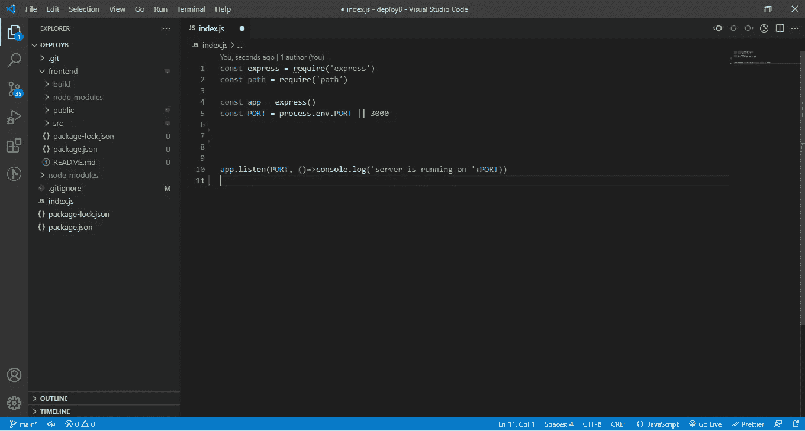
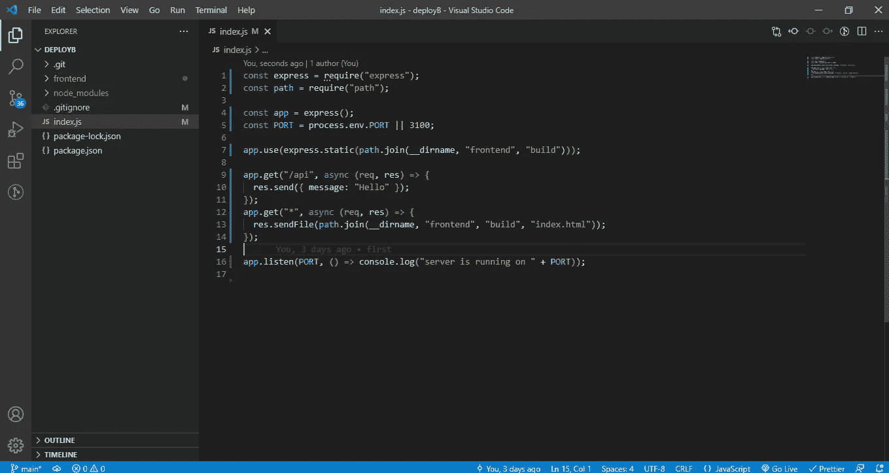

# 如何从 Express 端点提供 React 构建文件夹

> 原文：<https://javascript.plainenglish.io/how-you-can-serve-react-js-build-folder-from-an-express-end-point-127e236e4d67?source=collection_archive---------2----------------------->

## 关于如何从 Express 端点提供 React 构建文件夹的指南。


在本文中，我们将创建一个简单的 React 应用程序，运行 npm，运行 build，并从 Express 提供 build 文件夹。

第一件事是创建一个新文件夹并将 cd 放入该文件夹，然后运行通常的`npx create-react-app frontend`。这是创建一个反应应用程序，并命名为文件夹前端。将光盘放入*前端*文件夹，然后*运行* `npm build` *。*一旦命令执行完毕，你将得到一个构建文件夹。这是我们快递服务的文件夹。

Cd 放回根文件夹。这是我们初始化 Express 应用程序的地方。运行`npm init -y`，和`npm i express` *。*这将在根文件夹中安装 express。安装完成后，创建一个名为 index.js 的文件。在这个文件夹中需要 path 模块(Node.js 提供给我们的一个模块)。现在像往常一样设置一个 Express 服务器。



这就是你的文件夹结构和应用程序应该的样子。

下一步是让由 *npm 运行构建*创建的构建文件夹成为静态的。为此，您需要调用 *express.static()* 并将路径(绝对路径)传递给 express.static()。而 express.static()要在 app.use()中调用，作为中间件。现在的问题变成了我们如何获得构建文件夹的绝对路径。最简单的方法是利用我们之前引入的 path 模块。

如果您使用 console.log(__dirname)，您将获得根目录的绝对路径，但是我们需要将前端文件夹中的构建文件夹设为静态。这就是路径模块的用武之地。path.join 为我们轻松构建路径。我们将 path.join()称为 path.join(__dirname，' frontend '，' build ')。这将返回构建文件夹的绝对路径。所以在最后，我们应该有；

```
app.use(express.static(path.join(__dirname, ‘frontend’, ‘build’)))
```

你可以继续使用`console.log(path.join(__dirname, ‘frontend’, ‘build’))`来让 path.join()做得更清楚。

现在我们在 Express 中创建了一条路线。路由应该是 app.get(*，callback)。这里的通配符(*)表示一旦您向任何路由发送 get 请求，就会触发该路由。

通常情况下，由于 express 的工作方式(寻找与您发送请求的 URL 匹配的第一个路由)，这个(*)路由通常被放置在所有其他路由之后，这给了您定义其他路由(如/api/)的机会，以便您不会总是在发送任何 get 请求时让 react 应用程序提供服务。因为实际上，除了为 React 应用程序提供服务之外，您还希望将其他 get 请求发送到 Express API。

现在到回调，我们将传递给 app.get(*，callback)。在回调中，我们希望发送构建文件夹中的 HTML 文件。Lucky for us express 提供了一种从响应对象发送 HTML 文件的方法(第二个参数传递给回调)。所以我们只调用 res.sendFile()。现在，我们必须再次提供该 HTML 文件的绝对路径。就像我们在调用 path.join 之前所做的一样，只是多了一个参数' index.html '。path.join(__dirname，' frontend '，' build '，' index.html ')。最后我们有:

```
res.sendFile(path.join(__dirname, ‘frontend’, ‘build’, ‘index.html’))
```



这是你最后应该有的。

注意:我创建了一个 app.get('/api ')来展示您也可以向其他路由发送其他 get 请求，只要服务于 React 应用程序的路由不在这些路由之前。

我还制作了一个视频来解释同样的事情，在视频中，我还展示了如何在 Heroku(PAAS)上部署这个应用程序。视频如下:

*更多内容请看*[***plain English . io***](https://plainenglish.io/)*。报名参加我们的* [***免费周报***](http://newsletter.plainenglish.io/) *。关注我们关于*[***Twitter***](https://twitter.com/inPlainEngHQ)*和*[***LinkedIn***](https://www.linkedin.com/company/inplainenglish/)*。加入我们的* [***社区不和谐***](https://discord.gg/GtDtUAvyhW) *。*