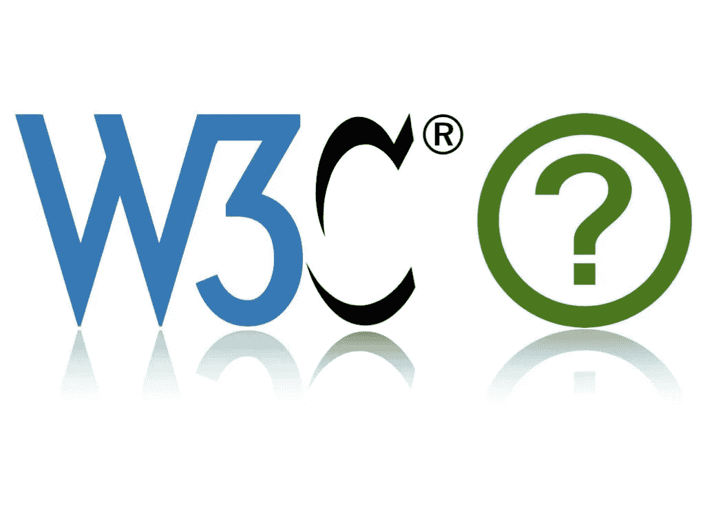

# HTML Web 标准，以及我们可以从 HTML 5.3 中期待的新特性

> 原文：<https://javascript.plainenglish.io/html-5-3-2521670d5da8?source=collection_archive---------12----------------------->

## 深入了解 HTML web 标准、web 可访问性和即将推出的 web 应用功能:支付请求 API、WCAG 2.2、WebAuthn 等

# 在这篇文章中，我将谈论以下内容:

1.  W3C 和 WHATWG——什么是 web 标准？
2.  未来的 Web 功能，例如支付请求 API、WCAG 2.2、WebAuthn、本地文件系统 API 等

这似乎是很久以前的事了，当时我还是一名初级开发人员，睁大眼睛看着最新的 HTML 5 版本。于 2014 年 10 月 28 日发布。HTML5 震撼！圈内人士的内部开发笑话:)([https://www.html5rocks.com/en/](https://www.html5rocks.com/en/))

时间在流逝:backjone.js，可访问性已经大大提高，HTML 5.3 正在召唤我们的网络工程师、产品设计师和产品经理。或者是？

等等 W3C 和 WHATWG 是什么？理解 HTML 标准。

基本上一段时间前，WC3 和 WHATWG 进入牛肉。早在 2004 年，W3C 就关注 XHTML，将其作为 HTML 的下一个主要版本。一些贡献者不喜欢这样，尤其是当时的主要浏览器供应商:苹果、Mozilla 和 Opera。后来谷歌和微软加入进来，他们开始为新的 HTML5 版本制定一个独立的标准。就像我们现在知道的那样震撼！慢慢地让 XHTML 走向死亡。这意味着 W3C 和 WHATWG 都在开发 web 技术。

然而，我们已经达成协议(15 年后),在开放网络平台的维护和发展方面进行合作。所以到今天为止，标记状态是基于 WHATWG 的工作，而不再是 W3C。[更多信息](https://www.w3.org/blog/2019/05/w3c-and-whatwg-to-work-together-to-advance-the-open-web-platform/)。

查看 WHATWG html 标准:【https://html.spec.whatwg.org/multipage/ 

有了这个消息，一些像 HTML 5.3 和 DOM 4.1 发布这样的老消息就不再是新闻了。迷惑的权利。但最确定的是，这些功能将作为正在进行的 WHATWG HTML 更新的一部分来实现。

## 仅供参考以下是一些 HTML 5.3 计划发布的功能:

*   rtc 元素在 ruby 文本中引入了一个新的附加注释。
*   [自动大写属性](https://www.w3.org/TR/html53/sec-forms.html#element-attrdef-input-autocapitalize)允许控制表单字段中输入文本的大写。
*   [defaultPlaybackRate 属性](https://www.w3.org/TR/html53/semantics-embedded-content.html#element-attrdef-media-disableremoteplayback)控制视频和音频的播放速度。类似于 iOS Podcast 应用程序的功能，我们可以将速度设置为半速、1 速或 2 速。
*   图像的[解码属性](https://www.w3.org/TR/html53/semantics-embedded-content.html#element-attrdef-img-decoding)。
*   一个[:定义的伪类](https://html.spec.whatwg.org/multipage/semantics-other.html#selector-defined)。
*   允许使用 name="description "的多个元元素。

然而，我个人认为，现在 W3C 和 WHATWG 已经“解决了他们的问题”,或者用更友好的术语来说，解决了他们的问题，我们可以开始看到 HTML 的更快发展，它是网络的主干。

# 以下是网络卡上非常酷的功能:

1.  WCAG 2.2
2.  [付款申请 API](https://www.w3.org/TR/payment-request)
3.  服务人员成为 W3C 标准的一部分
4.  [WebAuthn](https://developers.google.com/web/updates/2018/05/webauthn) 和 Web 认证 API
5.  [本地文件系统 API](https://web.dev/native-file-system/)

## WCAG 2.2

随着 WCAG 2.2 AA 现在有 58 个成功标准，并将有新的咏叹调技术。以后我会就此写一篇更深入的文章。与此同时，W3C 整理了一份[如何认识 WCAG(快速参考)](https://www.w3.org/WAI/WCAG21/quickref/)非常有用。

重要的是，欧盟将在 2022 年 6 月前发布网页可访问性指令的审查，您可以在这里[给出反馈](https://ec.europa.eu/info/law/better-regulation/have-your-say/initiatives/12537-Review-of-the-application-of-the-Web-Accessibility-Directive-)。

## 付款申请 API

这个 API 的目标是让网上交易更加顺畅、安全和可靠。用户将能够设置首选支付解决方案，并将其存储在他们的操作系统和/或浏览器中。然后，web 应用程序可以通过支付请求 API 请求这些信息。因此，用户可以自由安装他们喜欢的任何交易工具——Apple Pay、PayPal、Google Pay、Klarna 和 Vipps。毫不费力:)

## WebAuthn 和 Web 身份验证 API

[WebAuthn](https://developers.google.com/web/updates/2018/05/webauthn) 及其 API 将为 web 应用程序提供对授权码的访问，本质上允许使用一整套方法来安全登录，例如生物识别。

## 本地文件系统 API

该 API 允许 web 应用程序直接读取和/或保存对用户设备上的文件/文件夹的更改。这方面的一个用例当在本地机器上打开一个电子表格文件时，它可以作为一个 web 应用程序打开，然后保存回本地文件。这真的可以让 PWA 发挥越来越大的作用！尤其是当服务人员成为 W3C 标准的一部分时。

因此，随着 web 标准体的统一和新的丰富的 web 特性的出现，web 工程师变得越来越酷了。PWA 将开始在数字工具中扮演更重要的角色 URL 将继续存在。