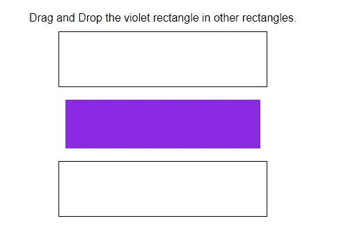

# 用例子解释 HTML 拖放 API

> 原文：<https://javascript.plainenglish.io/html-drag-and-drop-api-explained-with-examples-35cda91bce56?source=collection_archive---------0----------------------->

## 通过实例学习如何拖放。


Image created with ❤️️ By [author](https://mehdiouss315.medium.com/).

# 介绍

HTML 拖放 API 依赖于文档对象模型来获取关于正在拖放的内容的信息。因此，它允许我们在网页上拖放任何元素，几乎所有主流浏览器都支持它。使用 JavaScript 事件处理程序，我们可以将任何元素转换成可拖动的项目或可以放下元素的项目。

在本文中，我们将了解如何使用这个 HTML 拖放 API。让我们开始吧。

# Codepen 示例

在我们开始解释这个 API 之前，您可以看一下下面的 Codepen 示例:

Drag and Drop example.

这是通过使用 HTML 拖放 API 来完成的。这可能看起来很复杂，但我们将经历制作这个例子的所有不同部分。让我们开始吧。

# 让我们从 HTML 开始

在 HTML 结构中，我们将创建三个 div:一个可拖动的 div 和两个放置可拖动 div 的 div。

可拖动的 div 必须将属性`draggable`设置为`true`。然后，我们将添加一些 HTML 拖放事件属性，以便在 JavaScript 中处理它们。

以下是 HTML 示例:

```
<body><p>Drag and Drop the violet rectangle in other rectangles.</p><div id="dropHere" **ondrop**="drop(event)" **ondragover**="allowDrop(event)"></div><br><div id="div" **draggable**="true" **ondragstart**="drag(event)"></div><br><div id="dropHere" **ondrop**="drop(event)" **ondragover**="allowDrop(event)"></div></body>
```

现在让我们在 CSS 中设置 div 的样式。

# 样式表

所以现在，我们将使用 CSS 样式化我们的元素。您可以阅读下面的代码来查看我们的样式表。

```
*****{
 margin: 0;
 padding: 0;
 box-sizing: border-box;
 font-family: sans-serif;
}
**body**{
 display: flex;
 align-items: center;
 justify-content: center;
 flex-direction: column;
 height: 100Vh;
}
**p**{
 margin: 10px;
}
**#dropHere**{
 width: 300px;
 height: 80px;
 border: 1px solid black;
 display: flex;
 align-items: center;
 justify-content: center;
}
**#div**{
 background: blueviolet;
 width: 280px;
 height: 70px;
 cursor: grabbing;
 cursor: -webkit-grabbing;
 cursor: -moz-grabbing;
}
```

*输出:*



Output of HTML & CSS.

# JavaScript 部分

使用 JavaScript，我们将通过创建函数来处理我们在上面的 HTML 中添加的拖放事件属性。

以下是 JavaScript 示例:

```
function **allowDrop**(ev) {
  ev.preventDefault();
}function **drag**(ev) {
  **ev.dataTransfer.setData**("text", ev.target.id);
}function **drop**(ev) {
  ev.preventDefault();
  var data = **ev.dataTransfer.getData**("text");
  ev.target.appendChild(document.getElementById(data));
}
```

在这之后，您将能够在另外两个矩形 div 之间拖放紫色 div。现在让我详细解释一下这一切:

1.  在 HTML 中，我们必须为 violet div 指定一个属性`draggable`设置为`true`，以使它成为一个可拖动的元素。
2.  draggable 元素中的属性`ondragstart`调用函数 drag(event ),该函数指定要拖动的数据。`dataTransfer.setData()`方法设置被拖动数据的数据类型和值。

```
function drag(ev) {
  ev.dataTransfer.setData("text", ev.target.id);
}
```

3.对于我们放置紫色矩形的另外两个 div，事件`ondragover` 指定可以将拖动的数据放在哪里。因为默认情况下，不能将元素拖放到其他元素中。为了允许删除，我们在函数`allowDrop`中调用方法`event.preventDefault()`。

4.现在我们只需要做空投。当拖放数据时，会发生 drop 事件。这是通过调用函数 drop(event)的属性`ondrop`完成的:

```
function drop(ev) {
  ev.preventDefault();
  var data = ev.dataTransfer.getData("text");
  ev.target.appendChild(document.getElementById(data));
}
```

*   这里我们调用`preventDefault`来防止浏览器默认处理数据(默认是打开一个链接放在 drop 上)。
*   我们用方法`dataTransfer.getData`得到拖动的数据。该方法将返回在方法`setData()`中被设置为相同类型的任何数据。
*   被拖动的数据是被拖动元素的 id(“div”)。
*   最后，我们将拖动的元素添加到 drop 元素中。

# 结论

拖放 API 是每个 web 开发人员必须知道的事情。除了拖放之外，它还提供了多个其他选项来定制您的操作。我鼓励你从其他资源中了解更多。

感谢您阅读本文，希望您觉得有用。

# 更多阅读

*如果你对 JavaScript 和 web 开发相关的更有用的内容感兴趣，还可以* [*订阅*](https://exciting-musician-9042.ck.page/60477323b8) *我们的简讯。*

*下面是另一篇有用的文章，请点击链接查看:*

[](https://medium.com/javascript-in-plain-english/the-reduce-method-in-javascript-explained-with-examples-6232b85e47f6) [## 举例说明 JavaScript 中的 Reduce 方法

### 通过示例了解 JavaScript 中的 reduce 方法。

medium.com](https://medium.com/javascript-in-plain-english/the-reduce-method-in-javascript-explained-with-examples-6232b85e47f6)