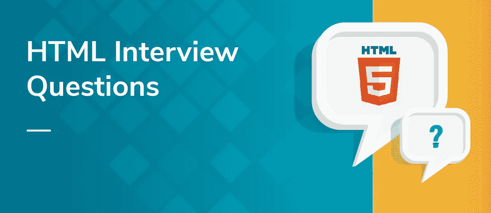
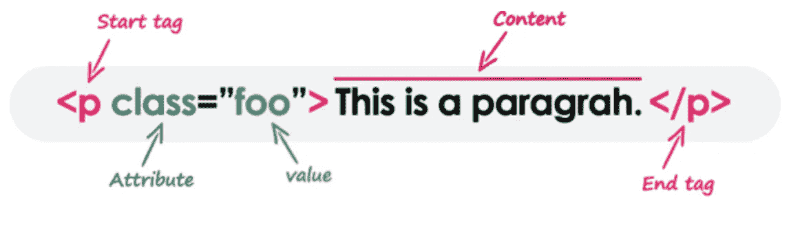
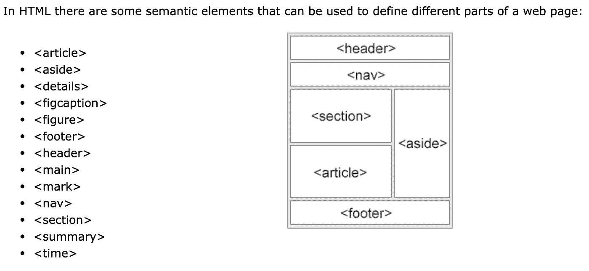
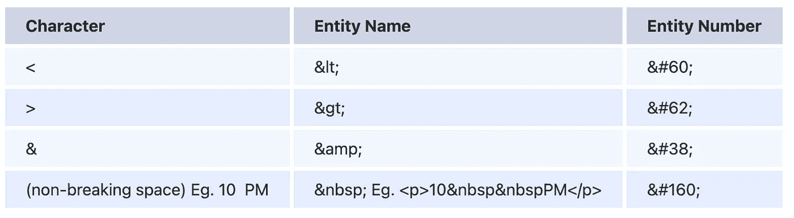
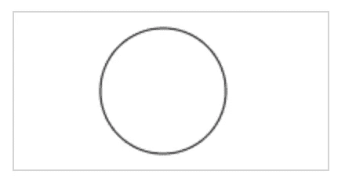
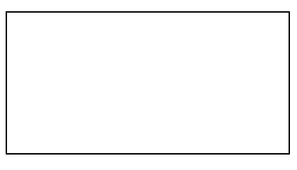
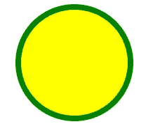
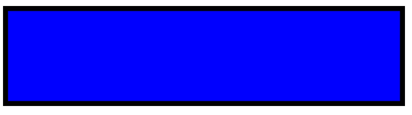
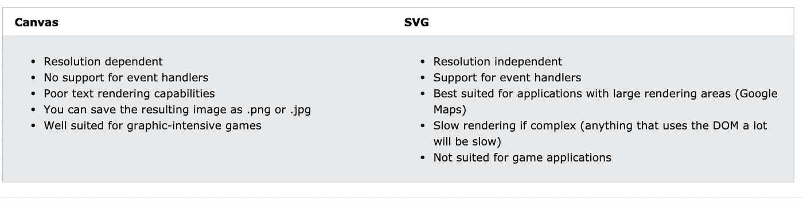

# HTML 面试准备指南(50 个问题)

> 原文：<https://javascript.plainenglish.io/html-interview-preparation-guide-50-questions-b53cd5c59790?source=collection_archive---------7----------------------->

## 前端开发人员备忘单



# 1)什么是 HTML5？

*   HTML 代表**超文本标记语言**。它用于使用标记语言设计网页。超文本标记语言是超文本和标记语言的结合。超文本定义了网页之间的链接。标记语言用于在定义网页结构的标签中定义文本文档。
*   HTML 5 是 HTML 的第五个**版本**和**版本。它改进了可用于文档的标记，并引入了应用编程接口(API)和文档对象模型(DOM)。**

# HTML5 的主要新功能是什么？

HTML5 引入了一些新的元素和属性，可以帮助你建立现代网站。下面是 HTML5 中引入的一些最突出的特性。

*   **新语义成分**——类似于<表头>、<表尾>、<节>、<条>和<图>。
*   **Forms 2.0**-对 HTML web 表单的改进，其中为<输入>标签引入了新的属性。
*   **持久本地存储**-网络存储设施，提供网络应用方法在网络浏览器上存储数据。
*   **网络套接字**——下一代网络应用双向通信技术。
*   **服务器发送事件**-html 5 引入了从网络服务器流向网络浏览器的事件，它们被称为服务器发送事件(SSE)。
*   **画布**-这支持一个可以用 JavaScript 编程的二维绘图表面。
*   **音频&视频**-您可以在网页上嵌入音频或视频，无需借助第三方插件。
*   **地理定位**——现在访问者可以选择在你的网络应用程序中分享他们的地理位置。
*   **微数据**-这让您可以创建 HTML5 以外的自己的词汇，并使用自定义语义扩展您的网页。
*   **拖放**-将项目从同一网页的一个位置拖放到另一个位置。

# HTML5 规范的主要目标和动机是什么？

HTML5 旨在取代 HTML 4、XHTML 和 HTML DOM 级。HTML 规范的主要目标是:

*   提供丰富的内容(图形、电影等)。)而不需要额外的插件(例如，闪存)。
*   通过引入新的结构元素标签，为网页结构提供更好的语义支持。
*   提供更严格的解析标准，以简化错误处理，确保更一致的跨浏览器行为，并简化与按照旧标准编写的文档的向后兼容性。
*   提供更好的跨平台支持(即，无论是在 PC、平板电脑还是智能手机上运行，都能正常工作)。

# 4) **什么是<！DOCTYPE >？<有哪些不同类型！可用的 DOCTYPE >？**

*   doctype 或文档类型声明是一条指令，它告诉 web 浏览器当前页面所用的标记语言。Doctype 不是元素或标记，它让浏览器知道 HTML 或文档中使用的任何其他标记语言的版本或标准。
*   DOCTYPE 声明出现在网页顶部所有其他元素之前。根据 HTML 规范或标准，每个 HTML 文档都需要一个文档类型声明，以确保页面以预期的方式显示。
*   HTML5 的 DOCTYPE 不区分大小写。它表示 HTML 的版本，在本例中是 5。像 HTML4 这样的早期版本是基于标准通用标记语言(SGML)的，需要文档类型定义(DTD)。然而，HTML5 并不基于 SGML，也不需要 DTD。
*   **html 5 还支持以下 DOCTYPE:**<！DocTYpe html >，<！dOCtype html >和<！doctype html >。
*   **有下面提到的 3 种类型的文档类型:**严格文档类型、框架集文档类型和过渡文档类型。

# 什么是 HTML 标签？

*   HTML 标签就像是定义网页浏览器如何格式化和显示内容的关键字。在标签的帮助下，网络浏览器可以区分 HTML 内容和简单内容。HTML 标签包含三个主要部分:开始标签，内容和结束标签。但是有些 HTML 标签是不封闭的标签。
*   当 web 浏览器读取 HTML 文档时，浏览器从上到下、从左到右读取。HTML 标签用于创建 HTML 文档并呈现其属性。每个 HTML 标签都有不同的属性。
*   一个 HTML 文件必须有一些基本的标签，这样 web 浏览器才能区分简单文本和 HTML 文本。根据您的代码需求，您可以使用任意多的标签。

1.  所有的 HTML 标签都必须用这些括号括起来。
2.  HTML 中的每个标签执行不同的任务。
3.  如果您使用了开始标签<tag>，那么您必须使用结束标签</tag>(某些标签除外)

```
<p> Paragraph Tag </p>
<h2> Heading Tag </h2>
<b> **Bold Tag** </b>
<i> *Italic Tag* </i>
<u> Underline Tag </u>
```

# 所有的 HTML 标签都是成对出现的吗？

*   不，有些 HTML 标签不需要结束标签。例子有、
    、、<link>、

    * * *

    、、、<command></command>、<embed>、<pram>、。</pram>
*   这些也被称为'**单个**标签或'**自结束**标签。

# 7)什么是 HTML 元素？标签和元素的区别是什么？

从技术上讲，HTML 元素是开始标签、它的属性、结束标签以及它们之间的所有东西的集合。另一方面，HTML 标记(开始或结束)用于标记元素的开始或结束，如上图所示。

然而，在通常的用法中，术语 HTML 元素和 HTML 标签是可以互换的，即标签是元素是标签。为了简单起见，术语“标签”和“元素”用于表示相同的东西——因为它将在您的网页上定义一些东西。



# 8)什么是 HTML 属性？

*   HTML 属性提供了关于 HTML 元素的附加信息。
*   所有的 HTML 元素都可以有**属性。**属性总是在**开始标签中指定。**属性通常以名称/值对的形式出现，比如: **name="value "。**举例:

HREF 属性——`<a>`标签定义了一个超链接。`href`属性指定链接所指向页面的 URL:

```
<a href="[https://ayushv.medium.com/](https://ayushv.medium.com/)">Visit Medium</a>
```

SRC 属性——``标签用于在 HTML 页面中嵌入图像。`src`属性指定要显示的图像的路径:

```

```

# HTML 中的和标签有什么意义？

*   标签提供了关于文档的信息。它应该始终包含在标签中。该标签包含了关于网页的**元数据**以及由 head 标签包围的标签，如<链接>、<元>、<样式>、<脚本>等。不显示在网页上。另外，**在整个 HTML 文档**中只能有一个< head >标签，并且总是在< body >标签之前。
*   标签定义了 HTML 文档的主体。它应该始终包含在标签中。使用

    、、、<heading>、、</heading>

    等元素，需要在网页上显示的所有内容，如图像、文本、音频、视频、内容等。将始终被标签包围。另外，**一个 HTML 文档中只能有一个 body 元素**，并且总是在< head >标签之后。

# 10)为什么 div 标签在开发 HTML 网页时如此有用？

*   div 标签被称为 Division 标签。div 标签在 HTML 中用来划分网页中的内容，如文本、图像、页眉、页脚、导航栏等。Div 标签有开始()和结束()标签，必须结束标签。T
*   Div 是 web 开发中最有用的标签，因为它帮助我们分离出网页中的数据，我们可以为网页中的特定数据或功能创建特定的部分。
*   Div 标签是一个块级标签。它是一个通用的容器标签。它被用于 HTML 的各种标签组，这样就可以创建部分并对它们应用样式。

我们知道，div 标签是一个块级标签。在下面的例子中，div 标签包含整个宽度。它将每次在新的一行显示 div 标签，而不是在同一行。

```
<div class="myDiv">
  <h2>This is a heading in a div element</h2>
  <p>This is some text in a div element.</p>
</div>
```

# 11)定义 span 标签？

标签是一个内嵌的容器，用来标记文本的一部分或者文档的一部分。`<span>`标签很容易被 CSS 样式化，或者使用 class 或 id 属性被 JavaScript 操作。

`<span>`标签很像< div >元素，但是< div >是块级元素，而`<span>`是内联元素。

```
<p>My mother has <span style="color:blue">blue</span> eyes.</p>
```

# 12)定义元标签？

*   标签`<meta>`定义了一个 HTML 文档的元数据。元数据是关于数据的数据(信息)。`<meta>`标签总是位于< head >元素内部，通常用于指定字符集、页面描述、关键字、文档作者和视窗设置。
*   元数据不会显示在页面上，但可以进行机器分析。浏览器(如何显示内容或重新加载页面)、搜索引擎(关键字)和其他 web 服务使用元数据。
*   有一种方法可以让网页设计者通过`<meta>`标签来控制视窗(网页中用户可见的区域)。

```
<head>
  <meta charset="UTF-8">
  <meta name="description" content="Web tutorials">
  <meta name="keywords" content="HTML, CSS, JavaScript">
  <meta name="author" content="Ayush Verma">
  <meta name="viewport" content="width=device-width, initial-scale=1.0">
</head>
```

# 13)什么是页面结构元素或语义元素？

语义元素清楚地向浏览器和开发人员描述了它的含义。

*   **非语义**元素的例子:`<div>`和`<span>`——对其内容一无所知。
*   **语义**元素的例子:`<form>`、`<table>`、`<article>`——明确定义其内容。



# 14)简要描述以下 HTML5 语义元素的正确用法:

`<header>`、`<footer>` 、`<nav>`、`<article>`、`<section>`、`<aside>`

*   **< header > :** 该标签代表 header 部分，存储关于网页的起始信息。
*   **<页脚> :** 这个标签表示页面的页脚部分(最后一部分)，可以包含作者信息、版权信息等。
*   **< nav > :** 这个标签表示文档中用于导航的部分。
*   **<文章> :** 这个标签代表一个文档的独立内容，比如一个博客条目或者报纸文章。
*   **<节> :** 该标签代表通用文档或应用程序节。它可以和 h1-h6 一起使用，表示文档结构。
*   **<抛开> :** 这个标签代表的是一段与页面其余部分只有轻微关联的内容。

# 15)一个`<section>`可以包含`<article>`元素吗？一个`<article>`能包含`<section>`元素吗？提供使用示例。

*   两个问题的答案都是肯定的；即，`<section>`可以包含`<article>`元素，而`<article>`可以包含`<section>`元素。
*   例如，个人仪表板页面可能包含一个用于社交网络交互的`<section>`和一个用于最新新闻文章的`<section>`，后者可能包含几个`<article>`元素。相反，一个`<article>`可能在末尾包含一个`<section>`用于读者评论。

# 16)一个网页可以包含多个`<header>`元素吗？`<footer>`元素呢？

两个都是。事实上，`<header>`和`<footer>`标签都是为它们各自的目的而设计的，不管它们的父“节”是什么。因此，不仅页面`<body>`可以包含页眉和页脚，每个`<article>`和`<section>`元素也可以。事实上，所有这些都应该有一个`<header>`，尽管一个`<footer>`并不总是必要的。

# 17)描述 HTML5 中的`<header>`和`<h1>`标签之间的关系。

*   在以前的 HTML 规范中，一个页面上通常只有一个`<h1>`元素，用于整个页面的标题。HTML5 指定`<h1>`表示一个“部分”的顶级标题，无论它是页面`<body>`，还是一个`<article>`或`<section>`元素。
*   事实上，每个`<header>`元素至少应该包含一个`<h1>`元素。如果该部分没有自然的标题，这很好地表明它不应该使用`<article>`或`<section>`标签。

# 创建一个网页最少需要多少 HTML5 标签？

创建一个网页至少需要 3 个 HTML5 标签，比如(、、)。

# 19)什么是 HTML 实体？

在 HTML 中，一些字符被保留，如'【T17 '，'/'等。为了在我们的网页中使用这些字符，我们需要使用称为 HTML 实体的字符实体。下面是保留字符与其各自要使用的实体字符之间的一些映射。



# 你如何在网页上写一个版权符号？

*   要在页面上插入一个特殊的字符，你需要在 HTML 中使用一些特殊的代码(通常是 markdown)，这些代码遵循模式&[code]；几个代码固定在几个不同的符号上，例如， 用于单个空格，>用于>符号。
*   为了编写一个版权符号，我们需要键入 **&副本；**或**&# 169；**在 HTML5 文件中。虽然大多数浏览器会显示它，但最好使用特定的字体，这样它就不会显示为“”或其他什么。

# HTML5 中删除了多少标签？

HTML5 中完全删除的标签列表包括:

、、

<noframes>、、<basefront>、<applet>、、<bigcenter>、<acronym>、<basefont>、

<dir>、`、、`</dir></acronym></bigcenter></applet></basefront> </noframes>

# 22) **什么是超链接？只适用于文字吗？**

*   超链接是一种链接，允许用户在单击时从一个网页移动到另一个网页。HTML `<a>`标签定义了一个超链接。它具有以下语法:

```
<a href=”*url*”>*link text*</a>
```

*   `<a>`元素最重要的属性是`href`属性，它表示链接的目的地。*链接文本*是读者可以看到的部分。
*   超链接的概念不仅用在图像上，也用在文本上，我们可以借助 […将图像转换成链接。](“)标签。例如:

```
<a href = “[https://ayushv.medium.com/](https://ayushv.medium.com/)” target = “_self”>.   
  
</a>
```

# 23)我们可以在网页中显示网页吗？或者可以嵌套网页吗？

是的，我们可以在另一个 HTML 网页中显示一个网页。HTML 提供了一个标签,使用它我们可以实现这个功能。

```
<iframe src=”url of the web page to embed” />
```

# 如何在 HTML 中插入注释？

*   评论标签(
*   You can use comments to explain your code, which can help you when you edit the source code at a later date. This is especially useful if you have a lot of code. Comments in HTML begins with “)。例如:

```
<!--This is a comment. Comments are not displayed in the browser-->

<p>This is a paragraph.</p>
```

# 25)定义 HTML 标题的类型。

*   HTML 包含 6 种类型的标题，从 h1 到 h6，从最高级别的 h1(主标题)到最低级别的 h6(最不重要的标题)。
*   h1 是最大的标题标签，h6 是最小的标题标签。因此 h1 用于最重要的标题，h6 用于最不重要的标题。标题一(h1)是最大字体，h6 是最小字体。

# 26)我们如何对标题元素进行分组？

HTML 中的

<hgroup>标签代表标题组，用于对标题元素进行分组。HTML 中的

<hgroup>标签用于包装从

# 到

###### 的一个或多个标题元素，例如标题和副标题。

<hgroup>标签需要开始标签和结束标签。</hgroup>

</hgroup>

</hgroup>

```
<hgroup>
  <h1>Main heading</h1>
  <h2>Subheading</h2>
</hgroup>
```

# 27)最常用的列表标签是什么？

列表标签用于列出任何信息。使用标签列出信息有以下几种类型:

*   **有序列表**:作为< ol > … < /ol >使用，以编号格式提供列表。
*   **无序列表**:用作< ul > … < /ul >，以项目符号格式提供列表。

注意:以上两者都使用列表项标签，即

*   …。

```
<ol>
  <li>Coffee</li>
  <li>Tea</li>
  <li>Milk</li>
</ol><ul>
  <li>Coffee</li>
  <li>Tea</li>
  <li>Milk</li>
</ul>
```

*   **定义列表**:用作< dl > … < /dl >，在其中提供一个列表，并带有定义术语(即< dt > … < /dt >)和详细定义(即< dd > … < /dd >)。

```
<dl>
  <dt>Coffee</dt>
  <dd>- black hot drink</dd>
  <dt>Milk</dt>
  <dd>- white cold drink</dd>
</dl>
```

菜单列表和目录列表不常用。

# 28)html 5 中的各种格式化标签是什么？

HTML5 有一些新旧格式标签，如下所示:

*   **标记文本:**代表高亮文本，以供参考。我们可以使用 **<标记** >标记来进行文本高亮显示。
*   **强文本:**定义具有强重要性的文本。里面的内容通常以粗体显示。我们可以使用 **<强** >标签
*   **删除文本:**指定删除的文本块。我们可以使用 **< del >** 标签来实现一个被删除的文本。
*   **强调文本:**定义强调文本。我们可以使用 **< em >** 标签来实现一个强调的文本。
*   **插入文本:**将文本块插入到文档中。我们可以使用 **< ins >** 标签来实现一个插入的文本。
*   **小文本:**以小尺寸显示插入的文本。我们可以使用 **<小>** 标签来实现一个小文本。
*   **上标文字:**这是上标文字。我们可以使用 **< sup >** 标签来实现一个上标文本。
*   **下标文本:**这是带下标的文本。我们可以使用 **< sub >** 标签来实现一个上标文本。

# 29)什么是内容可编辑属性？

`contenteditable`属性指定元素的内容是否可编辑。

```
<*element* contenteditable="true|false"><p contenteditable="true">This is an editable paragraph.</p>
```

# 30)折叠空白有什么好处？

在 HTML 中，空白字符的空白序列被视为单个空格字符，因为浏览器将多个空格折叠成单个空格字符，这有助于开发人员缩进文本行，而不用担心多个空格，并保持 HTML 代码的可读性和可理解性。

# 31)html 5 中的 MathML 是什么？

*   MathML 代表数学标记语言。像其他 HTML 元素一样，它用于在 web 浏览器中表示数学等式或表达式。
*   这个表达式应该插入到数学标签中。MathML 不是一个计算或求解复杂方程的计算器，它只是一种显示方程的方式。它不是一种编程语言，而是一种数学标记语言。

```
// a^2 + b^2 = c^2<math>
    <mrow>
      <mrow>
        <msup>
          <mi>a</mi>
          <mn>2</mn>
        </msup>
        <mo>+</mo>
        <msup>
          <mi>b</mi>
          <mn>2</mn>
        </msup>
      </mrow>
      <mo>=</mo>
      <msup>
        <mi>c</mi>
        <mn>2</mn>
      </msup>
    </mrow>
  </math>
```

# 32)html 5 中的图像映射是什么？

图像地图是 URL 和图像的组合，点击这些图像(图像的可点击区域)将打开不同的新网页。

HTML5 中有两种类型的图像映射，即客户端和服务器端:

*   **客户端图像地图**由两个元素 **<区域>** 和 **<地图>** 创建，其中地图保存地图信息，区域元素取属性定义地图的各个部分。
*   **使用 **< usemap >** 属性创建的服务器端图像地图**，usemap 属性是我们地图的名称。

```


<map name="workmap">
  <area shape="rect" coords="34,44,270,350" alt="Computer" href="computer.htm">
  <area shape="rect" coords="290,172,333,250" alt="Phone" href="phone.htm">
  <area shape="circle" coords="337,300,44" alt="Cup of coffee" href="coffee.htm">
</map>//The usemap attribute in  is associated with the <map> element's name attribute, and creates a relationship between the image and the map.
```

# 33)解释 HTML5 中新的表单输入类型？

HTML5 有 14 种新的表单输入类型:

*   这是一个日期选择器，我们可以使用 type =**“Date”来选择日期。**
*   这是一个星期选择器，我们可以使用 type =**“Week”来选择一个星期。**
*   这是一个月份选择器，我们可以使用 type =**“Month”来选择一个月份。**
*   这是一个时间选择器，我们可以使用 type =**“Time”来选择时间。**
*   **Datetime:** 这是一个日期和时间的组合，我们可以使用 type =**“Datetime”来选择日期和时间的组合。**
*   **Datetime-local:** 一个组合的本地日期和时间，我们可以使用 type =**“Datetime-local”选择本地日期和时间的组合。**
*   **邮箱:**允许一个或多个邮箱地址，我们可以使用 type =**“Email”输入多个邮箱地址。**
*   **电话:**允许全球不同的电话号码。电话号码由客户端验证。我们可以使用 type =**“tel”输入电话号码。**
*   **搜索:**允许通过输入文本搜索查询。我们可以使用 type =**“search”输入多个查询。**
*   **数字:**允许插入带有附加属性的数值，如最小值、最大值。等等。，并且我们可以使用 type =**“number”输入多个数值。**
*   **Url:**Url 输入类型，用于网址。在单个 url 中，我们可以使用 type =**“URL”来使用多个属性。**
*   **颜色:**允许选择多种颜色，我们可以使用 type = **“颜色”来 pic 多种颜色。**
*   **范围:**允许插入一个特定范围内的数值，范围类似于数字，但更具体。我们可以使用 type =**“range”输入一个范围内的数值。**
*   **占位符:**允许在我们输入值之前，在输入字段中显示一个简短的提示(通常是浅色的)。我们可以使用 type =**“placeholder”**在输入字段中写一个简短的提示

# 34)html 5 中有哪些新的表单元素？

HTML5 中的新表单元素提供了比早期版本更好的功能。提供用于执行这些功能的标签有:

1) **<数据列表>** —该元素指定了一个`<input>`元素的预定义选项列表。用户在输入数据时会看到预定义选项的下拉列表。

```
<form action="/action_page.php">
  <input list="browsers">
  <datalist id="browsers">
    <option value="Internet Explorer">
    <option value="Firefox">
    <option value="Chrome">
    <option value="Opera">
    <option value="Safari">
  </datalist>
</form>
2) <keygen> — This tag represents a key-pair generator field.
```

2) **< keygen >** —该标签在 HTML 中用于指定表单中的密钥对生成器字段。< keygen >元素的目的是提供一种安全的方法来验证用户。当提交表单时，会生成两个密钥，私钥和公钥。

```
<form>
  Username: <input type="text" name="uname"> <br><br>
  Encryption: <keygen name="secure"> 
  <input type="submit">
</form>
```

3) **<输出>** —该标签用于表示计算的结果(类似于脚本执行的结果)。

```
<form oninput="x.value=parseInt(a.value)+parseInt(b.value)">
  <input type="range" id="a" value="50">
  +<input type="number" id="b" value="25">
  =<output name="x" for="a b"></output>
</form>
```

4) **<进度>** —该元素显示一个指示器，显示一个任务的完成进度，通常显示为一个进度条。

```
<label for="file">File progress:</label><progress id="file" max="100" value="70"> 70% </progress>
```

5) **<米>** —该标签定义了一个已知范围内的标量测量，或一个分数值。这也称为仪表。示例:磁盘使用情况、查询结果的相关性等。

```
<label for="fuel">Fuel level:</label><meter id="fuel"
       min="0" max="100"
       low="33" high="66" optimum="80"
       value="50">
    at 50/100
</meter>
```

# 35)对表单元素进行分组的最佳方式是什么？

<fieldset>标签可以用来对一些表单元素进行分组。当目的是将一些 HTML 元素作为一个组提供给用户时，fieldset 标签是最好的选择。它接受另一个标签<legend>,为分组的元素提供标题。</legend></fieldset>

```
<form action="/action_page.php">
  <fieldset>
    <legend>Personalia:</legend>
    <label for="fname">First name:</label>
    <input type="text" id="fname" name="fname"><br><br>
    <label for="lname">Last name:</label>
    <input type="text" id="lname" name="lname"><br><br>
    <label for="email">Email:</label>
    <input type="email" id="email" name="email"><br><br>
    <label for="birthday">Birthday:</label>
    <input type="date" id="birthday" name="birthday"><br><br>
    <input type="submit" value="Submit">
  </fieldset>
</form>
```

# 36)如何优化网站资产加载？

为了优化网站加载时间，我们需要优化其资产加载，为此:

*   **CDN 托管**—CDN 或内容交付网络是地理上分散的服务器，有助于减少延迟。
*   **文件压缩** —这是一种有助于减小资产大小以减少数据传输的方法
*   **文件串联** —这减少了 HTTP 调用的数量
*   **缩小脚本** —这将减小 js 和 CSS 文件的整体文件大小
*   **并行下载** —在多个子域中托管资产有助于绕过所有现代浏览器每个域 6 项资产的下载限制。这是可以配置的，但是大多数普通用户从不修改这些设置。
*   **延迟加载** —非关键资产可以根据需要加载，而不是一次加载所有资产。

# 37)解释 HTML5 图形？

HTML5 支持两种类型的图形，即画布和 SVG。

**a)Canvas:**<Canvas>元素用于设计网页上的图形，它有几种方法可以用来画圆、方框、添加图片和文字。300 px X 150 px(宽 X 高)是画布的默认像素大小。



1 and 2

```
//1
<script>
var c = document.getElementById("myCanvas");
var ctx = c.getContext("2d");
ctx.beginPath();
ctx.arc(95, 50, 40, 0, 2 * Math.PI);
ctx.stroke();
</script>//2
<canvas id="myCanvas" width="200" height="100" style="border:1px solid #000000;">
</canvas>
```

**b)SVG:**<SVG>**可缩放矢量图形，多用于图形应用和可缩放矢量类型的图表，如 X、Y 坐标系、二维和饼状图。这使得它速度更快，重量更轻。SVG 遵循 XML 格式。**

**HTML `<svg>`元素是 SVG 图形的容器。SVG 有几种绘制路径、方框、圆、文本和图形图像的方法。**

********

**1 and 2**

```
//1
<svg width="100" height="100">
  <circle cx="50" cy="50" r="40" stroke="green" stroke-width="4" fill="yellow" />
</svg>//2
<svg width="400" height="100">
  <rect width="400" height="100" style="fill:rgb(0,0,255);stroke-width:10;stroke:rgb(0,0,0)" />
</svg>
```

# **38)Canvas 和 SVG 的主要区别是什么？**

**下表显示了 Canvas 和 SVG 之间的一些重要差异:**

****

# **39)html 5 中媒体元素有哪些新标签？**

**HTML5 中媒体元素的新标签如下:**

*   ****<音频> :** 适用于声音、音频流或音乐等多媒体内容，无需 flash player 等任何附加插件即可嵌入音频内容。**
*   ****<视频> :** 适用于视频流或电影剪辑等视频内容，嵌入视频内容等。**
*   ****<来源> :** 申请媒体元素中的多种媒体资源，如音频、视频、图片等。**
*   ****<轨道> :** 适用于视频或音频等媒体元素中的文本轨道。该标签用于视频媒体播放时的字幕或字幕文件。**

```
<audio controls autoplay muted>
  <source src="horse.ogg" type="audio/ogg">
  <source src="horse.mp3" type="audio/mpeg">
Your browser does not support the audio element.
</audio><video width="320" height="240" controls autoplay muted>
  <source src="movie.mp4" type="video/mp4">
  <source src="movie.ogg" type="video/ogg">
   <track src="fgsubtitles_en.vtt" kind="subtitles" srclang="en" label="English">
   <track src="fgsubtitles_no.vtt" kind="subtitles" srclang="no" label="Norwegian"> Your browser does not support the video tag.
</video>// controls attribute adds video controls, like play, pause, and volume.
// To start a video automatically, use the autoplay attribute
// Add muted after autoplay to let your video start playing automatically
```

*   ****<嵌入>** :定义 HTML 文档中的嵌入对象。**

```
<embed src="audi.jpeg"><embed width="100%" height="500px" src="snippet.html">
```

# **40)哪些视频和音频格式用于在网页上嵌入？**

**用于嵌入网页的视频和音频格式如下:**

*   ****视频:** MPEG4/MP4，Ogg，WebM。**
*   ****音频:** WAV，Ogg Vorbis，MP3。**

# **41)解释 HTML5 中的地理定位 API？**

**地理定位 API 用于定位用户的地理位置。**

**出于隐私原因，用户被要求许可来报告位置信息。使用**navigator . geolocation . getcurrentposition()**方法获取用户的位置和地理坐标(经纬度号)。**

```
var x = document.getElementById("demo");
function getLocation() {
  if (navigator.geolocation) {
    navigator.geolocation.getCurrentPosition(showPosition);
  } else {
    x.innerHTML = "Geolocation is not supported by this browser.";
  }
}

function showPosition(position) {
  x.innerHTML = "Latitude: " + position.coords.latitude +
  "<br>Longitude: " + position.coords.longitude;
}
```

**示例说明:**

*   **检查是否支持地理定位**
*   **如果支持，请运行 getCurrentPosition()方法。如果没有，向用户显示一条消息**
*   **如果 getCurrentPosition()方法成功，它将向参数(showPosition)中指定的函数返回一个坐标对象**
*   **函数的作用是:输出纬度和经度**

**地理位置对象还有其他有趣的方法:**

*   **`watchPosition()` -返回用户的当前位置，并在用户移动时继续返回更新的位置(就像汽车中的 GPS)。**
*   **`clearWatch()` -停止`watchPosition()`方法。**

# **42)html 5 中拖放的重要性是什么？**

*   **拖放是最重要的用户界面概念，它使得抓取一个对象并在鼠标点击的帮助下将其拖动到你想要的地方变得容易。拖放操作最常用的一些常见功能包括移动、链接或复制。**
*   **要使图像可拖动，请将 draggable image 属性设置为 true。******

```
<div id="div1" ondrop="drop(event)" ondragover="allowDrop(event)">
  
</div><div id="div2" ondrop="drop(event)" ondragover="allowDrop(event)"></div>
```

*   **`ondragstart`属性调用一个函数，指定要拖动的数据。`ondragover`事件指定拖动的数据可以放在哪里。当拖放数据时，会发生 drop 事件。**

# **43)解释 HTML5 中 Web 存储的概念？**

**Web 存储提供了将我们的 web 应用程序数据本地存储到用户浏览器中的工具。它可以存储高达 10 MB 的数据。网络存储有助于提高我们应用程序的性能。**

****在 HTML5 中有两种类型的网络存储用于本地存储数据:****

*   ****本地存储:**这个存储的数据不会过期，也不会在用户关闭或重新打开浏览器时自动清除。**
*   ****会话存储:**仅存储一个会话的数据(例如，正在上网或浏览网站的用户)。一旦浏览器关闭，会话数据将自动从 web 浏览器中删除。**

**在 HTML5 之前，应用程序数据必须存储在 cookies 中，包含在每个服务器请求中。Web 存储更加安全，大量数据可以存储在本地，不会影响网站性能。与 cookies 不同，存储限制要大得多(至少 5MB ),并且信息永远不会传输到服务器。**

**Web 存储是基于源的(基于域和协议)。来自同一个源的所有页面可以存储和访问相同的数据。**

```
// Store
localStorage.setItem("name", "Ayush");

// Retrieve
document.getElementById("result").innerHTML = localStorage.getItem("name");// Remove
localStorage.removeItem("name");**Note:** Name/value pairs are always stored as strings
```

# **44)Web Workers API 在 HTML5 中是如何使用的？**

*   **web worker 是在后台运行的 JavaScript，独立于其他脚本，不会影响页面的性能。你可以继续做任何你想做的事情:点击，选择东西等等。，而 web worker 在后台运行。**
*   **Web Workers 在一个孤立的线程中运行。因此，他们执行的代码需要包含在一个单独的文件中。但是在我们这样做之前，首先要做的是在主页中创建一个新的`Worker`对象。构造函数采用工作脚本的名称。创建工人后，通过调用`postMessage()`方法启动它:**

```
// Store
localStorage.setItem("lastname", "Smith");

// Retrieve
document.getElementById("result").innerHTML = localStorage.getItem("lastname");
worker.addEventListener('message', function(e) {
  console.log('Worker said: ', e.data);
}, false);

worker.postMessage('Hello World'); *// Send data to our worker.*worker.terminate(); //Terminate a Web Worker
```

# **45)什么是服务器发送的事件(SSE)？**

*   **服务器发送事件(SSE)允许网页从服务器获取更新。这在以前也是可能的，但是网页必须询问是否有可用的更新。对于服务器发送的事件，更新会自动进行。**
*   **例如:脸书/Twitter 更新、股票价格更新、新闻提要、体育比赛结果等。**
*   ****EventSource** 对象用于接收服务器发送的事件通知:**

```
var source = new EventSource("example.php");
source.onmessage = function(event) {
 document.getElementById("result").innerHTML += event.data + "<br>";
};
```

**示例说明:**

*   **创建一个新的 EventSource 对象，并指定发送更新的页面的 URL(在本例中为“example.php”)**
*   **每次收到更新时，都会发生 onmessage 事件**
*   **当 onmessage 事件发生时，将接收到的数据放入 id="result "的元素中**

# **46)html 5 中的应用缓存是什么，为什么使用？**

**应用程序缓存概念意味着 web 应用程序被缓存。无需互联网连接即可访问。**

**应用程序缓存的一些优势:**

1.  **离线浏览—网络用户也可以在离线时使用该应用程序。**
2.  **速度—缓存资源加载更快**
3.  **减少服务器负载 web 浏览器将只从服务器下载更新的资源。**

# **47)html 5 中的清单文件是什么？**

**清单文件用于列出可以缓存的资源。浏览器使用这些信息使网页加载速度比第一次更快。清单文件中有 3 个部分**

*   ****缓存清单** —需要缓存的文件**
*   ****网络** —文件从不缓存，总是需要网络连接。**
*   ****回退** —在页面不可访问的情况下回退文件**

```
CACHE MANIFEST
# 2012-06-16 v1.0.0
/style.css
/logo.gif
/main.js
NETWORK:
login.php
FALLBACK:
/html/ /offline.html<!DOCTYPE **HTML**>
<**html** manifest="tutorial.appcache">
...
...
</**html**>
```

# **48)解释 HTML5 中的微数据？**

*   **HTML5 特性允许您为您的文档定义自定义语义，以便传达关于内容的附加含义或信息。**
*   **微数据语法由一组名称/值对组成，可以使用机器解析工具访问文档内容。由于文档是机器可读的搜索引擎，网络爬虫和浏览器可以从文档中访问和提取微数据，将网页更好地放置在搜索结果中，并为用户提供更丰富的浏览体验。**
*   **封闭组被称为项目，描述性的**名称/值**对被称为属性。项目和属性由常规元素表示。示例:**
*   **为了创建一个项目，使用了 **itemscope** 属性。**
*   **为了给一个项目添加属性，在该项目的一个后代上使用了 **itemprop** 属性。**

```
<html>
 <div itemscope> 
       <p>First Name:<span itemprop="firstname">Ayush </span>.</p> 
       <p>Last Name: <span itemprop="lastname">Verma</span>.</p> 
       <p>Photo:  </p> 
       <p>Country: <span itemprop="country">India</span>.</p> 
      <p>Prizemoney: <span itemprop="prizemoney">$ 1000 </span>.</p> 
 </div> 
</html>
```

# **49)什么是 Web SQL？**

**Web SQL 是一个网页 API，用于存储或管理数据库中的数据，可以使用 SQL 的变体进行查询，如创建数据库、打开事务、创建表、向表中插入值、删除值和读取数据。**

**Web SQL 数据库 API 不是 HTML5 规范的一部分，但它是一个独立的规范。它指定了一组 API 来使用 SQL 操作客户端数据库。Web SQL 的方法:**

*   ****打开数据库** —使用现有数据库创建一个**数据库**对象，或者创建一个新的数据库。**
*   ****事务** —事务可以根据情况控制**事务**和**提交**或**回滚**。**
*   ****执行 SQL** —用于执行真正的 **SQL** 查询。**

# **50)解释 Web 组件及其用法？**

**Web Components 是一套不同的技术，允许您创建可重用的自定义元素(将它们的功能封装在代码的其余部分之外)，并在您的 Web 应用程序中使用它们。它由三项技术组成:**

*   **定制元素:一组 JavaScript APIs，允许您定义定制元素及其行为，然后可以根据需要在您的用户界面中使用它们。**
*   ****影子 DOM** :一组 JavaScript APIs，用于将封装的“影子”DOM 树附加到一个元素上——独立于主文档 DOM 呈现——并控制相关的功能。通过这种方式，您可以将元素的特性保持为私有，这样就可以编写它们的脚本和样式，而不用担心与文档的其他部分发生冲突。**
*   ****HTML 模板**:`<template>`和`<slot>`元素使您能够编写不在呈现的页面中显示的标记模板。然后，它们可以作为定制元素结构的基础被多次重用。**

**我希望你已经发现这是有用的。感谢您的阅读！:)**

***更多内容请看*[***plain English . io***](http://plainenglish.io/)**