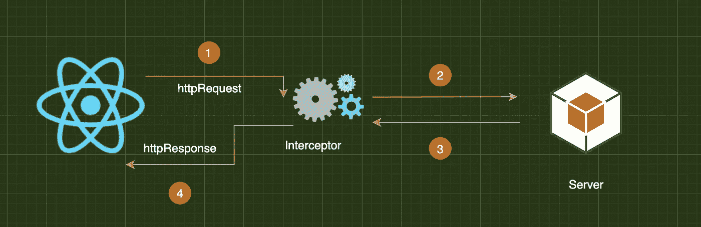
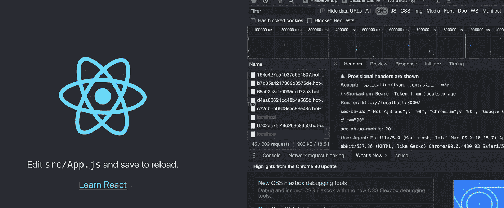
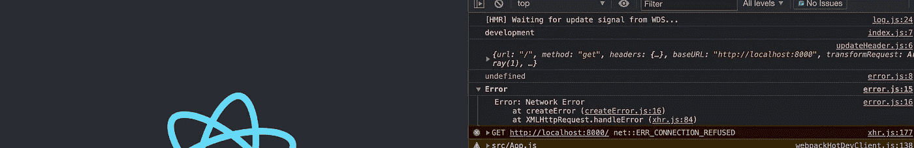

# React 中的 HTTP 拦截器

> 原文：<https://javascript.plainenglish.io/http-interceptors-in-react-4dd7a35ba297?source=collection_archive---------1----------------------->

为你的 React 应用编写超级拦截器。



React 的核心只是一个视图库，让您的 DOM 更新和状态管理变得更加容易。它消除了许多管理和担心漂亮 UI 的视图部分的负担。

我是一名全栈工程师，经常使用 JavaScript 的三个主要 UI 框架——Angular、React 和 Vue.js。当我从一个框架转换到另一个框架时，我可以感受到另一个框架中我喜欢的和不喜欢的东西。但是，根据您的使用情况，或者有时是因为业务需要，这是由许多因素造成的，您必须仔细选择您的武器库。

Angular 是一个完全电池加载的框架，其次是 Vue.js，然后是 React，这在很大程度上依赖于许多第三方库。但就其受欢迎程度或招聘信息而言，React 仍然是一个主要的赢家，这取决于你属于世界的哪个部分。

作为一名开发人员，我在心里对所有这些框架有一个很好的位置，这些是我们正在见证的一些令人惊叹的技术。由于互联网上充斥着这类文章，我不会深入比较这三者的本质。但是，我将根据您的经验和使用案例来比较这三者，以帮助您选择最佳方案。

**问题空间**

每个动态 UI 都需要与后端交互，最流行的方式是使用 HTTP 调用。大多数情况下，代码的某个部分可能是一个头或特定的操作，您需要在分派请求之前或接收响应之后对 HTTP 调用执行这些操作。

**解决方案**

对于 angular 来说，这很简单，并作为一个特性添加到 Angular 提供的 [@angular/common/http](https://angular.io/api/common/http) 模块中。

如果对此感兴趣，您可以继续关注:

 [## 有角的

### Angular 是一个构建移动和桌面 web 应用程序的平台。加入数百万开发者的社区…

angular.io](https://angular.io/api/common/http/HttpInterceptor) 

但是我们的目标不同。我们希望在 React 中有类似的功能。在发送请求和接收响应之前做一些事情的拦截器。

我们将使用的工具集:

```
"axios": "^0.21.1",
```

Axios 是一个使用非常广泛的库，你会在很多在线项目中发现它的集成。

其余的都将与 create-react-app 提供的所有基本内容相同。

在这个初学者教程中，我们将做 2 个拦截器。

## 基本设置:

```
import axios from "axios";import errorInterceptor from "./interceptors/error";import updateHeaderInterceptor from "./interceptors/updateHeader";const httpClient = axios.create({baseURL: process.env.REACT_APP_API_URL,});errorInterceptor(httpClient);updateHeaderInterceptor(httpClient);export default httpClient;
```

调用调用:

```
React.useEffect(() => {httpClient.get("/");}, []);
```

## 请求拦截器:

这是一个拦截器，位于您的所有请求之间，并将一个 JWT 令牌附加到我们客户端的所有身份验证请求上。JWT 就是一个例子。在请求发出之前，您可以对其进行各种各样的处理。

```
const updateHeaderInterceptor = (*axiosInstance*) => {*axiosInstance*.interceptors.request.use((*config*) => { const jwtToken = "Bearer Token from Localstorage"; *config*.headers["Authorization"] = jwtToken; return *config*;
},(*error*) => {

});};export default updateHeaderInterceptor; 
```



我们可以看到拦截器使用这种模式附加的授权。我们可以用几行代码将我们的 JWT 令牌添加到所有的请求中。

## 响应拦截器:

```
const DEBUG = process.env.REACT_APP_NODE_ENV !== "production";const errorInterceptor = (*axiosInstance*) => {*axiosInstance*.interceptors.response.use((*response*) => { //Response Successful},(*error*) => { if (*error*?.status?.code === 401) { //Unauthorized *//redirect to Login* } else { *//dispatch your error in a more user friendly manner* if (DEBUG) {
      //easier debugging console.group("Error"); console.log(*error*); console.groupEnd(); } }});};export default errorInterceptor;
```

在这里，我们可以看到我们的控制台组错误，因为我们没有任何后端连接到我们的用户界面。



接近尾声时，这是一个非常基本的教程，我们可以看到用很少的代码行使用这种模式可以做多少事情。我们可以在一个地方管理我们所有的错误处理，除此之外，在他们自己的拦截器中有共同的模式，使得他们非常容易理解并在日常工作中使用。

作为一名完整的工程师和架构师，请继续关注我提出的更多现实问题及其解决方案。和平！

*更内容于* [*通俗易懂*](http://plainenglish.io/)