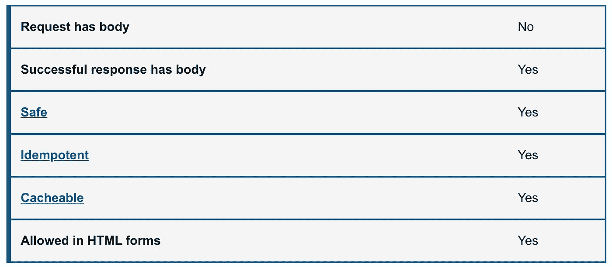
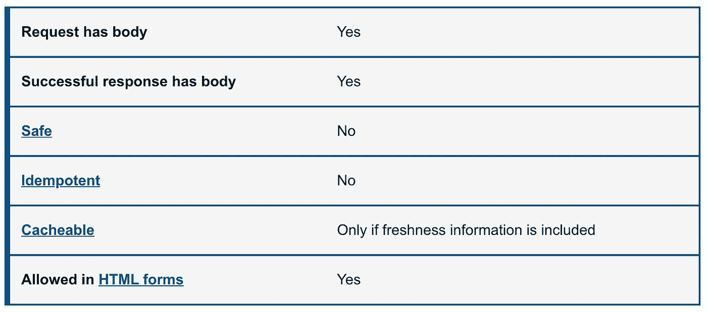
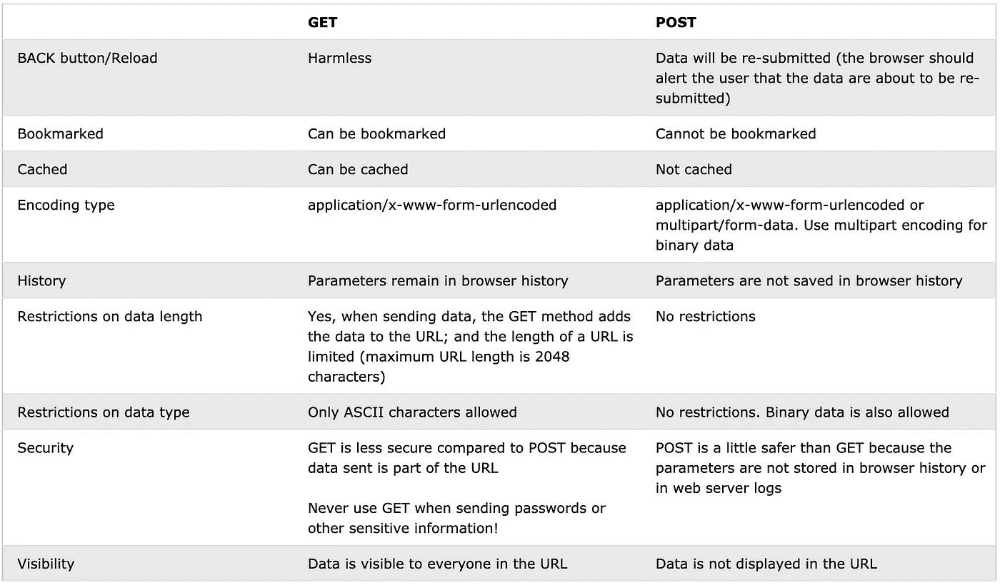
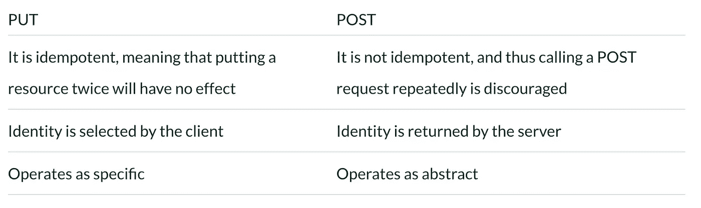
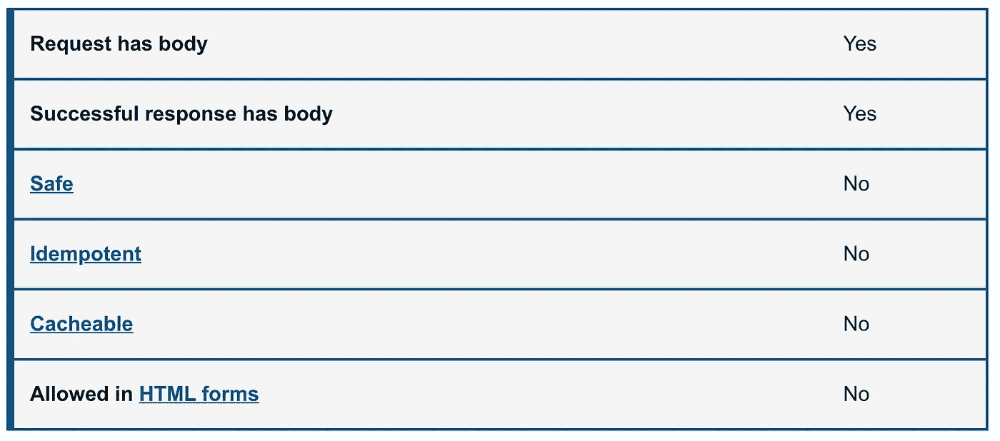
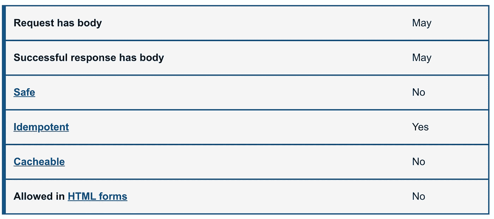
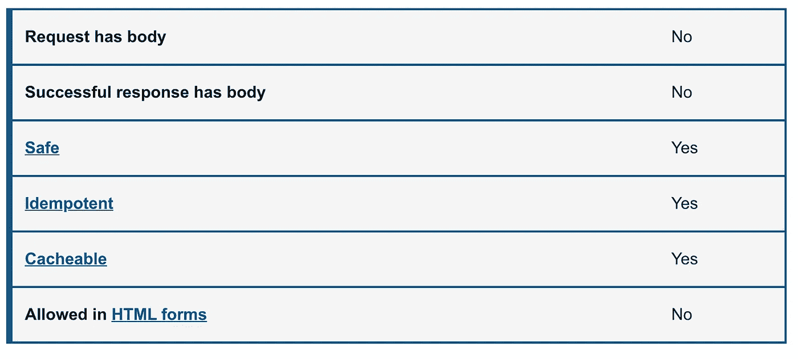
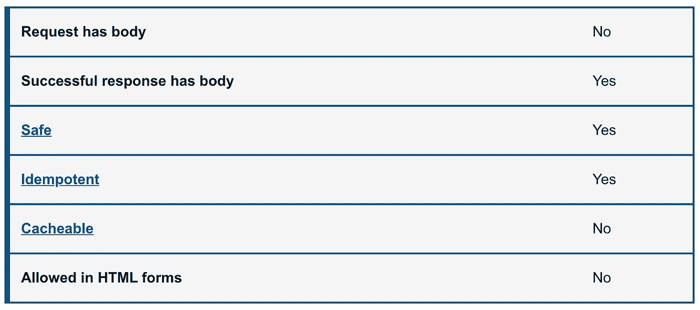

# HTTP 请求方法:完全指南

> 原文：<https://javascript.plainenglish.io/http-request-methods-complete-guide-cced531a42b7?source=collection_archive---------0----------------------->

## 获取、发布、上传、修补、删除、标题、选项和跟踪


# 得到

*   `GET`请求是 API 和网站中最常见、最广泛使用的方法。简单地说，GET 方法用于**从指定资源**的服务器检索数据。例如，假设您有一个带有`/users`端点的 API。向该端点发出 GET 请求应该会返回所有可用用户的列表。
*   由于 GET 请求只是请求数据而不修改任何资源，所以它被认为是一个**安全**和**幂等方法**。



# 邮政

*   在 web 服务中，`POST`请求用于**向 API 服务器**发送数据以创建或更新资源。发送到服务器的数据存储在 HTTP 请求的请求体中。
*   当一个新的资源被发布到服务器时，API 服务将通过给它分配一个 ID(新资源 URI)来自动关联新资源。简而言之，这个方法用于创建一个新的数据条目。
*   最简单的例子就是网站上的联系方式。当您在表单中填写输入并点击*发送*时，数据被放入请求的**响应体**并发送到服务器。这可能是 JSON、XML 或查询参数(还有很多其他格式，但这些是最常见的)。
*   值得注意的是，一个`POST`请求是**非幂等**。它改变后端服务器上的数据(通过创建或更新资源)，而不是不改变任何数据的`GET`请求。



Comparison between GET and POST

# 放

*   与 POST 类似，`PUT`请求用于向 API 发送数据，以**更新或创建资源**。不同之处在于 **PUT 请求是幂等的**。也就是说，多次调用相同的 PUT 请求**将总是产生相同的结果**。相反，重复调用 POST 请求会产生多次创建相同资源的副作用。
*   一般来说，当`PUT`请求*创建*资源时，服务器会用`201` ( `Created`)进行响应，如果请求*修改了*现有资源，服务器会返回`200` ( `OK`)或`204` ( `No Content`)。



Comparison between PUT and POST

# 修补

*   `PATCH`请求是一种鲜为人知的 HTTP 方法，但它类似于 POST 和 PUT。与`PATCH`的区别在于**只对资源**进行部分修改。
*   补丁和上传的区别在于**补丁请求不是等幂的**(类似于 POST 请求)。
*   为了扩展部分修改，假设你的 API 有一个`/users/{{userid}}`端点，一个用户有一个*用户名*。对于补丁请求，**您可能只需要在请求正文中发送更新后的用户名**——而不是 POST 和 PUT，后者需要完整的用户实体。



正如您在这里看到的，请求与 PUT 请求非常相似，但是请求体只包含需要更改的资源的属性

# 删除

*   `DELETE`方法顾名思义:**删除指定 URL 处的资源**。这个方法是 RESTful APIs 中比较常见的方法之一，所以了解它的工作原理是很有好处的。
*   如果一个新用户是通过对`/users`的 POST 请求创建的，并且可以通过对`/users/{{userid}}`的`GET`请求来检索，那么对`/users/{{userid}}`的`DELETE`请求将完全删除那个用户。



# 头

*   除了没有响应体之外，`HEAD`方法几乎与`GET`、**相同。换句话说，如果`GET /users`返回一个用户列表，那么`HEAD /users`将发出同样的请求，但不会返回用户列表。**
*   HEAD 请求**对于在实际发出 GET 请求之前检查 GET 请求将返回什么**很有用。例如，如果一个 URL 可能会产生大量的下载，那么一个`HEAD`请求可以读取它的`[Content-Length](https://developer.mozilla.org/en-US/docs/Web/HTTP/Headers/Content-Length)`头来检查文件大小，而不需要实际下载文件。



以下示例演示了如何向有关用户的查询发送 HTTP HEAD 请求:

```
HEAD /users HTTP 1.1
User-Agent: Mozilla/4.0 (compatible; MSIE5.01; Windows NT)
Host: medium.com
Accept-Language: en-us
Accept-Encoding: gzip, deflate
Connection: Keep-Alive
```

响应包含与 GET 方法相同的。

```
HTTP/1.1 200 OK
Date: Mon, 23 Sept 2021 12:28:53 GMT
Server: Apache/2.2.14 (Win32)
Last-Modified: Wed, 22 Jul 2021 19:15:56 GMT
ETag: "34aa387-d-1568eb00"
Vary: Authorization,Accept
Accept-Ranges: bytes
Content-Length: 88
Content-Type: application/json
Connection: Closed
```

# 选择

*   HTTP `OPTIONS`方法为给定的 URL 或服务器请求允许的通信选项。客户端可以用这个方法指定一个 URL，或者用一个星号(`*`)来指代整个服务器。OPTIONS 请求应该**返回数据，描述在给定的 URL 上服务器支持什么*其他*方法和操作**。
*   OPTIONS 请求的定义和使用比其他请求更宽松，这使它们成为测试致命 API 错误的良好候选对象。如果一个 API 不期望一个选项请求，那么最好放置一个测试用例来验证失败的行为。
*   在 [CORS](https://developer.mozilla.org/en-US/docs/Web/HTTP/CORS) 中，使用`OPTIONS`方法发送一个[预检请求](https://developer.mozilla.org/en-US/docs/Glossary/Preflight_request)，以便服务器可以响应是否可以发送该请求。



以下示例请求运行在 medium.com 上的 web 服务器支持的方法列表:

```
OPTIONS * HTTP/1.1
Host: medium.com
Origin: [https://medium.com/](https://medium.com/)
```

服务器的响应是:

```
HTTP/1.1 200 OK
Allow: GET,POST,PUT,PATCH,DELETE,HEAD,OPTIONS
Access-Control-Allow-Origin: https://medium.com/
Access-Control-Allow-Methods: GET,POST,PUT,PATCH,DELETE,HEAD,OPTIONS
Access-Control-Allow-Headers: Content-Type
```

## 找到；查出

*   **HTTP** `**TRACE**` **方法**设计用于诊断目的。它沿着到目标资源的路径执行消息环回测试，提供了一个有用的调试机制。
*   请求的最终接收者应该将收到的消息(不包括下面描述的一些字段)作为带有`message/http`的`[Content-Type](https://developer.mozilla.org/en-US/docs/Web/HTTP/Headers/Content-Type)`的`[200](https://developer.mozilla.org/en-US/docs/Web/HTTP/Status/200)` ( `OK`)响应的消息体返回给客户端。最终接收者要么是源服务器，要么是在请求中接收到 0 的`[Max-Forwards](https://developer.mozilla.org/en-US/docs/Web/HTTP/Headers/Max-Forwards)`值的第一个服务器。


以下示例显示了 TRACE 方法的用法:

```
TRACE / HTTP/1.1
Host: www.medium.com
User-Agent: Mozilla/4.0 (compatible; MSIE5.01; Windows NT)
```

对于上面的客户机请求，服务器响应被发送回来。

```
HTTP/1.1 200 OK
Date: Mon, 23 Sept 2021 12:28:53 GMT
Server: Apache/2.2.14 (Win32)
Connection: close
Content-Type: message/http
Content-Length: 39TRACE / HTTP/1.1
Host: www.medium.com
User-Agent: Mozilla/5.0 (Macintosh; Intel Mac OS X 10_15_7)
```

# 结论

在本指南中，我们已经了解了八种主要的 HTTP 请求方法。它们中的每一个都实现了不同的语义，但是它们之间有一些共同的特性:例如，请求方法可以是安全的、幂等的或者可缓存的。

> 安全方法:`GET`、`HEAD`、`OPTIONS, TRACE`
> 
> 等幂方法:`GET`、`PUT`、`DELETE`、`HEAD,OPTIONS`、`TRACE`
> 
> 可缓存的方法:`GET, HEAD`

如果指示了新鲜度并且设置了`Content-Location`头，对`POST`或`PATCH`请求的响应也可以被缓存，但是这很少被实现。

我们对 GET 和 POST 以及 PUT 和 POST 进行了比较。有了这些知识，我希望您能够建设性地使用 HTTP 方法。

一如既往，感谢阅读。如果你喜欢这篇文章，请分享它，看看我在 Medium 上的其他文章。

*更多内容看**[***说白了. io***](http://plainenglish.io/)*