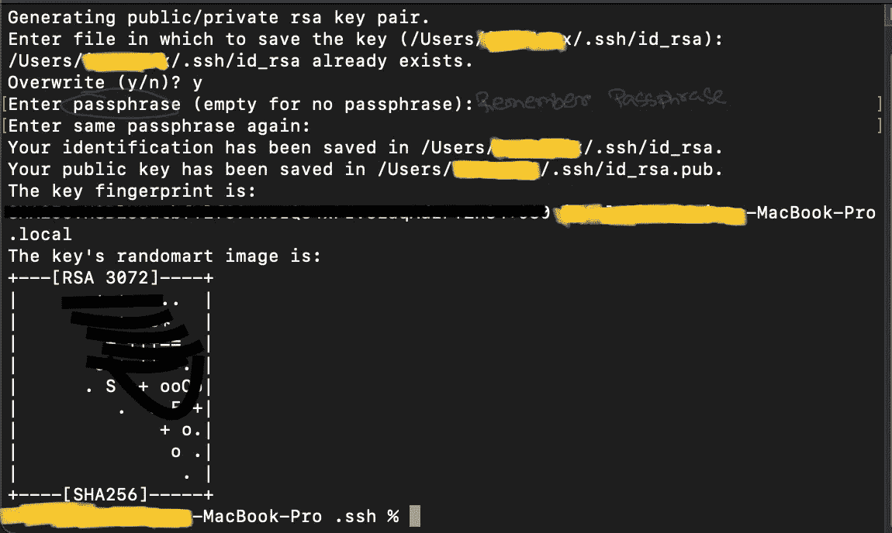
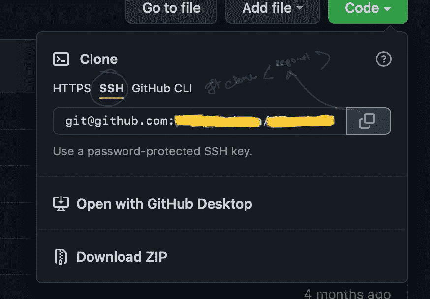

# 基于 HTTPS 的 GitHub Repo 克隆不起作用。

> 原文：<https://javascript.plainenglish.io/https-based-github-repo-cloning-is-not-working-c6da925ac29b?source=collection_archive---------17----------------------->

## 这就是你现在如何克隆你的 GitHub repo。

Photo by [Brina Blum](https://unsplash.com/@brina_blum?utm_source=medium&utm_medium=referral) on [Unsplash](https://unsplash.com?utm_source=medium&utm_medium=referral)

在尝试用传统方法克隆一个私有 GitHub 回购协议一段时间后，我发现他们不接受克隆私有回购协议的传统方法。

本文将一步一步地演示这个过程。

## 第一步:生成 SSH 密钥，并将其添加到您的 GitHub 帐户中。

*   打开终端并粘贴`ssh-keygen`

Copy your id_rsa file path

*   将路径复制到您的`id-rsa`文件路径，即`\Users\<userName>\.ssh\id_rsa`
*   `cat <path_to_id_rsa_file>`
*   复制从`ssh-rsa`开始到结尾的字符串。
*   还记得您为生成 SSH 密钥而输入的密码短语吗

## 步骤 2:将 SSH 密钥添加到 GitHub 并克隆

Copy the path to your repo

*   现在转到您想要克隆您的回购的目录
*   `git clone <github_repo_path>`
*   输入您为生成 SSH 密钥而输入的密码短语。

您的 GitHub repo 将开始克隆。

感谢阅读。干杯！

*更多内容请看*[***plain English . io***](http://plainenglish.io)