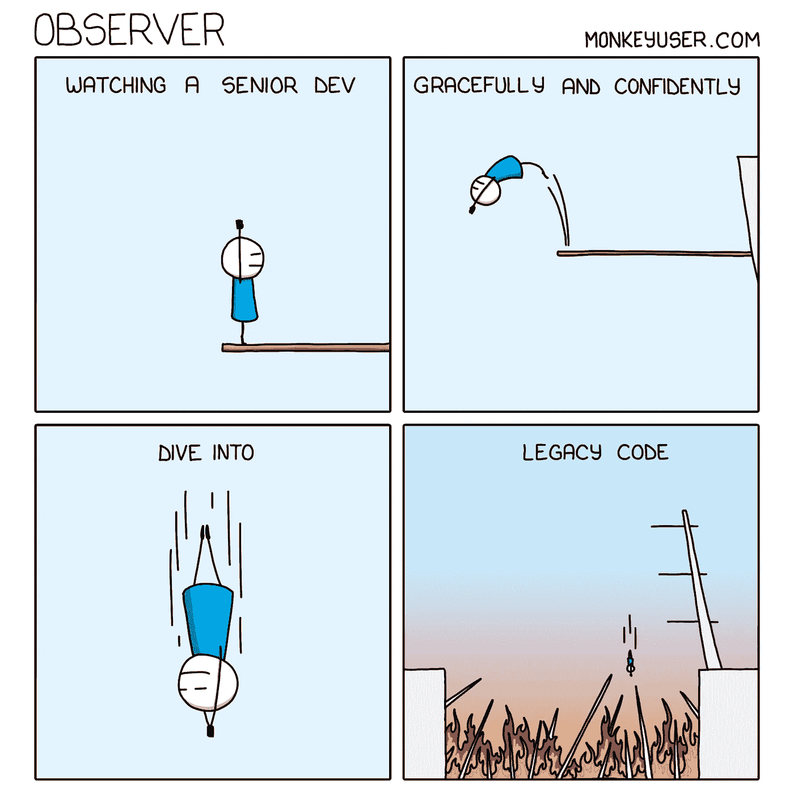
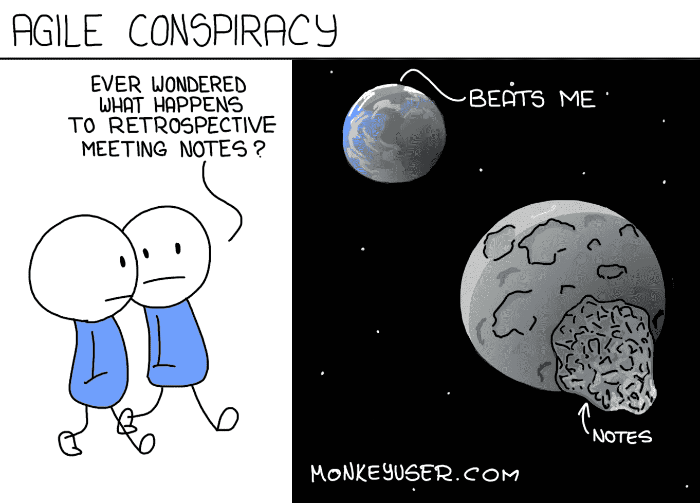
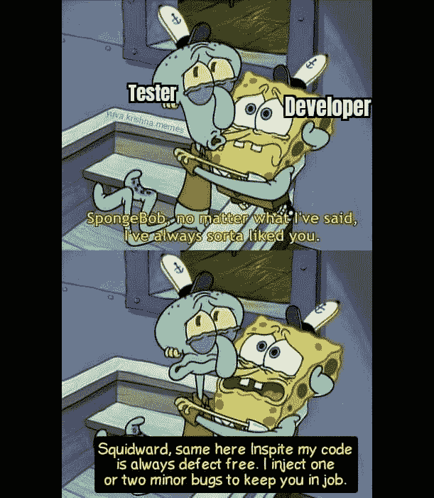
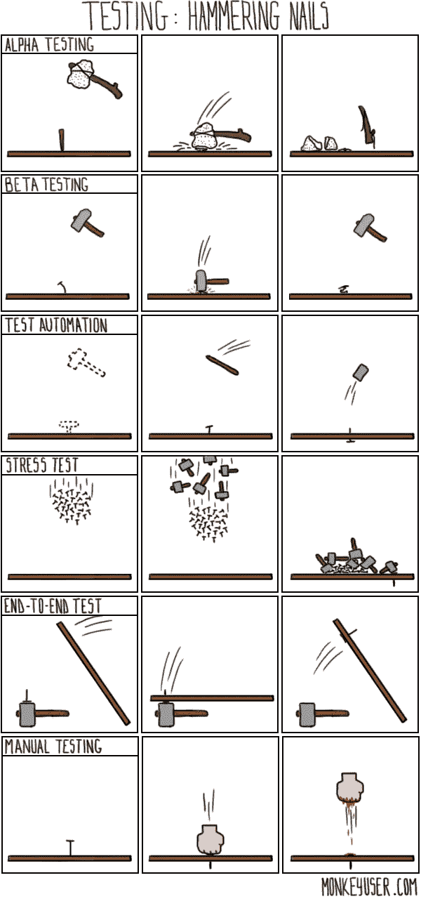
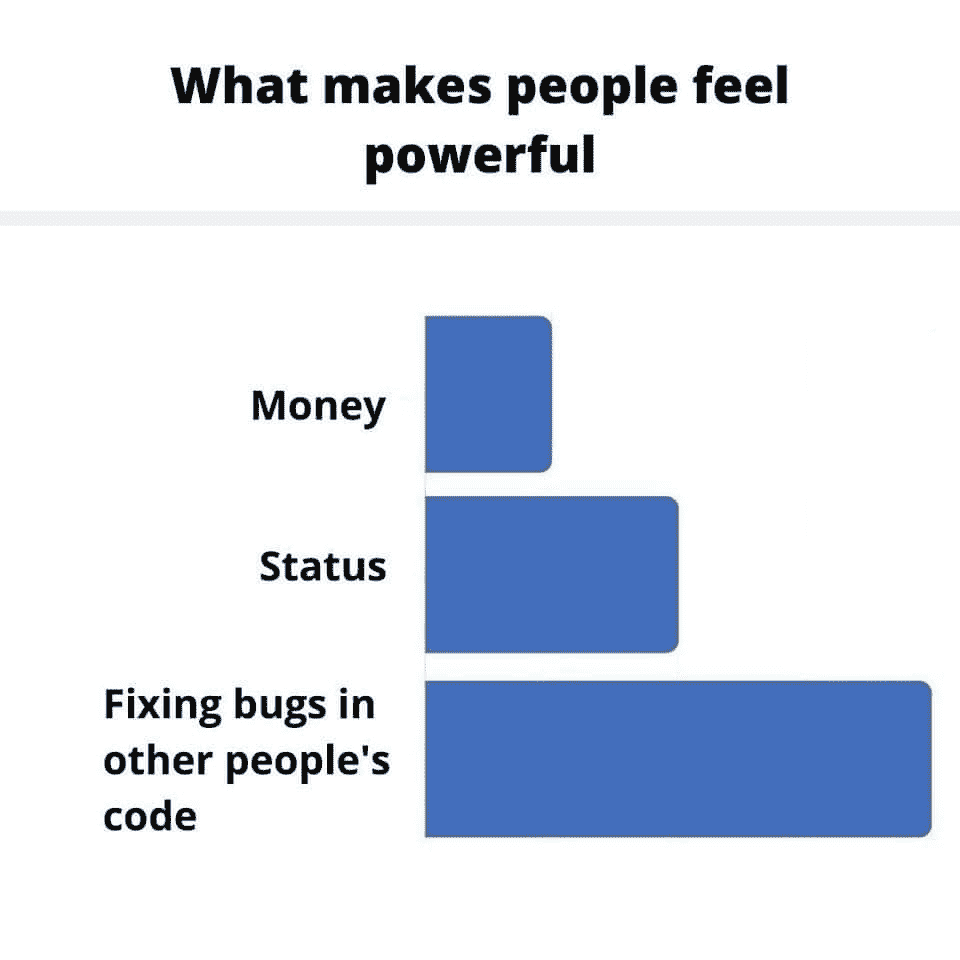
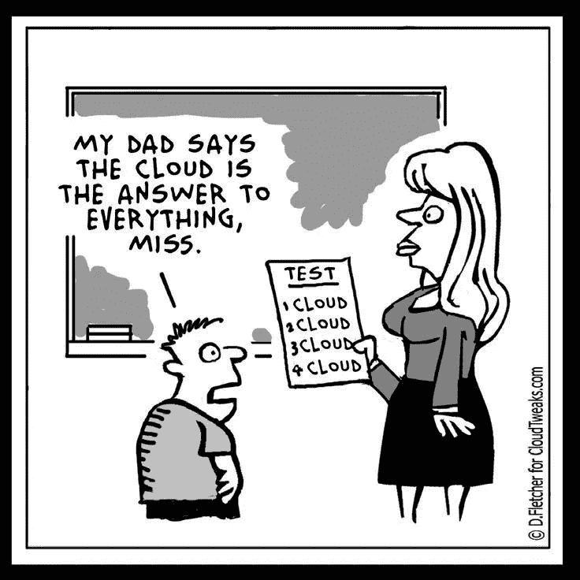
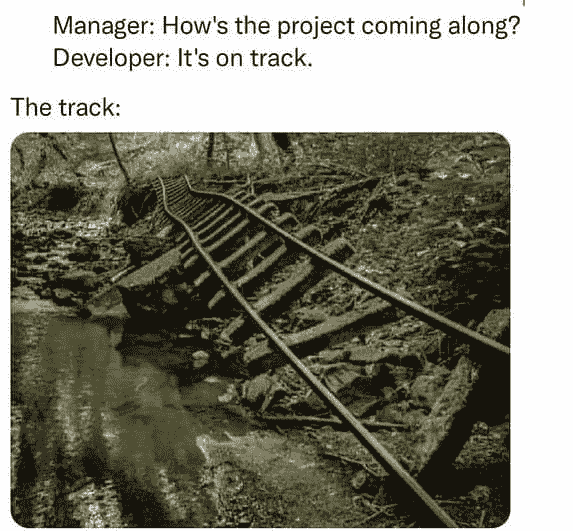
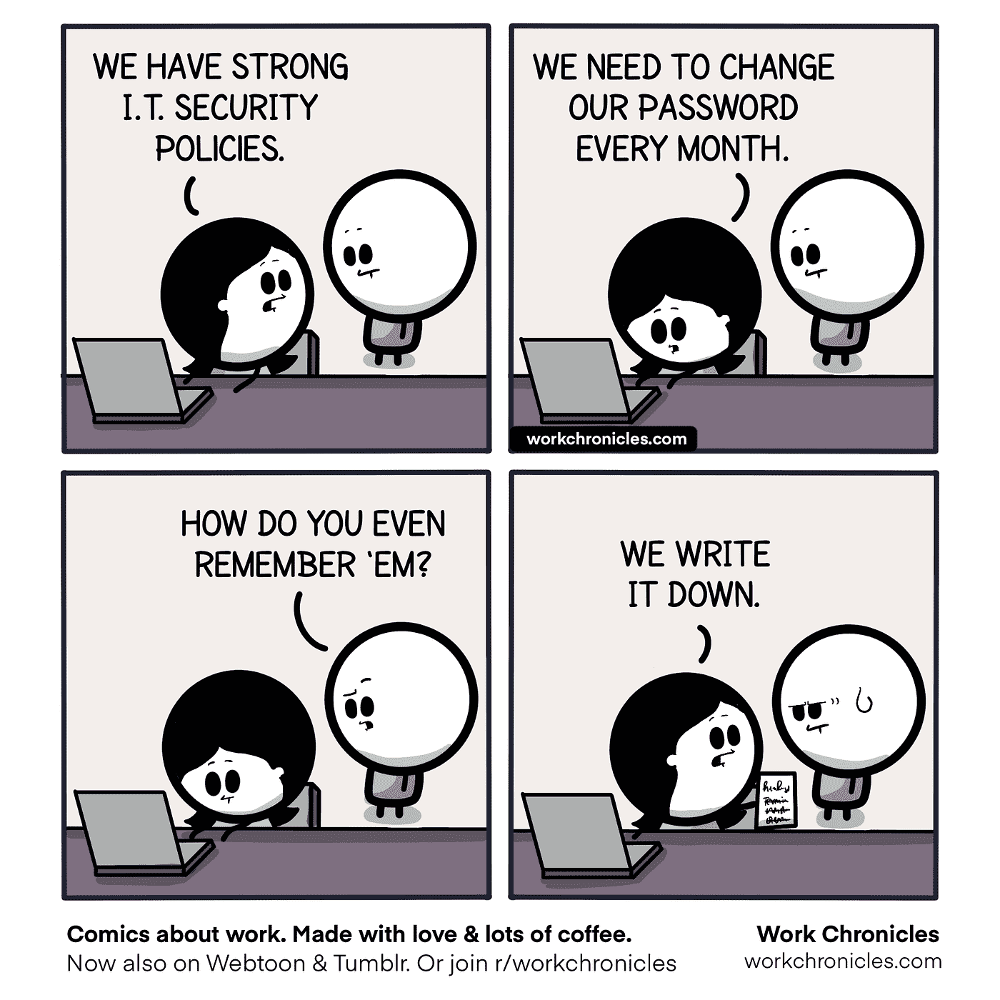
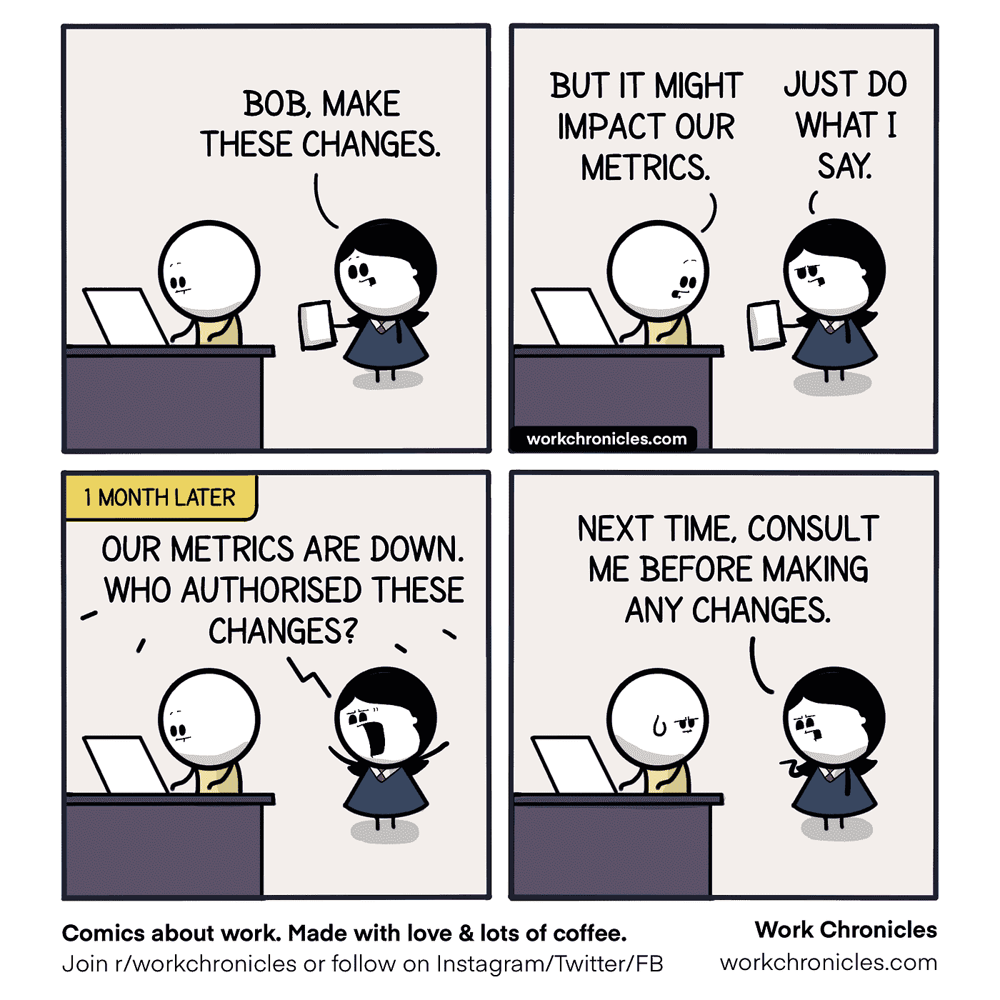
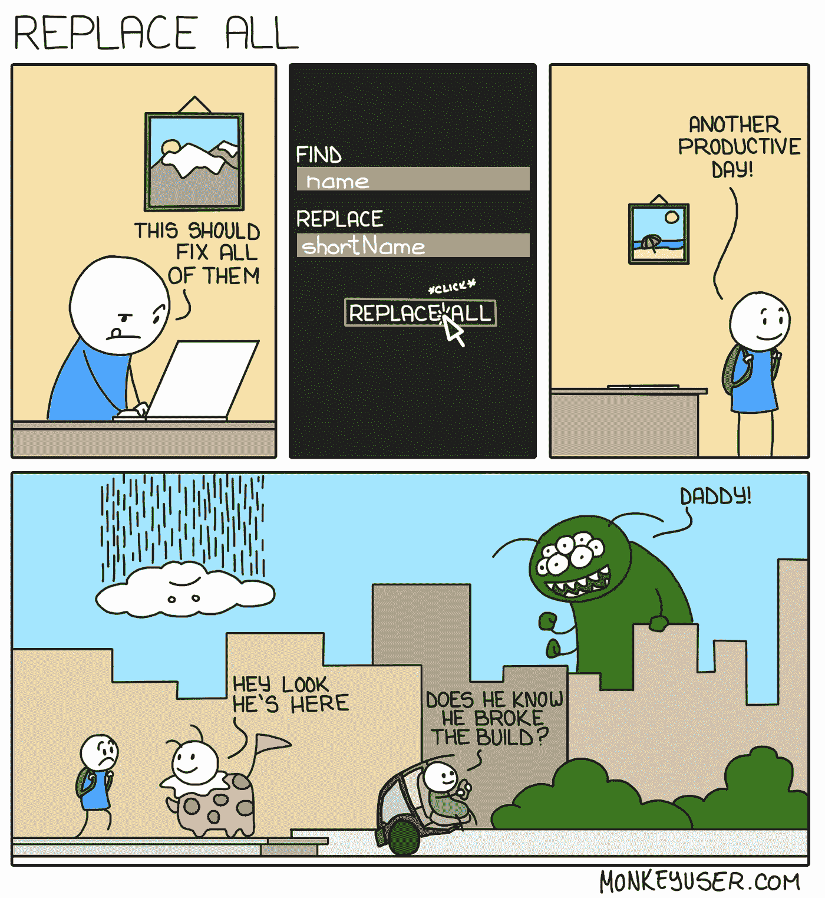

# 任何程序员都能体会到的幽默

> 原文：<https://javascript.plainenglish.io/humour-any-programmer-can-relate-to-f7c2e35745b2?source=collection_archive---------13----------------------->

## 是时候开怀大笑了。

Photo by [Amanda Sofia Pellenz](https://unsplash.com/@amanda_sofia_?utm_source=medium&utm_medium=referral) on [Unsplash](https://unsplash.com?utm_source=medium&utm_medium=referral)

你可能听说过笑是最好的药，它可以治愈任何疾病。

不要写太多，让我们朝着我们的剂量前进。

# 你是一个好的观察者还是一个追随者？

Source: [https://www.monkeyuser.com/](https://www.monkeyuser.com/)

# 龙骑士会怎么样？

Source: [https://www.monkeyuser.com/](https://www.monkeyuser.com/)

# 未来的关系目标…

Source: [https://www.facebook.com/yuva.krishna.memes](https://www.facebook.com/yuva.krishna.memes)

# 当我买课程时看到标题…

Source: [https://www.facebook.com/yuva.krishna.memes](https://www.facebook.com/yuva.krishna.memes)

# 当我打开任务管理器停止程序时发生…

[https://www.facebook.com/programmemer](https://www.facebook.com/programmemer)

# 测试不同的场景…

Source: [https://www.monkeyuser.com/](https://www.monkeyuser.com/)

# 程序员 vs bugs

[https://www.facebook.com/programmemer](https://www.facebook.com/programmemer)

# 是什么让人强大？

[https://www.facebook.com/programmemer](https://www.facebook.com/programmemer)

# 爸爸永远是对的…

[https://www.reddit.com/r/ProgrammerHumor](https://www.reddit.com/r/ProgrammerHumor)

# 给你更多的乐趣…

# 你用哪个借口？

Image Credit: [https://www.monkeyuser.com/2019/everyday-excuses/?sc=true&dir=random](https://www.monkeyuser.com/2019/everyday-excuses/?sc=true&dir=random)

# 我主要用 StackOverflow…但是品牌重塑也是一个很好的解决办法…

Image Credit: [https://www.monkeyuser.com](https://www.monkeyuser.com/2019/everyday-excuses/?sc=true&dir=random)

# 无错代码？我感觉自己像个国王…

Image Credit: [https://programmerhumor.io/programming-memes/please-excuse-my-brilliance-2/](https://programmerhumor.io/programming-memes/please-excuse-my-brilliance-2/)

# 这是一个简单的要求…

Image Credit: [https://www.facebook.com/groups/it.humor.and.memes](https://www.facebook.com/groups/it.humor.and.memes)

# 赛道不重要，对吧？英雄联盟

Image Credit: [https://www.facebook.com/javascriptJS](https://www.facebook.com/javascriptJS)

# 谁记下了密码？

Image Credit:[https://workchronicles.com/](https://workchronicles.com/)

# 怪游戏？

Image Credit:[https://workchronicles.com/](https://workchronicles.com/)

# 替换并不是一个好的解决方案…

Image Credit: [https://www.monkeyuser.com/2018/replace-all/?sc=true&dir=random](https://www.monkeyuser.com/2018/replace-all/?sc=true&dir=random)

# 我每天…

Image Credit: [https://www.reddit.com/r/ProgrammerHumor/comments/q9as20/oh_god_here_we_go_again/](https://www.reddit.com/r/ProgrammerHumor/comments/q9as20/oh_god_here_we_go_again/)

# QA 工程师测试一切…

Image Credit: [https://www.monkeyuser.com/](https://www.monkeyuser.com/2018/replace-all/?sc=true&dir=random)

# 来源:

 [## r/程序员幽默

### r/ProgrammerHumor:致力于与程序员和编程相关的幽默和笑话。

www.reddit.com](https://www.reddit.com/r/ProgrammerHumor)  [## 登录或注册查看

### 查看关于脸书的帖子、照片和更多内容。

www.facebook.com](https://www.facebook.com/programmemer)  [## 登录或注册查看

### 查看关于脸书的帖子、照片和更多内容。

www.facebook.com](https://www.facebook.com/yuva.krishna.memes)  [## 猴子用户

### 网络漫画中的软件开发讽刺。

www.monkeyuser.com](https://www.monkeyuser.com/) 

*更多内容尽在*[***plain English . io***](http://plainenglish.io/)