# 哈斯基+林特-在一个反应型脚本项目中上演

> 原文：<https://javascript.plainenglish.io/husky-lint-staged-on-a-react-typescript-project-automate-validation-before-submitting-your-code-8d388e63be70?source=collection_archive---------0----------------------->

## 提交代码前自动验证

# 介绍

即使您设置了保证某些代码质量的工具，也有可能在推送代码之前忘记执行它们。

为了自动化和解决这个问题，[哈士奇](https://www.npmjs.com/package/husky) + [Lint-Staged](https://www.npmjs.com/package/lint-staged) 包帮助您防止提交不遵循某些预定义规则的代码(即:单元测试验证、代码约定验证、代码格式化等)。

在本文中，我将向您介绍哈士奇、Lint-Staged 以及如何在 React TypeScript 项目中使用这些包。

# 先决条件

**Node.js** :需要安装节点版本> = 10。所以，如果你没有，请去 NodeJS 网站，下载并安装在你的本地机器上。([https://nodejs.org/en/](https://nodejs.org/en/))

**Git** :您需要安装 Git 版本> = 2.13.0。所以，如果你没有，请去 Git 网站，下载并安装在你的本地机器上。([https://git-scm.com/downloads](https://git-scm.com/downloads))

# 第一步。用 Git 启动一个反应型脚本项目

以下命令将在文件夹 *my-app* 内创建一个项目。
在终端，运行:

```
npx create-react-app my-app --template typescript
```

在项目文件夹中，启动 git:

在终端上，运行:

```
git init
```

*注意:出于本教程的目的，您不需要指向存储库，但是如果您愿意，您可以使用以下命令进行操作:*

```
git remote add origin <your_existing_repository_cloning_url>
```

# 第二步。设置“哈士奇”套餐

## 安装:

我们将使用[哈士奇版本 4](https://github.com/typicode/husky/tree/master) 。已经有了[更新版本](https://dev.to/typicode/what-s-new-in-husky-5-32g5)，但仅针对开源项目，或者如果您是哈斯基在 [GitHub 赞助商](https://github.com/sponsors/typicode)或[Open collection](https://opencollective.com/husky)的赞助商。

在终端上，运行:

```
npm install husky@4 --save-dev
```

## Husky 配置文件

创建一个“ *.huskyrc.json* ”文件，并将其清空(我们将在前面对其进行配置)。

在这个文件中，我们可以定义任何 [Git 钩子](https://git-scm.com/docs/githooks#_hooks)。

***什么是饭桶挂钩？*** *Git 挂钩是在给定的 Git 事件发生时可以执行的动作。即:当开发人员提交或推送一些代码时，运行所有的单元测试，如果所有测试都通过了，就完成提交/推送。*

# 设置为仅在所有单元测试都通过时提交

为了在提交之前触发一些动作，我们将使用名为*“pre-commit”*的 Git 钩子。

现在让我们创建一个动作来执行我们的' *test* '命令脚本(在我们的' *package.json* 文件中声明)。设置这个动作的主要目的是**阻止用户提交代码，如果某些测试失败**。

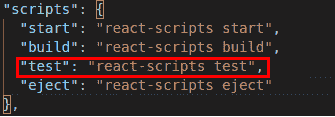

command scripts on “package.json” file

所以，在***. husk yrc . JSON***文件里面:

```
{
  "hooks": {
     "pre-commit": "npm run test -- --watchAll=false"
  }
}
```

*注意:如你所见，Husky 配置文件可以使用“package.json”上的任何脚本，只需使用* `npm run` *调用即可。*

*但是等等……什么是* `*-- --watchAll=false*` *？*

第一个双破折号“-”告诉我们的 npm 命令，我们将把参数传递给它(查看更多信息:[NPM 脚本的双破折号是什么意思？](https://stackoverflow.com/questions/44743626/whats-mean-of-npm-scripts-two-dahses))。

命令选项“- watchAll=false”是因为当执行“测试”脚本时，React 将启动一个观察模式菜单，因此您可以选择是否要运行所有文件、特定文件、仅修改的文件等。在我们的例子中，我们不希望它问任何问题，而只是运行所有的测试。因此，我们通过添加'- watchAll=false '来关闭这种监视模式。

现在，让我们用我们全新的哈士奇配置来试试吧！

在提交我们的代码之前，让我们测试一下我们的命令:

```
npm run test -- --watchAll=false
```

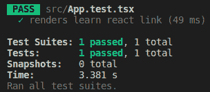

unit test running successfully

命令有效！太好了！因此，由于我们新的 Husky 配置，如果我们提交，测试应该在提交之前运行，对吗？让我们检查一下！

```
git commit -am "I hope the test run before this commit!"
```

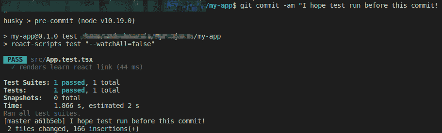

result: test ran before committing

酷！有用！

现在，让我们看看**如果测试失败会发生什么**？

首先，用下面的 Git 代码撤销提交:

```
git reset HEAD^ 
```

(在这里查看更多信息:[我可以删除 git 提交但保留更改吗？](https://stackoverflow.com/questions/15772134/can-i-delete-a-git-commit-but-keep-the-changes))

现在我们需要强制项目的单元测试失败。

如果我们分析单元测试文件***app . test . tsx****。*期望 ***App.tsx*** 文件呈现带有“Learn React”文本的元素。

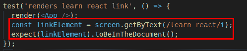

为了迫使它失败，让我们修改我们的 ***App.tsx*** 文件来呈现另一个文本。

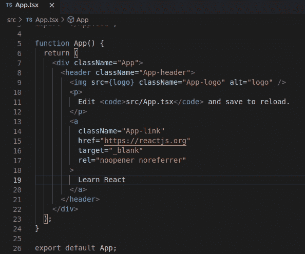

Modifying ‘App.tsx’ file

让我们再运行一次，看看测试是否会失败:

```
npm run test -- --watchAll=false
```

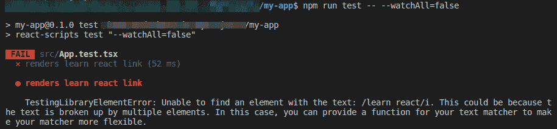

result: test fails

耶！现在让我们提交，看看会发生什么:

```
git commit -am "I hope this commit will be blocked"
```

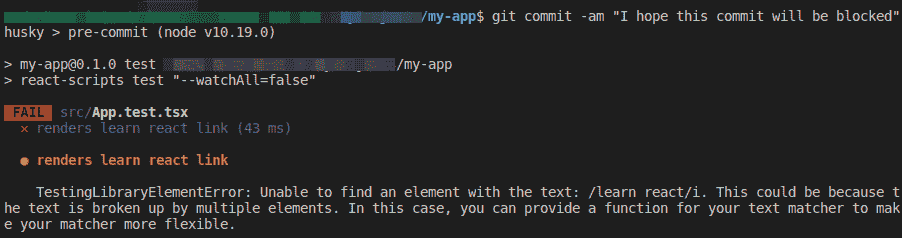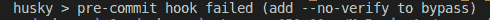

husky response: pre-commit hook failed

看到了吗？由于测试失败，提交被阻止！很酷，对吧？

# 设置仅在 ESLint 验证规则通过时提交

让我们基于 ReactJS 项目提供的默认 ESLint 配置来设置一个新的操作。

首先，让我们在整个项目中运行 ESLint，看看会发生什么:

```
npx eslint .
```

通过运行这个命令，您将看到什么也没有发生，因此这意味着整个项目的代码已经遵循了 React 提供的 ESLint 代码规则。

*注意:默认情况下，只有当违反的规则被设置为“*错误*”时，ESLint 才会抛出错误。如果你还想抛出“*警告*规则违反，你可以添加“* - max-warnings=0 *”命令选项。*

示例:

```
eslint . --max-warnings=0
```

现在，让我们将我们的 ***.huskyrc.json*** 文件改为使用 ESLint 命令:

```
{
"hooks": {
 "pre-commit": "eslint ."
 }
}
```

配置完成了！

仅仅出于**教学目的**(因此我们可以看到提交被 ESLint 代码规则阻止)让我们强制 ESLint 在某个规则上抛出一个错误，并插入一个违反该规则的代码。

ESLint 配置设置在 ***package.json*** 文件上。
在 json `“*eslintConfig*”`部分，添加以下代码:

```
"rules": {
 "@typescript-eslint/no-unused-vars": "error"
}
```

*注意:这条规则与未使用的变量有关，所以如果某个变量在代码中声明但未使用，ESLint 将抛出一个错误。*

我们的“package.json”中的结果是:

```
...
"eslintConfig":{
  "extends": [
    "react-app",
    "react-app/jest"
  ],
  "rules": {
    "@typescript-eslint/no-unused-vars": "error"
  }
},
...
```

现在，为了强制 ESLint 错误，让我们声明一个变量" *unusedVar* "并且不要在任何地方使用它。

关于 ***App.tsx*** 文件:

```
...
const unusedVar = "";function App() {
  return (
...
```

因此，让我们再次运行我们的 *eslint* 命令，看看是否会抛出一个错误:

```
npx eslint .
```

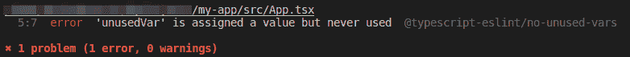

eslint point out a code violation

让我们看看当我们尝试提交代码时会发生什么:

```
git commit -am "I hope this commit will be blocked"
```

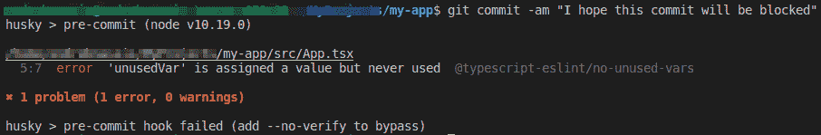

husky response: pre-commit hook failed

看到了吗？提交被阻止，因为没有应用 ESLint 规则！酷！

# ESLint 自动修复和 Husky 问题

最后的解决方案是那种**不完整的**。但是为什么呢？

ESLint 和许多其他软件包一样，可以自动修复不遵循一些基本规则的代码(例如，添加或删除分号“；”在行尾)。所以，想象一下这样一种情况，所有阻碍我们提交的坏代码都可以被 ESLint 用它的 auto-fix ' - fix '命令选项自动修复。

嗯，所以我们只需要将它添加到我们的 Husky 配置文件中，对于这些情况，提交将与所有修复的代码一起发送，对吗？

可惜没有。

哈士奇无法执行所有这些动作:
*(至少没有简单的方法做到)*

*   修复代码
*   检查是否解决了所有问题
*   将固定代码添加到暂存
*   提交代码。

幸运的是，我们有一个名为' *lint-staged* 的 npm 包可以帮我们做到这一点！让我们看看它是如何工作的。

# 第三步。设置“lint 暂存”程序包

Lint 对由 Git**暂存**的**文件**执行运行操作(换句话说。准备好提交的文件)。

## 装置

在终端上，运行:

```
npm install lint-staged --save-dev
```

## Lint 暂存配置文件

创建一个 **.lintstagedrc.json** 文件，暂时让它为空(我们将提前配置它)。

该文件将包含仅在暂存文件上执行**的脚本。如果脚本没有抛出任何错误，则该操作所做的所有更改都会保存到暂存文件中。**

# 使用 ESLint 自动修复和 Lint 暂存:问题已解决！

现在已经安装了 Lint-Staged，让我们解决 Husky 的限制，并配置我们的 ESLint 在 Staged 文件上运行它的 auto-fix 命令。
在'***lintstagedrc . JSON***上，添加以下内容:

```
{
"src/**/*.{js,ts,jsx,tsx}": [
  "eslint --fix"
  ]
}
```

*注意:你也可以使用*package . JSON 上的任何脚本，只需使用`npm run`调用它。

让我解释一下这个文件的内容:

*   " *src/**/*。{js，ts，jsx，tsx}* "告诉 lint-staged 将只对“src/”目录中的文件运行某些操作，并且只对那些具有*的文件。js '，'。ts '，'。jsx'* 或*'。tsx'* 扩展名文件。
*   动作是“ *eslint - fix* ”，它执行 eslint 规则检查，并对代码进行自动修复。

最后，Husky 现在需要调用 lint-staged 作为一个动作，来激活我们的***. lintstagedrc . JSON***文件配置。

关于***. husky RC . JSON***文件:

```
{
"hooks": {
  "pre-commit": "lint-staged"
  }
}
```

理解场景:

1.  当我们提交时，Husky 将调用 Lint-Staged。
2.  Lint-Staged 仅查找已转移的文件，并选择那些位于“src/”目录中并具有其中一个*的文件。js '，'。jsx '，'。ts '，'。tsx'* 扩展定义。
3.  Lint-Staged 然后将对选定的文件调用“eslint - fix”操作，检查代码规则并在可能的情况下应用自动修复。
4.  如果 *eslint* 成功，提交将完成，否则将被阻塞。

在我们的例子中，我们预计会被阻塞，因为我们的代码中有一个未使用的变量，而 ESLint 本身无法自动修复这个代码冲突。

让我们看看我们新的 Husky + Lint 分阶段配置是否有效:

```
git commit -am "I hope this commit will be blocked"
```

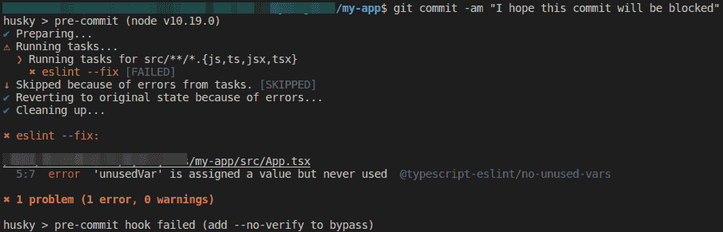

Husky + Lint-Staged execution

看到了吗？提交被阻塞是因为 *Husky* 调用了 *Lint-Staged* 命令，该命令调用了 ESLint 规则检查，正如我们所预料的那样，规则“no-unused-vars”被' *App.tsx* '文件中未使用的变量违反了！

## 更漂亮的自动修复和 Lint-Staged:格式化 JSON 文件

如果您想自动修复 JSON 文件，您可以设置 Lint-Staged 配置文件来对 JSON 文件运行更漂亮的自动修复格式。

```
{
"src/**/*.{js,ts,jsx,tsx}": [
  "eslint --fix"
],
"*.json": [
  "prettier --write"
]
}
```

# 有用的提示

我们完成了！但是让我给你一些非常有用的提示！

## 通过“package.json”文件组织所有脚本

我们已经知道“ *.huskyrc.json* ”和“ *.lintstagedrc.json* ”也接受使用在“ *package.json* 文件上定义的脚本的动作。

为了更好地组织您的项目，在" *package.json* "文件中声明所有脚本，并在" *.huskyrc.json* "和" *.lintstagedrc.json* "中使用。

示例:

在' *package.json* '上:

*   定义“ *lint* ”脚本
*   定义“*测试:无观察*”脚本

```
...
"scripts": {
...
"test": "react-scripts test",
"test:noWatch":"npm run test -- --watchAll=false",
"lint": “eslint --fix"
...
},
...
```

On ' *.huskyrc.json'* ':

*   从" *package.json* 中调用" *test:noWatch* "脚本

```
{
"hooks": {
  "pre-commit": "npm run test:noWatch && lint-staged"
}
}
```

在' *.lintstagedrc.json* '上:

*   从" *package.json* 中调用" *lint* "脚本

```
{
"src/**/*.{js,ts,jsx,tsx}": [
"npm run lint"
  ]
}
```

## 最佳哈士奇配置

设置 Git 钩子"*预提交*"和**更快的检查**(像林挺)，因为你可能会在推之前提交很多次。

设置 Git 钩子"*预推送*"和**较慢的检查**(像检查单元测试)，因为你推送的次数可能会比提交的次数少。

On ' *.huskyrc.json* ' ':

```
{
"hooks": {
  "pre-commit": "lint-staged",
  "pre-push": "npm run test:noWatch"
  }
}
```

## 也在您的 CI 管道上配置这些验证

创建这些策略不会阻止用户提交不符合预期规则的代码，因为即使是 Git 挂钩“*预提交*”和“*预推送*”也可以通过“ *- no-verify* ”命令选项绕过。

为了保证没有坏代码会到达存储库，我强烈建议您也在 CI(持续集成)管道过程中设置验证。但这个主题是另一个时间。

# 谢谢！

希望你喜欢！非常感谢您的任何反馈！

# 参考资料:

[](https://www.npmjs.com/package/husky) [## 强壮的

### Git 挂钩变得简单

www.npmjs.com](https://www.npmjs.com/package/husky) [](https://www.npmjs.com/package/lint-staged) [## 皮棉阶段

### 对暂存的 git 文件运行 linters，不要让💩滑入你的代码库！林挺在运行时更有意义…

www.npmjs.com](https://www.npmjs.com/package/lint-staged) [](https://git-scm.com/docs/githooks#_hooks) [## Git - githooks 文档

### 钩子是可以放在钩子目录中的程序，可以在 git 执行的某些时候触发动作。钩子…

git-scm.com](https://git-scm.com/docs/githooks#_hooks)