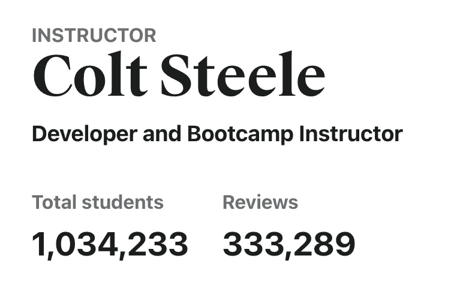
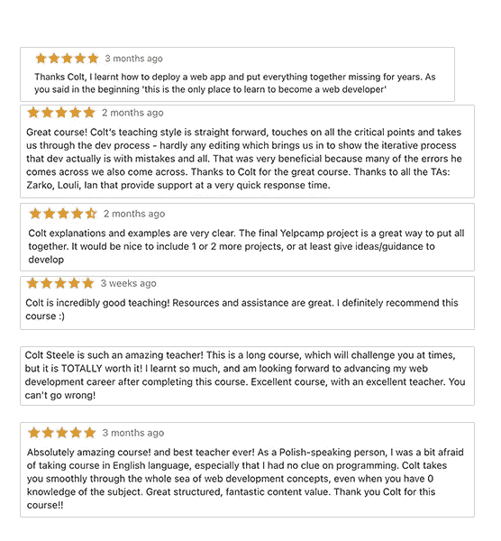
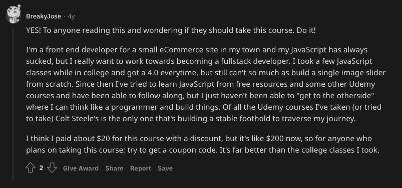
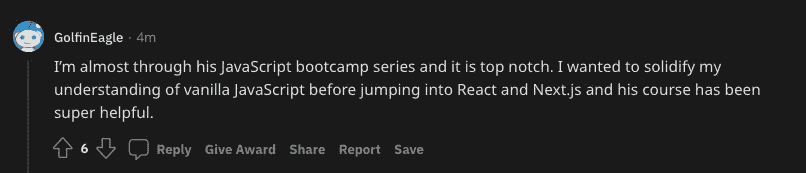
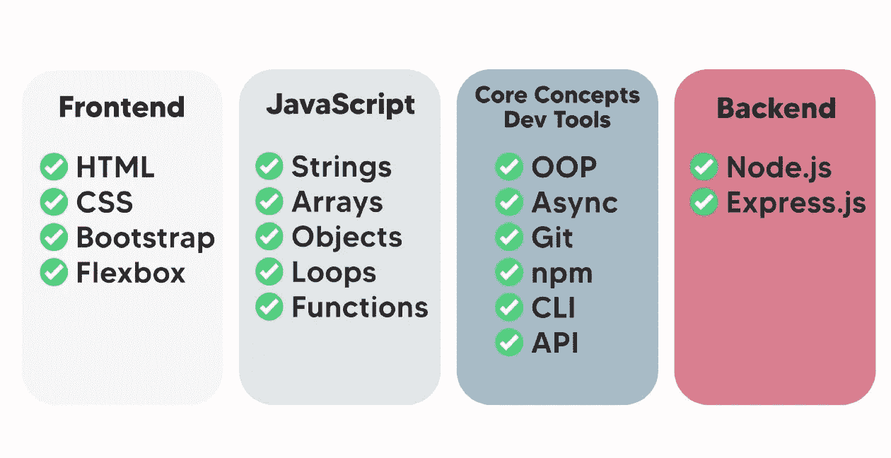
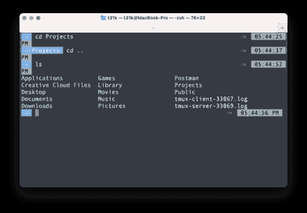
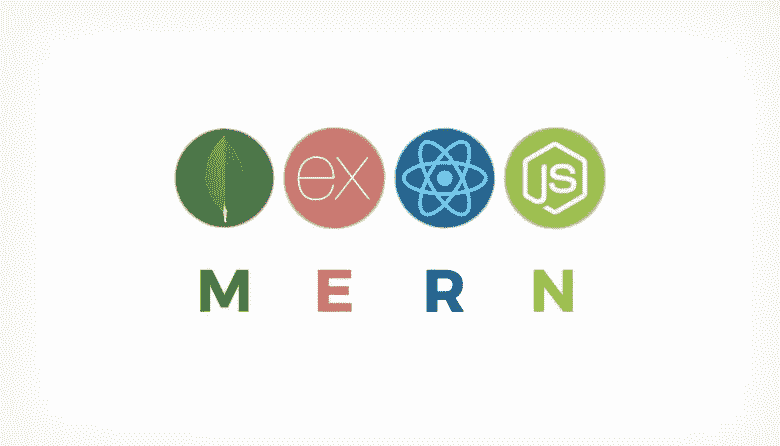

# 我参加了一个 20 美元的训练营，成为了一名全栈开发者

> 原文：<https://javascript.plainenglish.io/i-became-a-developer-with-a-20-bootcamp-32c776eaba13?source=collection_archive---------4----------------------->

## 我如何用 20 美元的训练营成为一名开发者

大家好，欢迎回来！我从写作的短暂但非故意的中断中回来了。我从*咳咳*一直忙到今天&我想分享一下我是如何在一年前参加了一个 20 美元的训练营，并在不久之后成为一名全栈开发者的。

不久前，也就是 2020 年年中，也就是 COVID 年，当我们像被关在笼子里的动物一样被迫呆在室内时，感觉就像是很久以前一样，感觉到一种无止境的渴望，希望这个疫情结束。

像许多其他人一样，我变得警惕并厌倦了不健康的网飞、垃圾食品、混乱的生物钟以及这之间的一切，最终发现学习编程比我以前的习惯稍微更有成效。

几个月后，我想把我的学习提高到一个新的水平，并开始了成为一名开发人员的自学之旅。我的选择有限，预算有限，朋友圈有限，所以我最终花 20 美元买了一个训练营，这个训练营*改变了我的生活。好吧，这有点夸张，但它确实极大地帮助了我转换领域和获得我的第一份开发工作。*

所以事不宜迟，我们走吧！

## 线上 vs 线下

**为什么我决定参加在线训练营？**

**🥇毫无疑问，许多人推迟上大学攻读计算机科学学位以成为一名开发人员的想法的主要原因之一是因为你必须支付的价格，更不用说每学期结束时堆积如山的学生贷款了。**

因此，希望从事编程领域的人转向了训练营路线，但也面临着几个预算问题，因为:

> *而* [*美国全职编码训练营的平均费用为 13584 美元*](https://www.coursereport.com/reports/coding-bootcamp-market-size-research-2019)**训练营的学费从 7800 美元到 21000 美元不等。**
> 
> **~* [*课程报告*](https://www.coursereport.com/blog/coding-bootcamp-cost-comparison-full-stack-immersives)*

*当然，与大学学费相比，这是很少的，但对许多人来说仍然是昂贵的。令人欣慰的是，许多在线训练营的教练在 Udemy 上取得了巨大的成功，因为它的学习质量非常好，非常像它的线下同行。*

***🥈线上与线下的优势:灵活性** 因为是在线，你也可以在你喜欢的时间(和地点)参加课程&按照自己的进度完成教学大纲。在我看来，这符合人们的许多要求，因为离线训练营通常需要几个月的全职投入和承诺才能完成。*

***🥉线上 vs 线下劣势:机遇** 尽管如此，与强大的对手相比，线上训练营也有自己的弱点。像大会和全栈学院这样的知名训练营组织通常与多个组织和招聘公司合作，以帮助他们的学生获得工作机会。*

*这意味着他们的校友可以利用这种超强的社交网络来结识该领域的专家，了解就业市场，当然最终获得工作机会。*

*相比之下，在线训练营不提供这种服务，因为当学生只支付很少的费用时，很难提供这种基础设施。参加在线训练营的学生必须完全依靠自己的网络技能和当地的工作网站来寻找招聘人员，以获得这份甜蜜的开发人员工作。然而，面对网上训练营的正确做法(尤其是价格)，这只是一个小问题。*

## *选择正确的路线*

*现在 Udemy、Cousera、freeCodeCamp 等网站上有太多的课程，我们如何做出合理的判断来选择最合适的课程呢？*

*老实说，答案是:没有完美的*课程，因为大多数在线训练营可能会教你几乎相同的东西。你可以随心所欲地偏离，但网络的基本原理保持不变(至少目前如此)**但**有一个特别的训练营*非常接近*，那就是*drumrolls* [柯尔特·斯蒂尔的网络开发者训练营](https://www.udemy.com/course/the-web-developer-bootcamp/)。**

*谁是柯尔特·斯蒂尔？一个很好的经验法则是:一个好的班级取决于教它的人。柯尔特绝对保持了这种高水平，他充满激情地致力于完善他的工艺，这显然可以看出他经常更新和完善这门课程。*

*柯尔特·斯蒂尔是一位经验丰富的训练营教练，他帮助零编码知识的初学者从零到英雄，再到在世界各地找到一份全职高薪开发工作。*

*他在传统的个人训练营课程中教授和带领一批教员，如镀锌公司和大会。知道自己在以正确的方式传递知识方面的绝对天赋后，他精心制作了自己的教学大纲，设计了一门全新的课程。*

*这个课程放在 Udemy 上，价格只是传统训练营的一小部分，希望世界各地的人都有机会进入这个领域，而不需要倾家荡产。*

*好吧，这个人很有经验，但是课程好吗？
根据 Udemy 的数据，他所有课程的注册学生总数超过 100 万。此外，只要看一眼全球学生给出的评论，就会发现不仅他的课程很棒，而且斯蒂尔是一位出色的教师，这让他感到高兴和满意。*

****

*除此之外，我们怎么能忘记来自我最喜欢的做出人生决定的地方的值得信赖的评论——Reddit:*

****

*看看这些评论，这些人完全没有理由在 Reddit 上分享他们对这个课程的 ***真正的*** 评论，但是如果这个课程真的那么神奇，我想你也不会错过用自己的方式赞美它的机会。*

## *课程结构*

*课程开始时有一些免责声明，只是斯蒂尔为学生设定了现实的期望。这个我就不细说了，因为你要自己体会。*

*斯蒂尔将课程分为两个部分。首先是前端部分，然后是后端部分，但在我看来，课程实际上分为 4 个部分。*

**

*访问[此处](https://www.udemy.com/course/the-web-developer-bootcamp/)获取完整的课程内容。*

# *课程纲要*

***1️⃣前端** 从根本上说，前端是网页的面具，是你的用户实际看到的部分。它是用户互动的第一个接触点。将您的应用程序想象成一辆汽车，前端是汽车的外部(前灯、引擎盖、保险杠)。*

*所以很自然地，我们从前端部分开始，它涵盖了 web 开发的基本模块——[HTML](https://www.w3schools.com/html/html_intro.asp)和我们都讨厌的样式表标记——[CSS](https://www.w3schools.com/css/)。就我个人而言，我觉得这部分有点冗长，但我猜斯蒂尔的做法是涵盖所有理由，迎合绝对的初学者。如果你对 HTML & CSS 有一个不错的想法，这部分对你来说将是轻而易举的。*

*Steele 还介绍了 Flexbox，这是 CSS 中一个更复杂的工具，用于对齐页面上的元素，当然还有 Bootstrap，所有 CSS 框架之王。直到今天，Steele 教授 grid & columns 的引导式方法仍然伴随着我的日常工作。*

*2️⃣ JavaScript 接下来，我们继续学习 JavaScript 的基础部分，斯蒂尔不仅解释了 JS 的基础，还解释了一般编程的基础。从广泛的*阵列*的经验教训，彻底解释字符串，数组，对象，循环&函数。*

*深入 js 的原因是因为我们将在这个 bootcamp 中使用的后端框架是 Node.js，这是一个“基于 Chrome 的 V8 JavaScript 引擎构建的 JS 运行时”(使用 JS 构建的服务器端框架)。稍后将详细介绍。*

***3️⃣Core 概念&开发者工具** 既然你已经掌握了相当多的 JS 基础知识，你已经取得了很大的进步，但是还远远没有理解这些代码是如何协同工作来构建企业级应用的。*

*Steele 花了几个模块解释更难的概念，比如异步函数和面向对象编程。这两者对于一个优秀的开发人员的工具库都是至关重要的&最重要的是一个概念，这个概念在编写面试问题时经常出现。理解这些概念可能具有挑战性，但绝对是至关重要的。*

*像许多其他训练营一样，Steele 也概述了如何在终端上使用命令行执行功能。*

**

*我们也用 Git 触基，这也是几乎每个公司都用的必不可少的工具(如果他们不用，你应该提出问题……)，当然还有 GitHub。*

*对于阅读这篇文章的新手来说，Git 和 GitHub 是不一样的。*

> **Git 是一个跟踪代码变更的版本控制系统。**
> 
> **GitHub 是一个开源的在线平台，它使用 Git 来存储这些变更。**

*本节的最后一部分将介绍 web dev 的另一个基础部分，即 API 和包管理器(本文中的 npm)。API 基本上允许一个应用程序/服务通过代码行相互通信来发送数据，而 npm 代表节点包管理器，它允许您使用命令行轻松地将库安装到您的项目中。*

***4️⃣后端** 许多开发人员已经放弃了后端工作，因为他们对好的设计没有眼光或者不是设计人员*。如果你是其中之一，那么恭喜你，因为我们现在已经进入了训练营的后端部分。**

**后端需要充分理解底层概念和逻辑思维，以便将正确的数据放在正确的位置。再次为新人着想，后端处理处理数据的请求。把你的应用想象成一辆汽车，后端就是汽车引擎。**

**从现在开始，我们将亲自动手，通过使用 Express.js 构建一个完整的堆栈审核应用程序来学习后端的神奇魔力。课程的这一部分需要相当多的时间来完成，因此请记住调整自己的节奏。**

**当您构建应用程序时，您将接触到 RESTful APIs 的核心概念，这是一种开发 API 的架构风格，将您的应用程序连接到 MongoDB(一种非关系数据库)以存储应用程序的数据。**

**对于完整的功能，我们还可以体验开发授权，允许用户注册、登录、发表评论，当然还有注销。**

## **保持简单**

**现在已经有批评了，有人问为什么 Steele 不教 Express.js 的流行版本，比如 Python/Django 或 Ruby on Rails。我相信这是一个非常好的选择，原因如下。**

**消除学习另一种语言的需要❎
因为我们已经在前端部分介绍了 JS，所以选择一个使用 JS 的后端框架来消除初学者学习另一种新语言的需要是非常明智的。**

**尽管大多数编程语言都有点类似于 T4。对于初学者来说，学习另一种语言可能是一项艰巨的任务，而且会浪费宝贵的时间。这也减少了困惑，因为学生不必在语言和他们的怪癖之间切换。**

**Ruby/Django 做了太多的魔法🪄
许多像我一样的开发者*喜欢* Rails，因为它提供了魔法(hello generators &脚手架！).然而，对于初学者来说，最好是学习*它是如何在引擎盖下工作的，而不是让生成器为你做所有的工作。当您对底层原则有了一个适当的基础时，它还允许您在将来轻松地过渡到其他框架。***

**最后，与许多其他训练营相比，我喜欢这个训练营的一个主要原因是，Steele 知识丰富，但在解释概念时，他不会试图发挥他的编码能力，也不会钻牛角尖。许多在线训练营的指导者会详细地解释一些事情，这很容易让你感到困惑，甚至让新的初学者更不愿意学习已经很难的话题。**

**一个好老师的关键特质是让难懂的概念看起来简单易懂，而不是相反。他开门见山，尽可能不跑题，只有在绝对必要的时候才会偏离主题。**

**斯蒂尔保持简单。句号。**

## **思想**

****Frontend — 9/10 ⭐️** 清晰&简明部分学习 HTML & CSS 的基础知识。这些练习是巩固你对所教内容理解的有趣方式。**

**JavaScript-8/10⭐️
很好的解释了 JS 及其在 web 开发中的用途。这当然足够了，但如果 Steele 包括 React 或 Vue(最广泛使用的 JS 前端框架)会更好。**仍然是**，我理解为什么它被排除在外，因为这些 JS 前端框架在与从头构建后端结合时可能会变得势不可挡。我的看法是，斯蒂尔希望学生从整体上理解 web dev 的大局，而不是浪费时间在 React 或 Vue 上漫谈细节，这可能会被证明是一个深度潜水。**

****核心概念&开发者工具— 9/10 ⭐️** 这里没什么好抱怨的。太牛逼了。npm 绝对是必备的，斯蒂尔绝对不会错过。**

****后端— 7/10 ⭐️** 这一段*挺*长。作为一个初学者，我当时肯定感到沮丧，因为当斯蒂尔快速切换窗口时，你会搞不清发生了什么，迫使你不断重新观看视频以理解。**

****尽管如此，**在网上进行训练营有其挑战性，但 Steele 肯定会在遇到错误时提供更新和详细的解释，这样你就可以理解为什么会发生这种情况，而不是*只是*应用他所做的修复。**

**该课程还有助教(Teaching Assistants ),定期弹出来更新斯蒂尔可能遗漏的过时语法或代码行，以使学习体验更好。如果你遇到一个你无法解决的难题，他们也会回答你的问题。**

**卡住了记得休息一下，抓个零食吃。🍔**

## **如何充分利用你的 20 美元**

****🥇与普遍的看法相反，jQuery 是**而不是**死了。jQuery 是另一个用于 DOM 操作的 JS 工具，这些年来用户数量有所下降，因为 JS 本身已经有了很大的改进，但是它仍然很活跃。今天，许多网站仍然严重依赖 jQuery 来加载。事实上，我在工作中几乎每天都使用 jQuery，多亏了 Steele 先生，我才能熟练使用它。****

**在旧版本的 Bootcamp 中，Steele 在前端部分介绍了 jQuery，如果你浏览了**遗留内容**部分。你可能会找到这个，下载访问它&你以后会感谢我的😉**

****

**🥈 **MERN****

****

**你可能(也可能没有)听说过这个术语，它经常出现在 Reddit 的 r/learn programming subredit 或任何与编程相关的对话中。实质上，MERN 代表了 MongoDB、Express.js、React 和 Node.js，这是一个非常时髦的技术堆栈，许多新老公司都在采用它，因为它具有强大的用途和多功能的可扩展性。**

**在这种情况下，斯蒂尔涵盖了没有 R 的男子，这是反应。你无限长手套里的一颗失踪的宝石。在我个人看来，将来学习自己的前端框架(React 或 Vue)是很好的，这样你就可以更好地适应全栈开发工作，并拥有在开发人员不断要求的就业市场中满足要求所需的技能。**

**🥉 **Rewatch &重做**
Udemy 使用点播视频作为平台向你提供内容。这提供了一个优势，因为事实上你可以无限次数地观看视频。**

**这在**后端**部分尤其有用，在这里你将体验到信息过载，概念一个接一个地向你袭来。不要在第一次播放时就感到有压力去理解所有的东西，相反，你可以随意地看尽可能多的视频来完全理解课程。**

**此外，YelpCamp 是一个学习 RESTful API 基础知识和构建基本 CRUD 应用程序的完美项目。然而，这也是一个展示作品集的绝佳机会。在我完成训练营之后，我试着在不看视频的情况下从头开发它，除非我被卡住了，并以我自己的第一个[组合项目](https://bellboy.herokuapp.com/)结束。**

## **最后的想法**

**生活是一个永无止境的学习过程。你停止学习的那一天，也是你选择停止生活的那一天。这也与开发人员的世界密切相关。你的学习意愿决定了你的重要性。**

**这个训练营并没有涵盖你需要知道的一切，因为这对任何训练营来说都是不可能的。斯蒂尔明白这一点，并承诺这一点，以传统训练营价格的一小部分*提供足够的知识。***

***这是 web 开发训练营的黄金标准。停止搜索评论和考虑替代方案，从这个开始。不管是全栈，前端还是后端，我都向任何想成为 web 开发人员的人推荐这个课程。如果没有这个课程，我可以很有把握地说，我永远不会成为今天的开发者，所以这是对斯蒂尔和这个*奇妙的*课程的称赞。***

***大约一年前，我一行代码都不懂，还处于半失业状态，但现在我是一名全栈开发人员，通过这个训练营开始了我的旅程。因此，对于那些正在阅读即将开始这一旅程的读者来说，我希望你和我一样从中受益。***

***感谢您的阅读，我们下次再见。***

***蒂姆***

***我在我的文章上花了很多时间，所以，如果你喜欢我的内容并希望进一步支持我，如果你能给我买杯☕️咖啡，我会非常感激。***

***[通过电子邮件获得通知](https://t31k.dev/newsletter)📧，当我在媒体上发布时。(没有垃圾邮件，当我再次发帖时，我会亲自给你发邮件，无论什么时候😝)***

****更多内容请看*[***plain English . io***](http://plainenglish.io)***