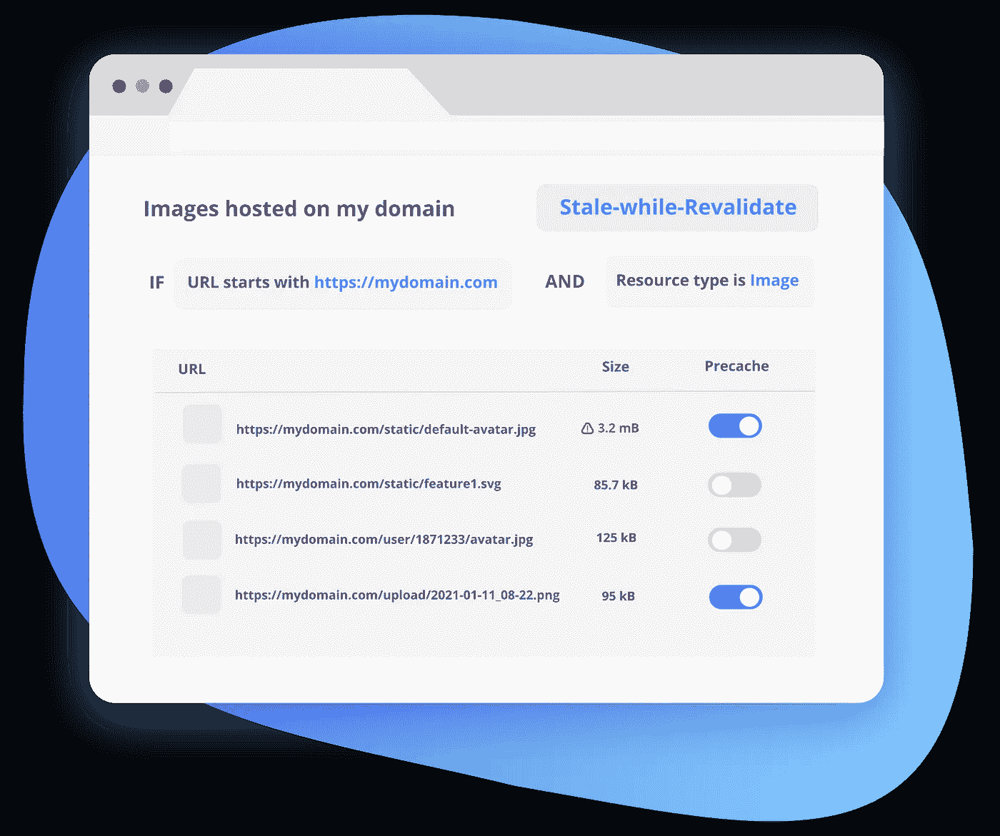
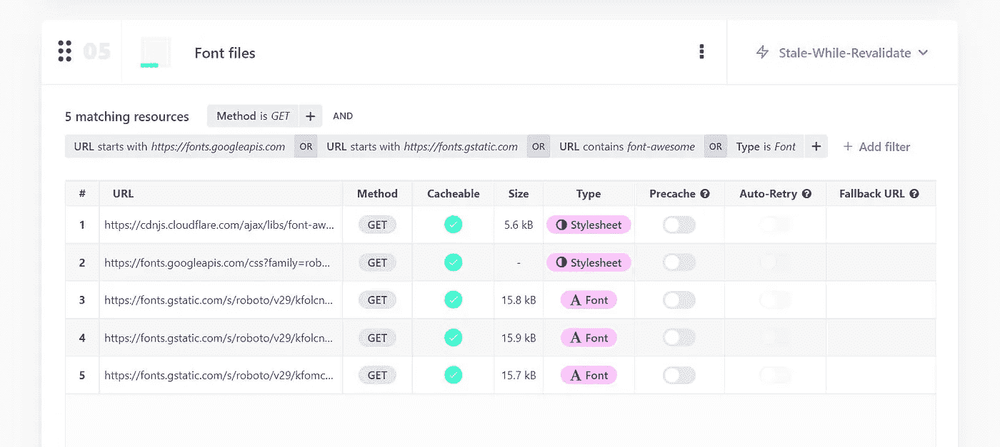
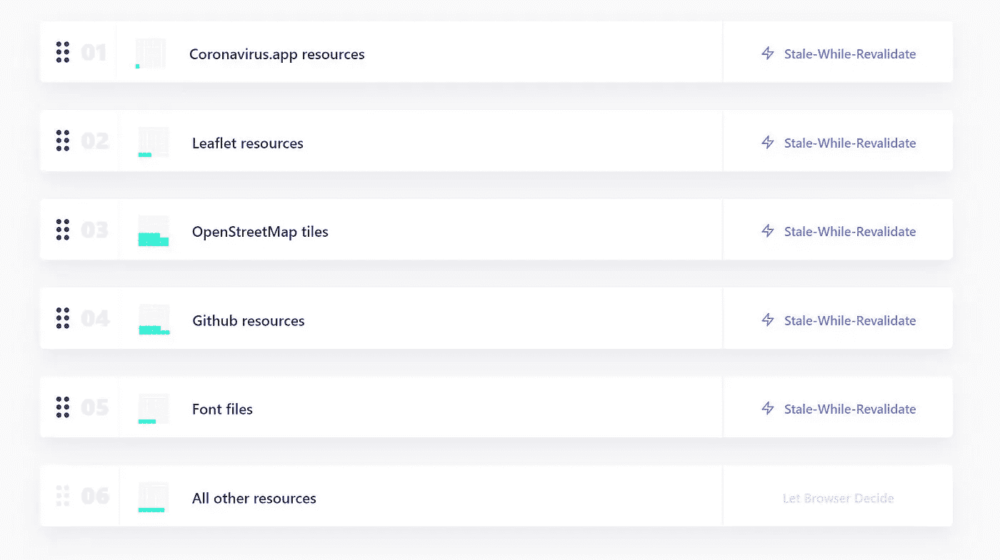

# 我构建了一个替代 Workbox 的无代码版本

> 原文：<https://javascript.plainenglish.io/i-built-a-no-code-alternative-to-workbox-27a0a484635?source=collection_archive---------4----------------------->

## 这个缓存策略生成器是我开发过的最难的产品

几天前，我们终于发布了一个令人兴奋的新 [Progressier](https://progressier.com) 功能，自从我们发布测试版以来，我们的客户一直在不懈地要求这个功能。

有了我们的[缓存策略生成器](https://progressier.com/dashboard/caching-strategies)，任何拥有 web 应用的人都可以轻松配置缓存策略——通过切换和下拉，而不是复杂的 [regex](https://en.wikipedia.org/wiki/Regular_expression) 和硬编码的[服务工人](https://developer.mozilla.org/en-US/docs/Web/API/Service_Worker_API)。

# 为什么我应该关心缓存策略？

默认情况下，浏览器倾向于通过 [HTTP 缓存](https://developer.mozilla.org/en-US/docs/Web/HTTP/Caching)机制缓存不可预测的资源。您几乎无法控制如何缓存和更新资源。

取而代之的是服务工作者中可用的[缓存接口](https://developer.mozilla.org/en-US/docs/Web/API/Cache)，您可以非常精确地定义如何获取、缓存和刷新每种类型的资源。

借助正确的策略，您可以:

1.  使您的应用程序脱机工作
2.  缩短加载时间
3.  保持关键资源新鲜，而不必使用[版本控制技巧](https://css-tricks.com/strategies-for-cache-busting-css/#query-strings)
4.  降低您的服务器成本

理论上很酷。在实践中？没那么容易。今年早些时候，谷歌几乎给每个网络应用开发者下了最后通牒:要么让你的应用离线工作，要么失去安装功能。当他们放弃这个计划时，我假设让一个网站离线工作比大多数人想象的要困难。

2021 年，大多数开发人员使用[工具箱](https://developers.google.com/web/tools/workbox)——一个 JavaScript 库，它抽象了[获取 API](https://developer.mozilla.org/en-US/docs/Web/API/Fetch_API) 和[缓存 API](https://developer.mozilla.org/en-US/docs/Web/API/Cache) 。工具箱简化了事情…但是对我来说还不够简单。测试策略是一件麻烦的事。在服务人员中对 URL 列表进行硬编码并不能完全适应未来。规则的顺序可能会导致意想不到的行为。并且编写 Regex 是一个众所周知的令人头疼的事情。

# 缓存是一个雷区

[CORS](https://developer.mozilla.org/en-US/docs/Web/HTTP/CORS) 、[预检请求](https://developer.mozilla.org/en-US/docs/Glossary/Preflight_request)、[不透明响应](https://intercom.help/progressier/en/articles/5740926-how-to-deal-with-opaque-responses-in-service-workers)、[缓存控制头](https://developer.mozilla.org/en-US/docs/Web/HTTP/Headers/Cache-Control) …这些是一些让缓存难以掌握的概念。它们是抽象的和有见解的——事实上大多数开发人员并不真正了解它们。

所以挑战是双重的。首先，如何构建一个通用的服务工作器来处理任何域和资源？第二——如何构建一个没有学习曲线的用户界面来适应这个*内在复杂的*过程？

关键是每个人处理缓存的方式都是一样的——从[工具箱网站](https://developers.google.com/web/tools/workbox)或[谷歌开发网站](https://developers.google.com/web/fundamentals/primers/service-workers)复制粘贴代码片段，然后用自己的变量交换样本值。 [Progressier](https://progressier.com/) 让您用切换和下拉来定义这些变量，而不是在您的服务人员中硬编码它们。

Specify rules, choose a strategy, see matching resources, precache URLs, auto-retry them — all in one interface with inputs and toggles instead of code

还有一些看起来不一样的东西，在我们这个时代已经不再需要了。Progressier 简化这一过程的方法之一是自动屏蔽你。缓存到期日期就是一个很好的例子。

# 缓存的现代观点

你再也不用担心保质期了。因为不再需要缓存到期日期。这是一种使缓存资源无效的过时方法——让人回想起处理缓存的唯一方法是不可预测的 [HTTP Cache](https://developer.mozilla.org/en-US/docs/Web/HTTP/Caching) 接口。

有了服务人员可用的[缓存接口](https://developer.mozilla.org/en-US/docs/Web/API/Cache)，完全没有必要在任何地方设置过期日期。你现在对事情有了更好的控制:

*   您可以通过完全不使用缓存(仅网络)来保持资源的系统性更新
*   您可以保持资源的新鲜，但是当网络不可用时(网络优先)，您可以使用缓存的版本
*   您可以首先从缓存中获取资源以减少加载时间，但是每次都要系统地重新验证它们(Stale-while-Revalidate)
*   您可以从缓存中获取资源，并且永远不会重新验证它们，以降低服务器成本(缓存优先)

# 简明英语中的缓存策略

使用 [Progressier](https://progressier.com/) ，您只需选择上面的一个策略，并选择将它应用于哪些资源。规则示例:

*   "*将网络优先应用于来自 cdn.whatever.com 的所有资源"*
*   *“首先将缓存应用于所有字体文件”*
*   *“仅将网络应用于 api.mydomain.com/very-important-data.json"*
*   *“对托管在我的域上的所有图像应用失效时重新验证”*

因为 [Progressier](https://progressier.com/) 是一个无代码工具，你用简单的英语来指定这些规则——就像我上面做的那样。这可能看起来很无聊。但是如果两年后你必须修改它们，你会很高兴不用去破译一堆正则表达式。

你也可以想象每个策略如何拦截你的资源——因为规则可能会重叠。

A visual indicator tells you how many actual resources from your app match each of these strategies.

# 以及所有其他缓存功能

缓存策略是让 web 应用离线工作的关键。要获得完整的离线体验，还必须了解一些其他机制。

以下是一些你可以在 [Progressier](https://progressier.com/) 中点击几下就可以配置你的网络应用程序自动完成的事情:

*   [离线时启动应用程序所需的预缓存资源](https://intercom.help/progressier/en/articles/5746972-how-to-precache-resources-to-make-them-available-offline)
*   [当网络连接丢失时，稍后重试失败的请求](https://intercom.help/progressier/en/articles/5741155-how-to-retry-a-post-request-later-when-offline)
*   通过[为重要资源提供后备 URL](https://intercom.help/progressier/en/articles/5732949-how-to-set-a-fallback-url-in-progressier)来建立冗余
*   覆盖阻止缓存的头(对于像 [Bubble](https://bubble.io/) 这样的无代码构建器特别有用)。
*   显示一个[离线提醒](https://intercom.help/progressier/en/articles/5750252-how-to-display-an-offline-alert)来警告用户他们已经失去了网络连接

# 简单很难

史蒂夫·乔布斯说过“*简单可能比复杂更难:你必须努力让你的思维变得清晰，才能变得简单。但最终还是值得的，因为一旦你到了那里，你就可以移山倒海了。*

构建缓存策略生成器的用户界面可能是我曾经做过的最难最简单的事情。虽然 Progressier 肯定不会移山，但它确实让任何开发人员都可以实现缓存——无论他们是编写代码还是使用无代码构建器。如果这听起来很有趣，你可以在这里免费试用。

*更多内容请看* [***说白了就是***](http://plainenglish.io/) ***。*** *报名参加我们的* [***免费每周简讯这里***](http://newsletter.plainenglish.io/) ***。***