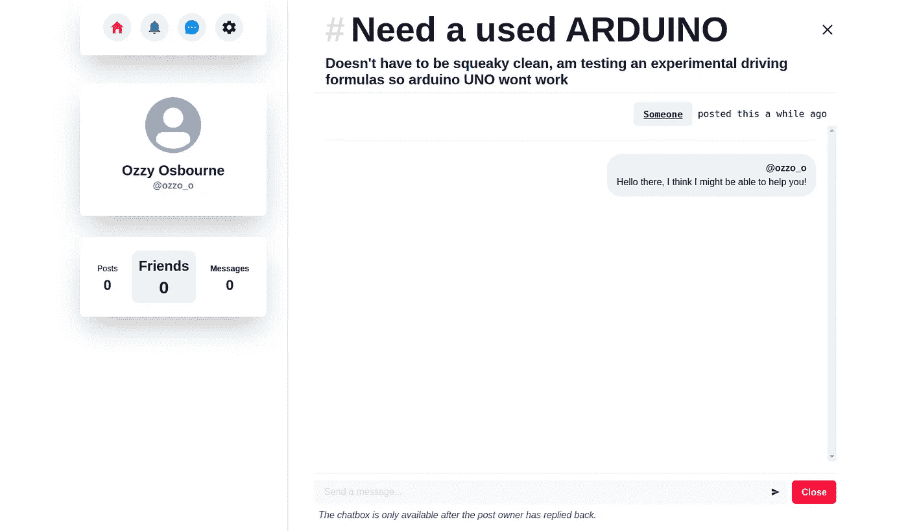

# 我建立了一个开源的社交应用，你可以通过帮助他们来交朋友

> 原文：<https://javascript.plainenglish.io/i-built-an-open-source-social-app-where-you-make-friends-by-helping-them-c6ab15afb38d?source=collection_archive---------14----------------------->

## 伸出援手👋:我在 HarperDB+Hashnode hackathon 2021 的短暂旅程

HelpingHand

通过这篇文章，我将向你介绍我的开源应用程序 **HelpingHand** 的制作和展示，并从我的角度谈谈#HarperDBHackathon 的简短旅程。

WebApp 链接:[https://helpinghand . sowmenrahman . tech](https://helpinghand.sowmenrahman.tech)

# 这个想法

> **HelpingHand** 是一款开源应用程序，它的建立只有一个目的:
> **帮助有需要的人**。

每个应用程序用户都在应用程序平台上注册，然后可以发现自己愿意帮助人们之前发布的各种帖子。如果这些人觉得帖子描述了一个他/她/他们可以解决的问题，这个人就可以联系他们。

但是有一个问题，如果你联系的是一个你从未接触过的人，你的两个身份都是保密的，除非帖子分享者发现你有用，并决定让你成为他/她/他们的朋友。这样，没有人能了解他们帮助的人，除非双方合作。

当一个用户决定与另一个用户成为朋友时，他们可以查看自己的帖子，或者是帮助寻找帖子，或者是社交帖子，并在帖子的上下文中与他们聊天。这就是帮助之手的基本含义。你可以把 HelpingHand 看作是 StackOverflow 的精简版，但是在双方都准备好被介绍之前，用户都是匿名的。

# 为什么会这样？

从小到大，我一直想帮助别人。所以我想这个项目的想法自然源于想要帮助人们的冲动，不管贡献有多小。这个想法可能不太好，但我真的很想参加黑客马拉松，这是我展示技能的黄金机会。

# 技术堆栈

1.Frontend — React.js
2。后端— HarperDB 集成 REST API，(*没有额外的服务器！* )
3。托管— Vercel
4。版本控制— GitHub

如果你看了这篇文章的标题后感到困惑，不要质疑自己，因为一开始看起来就是这样。HRN 将代表 HarperDB、React 和 Node.js

现在我很确定每个人都在堆栈中寻找“E ”,但是没有。

让我给你一点背景故事，解释一下为什么我为这次黑客马拉松跳过了服务器。虽然这次黑客马拉松持续了整整 30 天，但我从 6 月 24 日开始只用了 7 天多一点的时间就完成了这个应用。由于我在大学承受了太多的学业压力，我意识到构建后端和前端都不会在截止日期前完成。幸运的是，哈泼德布来帮忙了。

使用其出色的 SQL/NoSQL 集成 REST API，我能够构建后端，而不需要像我通常需要的 Express 或 HAPI 服务器。不要误解我，这确实不是最好的方法，但是考虑到我计划的特性，如果我想按时完成，这是唯一的方法。

# 项目特征

## 证明

用户注册为直接数据库用户，直接通信，中间没有任何服务器的干预。然而，这也意味着人们将不得不创建符合 HarperDB 提供的认证规则的用户名，并且这也使得批量读写的过程更加困难，因为一切都是在客户端完成的。我知道这不理想。

## 登录页面

Login page

## 注册页面

Signup page

## 帖子分享

用户可以在应用程序上写帖子和寻求帮助。如果人们想帮助他们解决问题，他们可以回复这些帖子。帖子可以是帮助类的，也可以是社交类的。只有您的好友才能看到社交帖子。

## 搜索

顶部的搜索栏可以用来搜索文章。用户可以搜索帖子的目标标签、标题或描述。

Searching

## 信息发送

该应用程序的核心依赖于与人聊天的能力，并针对某一类型的问题交流解决方案。用户可以相应地互相聊天，但是身份是隐藏的，直到一个人对他/她从另一个人那里得到的帮助感到满意。

## 公共帖子的用户视图

User view for public posts

## 在用户回复某人的帖子之前

Before a user responds to a person’s post

## 在用户给需要帮助的人发消息之后

After user sends message to post

之后，搜索者可以根据自己的意愿决定是否回复。

## 通知

当有人加你为好友或给你发信息时，这款应用程序还提供了小通知支持。目前，通知系统不基于 websocket 或外部 webhook 服务器，只在页面刷新时更新，但这些问题都可以随着时间的推移而缓解，更多信息请参见下面的路线图！

Notifications page

## 移动友好且响应迅速的布局

由于一些非常方便的断点挂钩和响应性布局绑定，我能够使这个网站完全移动响应。

# 项目路线图

正如你可能已经意识到的，这个项目还远未完成(事实上，它只花了一周的时间就完成了，这让我很惊讶，这都要感谢 HarperDB)。我正在概述这个项目的一些更重要的任务。然而，这些并没有按照任何特定的顺序排列，但是在所有其他事情中，我认真地把重构作为第一优先考虑的事情。这些任务是

*重构代码(很多)
*实现干净的架构(这是一个主要目标，但被缩短了)
*为其余的 reducer 启用持久性，目前只有 auth reducer 启用了持久性)
*减少客户端操作代码，在 Express.js 服务器中实现 auth 和其他 get 和 POST 操作的后端代码
*实现对向帖子添加自定义媒体的支持
*实现 websockets 和邮件支持(取决于服务器实现)
* PWA(渐进式 web-app)

## 贡献

我邀请社区在这个开源项目上合作，因为我不会在黑客马拉松之后放弃这个项目。我会尽快对用户界面和服务器进行修改。

## 挑战

使用 HarperDB 是一种非常独特的体验，因为我可以使用 SQL 和 NoSQL 语言来操作数据库。我面临的主要挑战实际上是与项目目标权重相比的时间限制，因为我开始得很晚。关于 HarperDB 我注意到的另一件事是，它不允许我运行嵌套的 SQL 查询，它总是以一些我无法解决的错误结束。然而，我设法找到了替代方案。从事这个项目让我意识到我的优势和劣势，特别是考虑到数据库建模和查询。

## 链接

*代码库:[https://github.com/sowmenappd/helping-hand](https://github.com/sowmenappd/helping-hand)
*直播网站:[https://helpinghand . sowmenrahman . tech](https://helpinghand.sowmenrahman.tech)

*更多内容请看*[***plain English . io***](http://plainenglish.io)