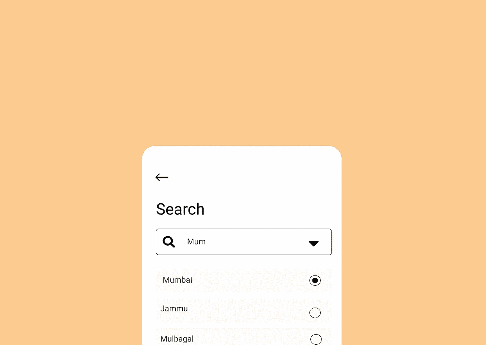
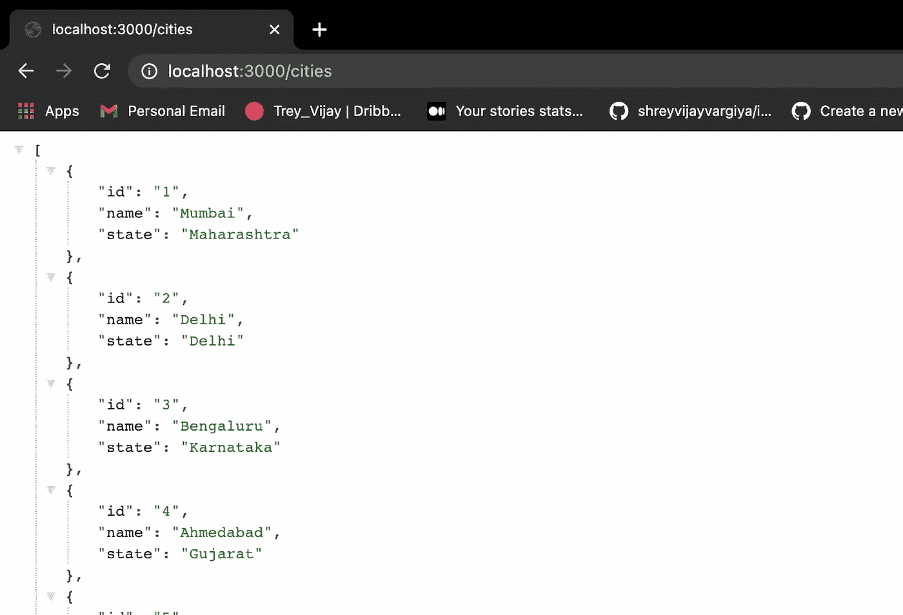
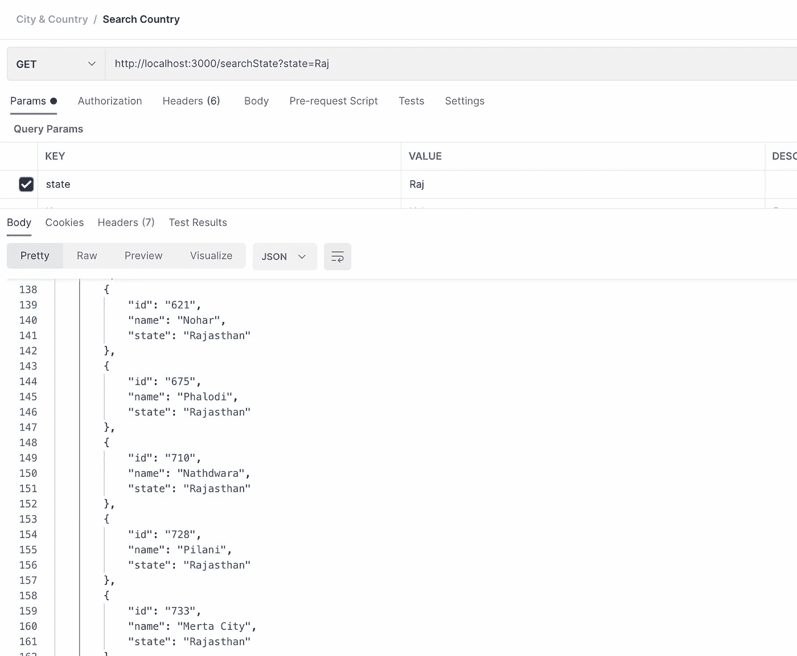
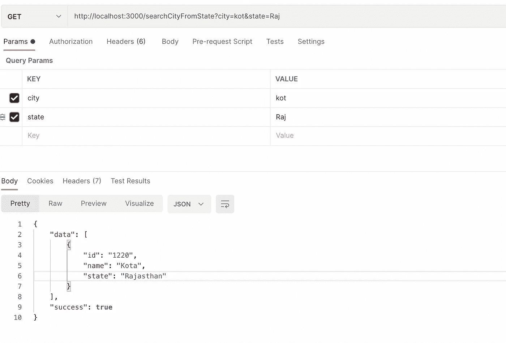

# 我如何创建自己的搜索城市和国家 API

> 原文：<https://javascript.plainenglish.io/i-create-my-own-search-city-country-api-de8891b259e?source=collection_archive---------5----------------------->

通过为选定的城市开发我们自己的搜索查询来解决现实世界的问题。

[A search creative designed by me](http://ihatereading.in)

# 在后台

我正在为用户开发一些前端表单。我们有一个下拉和搜索输入选项，用户输入他们的城市和相应的过滤功能。我们在前端使用 React 第三方库创建这样的功能时遇到了一些问题。最后，我们不得不添加一个简单的下拉菜单，并删除用户输入和过滤城市的附加功能。

# 入门指南

今天，我们将通过创建一个 API 来解决这个问题。我们的议程将是首先创建一个 API，为我的国家(印度)的所有城市提供。接下来是一个搜索 API，它将根据我传递的查询过滤城市。这是一个非常简单的方法。为了返回所有城市，我们需要所有城市的列表，下面是到我国所有城市的 JSON 数据的链接。

 [## nshntarora/印度城市-JSON

### 一个 json 文件，包含 1220 个印度城市及其各自的州- nshntarora/Indian-Cities-JSON

github.com](https://github.com/nshntarora/Indian-Cities-JSON/blob/master/cities.json) 

我相信你可以很容易地找到你们国家所有城市的 JSON 数据。一旦有了这些数据，您就有两种方法来开发 API:

*   下载城市的 JSON 文件，并将其放入代码库中。
*   使用 axios 从 URL 获取这些城市。

我将使用后者，因为这将使我开发搜索 API 变得容易。

# 编写代码

我们将使用 axios 通过上面的链接获取城市列表。一旦所有城市的获取完成，我们简单地返回这个。这个很简单。

Response of `**/cities**` endpoint

Fetching all cities from the endpoint.

# 搜索 API

为了搜索一个城市，我们创建了另一个端点`**searchCity**` **。**该端点将接受 URL 请求中的查询参数，并相应地从所有城市的数组中过滤响应或城市。

SearchCity router filtering cities on the basis of user query

路由器上的端点使用`**filter**`方法从用户传递的城市参数中过滤数据。

# 为什么？`includes`方法？

我们可以使用`===`操作符来交叉检查用户添加的参数中的城市值，但这不是一种准确的方法，一旦用户键入，它总是返回空城市，直到用户提供完整的城市名称。自己去试试。除了 includes 方法，您可以尝试使用`===`操作符。结果会不一样。

# 状态搜索 API

一旦城市搜索 API 完成，我们将创建一个端点来过滤状态，并返回具有相同状态的对象数组。

**searchState** endpoint with the state parameter

# 从州过滤城市

下一步是，一旦用户选择他/她的州并开始键入，就从相同的州中筛选城市。我们可以相应地过滤城市，因为该州已经被选中，现在我们在过滤后的州占据上风。我们只需要从一个更小的数组中搜索，而不是从整个城市数组中搜索。

**searchCity** API with state and city as parameters

这一步通过提供准确的数据使用户体验占据上风。在前端执行这个端点时，我们只需要添加 2 个 selects。第一个选择将采用用户的州，第二个选择将采用用户的城市。一旦选择了州，我们就可以简单地从单个州获取城市。

# 结论

如果你想为你的国家创建这个 API，那么你只需要找到你的特定国家的城市列表，你就可以去了。您可以使用此[链接](https://rapidapi.com/wirefreethought/api/geodb-cities)查找特定国家/地区的城市 API。

代码存储库:

 [## shreyvijayvargiya/ihateredingglogs

### 100 天代码质询存储库。。通过创建一个……

github.com](https://github.com/shreyvijayvargiya/iHateReadingLogs/tree/main/TechLogsBackend/CreatingCity%26StateApi) 

如果你每天都想学习技术，请随时跟我来。直到下次。各位，祝大家有愉快的一天！

*更内容于* [*通俗地说就是*](http://plainenglish.io/)