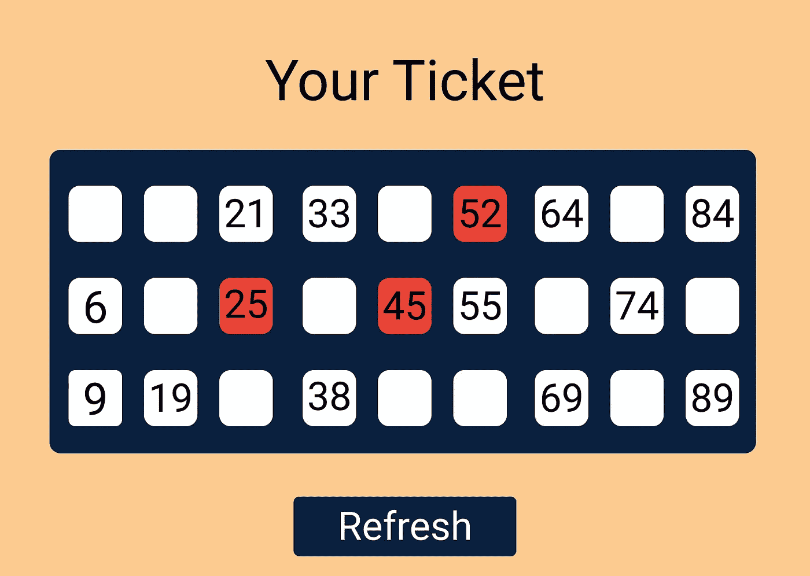
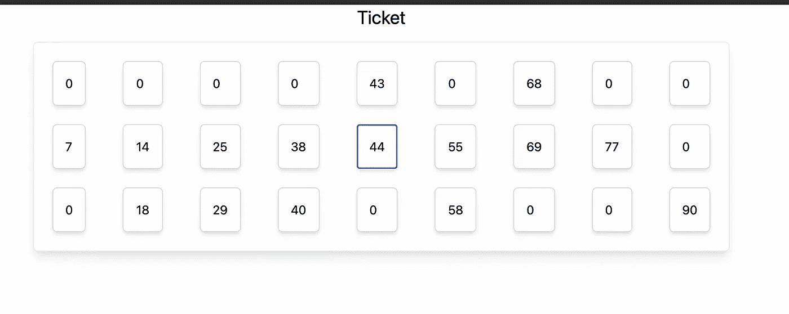

# 我如何用 JavaScript 创建自己的彩票

> 原文：<https://javascript.plainenglish.io/i-create-my-own-tombola-ticket-aea085887de4?source=collection_archive---------16----------------------->

使用 JavaScript 编写彩票算法。



Tombola ticket UI creative

# 在后台

在疫情时期，博彩业非常繁荣。下班后，我在移动设备上玩了很多游戏。我们在 Zoom call 上玩了一个 tombola 游戏，相当有趣。所以游戏是这样的——我们有实体彩票，通过 Zoom call，我们有一个组织者组织游戏，其余的都是玩家。

我们面临的唯一问题是偶尔的网络问题和人们通过麦克风说得太多。这妨碍了我享受比赛。就在那时，我想到了解决这个问题的办法。一种方法是我自己创建一个彩票游戏，并让用户可以玩。

# 入门指南

今天，我们将从一张非常基本的彩票开始。以下是每次生成新票证时的一些规则-

*   **规则#1** —一张票应该有 3 行 9 列。
*   **规则 2-** 每一列都应该有一个数字范围，比如第一列 1-10，第二列 11-20。
*   **规则 3-** 在特定的列中，数字必须按升序排列。
*   规则#4- 数字应该在 1-99 之间，包括 1 和 99。
*   **规则#5-** 每行不能超过 5 个数字。

# 编写代码

第一个任务是创建一个票数组。该数组应该是 3 行 9 列的三维数组。该数组的总大小为 27，我们将在该数组的每一列中按升序只填充 15 个数字。

为了填满 15 个数字，并且每行只有 5 个数字，我应用了基础数学和一些排列组合。

# **智能计算**

我们有 9 列和 15 个数字。为了用至少一个和最多两个数字填充每一列，我们只需要 6 列各有两个数字，其余 3 列各有一个数字。

```
– 6 columns * 2 number each = 12 numbers
– 3columns * 1number each = 3 numbers– Total = 15 numbers with at least one number in each column.
```

# 获得只有一个数字的 3 列

然后，我开始填充只有一个数字的列。同样，只有一个数字的列是随机的，所以我们需要 9 列中的 3 个随机列，它们只有一个数字。

为了选择 3 列，我创建了一个从 0 到 9 的所有列的随机数组，并使用 Lodash 的 shuffle 方法对它们进行洗牌，然后数组的前 3 个元素将是我的 3 个随机列。

```
let columns = [0, 1, 2, 3, 4, 5, 6, 7, 8];
const newColumns = shuffle(columns);3 columns with only single numbers are:newColumns[0], newColumns[1] & newColumns[2]
```

# 在票证对象中仅用一个数字填充 3 列

我的票对象是一个 3 行 9 列的 2D 数组。要填充列中的单个数字，我只需要列号、票证对象和该数字的确切位置。

为了在单个列中找到一个数字，我们再次需要将该范围内的所有数字放入一个数组中，并对数组进行洗牌，将数组的第一个元素声明为该特定列的单个数字。

```
import { shuffle } from 'lodash';// assuming our column no is 3
so number will ranges from 30-40 
so const nums = [ 31, 32, 33, 34, 35, 36, 37, 38, 39, 40];shuffle(nums);Then nums[0] will be our single number from column 3
```

为了找到数字的确切位置，我遵循了在范围内划分数字的基本概念，在一列中找到确切的行。

例如，我们有第 3 列。那么第 3 列的数字范围将从 30 到 40。所以，如果我们有一个数字 33，那么它应该放在票证对象的第一行和第三列，或者如果我们有一个数字 38，那么它应该放在票证对象的第三行和第三列。

一旦我们得到 30-40 之间的随机数，我们只需要选择行，选择行背后的概念也只是基本的数学。

号码将在:

*   **第 1 行**从`**(30–34]**`开始(含 34)。
*   **第 2 行**从`**(34–37]**`开始(含 37)。
*   **第 3 行**当其范围从`**(37–40]**`(包括 40)时。

一旦我们在一列中找到了我们号码的确切行，我们只需要把我们的号码推到票证对象中的那个位置。

我写了一个函数，用上面的逻辑在一列中找到一个数字的行。

Finding row of a single number in a single column

# 用 2 个数字填充列

嗯，这部分也很简单。我们需要一列中的 2 个数字范围，然后我们需要确定每个数字的位置，即每个数字在一列中的行。最后一步是对 6 列重复这个过程，每列有 2 个数字。因此，我们最终将在 6 列中填写 2 个数字。

要确定单个列范围内的数字，我们将使用与填充时相同的算法，为一个列获取一个数字。

例如，我们的第 3 列现在将有 2 个范围从 30 到 40 的数字。我们将随机抽取其中 30–40 个数字的数组，随机抽取的数组的前 2 个元素将是该特定列的 2 个数字。

```
import {shuffle} from 'lodash';const nums = [31, 32, 33, 34, 35, 36, 37, 38, 39, 40];shuffle(nums);nums[0] & nums[1] will be our 2 number from column 3
```

**求出一列中 2 个数字的精确位置。** 一旦我们得到了 2 个数字，我们只需要知道 2 个数字的确切位置。为了找到这些数字，我遵循了比较的概念。

我们将首先得到由 3 列组成的单个列的 2 个随机行，然后使用最后的**规则#3，**我们将找到我们的 2 个数字的精确行。然后把这两个数字放在正确的位置。

例如，对于第 3 列，我们有 2 个范围在 30–40 之间的数字。假设我们这里的 2 是 33，37。然后，我们决定将这些数字按降序排列。

为了从 3 行中得到 2 个随机行，我们将再次对行数组进行洗牌，前 2 个元素将是这 2 个数字的 3 行。

```
const rows = [0, 1, 2];
shuffle(rows);const row1 = rows[0], const row2= rows[1] 
row1 & row2 are 2 rows in a column number 3
```

最后，一列有 2 个数字和 2 行，我们只需要将它们按升序排列。数字越大，取的行就越深或越大。一个非常简单的方法，在一列中按升序排列我们的数字。

Filling 2 numbers in 2 rows for a single column

# 显示票证用户界面

我们的票证对象现在已经生成。最后一步是在 UI 上以实际票据的形式显示票据。我使用 Next.js 存储库和 Tailwind CSS 进行样式设计。我已经使用 flex 属性创建了一个 UI，它与我们的票证曾经拥有的 UI 完全相同。最后一步是在数组的空白处加零，否则你将无法创建一个 9 X 3 大小的标签。

到目前为止，我只是简单地创建了一个函数来用零填充数组中那些未定义的位置。你可以用其他任何东西来补偿 undefined。

Replacing undefined or empty with zero

# 最终产品

这是我最后的票的样子。



Final ticket on the localhost

# 结论

您可以为票证扩展更多功能。您甚至可以添加游戏奖品，如角落，第一行，和完整的房子，只需让用户点击每一个数字，并取消它们，一旦他们要求的价格，交叉检查这些数字从公布的数字。这不是很难，我们只需要在引擎盖下应用一些纯数学逻辑。

我正在添加代码库以供进一步参考，在未来，我将推出这个游戏供观众玩。

[](https://github.com/shreyvijayvargiya/iHateReadingLogs/tree/main/TechLogs/TombolaTicket) [## shreyvijayvargiya/iHateReadingLogs

### 100 天代码挑战库。。为 shreyvijayvargiya/iHateReadingLogs 的发展作出贡献

github.com](https://github.com/shreyvijayvargiya/iHateReadingLogs/tree/main/TechLogs/TombolaTicket) 

下次见！祝大家愉快。

*更多内容尽在*[*plain English . io*](http://plainenglish.io/)