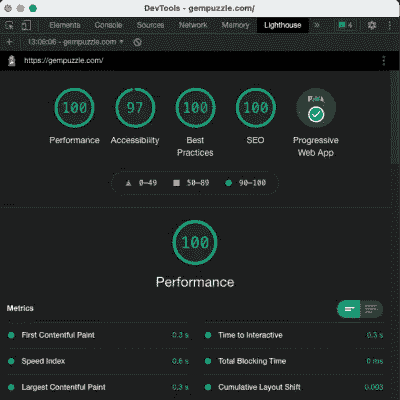
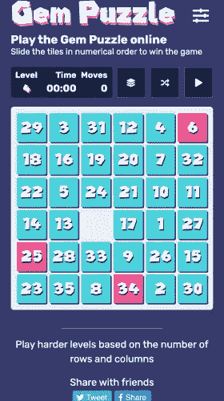

# 我在 Next.js 中创建了一个 PWA 游戏，这是我从这个过程中学到的

> 原文：<https://javascript.plainenglish.io/i-created-a-pwa-game-in-next-js-and-this-is-what-i-learned-from-the-process-62b68e8bba?source=collection_archive---------9----------------------->

Photo by [Jonathan Kemper](https://unsplash.com/@jupp?utm_source=medium&utm_medium=referral) on [Unsplash](https://unsplash.com?utm_source=medium&utm_medium=referral)

我住在澳大利亚的悉尼，在我写这篇文章的时候，我们刚刚走出由于新冠肺炎的 Delta 变体而导致的长期封锁。

几周前，我意识到我们将在家里呆很长时间。所以我决定把多余的时间花在家里做点别的事情，而不是沉迷于网飞。

我决定重新启动一个老项目，把它变成一个功能齐全的产品，当人们问我:“这段时间你做了什么？”的时候，我可以回顾并为之自豪

# 灵感

几年前，我向澳大利亚一家非常有名的公司申请 JavaScript 工程师的工作。按照惯例，他们会给你一个展示技能的编码挑战。

这一次的挑战是使用您选择的 JavaScript 库重现经典的十五人游戏。我决定用普通的 JavaScript 编写代码，通过实现一个 [MVC](https://en.wikipedia.org/wiki/Model–view–controller) 架构而不使用 [React](https://reactjs.org) 来打动他们。我错了。

他们希望我使用 React，当然，这是我的工作。不仅如此，我收到了对状态管理和动画的严厉批评，实际上是演示中缺少动画。

以下是原始源代码的链接:

 [## GitHub-andresdhn/puzzle-15:15 puzzle 是一个滑动拼图，由一帧编号的…

### 15 拼图是一种滑动拼图，由一帧随机排列的编号方块拼图组成，其中一个拼图缺失…

github.com](https://github.com/andresdhn/puzzle-15) 

演示页面:

 [## @andresdhn 的 15 个难题

### 编辑描述

andresdhn.github.io](https://andresdhn.github.io/puzzle-15/) 

你看，我当时做的是全职工作，我的“自由”时间被限制在下班后，所以我没有太在意细节。最终，我没有得到这份工作，我也学会了不要过多考虑项目的要求。尽管如此，我认为结果还不错？—让我知道你的想法。

快进到几个星期前，我决定接受那次失败，那次失败一直在我的脑海里，用给我的一点额外时间把它变成一次成功。

但是，在创建生产就绪的应用程序时，会面临许多挑战。因此，我决定分享我克服这些挑战的经验，并帮助任何经历相同过程的人。

# 挑战

**产品:**想出一个产品创意并不容易。我必须确切地知道它是什么，它会做什么。

在我的情况下，我需要把旧项目转化成原创的、吸引人的、高质量的、有价值的，特别是属于我的东西。我愿意相信我做到了。如果你玩这个游戏，请让我知道。

**技术栈:**这需要一点思考，但我知道我会从一开始就使用 React。我已经和这个库一起工作了足够长的时间，让它唱歌，但我也知道我将在多个层次上管理状态，React 正是合适的工具。

这个游戏需要是一个[渐进式网络应用](https://developer.mozilla.org/en-US/docs/Web/Progressive_web_apps) (PWA)。在我看来，使用服务人员来允许下载和离线游戏给了游戏很好的用户体验。

如果您正在考虑创建自己的渐进式 Web 应用程序，您将会偶然发现 PWABuilder。这个工具对我帮助很大，让服务人员变得更健康。

 [## PWABuilder

### 构建和部署渐进式 Web 应用程序所需的所有工具。

www.pwabuilder.com](https://www.pwabuilder.com) 

因为[gempuzzle.com](https://gempuzzle.com)是一款免费的网络游戏， [SEO](https://en.wikipedia.org/wiki/Search_engine_optimization) 是游戏成功的关键部分。因此，它不能仅仅是一个[单页应用](https://en.wikipedia.org/wiki/Single-page_application) (SPA)，它需要或者是[服务器端呈现的](https://www.educative.io/edpresso/what-is-server-side-rendering) (SSR)或者是[静态生成的站点](https://www.cloudflare.com/en-au/learning/performance/static-site-generator/) (SGS)以获得最佳的搜索结果。

我选择使用混合 SSG 和 SSR 架构的 Next.js。这让我在不牺牲性能的情况下获得了两全其美。这也为将来的版本和新特性打下了良好的基础。我很高兴我同意了。

你需要计划一个好的搜索引擎优化策略。看，搜索引擎爬虫不会阅读你所有的 JavaScript。而如果爬不出来，就不存在。有一些规则需要遵守，这段视频在这方面给了我很大帮助:

动画:每个从事 JavaScript 工作的人，尤其是 React，都知道组件在每次状态改变时都会呈现。React 在[虚拟 DOM](https://reactjs.org/docs/faq-internals.html) 中利用它们创建平滑的不易察觉的变化。

当您需要动画显示刚插入 DOM 的对象的位置时，问题就来了。解决方案:**翻转** **手法**。

我不会在这里解释它是如何工作的，那将是一篇全新的文章，但是请查看这个[链接](https://css-tricks.com/everything-you-need-to-know-about-flip-animations-in-react/)来阅读更多关于它的内容。

**优化:**这可能是创建一个在线产品更耗时的方面。

我用[谷歌 Chrome 的 Lighthouse](https://developers.google.com/web/tools/lighthouse) 来测试和评估这个页面。然后我通读了他们所有的建议，使它在各方面的得分接近 100 分。

这并不容易，它改变了我最初的一些想法，但在这样做的过程中，应用程序得到了巨大的改进。这绝对值得花时间。

Screenshot taken and edited by the Author

# 游戏

游戏的本质本身就是一种挑战。任何一个谜题关卡都有百分之五十的拼图配置是不可解的。这是因为一个数学问题，如 *Jhonson &故事*[*【15】谜题注释 1879*](https://en.wikipedia.org/wiki/American_Journal_of_Mathematics) 所示。

对于用户来说，没有什么比花大量时间在一个无法解决的 10x10 的难题上更令人沮丧的了。这个游戏在网络上的所有其他版本都忽略了这个问题。

我必须想出一个过程来检查游戏在每一次重现时的可解性，我做到了，而且它以一种惊人的表现方式做到了。

游戏在[gempuzzle.com](https://gempuzzle.com)上的每一个配置都是 100%可解的。而且，完成它是非常令人满意的。做吧，你会看到的。😉

# 今后

如前所述，我已经在考虑游戏的新功能了。它们将涉及一些 API 集成，推送通知，更多的共享选项，也许还有一些额外的内容。

# 结论

我非常高兴我花时间完成了这个想法；把痛苦的经历变成快乐的过程，证明给自己足够的时间我能做什么。

这需要很多的奉献和承诺，我对目前的结果很满意。我敢打赌，公司现在想再次与我联系，但就目前而言，我只是高兴地回到外面。

我希望每个人都喜欢这个游戏。如果你喜欢这篇文章，请给我留言。

干杯，注意安全。

*更多内容看*[***plain English . io***](http://plainenglish.io/)