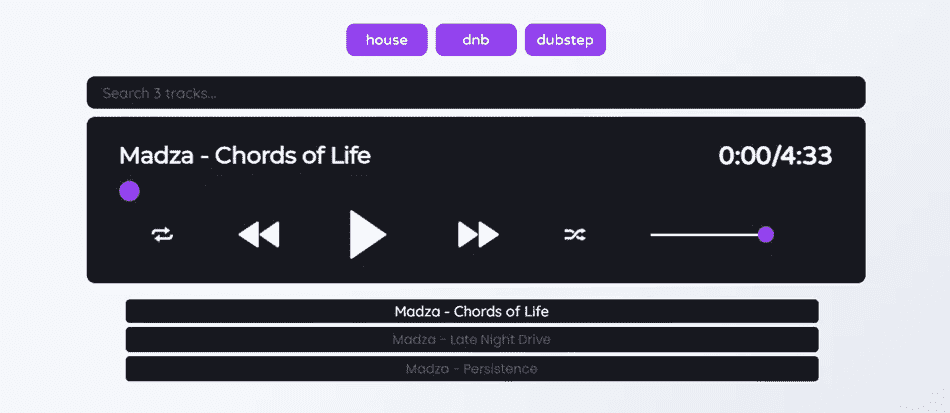
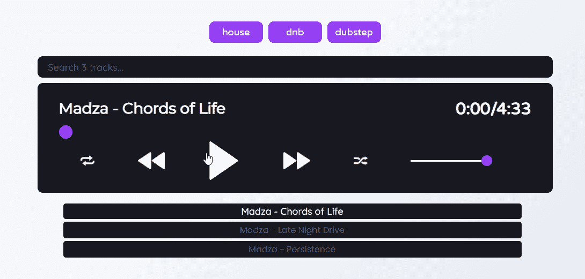

# 我创造了一个开源音乐播放器🎵🎶

> 原文：<https://javascript.plainenglish.io/i-created-an-open-source-music-player-751070107a49?source=collection_archive---------14----------------------->



几天前我在[发了一篇](https://dev.to/madza/hooray-i-created-my-first-portfolio-36li)关于我如何创建 [madza.dev](https://madza.dev) 的帖子。最激动人心的部分之一是为[音乐部分](https://madza.dev/music)创建一个音频播放器。

我已经收到了一些关于它的 PMs，所以我决定详细说明一下。

作为一名[音乐制作人](https://soundcloud.com/999madza)，我开始把它作为一个组件来播放自己的曲目。尽管如此，我做得越多，我就越知道我应该把它变成一个社区也能从中受益的东西。

所以我用它做了一个开源包。一个你可以安装，设置曲目来源，并自定义外观。



链接:💻[演示](https://audioplayer.madza.dev/)📦 [NPM 套餐](https://www.npmjs.com/package/@madzadev/audio-player)💿[GitHub source](https://github.com/madzadev/audio-player)

## 特征

1.  播放/暂停
2.  下一个/上一个
3.  重复/循环
4.  进度滑块
5.  剩余时间/总计
6.  音量滑块
7.  搜索音轨
8.  按流派过滤
9.  播放列表项目

## 安装

```
npm install @madzadev/audio-player
```

## 使用

```
import Player from "@madzadev/audio-player";
import "@madzadev/audio-player/dist/index.css";const tracks = [
  {
    url: "https://audioplayer.madza.dev/Madza-Chords_of_Life.mp3",
    title: "Madza - Chords of Life",
    tags: ["house"],
  },
  {
    url: "https://audioplayer.madza.dev/Madza-Late_Night_Drive.mp3",
    title: "Madza - Late Night Drive",
    tags: ["dnb"],
  },
  {
    url: "https://audioplayer.madza.dev/Madza-Persistence.mp3",
    title: "Madza - Persistence",
    tags: ["dubstep"],
  },
];<Player trackList={tracks}>
```

`trackList`是强制属性，需要传入一个由带有`url`、`title`和`tags`键的对象组成的数组。

## 选择

显示可用选项属性的默认值。

```
<Player
  trackList={tracks}
  includeTags={true}
  includeSearch={true}
  showPlaylist={true}
  autoPlayNextTrack={true}
/>
```

## 配色方案

您可以通过编辑下面的颜色变量来进一步自定义播放器 UI。预定义的配色方案是未来的计划。

```
const colors = `html {
          --tagsBackground: #9440f3;
          --tagsText: #ffffff;
          --tagsBackgroundHoverActive: #2cc0a0;
          --tagsTextHoverActive: #ffffff;
          --searchBackground: #18191f;
          --searchText: #ffffff;
          --searchPlaceHolder: #575a77;
          --playerBackground: #18191f;
          --titleColor: #ffffff; 
          --timeColor: #ffffff;
          --progressSlider: #9440f3;
          --progressUsed: #ffffff;
          --progressLeft: #151616;
          --volumeSlider: #9440f3;
          --volumeUsed: #ffffff;
          --volumeLeft:  #151616;
          --playlistBackground: #18191f;
          --playlistText: #575a77;
          --playlistBackgroundHoverActive:  #18191f;
          --playlistTextHoverActive: #ffffff;
      }`;<Player trackList={tracks} customColorScheme={colors} />
```

## 最终注释

建议使用像 [Contentful](https://www.contentful.com) 或 [DatoCMS](https://www.datocms.com/) 这样的 CMS 来管理您的音频文件，并通过 API 访问它们。

该项目是开源的，任何功能请求或问题都欢迎在 [Github repo](https://github.com/madzadev/audio-player) 中提出。看一看，如果你喜欢，给它一个⭐奖。

写作一直是我的激情所在，帮助和激励他人给我带来了快乐。如果您有任何问题，请随时联系我们！

在 [Twitter](https://twitter.com/madzadev) 、 [LinkedIn](https://www.linkedin.com/in/madzadev/) 和 [GitHub](https://github.com/madzadev) 上给我接通！访问我的[博客](https://madza.dev/blog)获取更多文章。