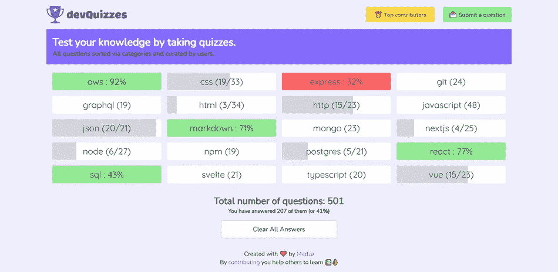
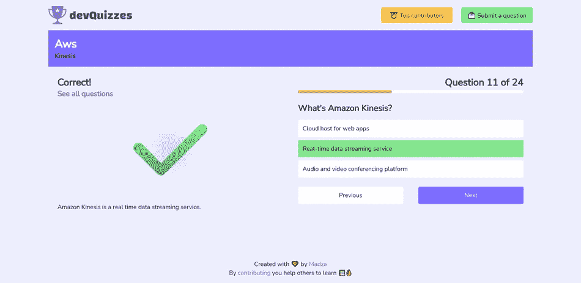
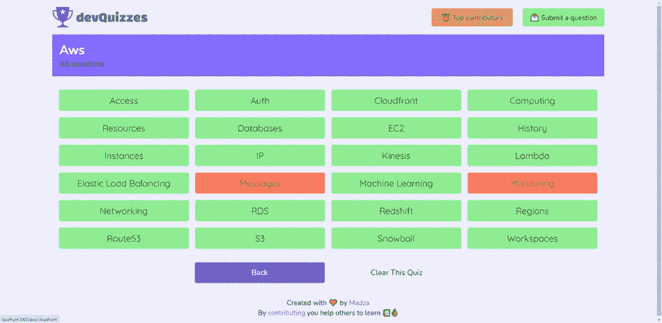
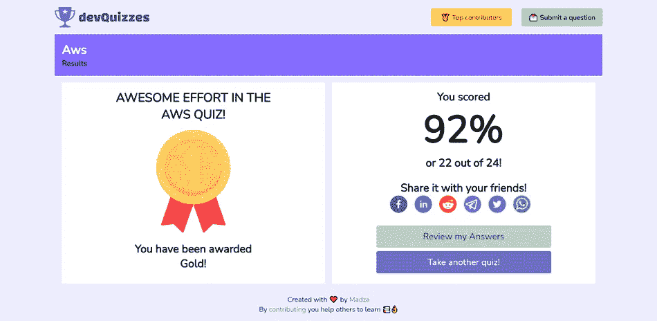

# 我收集了 500 多个开发问题，并推出了一个问答平台

> 原文：<https://javascript.plainenglish.io/i-gathered-500-dev-questions-and-launched-a-quiz-platform-cd2caec6e68a?source=collection_archive---------7----------------------->

公司通常想测试某个特定领域的知识。小测验是一种测试你在某一特定领域的专业知识的吸引人的方法。

这就是我创建[DEV quikes](https://quizzes.madza.dev)的原因，这是一个在线平台，你可以在这里测试你在各种开发主题上的知识。

## 内容

在过去的 6 个月里，我阅读了大量的官方文档，研究了几十个教程，为最初的发布创建了内容基础。

我最终在 20 个类别中创建了 500 多个问题。

括号中的数字表示每个测验中的问题。灰色代表正在进行的测验，而白色代表所有新的测验。

只显示已完成测验的百分比，绿色和红色分别代表通过和未通过的测验。

## 恶作剧

当选择一个类别时，用户会得到一个测验。默认情况下，首先显示未回答的问题。

每个问题通常会提供 2 到 4 个可能的答案。作为参考，每个问题都有一个主题/标题。

只有回答了当前问题，下一个问题才可用。前面的问题有一点就有。

当提供提示时，用户可以单击提示按钮。这样，关于问题的附加信息将被显示。

有些问题确实提供了问题所基于的代码。

## 进步

所有进度都存储在本地存储器中。

用户还可以清除本地存储，同时清除所有测验或单独清除任何特定测验。

在测验过程中的任何时候，用户都可以访问问题列表，这意味着可以手动选择问题或稍后查看。

## 奖励

完成测验后，用户将获得金牌(> 90%)、银牌(> 75%)、铜牌(> 60%)。

如果用户得分在 60%到 40%之间，则测试通过，但不会给予奖励。40%以下的成绩全部不及格。

用户可以选择在社交媒体上分享他们的成就。

## 贡献

欢迎大家通过[表格](https://airtable.com/shrB1hZYi32q9AxYM)提交问题。

问题将被接受，除非他们重复现有的内容。该数据库将每天更新。

每个贡献者都会获得积分，并被列入顶部的最近和/或最活跃的贡献者列表中。

## 最终注释

这个项目是[直播](https://quizzes.madza.dev)，有空你试试。测验平台响应迅速，这意味着它可以在桌面和移动设备上轻松进行。

我希望这个项目能帮助社区。我还期待着在未来为平台本身添加问题和功能。

如果您有任何问题，请随时联系我们！

在 [Twitter](https://twitter.com/madzadev) 、 [LinkedIn](https://www.linkedin.com/in/madzadev/) 和 [GitHub](https://github.com/madzadev) 上给我接通！

*更多内容请看*[*plain English . io*](http://plainenglish.io/)