# 我指示 GitHub Copilot 在 React 中编写一个 Instagram 个人资料。事情是这样的。

> 原文：<https://javascript.plainenglish.io/i-instructed-github-copilot-to-code-instagram-profile-feed-infinite-scroll-in-react-this-is-a863e7ce3a0d?source=collection_archive---------0----------------------->

# 怎么开始的

一个月前我拿到了 GitHub Copilot，我已经对 Copilot 在几秒钟内解决 Leetcode 问题感到惊讶了。事实上，它是在数十亿行公共代码上训练出来的，这很有趣。👀

*是的，这一切都很酷，但它能解决我作为前端工程师面临的日常问题吗？*

**所以我开着它兜了一圈！**

## 我的初始设置

我准备了一个 Next.js(如果你不知道的话，也叫 React)脚手架，我在面试的时候用过。所以我开始设置。 [Github 链接此处](https://github.com/ayush013/ig-clone-copilot)

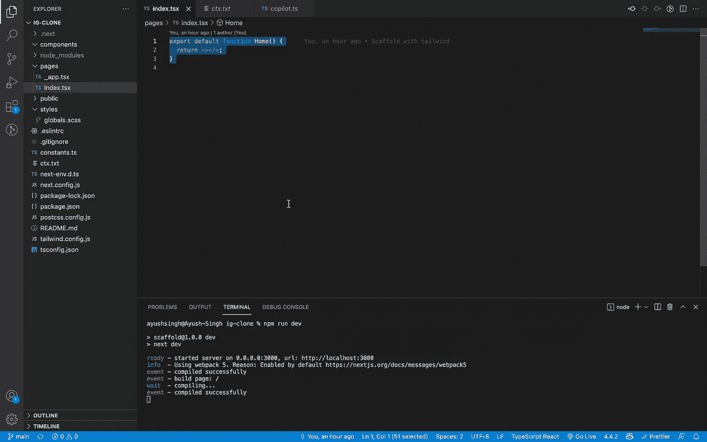

Initial setup

## 最终目标

我期望最终得到这样的用户界面:

[Mockup by Ashey on Figma community](https://www.figma.com/community/file/878318142103232907)

*   每行堆叠 3 个图像
*   当我点击视窗底部时，能够加载更多的图像(从分页的 API)
*   使用 useState 挂钩维护状态(加载的图像)

# 这就是它如何进入的

## 1.预热—瓷砖组件

我开始编写注释来创建一个简单的 Tile 组件。

*   磁贴以网址为道具
*   使用 URL 呈现图像
*   有一些基本样式的类

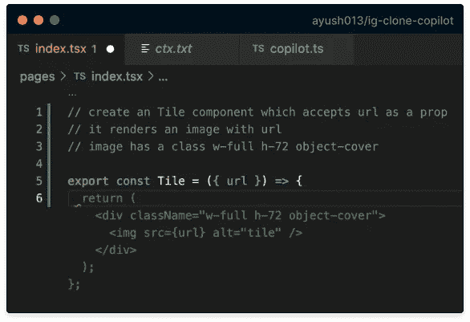

Result as per the context — Not a bad start, I’d say

太棒了。乍一看，我觉得很准确。我一意孤行。CSS 类被添加到 div 中，而不是图像中，这是我手动修改的。还为将来在 div 上增加了一个 CSS grid tailwind 类。

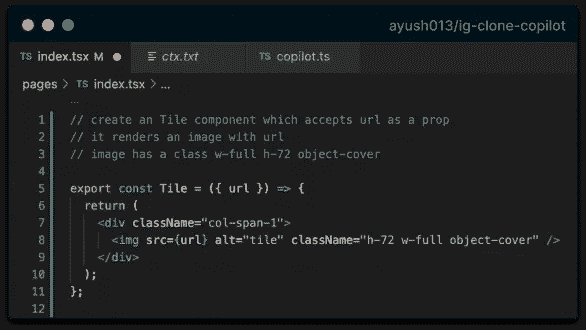

With minor tweaks to CSS

## 2.饲料成分

在这一点上，我有点创意😝。指示副驾驶执行以下操作:

*   创建一个看起来像 Instagram feed 的组件🤣
*   它接受图像列表作为道具
*   它呈现一个瓷砖组件列表
*   每个图块组件都有一个 URL 属性

顺便说一句，副驾驶也很好心地预测了这些评论😉

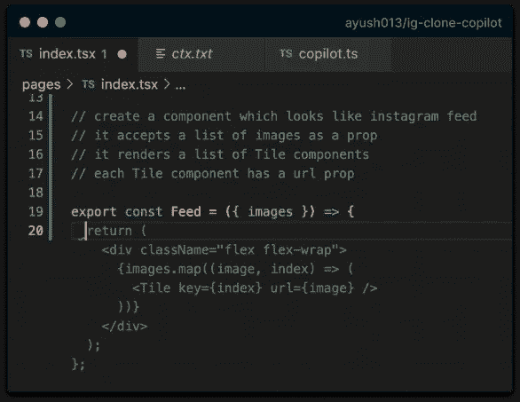

After 2 seconds of processing

似乎我期望太多了😅。它肯定没有为 3 列拆分布局添加正确的 CSS 类。但是请注意它是如何循环遍历以数组形式传入的图像，并按照我们的预期正确呈现我们的 Tile 组件的。

在对 CSS 类做了一些小的调整后，我接受了这个解决方案:

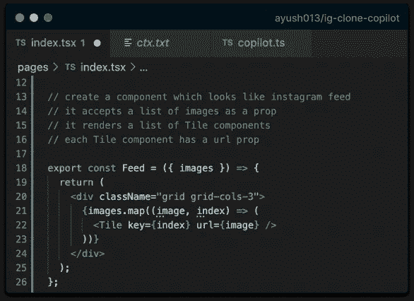

Feed component

## 3.最终组件！

猜猜，这就是你来这里的原因！它能预测无限滚动的逻辑吗？它能准确地从分页的 API 中获取数据吗？

让我们来了解一下！这次提供了以下背景:

*   创建一个无限滚动的主组件
*   它从 API_URL 获取图像并将它们存储在 state 中
*   它用图像呈现一个提要组件

这时，它开始预测接下来的评论，这是它想出的:

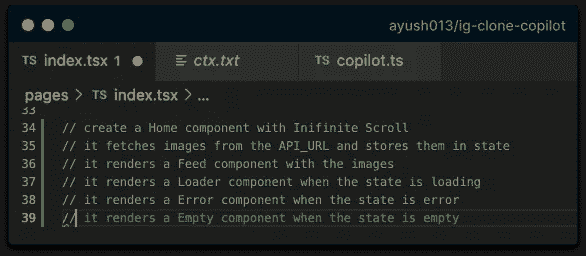

The context for Home Component

三…二…一…我们走吧！

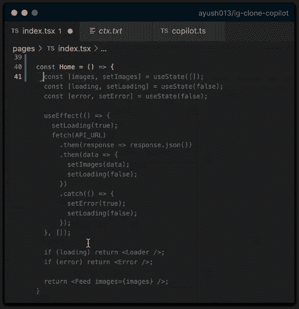

Produced output

我印象深刻！它肯定没有生成无限滚动的逻辑，但是其他的东西，比如图像的 useState 和 API 调用的 useEffect，乍看起来都很可靠。所以我接受了这个结果(有一些我稍后会讨论的警告)。

此时，我保存了文件以检查输出，我还删除了 Loading & Error 组件，并做了一个小的特定于 API 的调整。

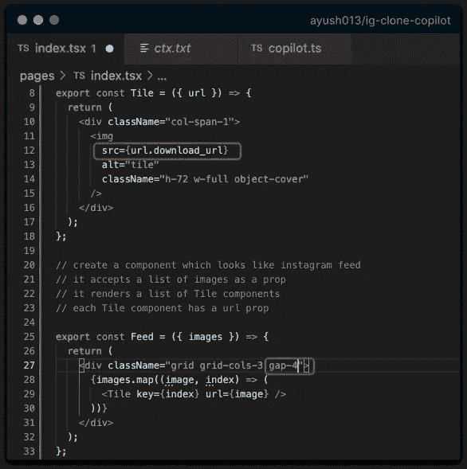

Minor tweak for API and styling

它呈现的图像有点像我们想要的。只有页码和无限卷轴不见了。

Produced output

在修复问题的另一次尝试中，给出了以下提示:

*   增加了一个观察 ref 的按钮
*   在上下文中专门编写了 IntersectionObserver API
*   在状态中添加了页面，以提示分页

Produced output

它最终按照我们想要的方式进行了分页处理，请注意第 59 行，它是如何在后续的 API 调用中尝试处理与之前数据集的连接的。但我们还没到那一步！

对以下上下文的最后尝试(它也尝试预测):

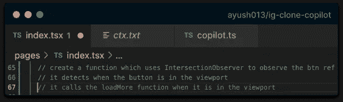

*   创建一个使用 IntersectionObserver 来观察 btn ref 的函数
*   它检测按钮何时在视口中
*   当它在视口中时，它调用 loadMore 函数

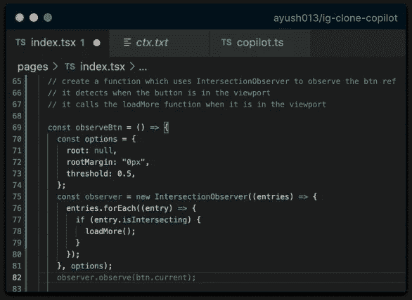

是的，这就是我们拼图中缺失的那块。当按钮在视区中可见时，观察按钮以启动下一个 API 调用的方法。

让它运行起来的一些最后的调整:

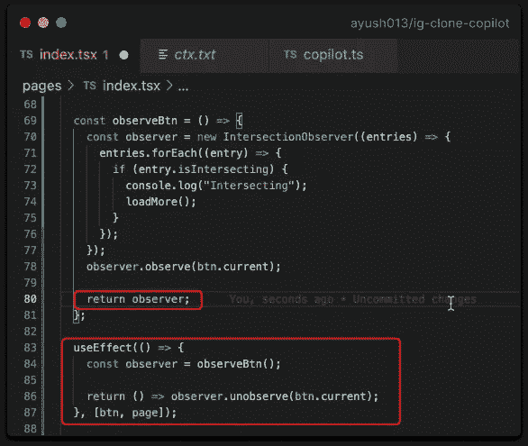

添加了一个 useEffect(也是 Copilot 预测的)来调用生成的函数，将 btn 和 page 作为副作用传入依赖数组。手动添加了一个清除以在组件卸载时不被观察到。

## 最终结果

End result

全程录像-

事实上，我们可以免费得到所有这些东西，这是令人惊讶的。现在还没有，但是在不断进步。处理平凡的任务是非常有用的，这样我们作为开发人员可以花更多的时间做高质量的工作。迫不及待地想在日常工作中使用它😜。如果它接管了我们的工作呢？请在评论中告诉我你的想法！

另外，它能使一个 div 居中吗？是的！

*更多内容尽在*[***plain English . io***](http://plainenglish.io)