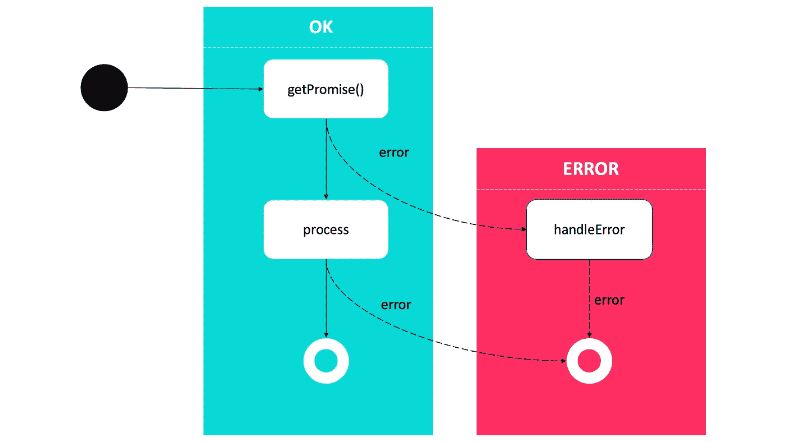

# 我查看了 1000 多个 JavaScript 项目，发现了以下错误

> 原文：<https://javascript.plainenglish.io/i-looked-at-over-1000-javascript-projects-and-found-the-following-errors-1ada93afd1af?source=collection_archive---------1----------------------->

## 1000 多个项目中 JavaScript 的异步常见错误

错误教会我们什么是行不通的，并鼓励我们创造新的思维和行为方式。



Diagram of the promise chain

使用 JavaScript 需要掌握异步代码。如果你不理解异步代码是如何工作的，你将会得到难以维护的不可预测的代码。

您可以从最佳实践中学习，但是今天，我将只向您介绍来自 1000 多个项目的异步编程中的错误。

# 忘记检查请求的返回值

让我们创建一个调用 API 的函数，当调用不能建立连接时，`Promise`拒绝。

```
try {
  await fetch("htp://yoursite.com");
} catch(e) {
  // Failed to fetch
  console.log(e.message); 
}
```

但是，不能确定一切都好。让我们考虑成功连接的情况，`Promise`总是解析。

*   响应状态代码指示一个错误(即 **404 未找到**),但程序仍然正常运行。

```
try {
  await fetch("https://httpbin.org/status/404");
  // no error
} catch(e) {
  // Failed to fetch
  console.log(e.message);
}
```

*   前面的代码显示了使用异步调用时的一个错误。在这种情况下，为了避免错误，我们必须检查响应的结果。

```
try {
  const response = await fetch("https://httpbin.org/status/404");
  **if (!response.ok) {
    throw new Error("Error response");
  }**
} catch(e) {
  // Failed to fetch
  console.log(e.message);
}
```

# 尝试中缺少等待..捕捉

当你在一个异步函数中使用`try..catch`或`try..finally`时，确保你也使用了`await`。例如，`try..catch`块不会处理下面代码中的异常。

```
const fn = async () => {
  throw new Error("error");
}

const outer = async () => {
  try {
    return fn(); // **<= missing await!**
  } catch(e) {
    console.log(e.message);
  }
}

await outer();
// exception is thrown!
```

# 用异步代码读取文件时的错误

这里有一个常见错误的异步版本，它将打印`File content:`。

```
var fs = require("fs");
var content = "";
fs.readFile("/path/to/file", function(err, data) {
  content = data;
});
console.log("File content: ", content);
```

文件的内容没有被写入，因为在最后一行`console.log()`之后执行了`callback()`。

很简单，要解决这个问题，只需将最后一行`console.log()`移到`callback()`函数中，这样就可以确保内容变量设置正确。

```
var fs = require("fs");
console.log("About to read the file...");
var content = "";
fs.readFile("/path/to/file", function(err, data) {
   content = data;
   console.log("File content: ", content);
});
```

# 忘记用 catch()方法来处理被拒绝的案例

让我们看一个基于假设的返回承诺的`getPromise()`函数的例子，一个异步的`process()`函数对承诺的结果做一些事情，一个`handleError()`函数用于错误处理。

```
getPromise()
  .then(process, handleError);
```

由于`handleError()`函数只从`getPromise()` 函数得到错误，如果`process()`函数的结果被拒绝，*将不会被处理*。

更好的解决方案是使用`catch()`方法返回一个`Promise`并只处理错误情况。

```
getPromise()
  .then(process)
  .catch(handleError);
```

这样，这两个步骤都被错误处理程序覆盖是最好的。

# 不等待异步 forEach

`forEach()`方法为每个数组元素执行一次提供的函数。当没有等待迭代完成时，我们有时会犯错误。

```
const arr = [5, 6, 7, 8];
arr.forEach(async (e) => {
  console.log(e);
  return makePromise(e);
});
console.log("finished");**// finished
// 1
// 2
// 3**
```

最佳实践是等到整个集合都处理完，这可以通过一个`Promise.all`和一个`map`来实现。

```
await Promise.all(arr.map(async (e) => {   
  console.log(e);
  return makePromsie(e);
}));
console.log("finished");**// 1
// 2
// 3
// finished**
```

# 我们忘记关闭资源以防被拒绝

打开一些资源，然后在不需要时关闭它是很常见的。通过将资源生命周期转移到专门的功能，这是最好的解决方案之一。

```
const withTempDir = async (fn) => {
  const dir = await fs.mkdtemp(
    await fs.realpath(os.tmpdir()) + path.sep
  );
  try {
    return await fn(dir);
  } finally {
    fs.rmdir(dir, {recursive: true});
  }
};

await withTempDir((dir) => {
  // use dir to store temporary things
})
```

# 在承诺实现/拒绝后运行一些最终代码

在某些情况下，您希望在一个承诺完成后运行最后一个代码块，而不管它是实现了还是被拒绝了。

## 不

例如，你可以在`.then()`和`.catch()`回调中包含相同的代码。但这是气味代码。

```
myPromise
.then(response => {
  doSomething(response);
  runFinalCode();
})
.catch(e => {
  returnError(e);
  runFinalCode();
});
```

## 做

在最近的现代浏览器中，`.finally()`方法是可用的，它可以链接到你的常规承诺链的末端，允许你减少代码重复，更优雅地做事。

```
myPromise
.then(response => {
  doSomething(response);
})
.catch(e => {
  returnError(e);
})
.finally(() => {
  runFinalCode();
});
```

仅此而已！。注意，如果你想避免重蹈覆辙，你必须从这些错误中吸取教训。

简单对吗？

## 参考

[1][https://developer . Mozilla . org/en-US/docs/Web/JavaScript/Reference/Global _ Objects/Promise](https://developer.mozilla.org/en-US/docs/Web/JavaScript/Reference/Global_Objects/Promise)

[2][https://developer . Mozilla . org/en-US/docs/Web/JavaScript/Reference/Statements/async _ function](https://developer.mozilla.org/en-US/docs/Web/JavaScript/Reference/Statements/async_function)

[3][https://developer . Mozilla . org/en-US/docs/Web/JavaScript/Reference/Global _ Objects/Promise/catch](https://developer.mozilla.org/en-US/docs/Web/JavaScript/Reference/Global_Objects/Promise/catch)

*更多内容请看*[***plain English . io***](http://plainenglish.io)