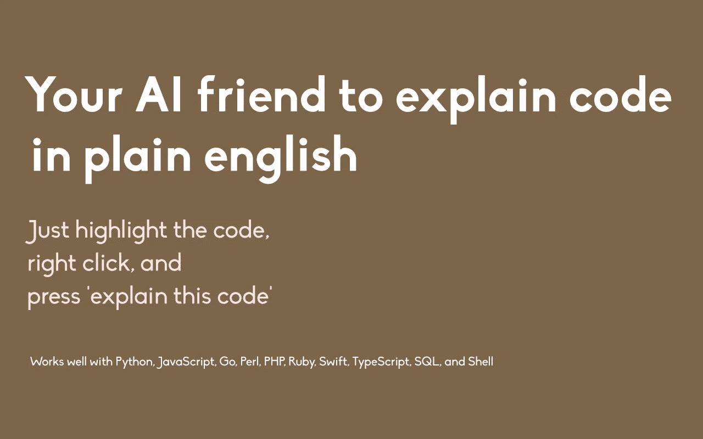

# 我做了一个 Chrome 扩展，用简单的英语解释代码

> 原文：<https://javascript.plainenglish.io/i-made-a-chrome-extension-to-explain-code-in-plain-english-4f9f4957e0a2?source=collection_archive---------18----------------------->

## 你的人工智能朋友用简单的英语解释代码，它可以在任何网站上工作。

各位开发者好，我刚刚推出了 Codexplainer 的 MVP。它是一个人工智能工具，可以在互联网上的任何网站上用简单的英语解释代码。它甚至支持你最喜欢的网站，如 Stack Overflow 和 Github。我期待着为所有与编码相关的网站增加支持。

这是该应用程序的链接:

 [## 共同解释者

### 用简单的英语理解一段代码

chrome.google.com](https://chrome.google.com/webstore/detail/codexplainer/mekadgeckpcgideipfhbcapmenbadejp) 

我不会说这个工具 100%完美。它有它的缺陷。但是我 100%肯定这个工具会越来越好。我可以想象它将对开发人员的学习体验产生的影响。

这款应用是免费的。

大多数开发者都是学习者，来自发展中国家，所以我认为要求他们付费使用应用程序是不公平的。我希望每个人都可以使用这个应用程序，并简化他们的学习流程。

如果你有兴趣，请尝试该应用程序，并给我反馈和建议。如果你觉得有用，请在 chrome 网上商店留下好评。这只是一个 MVP，我期待着你的反馈。

*更多内容看* [*说白了。报名参加我们的*](http://plainenglish.io/) [*免费每周简讯*](http://newsletter.plainenglish.io/) *。在我们的* [*社区*](https://discord.gg/GtDtUAvyhW) *获得独家写作机会和建议。*