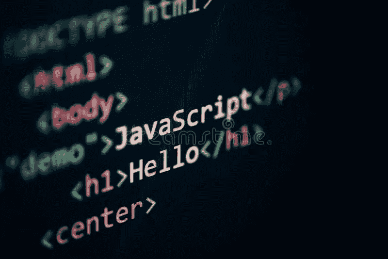

# 我做了一个 JavaScript 单页应用程序，这是我学到的

> 原文：<https://javascript.plainenglish.io/i-made-a-javascript-single-page-application-and-this-is-what-i-learned-838f16a4c67?source=collection_archive---------8----------------------->

在熨斗学校软件工程项目的倒数第二个项目中，我必须创建一个单页面应用程序，用 JavaScript 处理前端，用 Rails 作为后端的 API。这些是我想传达给其他正在用这个框架构建东西的人的重要信息。

1.  **JavaScript fetch 调用和 Rails 批量赋值**

对于从 JavaScript 前端向 Rails 后端发送信息，了解 Rails 中批量赋值的工作方式非常重要。了解如何在 fetch 调用中构造 body 参数可以使创建模型及其子模型的新实例变得更加容易。为了举例，我们假设模型是:

列表有标题，项目有名称。为了创建一个新的列表和多个条目，我们需要使用 fetch()方法，并确保我们告诉它我们使用的是 POST 方法。body 参数是神奇的地方。如果您还记得上面的列表类，它有`accepts_nested_attributes_for`类方法。这将定义一个名为`items_attributes`的属性写入器，然后可以在 list_params 方法中使用，比如:`params.require(:list).permit(:title, items_attributes: [:name])`。考虑到这一点，在前端，fetch()调用的主体应该是结构化的，以便 Rails 可以获取这些信息，并通过批量赋值一次创建所有内容。

如果操作正确，您可以将 fetch()调用发送到`/lists`，并在控制器方法列表#create 中创建一个新列表和与之关联的 5 个新项目，并将它们一次性保存到数据库中。这些关于 Rails 的知识有助于向后端发送信息，但是如何接收信息并将其用于前端应用程序呢？

2.**用序列化器渲染 Rails】**

如果我们要检索一组列表及其相关条目，它们被收集在 Rails 的列表控制器中。然后它们被呈现在 JSON 中，这样前端就可以使用这些信息在 DOM 中显示。最有效的方法是创建一个序列化程序类，以便只允许您想要的数据，而不会有任何多余的数据。

在控制器中收集列表后，可以使用 ListSerializer 呈现它们:

这将在 JSON 中的`/lists`地址呈现数据库中的所有列表，供前端收集。请注意，它包括了相关条目的列表以及条目的 id 和 name 属性，但不包括列表数据库中的`:created_at`和`:updated_at`列。由于列表模型使用的是`has_many :items`关联，因此它获得了`List.items`关联方法，然后我们可以在 ListSerializer 类中使用该方法来呈现项目和列表。

这一切都很好，只要你能很好地按照它们被创建的顺序来呈现它们，但是如果你想让它们以另一种方式排序，比如字母顺序，那该怎么办呢？首先，创建一个实例方法来处理列表模型中的排序:

现在我们可以使用`items_sorted`方法并将其放入 ListSerializer。

这些项目现在将按字母顺序呈现！只要您在序列化程序中使用方法名，任何对关联进行排序的实例方法都适用于此。这对于一些人来说可能是显而易见的，但这是我在为我的项目摆弄数据时发现的。从 Rails 呈现数据时，将数据组织好要比试图用 JavaScript 在前端组织数据容易得多。

3.**遇到困难时，不要忘记先检查简单的东西**

最后一个例子，我将呈现一个个人轶事。我要传达的内容对许多读者来说可能是显而易见的。在大多数情况下，我不会落入我将很快揭示的陷阱，但有时我仍然发现自己跳过了一些小事，试图找到一个过于复杂的解决方案来解决一个令人尴尬的简单问题。事实上，在这个项目中，我被它烧伤了，最后在电脑前扯了很长时间的头发。当我最终意识到这个问题，以及它是多么的简单时，我真的笑出声来，因为我让它持续了这么久。这是一个令人羞愧的考验，对于大多数阅读这篇文章的人来说，这可能是非常明显的，但我觉得在编写代码时经常出现，值得一提。

我已经编写了代码来提交一个由输入和选择元素组成的表单元素。这意味着一个事件监听器连接到一个按钮上，当点击这个按钮时，它会调用一个 fetch()方法将表单信息发送到后端 Rails API，创建必要的模型并将它们保存到数据库中，然后用 JSON 呈现这些新模型，这些新模型可以在前端抓取并显示在 DOM 中。问题是当点击提交按钮时，模型将被创建并保存在后端，但页面上不会显示任何内容。因为问题似乎只出在前端，所以我立即跳转到 promise fulfillment then()方法和我在其中创建并调用的函数，以在页面上显示模型数据。我看不出有任何问题，控制台中也没有任何错误来告诉我发生了什么问题。我修改了处理 DOM 的函数，但毫无效果，并反复阅读了从 fetch()调用开始的代码，直到我眼花缭乱。

好好休息一下后(另一个明显但有用的提示！)我最终决定从提交按钮上的事件监听器开始查看这个序列的最开始。这时，我注意到在事件监听器的回调函数中，我没有使用`preventDefault()`。因为我没有使用标准的 HTML 表单提交，也没有在表单元素本身中提供动作，所以这个函数对于阻止页面正常提交表单数据是必要的。一旦我纠正了这一点，我又尝试了所有的东西，然后“击鼓*”。还是不行。然而，并没有全部丢失，因为我现在在控制台中得到一个“变量未定义”的错误。在查找错误引用的代码行时，我立即注意到我拼错了一个变量，我用它作为函数调用的参数。两个非常小而简单的错误花费了比应该花费的更多的时间来修复。这里的教训是不要忘记从简单开始。试图跳过简单的事情几乎是本能地发生的，无论是因为你认为那些事情太简单而不能搞砸，还是因为问题一定出在事情更复杂的地方。简单的事情几乎不需要任何时间来检查，所以即使问题不在那里，你也不会因为先检查那里而损失太多。

像任何编码项目一样，这是一次学习的经历，而且我在很多方面都觉得受益匪浅。我为自己能够创造的东西感到自豪，但同时也对自己作为开发人员的优势和劣势有了新的关注。当我进入熨斗计划的最后一部分时，我对自己取得的进步感觉良好，并对我将从事的所有未来项目感到兴奋。

*更多内容尽在*[***plain English . io***](http://plainenglish.io/)