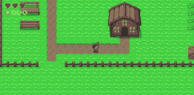
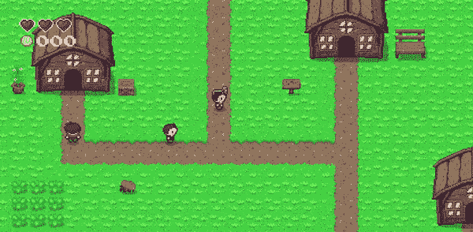
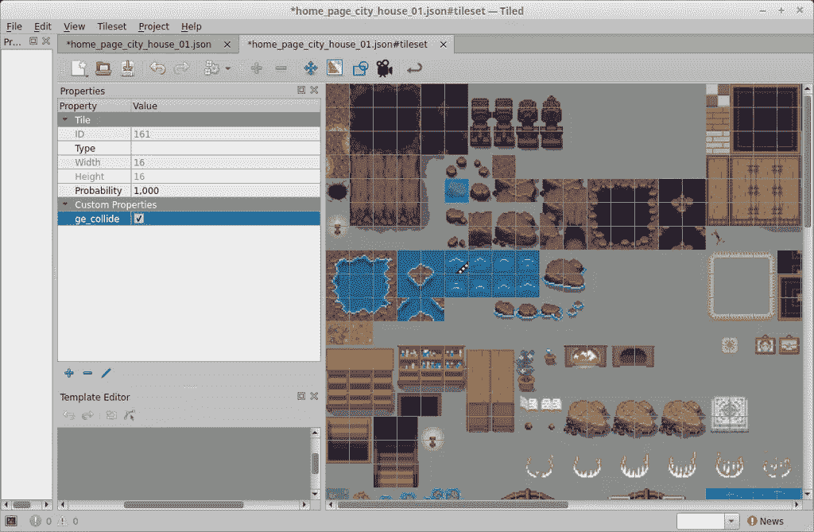
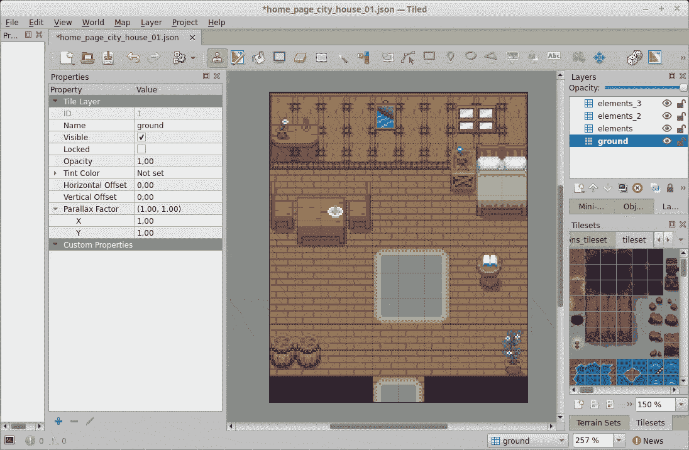
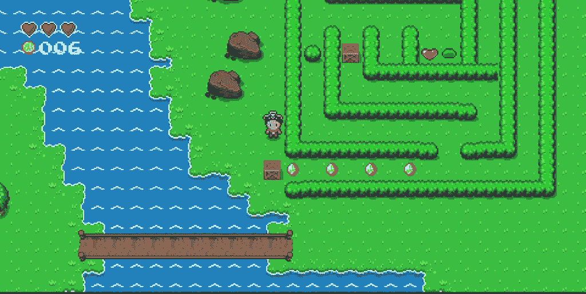

# 我用 Phaser 和 React 制作了一个自上而下的游戏版本

> 原文：<https://javascript.plainenglish.io/i-made-a-top-down-game-version-of-my-blog-with-phaser-and-react-faf5c28cf768?source=collection_archive---------2----------------------->

对，没错，这个网站现在有游戏版了。厌倦了点击无聊的网页和阅读材料？深入到一个自上而下的类似 RPG 游戏的旅程中，找到博客帖子并在游戏中阅读它们怎么样？

# 好吧，但是为什么？

这个想法是在我将 Konami 代码添加到我的网站时产生的，它使 Matrix 源代码显示在网站的背景中(现在尝试一下)，虽然超级酷，但我认为让 Konami 代码打开游戏或其他东西会更酷，因为我已经有 2 年的 Phaser 经验，我决定做一个愚蠢的游戏作为 MVP。

大约在同一天，我发现了 [grid-engine Phaser 插件](https://github.com/Annoraaq/grid-engine)，它使得创建一个自上而下的类似 RPG 的游戏变得如此容易，以至于我决定用它来制作一个游戏，还因为我的第一次“编程”经历可以追溯到 2002 年，当时我正在用 RPG Maker 创建一个一模一样的游戏。

从那时起，这个项目开始变得更加雄心勃勃，我想“如果我在游戏中显示博客帖子会怎么样？”，反正 React via `GraphQL`里所有的博客数据都有，应该不会太难。

# 将 React 用作 Phaser 的用户界面

Phaser 通过在 DOM 中的一个`canvas`元素中呈现像素来工作，这很好，但是 web 开发的一个很好的特性是 DOM 和 CSS 创建很好的 UI 元素的能力，而你不能单独用 Phaser 来做这些。

使用 Phaser 和 React 的最简单方法是使用如下所示的功能组件。

这在大多数情况下都很好，但为了让 Phaser 能够与 React 来回通信，比如显示菜单项或对话框，我将在 Phaser 和 React 之间调度 JavaScript 事件。

最好的方法是使用某种状态管理工具，比如 [Flux](https://facebook.github.io/flux/) ，但是因为这只是一个非常小的项目，分派 JavaScript 事件暂时可以。看看下面的例子如何做到这一点:

如果你想知道更多关于如何为你的 Phaser 游戏创建一个 React 对话框的细节，请查看我的博客文章。

# 集成 Phaser 和 Gatsby

Gatsby 是一个由 React 驱动的静态站点生成器，但是 Phaser 是一个客户端专用的包(当然，我的意思是，为什么后端需要 Phaser？)，所以每当 Gatsby 构建我的游戏页面时，我都会收到 SSR 错误，因为 Phaser 试图只访问客户端 API。

为了解决这个问题，我使用 React 钩子`useEffect`来动态导入所有与 Phaser 相关的模块，因为`useEffect`只在客户端执行。

# 创建地图

为了创建地图，我将再次使用 Tiled，这是一个 FOSS，你可以在其中创建地图，并在几乎任何游戏引擎中使用它们。

我在地图上使用的`tileset`是由[arm 1998](https://itch.io/profile/armm1998)创建的[塞尔达风格的 tileset](https://opengameart.org/content/zelda-like-tilesets-and-sprites) ，包括室内和室外 tileset。

首先，我将在瓷砖上创建`tileset`,并在所有瓷砖上设置一个名为`ge_collide`的属性为`true`,我希望与英雄发生冲突

创建多层地图很重要，这样一些部分可以在英雄下面，一些部分在英雄上面。

地图完成后，[我会将 tileset 嵌入到地图](https://pablo.gg/en/blog/games/automatically-update-the-embedded-tileset-for-all-your-tiled-game-with-a-nodejs-script/)中，然后我可以简单地将地图和`tileset`文件导入到我的游戏中，并在 Phaser 中加载它们。

# 使用网格引擎相位器插件

正如我在文章开头提到的，使用 grid-engine 插件创建一个自上而下的 RPG Maker 风格的游戏很容易，只需将你的游戏配置为使用 arcade physics 并添加 grid-engine 作为插件。

现在我可以在任何 Phaser 游戏场景中通过`this.gridEngine`访问插件。下一步是创建一个精灵并用网格引擎插件移动它。

这段代码基本上是从他们的官方文档页面复制粘贴而来的。

正如我之前提到的，要使碰撞自动与在平铺地图上创建的地图一起工作，只需添加属性`ge_collide`设置为`true`，用于英雄将要碰撞的平铺地图。

请注意，这将使英雄移动并与物体碰撞，但没有行走动画。为了创建新的精灵动画，我将使用`this.anims.create()`函数，然后在每次网格引擎告诉我玩家移动时播放该动画，网格引擎将调度`movementStarted`、`movementStopped`和`directionChanged`事件。

在这篇文章中，我将更详细地介绍游戏机制是如何制作的[。](https://pablo.gg/en/blog/games/how-to-create-a-top-down-rpg-maker-like-game-with-phaser-js-and-react/)

# 从 Gatsby 获取帖子数据

Gatsby 通过`GraphQL`提供你所有的静态数据，在我的博客上，我使用[markdown 插件](https://www.gatsbyjs.com/plugins/gatsby-transformer-remark/)来发布我的帖子，所以我访问我的数据如下:

添加了`GraphQL`查询后，我所有的帖子数据都可以通过`data.allMarkdownRemark.edges`道具获得。

现在，在游戏中，我可以发送一个 JavaScript 事件，要求 React 在一个列表中显示我的所有博客文章，然后当一篇博客文章被选中时，在一个材质 UI 模型中显示它。

# 把所有的加在一起

这是我的`GamePage`最终代码的样子:

如果你想知道更多关于`GameScene`内部发生的细节，查看[这篇博文](https://pablo.gg/en/blog/games/how-to-create-a-top-down-rpg-maker-like-game-with-phaser-js-and-react/)。

# 结论

为我的博客创作这个游戏很有趣，除此之外，我在 Phaser 和 React 中学到了很多新东西。也许我甚至可以用这部分代码做一个真正的自顶向下的游戏:眼睛:。

# 特别感谢

没有一些了不起的人和他们的工作的帮助，这个游戏是不可能的，所以这里是我特别感谢的名单。

*   [photonstorm](https://github.com/photonstorm) ，用于创建 [Phaser.io](https://github.com/photonstorm/phaser) 。
*   [Annoraaq](https://github.com/Annoraaq) ，用于创建[网格引擎](https://github.com/Annoraaq/grid-engine)插件。
*   [ArMM1998](https://itch.io/profile/armm1998) ，用于[角色精灵和图块集](https://opengameart.org/content/zelda-like-tilesets-and-sprites)。
*   [PixElthen](https://elthen.itch.io/) ，为[粘液精灵](https://opengameart.org/content/pixel-art-mini-slime-sprites)。
*   [pixelartm](https://itch.io/profile/pixelartm) ，给[海盗帽精灵](https://opengameart.org/content/pirate-1)。
*   [jkjkkke](https://opengameart.org/users/jkjkke)，为[游戏过屏背景](https://opengameart.org/content/background-6)。
*   [KnoblePersona](https://opengameart.org/users/knoblepersona) ，用于[主菜单屏幕背景](https://opengameart.org/content/ocean-background)。
*   [Min](https://opengameart.org/users/min) ，为[开卷精灵](https://opengameart.org/content/open-book-0)。

*最初发布于*[*https://pablo . gg*](https://pablo.gg/en/blog/coding/i-made-a-top-down-game-version-of-my-blog-with-phaser-and-react/)*。*

*更多内容请看*[***plain English . io***](http://plainenglish.io)