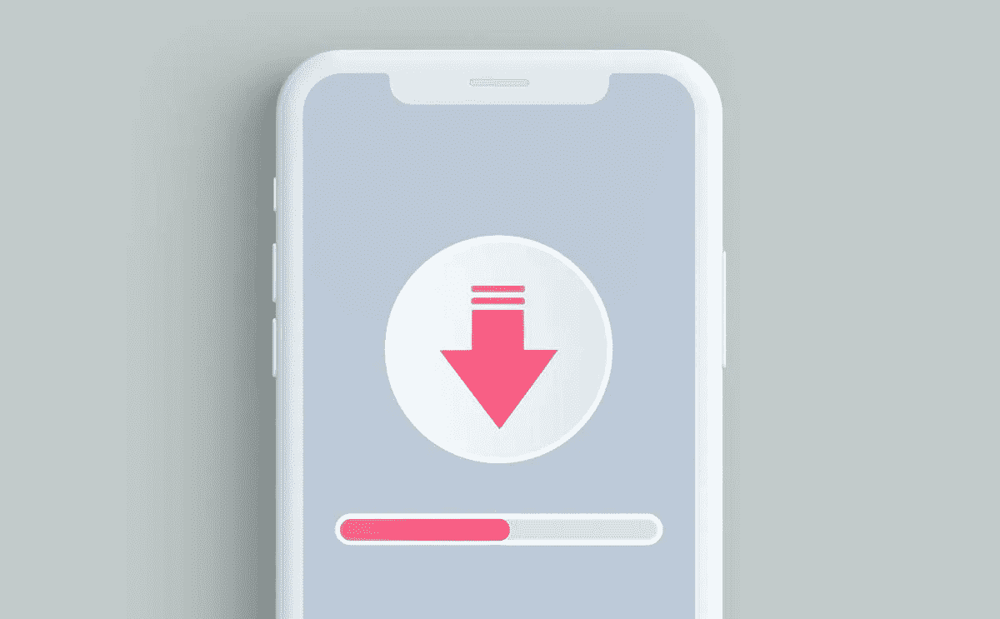

# 艾滋病人令人惊讶的身份问题

> 原文：<https://javascript.plainenglish.io/i-solved-the-biggest-problem-with-pwas-2996d02c5728?source=collection_archive---------2----------------------->

2020 年 1 月一个阳光明媚的早晨，我突然意识到，没有一款应用程序可以让全世界追踪当时正在崛起的新冠肺炎。我买了域名[冠状病毒. app](https://coronavirus.app) ( *无法访问？检查一下* [*这个*](https://progressier.notion.site/Why-can-t-I-access-coronavirus-app-859a165044e4474d8191a5ab1dd23c7f) )，和几个朋友一起把 app 建成 PWA，[推出](/building-a-pwa-was-our-best-idea-ever-b7b233726b41?source=friends_link&sk=e197dc9a0d5c94fc10576835eb089936)，然后几百万人开始使用。

从那以后，我们收到了数量惊人的用户电子邮件，强调了一个非常特殊的问题:

> “我已经搜索了 App Store/Google Play，但是找不到。app 在哪里？"

# “app 在哪里？”

我们的大部分用户——大多数是普通人，而不是技术人员——无法接受他们在[**coronavirus . app**](https://coronavirus.app)上看到的就是应用程序。没什么可下载的。你只要在手机或者桌面上打开那个网址，就可以了。就是这个应用。

人们对此感到困惑是合情合理的。谷歌和苹果已经让我们习惯于认为应用程序必须从应用商店下载。到 2021 年，这种模式不再有完美的意义。

# 解决办法？不是另一个应用商店

随着 [Progressier](https://progressier.com) 的出现，感觉是时候为这个问题建立一个解决方案了。但是…我要打断你。解决方案不是“*PWAs 的应用商店*”。在这方面有很多不太成功的尝试——pwa 不需要应用商店。

人们寻找解决特定问题的应用程序。外形因素——无论是本机应用还是 PWA——都无关紧要。一个“PWA 应用商店”本质上是一个坏主意，因为它只吸引对 PWA 概念感兴趣的人——而这只是网络开发者的一个很小的市场。

此外，应用商店实际上应该服务于两个目的:

*   **分销渠道**:通过将你的应用添加到应用商店，你可以接触到新的潜在客户。
*   **基础设施提供商**:应用商店负责所有应用的标准流程，如安装、更新、支付、评论等

第二个角色与艾滋病毒感染者和病人无关。安装功能嵌入在浏览器本身中(尽管如果你想要一个浏览器无关的解决方案，这就是 [Progressier](https://progressier.com) 的用武之地)。

第一个角色，嗯……应用商店不再履行这个角色了。不适合艾滋病人。也不适用于本地应用。

# 2021 年的应用分发

你必须回到过去才能理解为什么应用商店变得如此普遍。十年前，你会发布一个应用程序或 Google Play 或 App Store——仅此一项就能为你带来新用户。对于像 Evernote 这样的市场早期参与者来说，出现在每一家商店是一个成功的用户获取策略。

如今，这些商店中的每一家都有[200 万到 300 万个应用](https://www.statista.com/statistics/276623/number-of-apps-available-in-leading-app-stores/)。许多类别已经饱和，如果没有额外的努力(例如广告)，你的应用程序可能会稳定地保持在…零下载。

**应用商店不再是分销渠道**。如今，它们已经完全变成了托管服务提供商/支付处理商的联合体。应用商店帮助你的用户下载、安装、更新你的应用并为其付费——仅此而已。他们肯定不再帮助你接触新客户。

这就是为什么谷歌和苹果最近被迫将应用内收入的 30%佣金降至 15%。当你带来客户时，收取 30%的佣金是合理的。如果你所做的只是“处理支付”——尤其是当像 Stripe 或 PayPal 这样的纯粹的支付处理商通常只收取 2%到 5%的费用时。

# 体验中断的地方

pwa 有两个主要弱点:

*   他们无法访问本机应用程序可以访问的所有设备功能
*   跨浏览器正确设置它们是一件痛苦的事情。

[Progressier](https://progressier.com) (大部分)解#2。第一个是由浏览器供应商领导的正在进行的工作。它每年都在变得更好，但如果你的应用程序必须访问用户的加速度计才能正常工作，PWA 可能不是一个选项。

在所有其他情况下，pwa 都比原生应用优越得多:它们更容易开发(特别是当使用像 [Bubble](https://bubble.io) 这样的无代码构建器构建时)，用户访问更快，更新完全没有麻烦，维护更便宜。

现在的问题是:人们仍然非常习惯于从第三方应用商店下载应用。所以当你告诉用户只需点击右上角的**【安装】**就可以了，他们并不觉得自己在下载一个 app。从用户体验的角度来看，这几乎…太直接了。太有侵略性了。它缺少*包装*和技巧。或许更重要的是，它与用户在过去十年中已经习惯的东西相冲突。这就是“*pwa 是应用*的神奇之处。

# 进入 PWA 安装链接

使用 [Progressier](https://progressier.com) ，您的 PWA 将获得一个独特的安装链接，如下所示:

> [**install.page/covid**](https://install.page/covid)

给用户一个 *app store 体验*——一个第三方网站，宣传你的 PWA 的安装——让他们知道他们正在安装你的应用。见鬼，这个域名甚至有“ *install.page* ”在里面——你不能比这更清楚了。

当然，它是完全可定制的。您可以添加截图、修改 URL、添加封面图片、SEO 友好描述等等。你对应用商店列表的所有期望。

我们的安装链接本身不会获得新用户。没人会从那个链接找到你的应用。我们不是应用商店。我们只是为您提供一个工具，让您的用户一旦找到您，就可以轻松安装您的 PWA。

不过没关系。因为如果你在 2021 年在 Google Play 和 App Store 上发布了一款应用，那么……你也必须注意寻找自己的用户。

*更多内容请看*[***plain English . io***](http://plainenglish.io/)