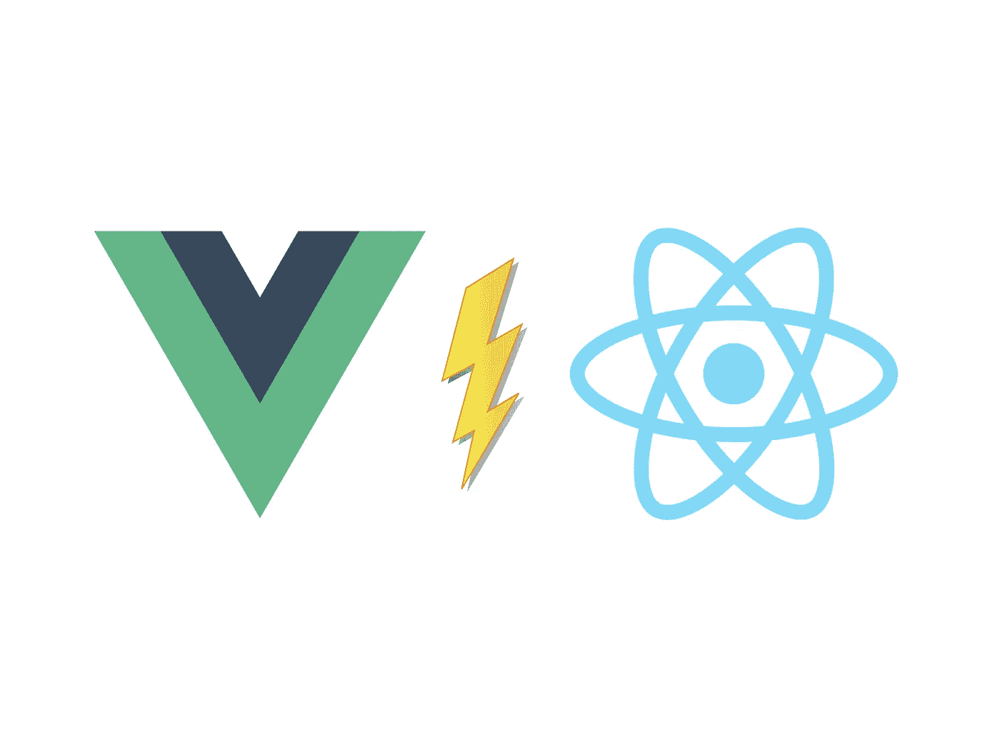
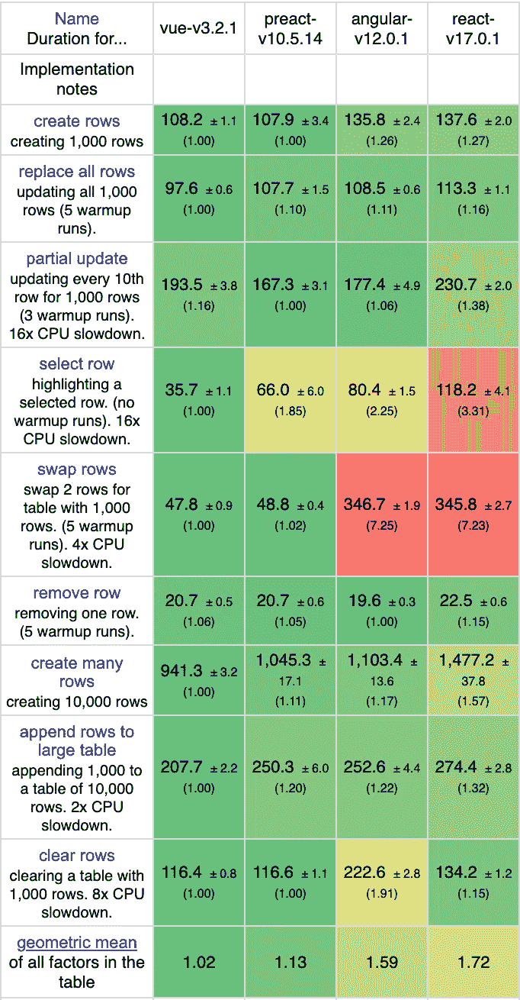

# 我以 React 开发者的身份尝试了 Vue.js。以下是我喜欢它的 5 点

> 原文：<https://javascript.plainenglish.io/i-tried-vue-js-as-a-react-developer-here-are-5-things-i-like-about-it-a4270a68688b?source=collection_archive---------5----------------------->

## 集成、学习曲线、捆绑包大小等等

Source: the author

我最近的一篇文章“[作为一名 React 开发人员，我喜欢 Angular 的什么地方](/angular-vs-react-8125a541dd2a)”很受欢迎。

我得到的反馈最多的是:这是一篇公正、不偏不倚、思想开放的文章，而不是一篇比较。这是我打算写的。

我厌倦了科技战争。我厌倦了那些声称某种框架是最佳选择的文章。最讨厌拿这些文章当自己做傻事比较。角度与反应。React vs. Vue —等等。我认为永远不会有一个明确的赢家。原因是所有的技术都有不同的优势——结束技术战的最好方法可能是指出这些优势。

因此，这就是我喜欢 Vue.js 的地方——作为一名思想开放的 React.js 开发者。玩得开心！

# 1.开始很容易

React.js、Angular 以及更多的框架和库都依赖于 CLI 来帮助您入门。Angular 甚至可以让您安装现成的 TypeScript。

当然，您可以在没有捆绑器的情况下编写 React.js。但是如果你选择这样做，你将不得不放弃 JSX。老实说，如果没有 JSX，编写 React 是很麻烦的。在这种情况下，Vue 大放异彩。

该库可以包含在 CDN 中，或者自己下载文件，然后将其导入 HTML，您就可以开始编写 Vue.js 了，无需 CLI 和 bundler。

您的应用程序看起来就像这样:

当然，像这样使用 Vue 意味着摆脱有用的开箱即用功能，如林挺、打字稿、最小化等等——尽管如此，我看到有人像这样使用 Vue.js。主要是在将库集成到现有项目中时，比如普通的 JS 和 HTML 应用程序。

我想到的另一个用例是在使用后端模板的站点中集成前端库。

# 2.它可能有最平坦的学习曲线

在 Angular 与 React.js 的冲突中，反对 Angular 的一个论点如下: *Angular 难学得多，React.js 容易学*。

因为我是 React.js 开发人员，对 Angular 几乎一无所知，所以我不想对它本身进行评判。不过我能判断的是以下几点:Vue.js 的入门水平比另外两家低。

Vue 经常被称为两全其美，这并非巧合。虽然 Angular 感觉严格得多，但 React.js 的自由和结构可能是压倒性的，并导致实现除最佳实践之外的一切。Vue 感觉是两种哲学的结合。

每个 Vue 组件都由三部分组成:

*   一个标记部分，你可以用 Vue 的特殊模板语法写 HTML。
*   JavaScript 代码部分，我们在这里定义组件。这包括函数、数据、道具等等。
*   一个用于样式的部分，它只能作用于一个组件。

在我看来，对于建筑构件来说，这是一个干净而简单的结构。

# 3.捆绑大小

在我的“我喜欢 Angular 的什么”一文中，我提到了一个常见的误解——Angular 是肥胖的神话。我用 Angular 和 React.js 创建了一个简单的应用程序。

React.js 的大小是 135 kb，同样的 Angular app 是 145 kb——只有 10 kb 的差别。那么，但是 Vue 呢？

同样，我构建了相同的计数器应用程序。然后，我捆绑制作，结果是 Vue app 的大小是 93 kb。那是相当不同的！

现在，让我们来看关于性能的下一点。

# 4.表演

实际上，我并不热衷于比较框架和库的性能。为什么？因为通常情况下，这些指标对于普通的应用程序来说毫无价值。然而，我发现引入这种观点很有趣(因为我知道有多少人会评论说 Vue 的出色表现不见了)。

Source: [https://krausest.github.io/js-framework-benchmark/current.html](https://krausest.github.io/js-framework-benchmark/current.html)

所以，这就对了。以下是 Vue、Angular、React 和 Preact 的结果。我选择包含 Preact 是因为它是 react 的更快的替代方案，而且通常是比普通 React 更好的替代方案。

其实结果让我很惊讶。我知道 Vue 比 React 和 Angular 有更好的性能，但我不希望差别超过一点点。此外，Vue 优于 Preact 的事实让我感到惊讶。

虽然 Vue 没有在每个基准测试中占据主导地位，但整体性能更好。我们可以在最后一行看到这个，叫做几何平均值。

然而，你可以看到在什么样的情况下差异会真正显现出来。更新 1m000 行或创建 10，000 行并不是 web 应用程序中的典型场景。

# 5.开箱即用的优秀工具

这一点已经让我对 Angular 感到惊讶了。Angular 带有一个很棒的 CLI，支持你做任何你想做的事情。

由于我主要使用 React，它没有如此丰富的 CLI，我对 Vue CLI 感到非常幸运——它让我想起了驾驶 Angular。

有了 Vue 的官方 CLI，我们可以做任何事情:

*   添加像 eslint、vuex 甚至 apollo 这样的工具。
*   我们可以添加来自 NPM 的第三方组件。
*   我们可以运行 CLI 的 UI 版本，这也使我们能够访问漂亮的 webpack 分析器。
*   将项目升级到新的 Vue 版本。

除了 CLI 之外，我们还可以访问更大的环境。我们可以轻松地使用和配置 webpack，构建 web 组件以及做更多的事情。Vue CLI 甚至可以运行用于原型制作的单个组件。

Vue.js 是我听说的:作为对 Angular 文章的评论，我收到的反馈是 Vue CLI 和 Angular 的 CLI 一样棒。两种都试过了，我可以同意。

感谢您的阅读！

更多关于技术战的信息:

 [## 作为一名 React 开发者，我尝试过 Angular。以下是我喜欢它的 6 点

### #4 是的，这是一个框架

javascript.plainenglish.io](/angular-vs-react-8125a541dd2a)  [## 我用 React 和 Preact 构建了相同的应用程序。以下是不同之处

### 以及测量的大小、性能和实现

javascript.plainenglish.io](/i-built-the-same-app-with-react-and-preact-here-are-the-differences-b0da382a6f72) 

*更多内容看*[***plain English . io***](http://plainenglish.io)