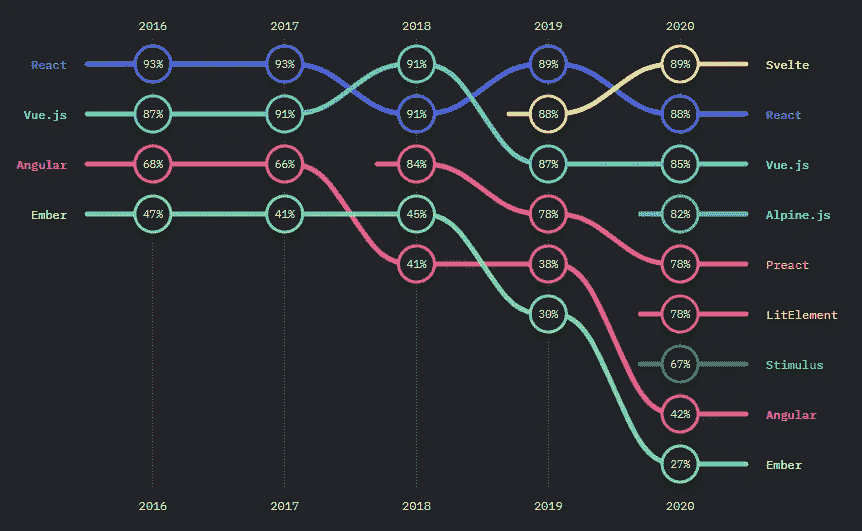
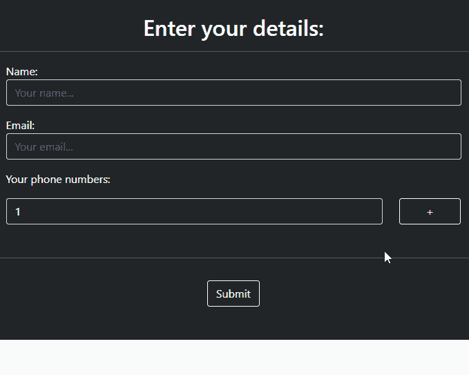

# 我用 Vue.js，你也应该用

> 原文：<https://javascript.plainenglish.io/i-use-vue-js-and-so-should-you-19f603ae04e3?source=collection_archive---------10----------------------->

## 让我们花几分钟时间来重新发现 Vue.js 的魅力，以及如何在不完全脱离首选前端框架的情况下使用它。

Photo by [Paulius Andriekus](https://unsplash.com/@paulando14?utm_source=unsplash&utm_medium=referral&utm_content=creditCopyText) on [Unsplash](https://unsplash.com/s/photos/vuejs?utm_source=unsplash&utm_medium=referral&utm_content=creditCopyText)

据[维基百科](https://en.wikipedia.org/wiki/Vue.js) Vue.js 是“一个开源的模型-视图-视图模型前端 JavaScript 框架，用于构建用户界面和单页应用。它由尤雨溪创建，并由他和其他活跃的核心团队成员维护”。

尤雨溪在谷歌工作时，在几个项目中使用 Angular.js 创建了 Vue.js。在那里，他有了创建轻量级框架的想法。他在 2014 年 2 月首次发布了 Vue.js。如前所述，它由尤雨溪和其他活跃的核心团队成员维护。与其他流行的前端框架不同，Vue.js 姗姗来迟，Angular 在 2010 年首次以 Angular.js 的身份出现，并在 2013 年做出反应。然而相对来说，它来得太晚了，效果非常小。另外，与谷歌支持的 Angular 和脸书支持的 React 相比，Vue.js 更倾向于社区驱动和维护。

# vue . js 2021 年的状态

Source [State of JS](https://2020.stateofjs.com/en-US/technologies/front-end-frameworks/)

2018 年开始使用 Vue.js，在 [Laravel 框架](http://laravel.com)。那时我主要使用 Vue.js 编写一些组件，使用简单的 Vue.js 语法实现复杂的 JavaScript 功能。

Vue.js 目前在开发人员中相当不受欢迎，尽管它还未能占据第一名的位置，但受欢迎程度正在迅速下降。在 2020 年前端框架 JavaScript 开发者调查中，Vue.js 仅次于 Svelte 和 React，位列第三。我对它仍然被使用和首选的程度感到惊讶，但我认为主要是因为它的版本 3 的发布，它仍然是相关的，我将很快讨论它。

## Vue.js 3 发布

2020 年 12 月，Vue.js 第三版正式发布，以其臭名昭著的组合 API 矛为标题，试图宣称其统治地位。在我使用 Vue.js 3 composition API 的几个案例中，我看到了它所拥有的承诺，以及它如何轻松地站起来面对 Svelte 这样的人。Vue.js 3 有几个突出的特性:

*   组合 API
*   碎片
*   门户网站
*   自定义指令 API
*   焦虑

这篇[文章](https://vueschool.io/articles/vuejs-tutorials/exciting-new-features-in-vue-3/)很好地解释了它们。Vue.js 的发布见证了来自其他框架(如 React)的各种强大功能的改编，为其提供了所需的竞争优势。

## Laravel 发布带 Jetstream 的 Laravel 8

在 2020 年 Laravel 8 的发布中，Laravel 与 Jetstream 一起发布，Jetstream 用于构建 Laravel 应用程序。Jetstream 自带两个选项，Livewire 和 Inertia.js 开箱即用。这意味着，不像 Laravel 7 使用的 laravel/ui 包可以选择 Vue.js 作为默认设置，Jetstream 没有。这意味着对于学习 Laravel 的新开发者来说，他们几乎不会意识到 Vue.js 的存在，从而导致用户数量的整体减少。

Vue.js 3 的发布比使用 Jetstream 的 Laravel 8 影响更大。总的来说，Vue.js 仍然是第三大首选前端框架，也是我第二大首选前端框架，仅次于 Angular。

# 我为什么使用 Vue.js

当我根据 web 应用程序的需求和约束开发 web 应用程序时，我通常会在 Angular 和 Vue.js 之间进行选择。如果需求是完整的 SPA，我会选择 Angular，但如果是一些组件来增强我的 web 页面中的用户体验，那么显然会选择 Vue.js。

Vue.js 包含了 Angular 的最佳特性，以及 React 的简单性和小封装尺寸。此外，对于初学者来说，它有一个非常温和的学习曲线，使得在旅途中创建组件变得容易。为了详细说明这一点，以下是核心原因。

## 简单

创建一个组件并利用所有特性非常简单。调用 CDN，然后在一个脚本标签中，开始写你的代码。就这样！

## Vuex

Vuex 是 Vue.js 的状态管理库。在我看来，Vuex 是最简单的状态管理和功能性的最佳平衡。Vuex 的灵感来源于 Flux 和 Redux。Vuex 允许多个组件共享数据，而不需要沿着组件树向下传递，并且多个视图可以改变同一状态。将它合并到您的 Vue.js 项目中也非常容易。在 [Vuex 文档](https://vuex.vuejs.org/)了解更多信息。

Source [Vuex Documentation](https://vuex.vuejs.org/#what-is-a-state-management-pattern)

## 句法

Vue.js 语法很早就引起了我的注意。同样是 HTML，只是在这里那里添加一些属性，就万事俱备了。只有当组件或功能变得更加复杂时，我才编写复杂的 JavaScript。与其他框架相反，比如 React，无论功能是简单还是复杂，我都必须学习 JSX 或 TSX，一种全新的语法。

示例:

## 有约束力的

使用 Vue.js 模板绑定意味着我可以在数据方法返回的对象中声明一个变量，在模板中使用它，每当我对这个变量进行任何更改时，无论是在模板中还是在 js 源代码中，数据都会对这一更改做出反应，然后重新呈现组件。

# 何时何地应该使用 Vue.js

如果您是一名从事 web 应用程序开发的前端开发人员，并且您遇到了需要使用 JavaScript 或 JQuery 来实现某项功能的情况，请切换，使用 Vue.js。它被设计为非常轻量级，具有非常温和的学习曲线，是您项目中 JavaScript 或 JQuery 的最佳替代品。我并不是说你应该在所有的功能中用 JS 来代替，因为有些情况太基本了，不能用 Vue.js。

这里有几个问题可以帮助你决定；

*   该功能会影响两到三个以上的 DOM 元素吗？DOM 元素有 div、input、p、span 等。
*   该功能是否包括从用户处获取数据并显示、处理或发送到其他地方？
*   这个功能必须在多个页面中重用吗？
*   我有足够的时间和经验来使用 JS 和 JQuery 实现这个功能吗？
*   我可能会在其他项目中需要相同的功能或特性吗？

如果您对这些问题中的任何一个回答是肯定的，那么您肯定已经超越了 JavaScript 或 JQuery。你应该使用 Vue.js。这些问题涵盖了驱动大多数前端框架创建者开发它们的领域。

## 示例用法:

为了证明这一点，我们来看一个例子。假设我们想要创建一个表单，用户可以在其中输入多个电话号码。

首先，我使用 bootstrap 创建一个简单的**index.html**HTML 文件，带有表单和简单的样式。

然后我在同一个目录下创建一个 **phone-field.js** 文件。

不要让冗长的要点吓到你😅。发生的事情很简单。让我们来看看 index.html 的**:**

*   **大部分的 HTML 都是基本 HTML，使用 bootstrap 框架创建基本表单。**
*   **在第一个脚本标签中，我从 [unpkg](http://unpkg.com) CDN 导入了 Vue.js 3 库**
*   **然后，我将第二个脚本标记导入 phone-field.js 文件，该文件包含我们的 Vue.js 组件。**
*   **div 容器有一个 id“app”，它是我在其中初始化 Vue.js 应用程序的主容器，我可以使用其中的组件。**
*   **在标签“your phone numbers”下面，我添加了标签`<phone-field></phone-field>`，它调用名为“phone-field”的组件。**

**在 **phone-field.js** 中，我初始化了 Vue.js 应用程序，同时定义并创建了模板。Vue.js 的语法和工作方式已经超出了本文的范围，但是我仍然会重点介绍几个关于已经发生的事情的快速提示。**

*   **我使用字段数组和字段索引来存储表单字段和字段索引，以允许创建和删除字段。**
*   **方法“addField”和“removeField”分别负责递增字段索引，然后将其添加到字段数组和从字段数组中移除字段索引。**
*   **mounted 方法通过添加第一个元素来初始化 fields 数组。**
*   **模板内部是用于呈现内容的 HTML。HTML 也可以保留在 HTML 页面中，但是我把它放在了组件中，使组件可以重用，并且与 HTML 代码分离。**

**代码的输出是这样的简单形式:**

****

**就这么简单。用其他前端框架或普通的 JavaScript 创建相同的表单更麻烦。没有比这更简单的了！**

# **结论**

**在这篇文章中，我设法让你开始使用 Vue.js，如果你从未尝试过的话，同时也给你一个测试和学习更多 Vue.js 的起点。您可以使用 Vue.js 创建复杂得多的应用程序**

# **资源**

*   **本文使用的代码在这个[要旨](https://gist.github.com/mwakalingajohn/6dac405afc6c3bd41becce324b5ed0c0)里。**
*   **Vue.js [文档](https://v3.vuejs.org/guide/introduction.html)**
*   **Vuex [文档](https://vuex.vuejs.org/)。**
*   **[JavaScript](http://stateofjs.com)网站状态。**
*   **拉勒维尔[急流](https://jetstream.laravel.com/)。**