# i18n:Vue 应用的国际化

> 原文：<https://javascript.plainenglish.io/i18n-internationalization-in-vue-applications-53d868f831bd?source=collection_archive---------6----------------------->

在我们生活的这个全球化时代，为世界不同地方的人制作应用程序的需求越来越普遍。这种需求带来了挑战，例如支持多种语言环境并将它们集成到您的应用程序中，但幸运的是，这正是国际化的切入点。

# 什么是国际化和本土化？

让我们从头开始，从一些我们需要理解的概念开始。第一个是 ***国际化*** *，*这个词指的是规划和实现 app 以满足全球不同地区需求的过程。国际化也被称为 i18n，意思是“I —十八个字母— N”。

然后我们有 ***本地化*** (L10n) ***，*** 其中是构建特定于目标市场或地区的应用程序版本的过程，包括翻译界面、格式化特定地区的数据等等。

# 国际化的好处

如果没有国际化的过程，应用程序不仅会变得难以开发和耗时，而且几乎不可能大规模维护。让我们想象一下，我们必须为西班牙和法国的人们创建一个应用程序，如果没有国际化，我们可能会有两个不同的应用程序，每个市场一个，如果只有两个市场，这可能不是什么大问题，但如果我们需要扩展到九个或十个市场呢？这将是一个维修地狱。

总而言之，在您的应用程序上实现国际化的好处如下:

*   不管你的应用程序在什么地方，你都会有一个真实的来源。
*   它将很容易扩展到其他市场。
*   应用程序将更容易维护
*   它减少了实现本地化所需的时间、成本和工作量。

# Vue i18n 安装

Vue i18n 是 Vue.js 的国际化插件。它是一个非常完整的插件，允许向应用程序添加不仅仅是翻译。安装过程非常简单，您有两种不同的方法来完成:

**直接下载** : [*这个链接*](https://unpkg.com/vue-i18n@9) 会一直指向 npm 上的最新发布。

*   全球进口

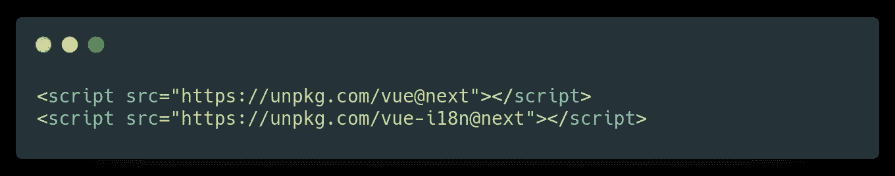

*   ES 模块导入

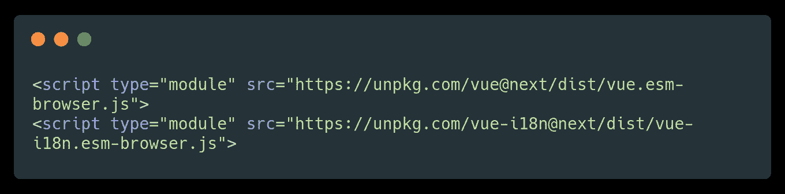

**包管理器:**

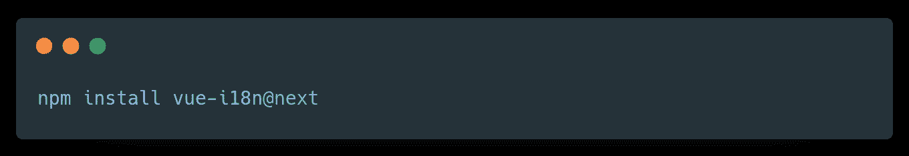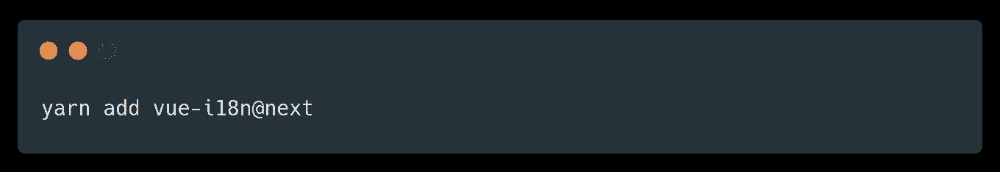

使用模块系统时，必须通过`app.use()`明确安装`vue-i18n`:

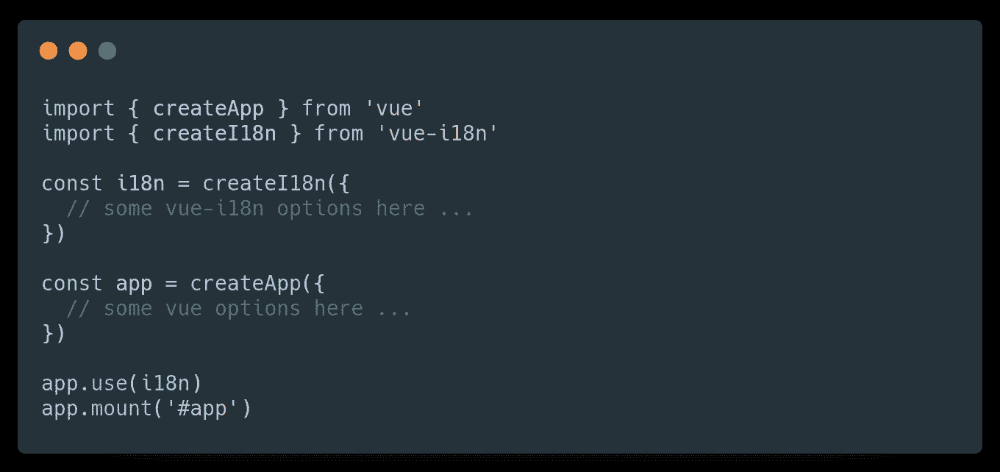

所以正如我所说，安装非常简单，有趣的部分来了，让我们看看我们如何使用它，这个插件带来了什么功能。

# Vue i18n 用法

这里有一个简单的例子，说明如何在我们的应用程序中使用国际化插件。

**HTML**

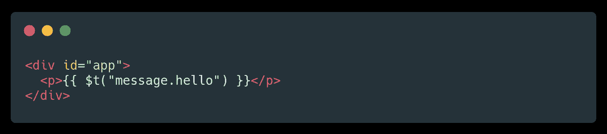

**Javascript**

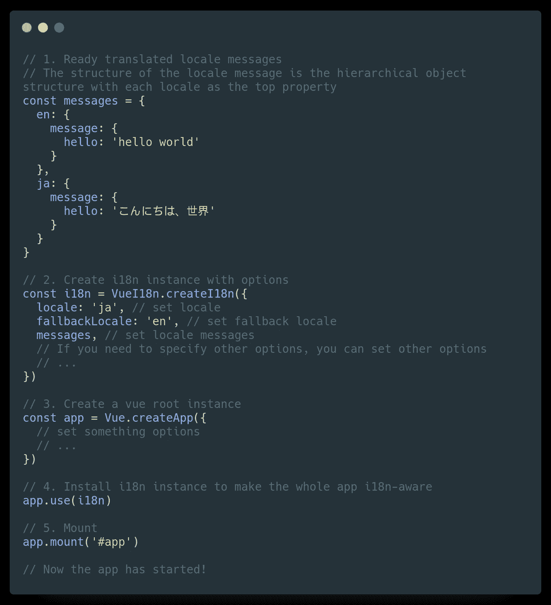

结果将会是

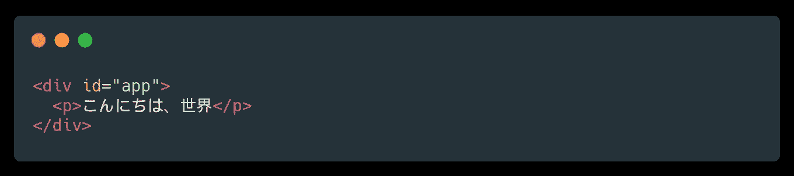

这很有意思。但是我们还能用 Vue i18n 插件做什么呢？让我们看看它带来的一些其他功能

# Vue i18n 特性

简单的文本翻译:这和我们之前做的差不多。要使用翻译，使用带有翻译 id 作为参数的`$t()`函数。

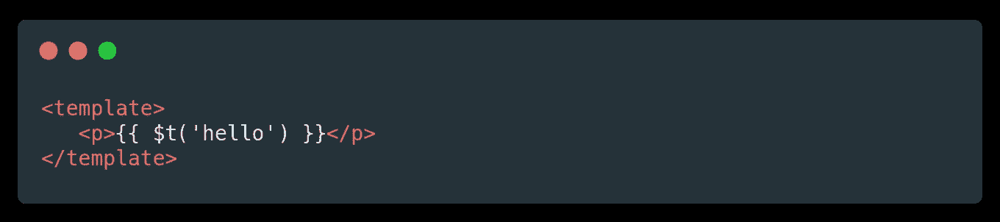

**带参数的文本**:你也可以给你的翻译文本添加参数，例如，在你有的翻译文件上

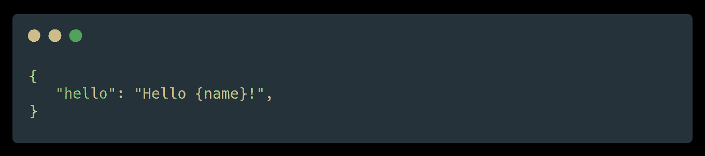

并在 HTML 上将名称作为参数传递

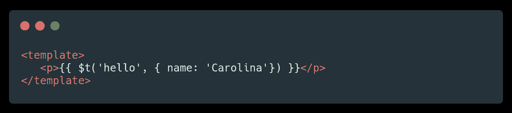

**翻译属性值**:您可以通过这种方式将翻译后的属性值传递给子组件

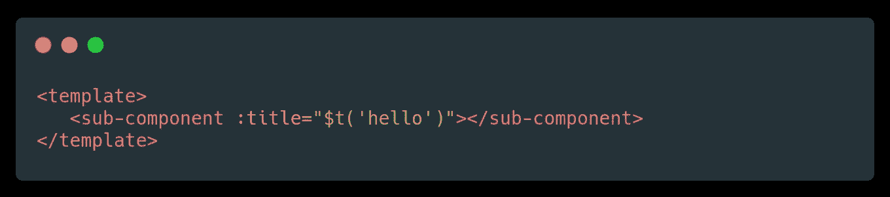

**多元化**:为了本地化消息，您可能需要支持某些语言的多元化，并根据项目的数量更改翻译。这在 Vue I18n 中是可能的

使用`$tc(id,count,parameters)`功能通过以下参数设置您的翻译:

*   `id` id 的翻译
*   `count`复数的项目数
*   `parameters`添加到文本中的参数(可选)

例如，在翻译文件中，我们可以有

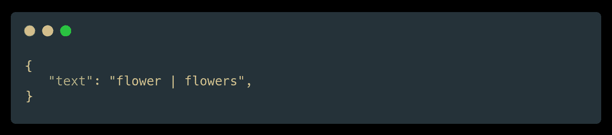

然后，在 HTML 上，我们指向我们的翻译 id 并传递计数 2，这样 Vue 就知道它将是复数，所以它将输出“flowers”

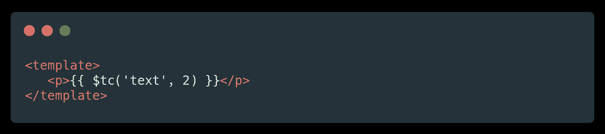

它甚至可以更具体，例如

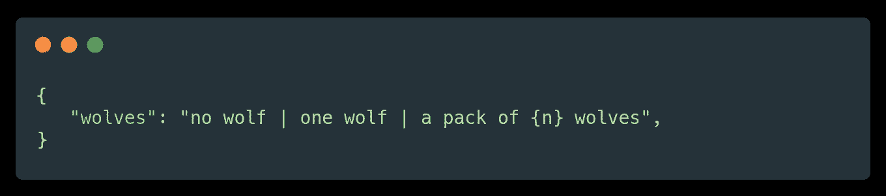

vue-i18n 自动将翻译中的`{count}`和`{n}`替换为传递给`$tc()`函数的数字:

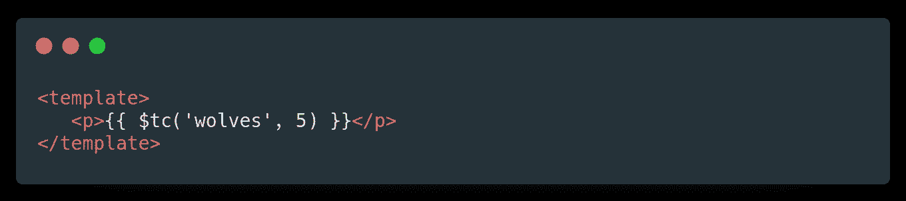

最后，您还可以传递一个带有命名项的参数对象作为第三个参数

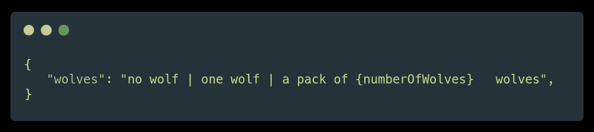

在 HTML 上

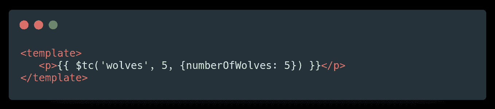

**日期时间格式**

您可以使用自己的定义格式本地化日期时间

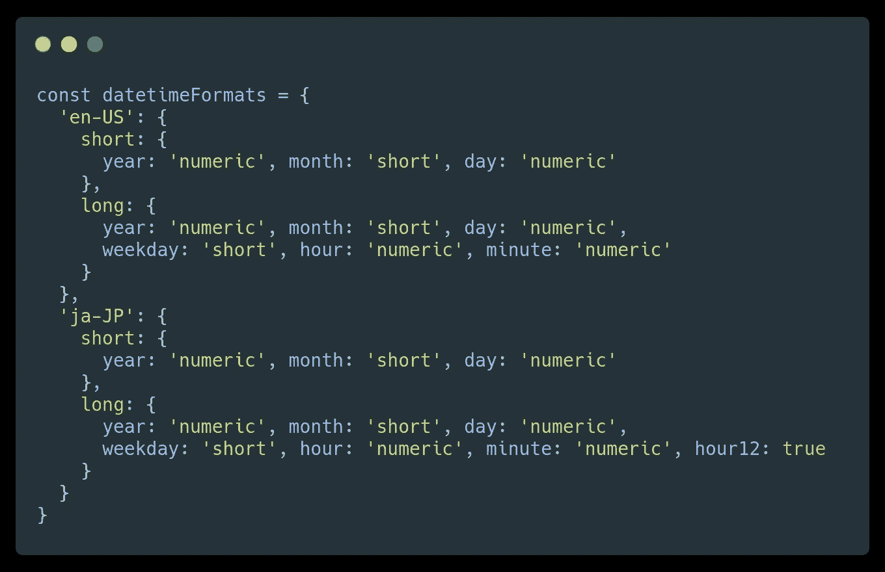

之后，当使用语言环境消息时，需要指定`createI18n`的`datetimeFormats`选项:

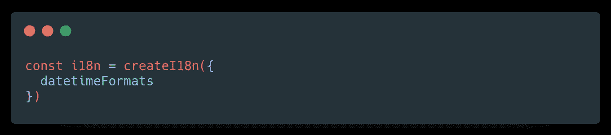

要使用 Vue i18n 本地化 DateTime 值，请使用`$d`。在 HTML 上

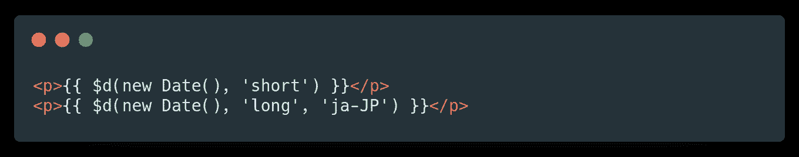

结果将会是

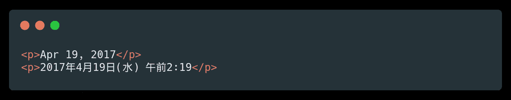

**数字格式:**您可以使用自己的定义格式对数字进行本地化。

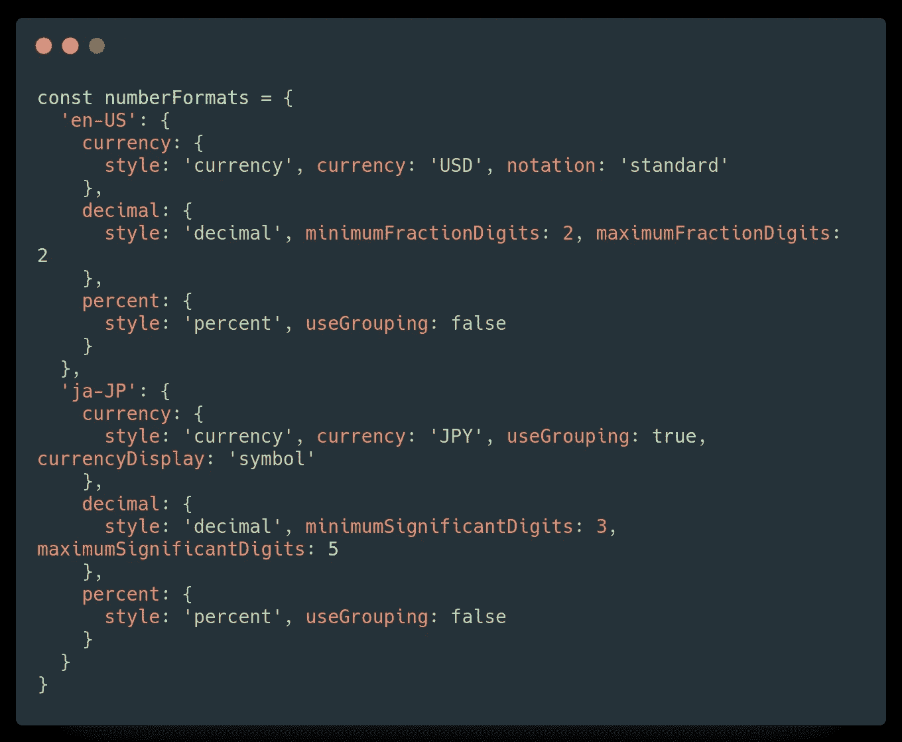

之后，在使用语言环境消息时，需要指定`createI18n`的`numberFormats`选项:

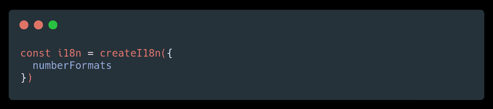

以下是在模板中使用`$n`的例子:

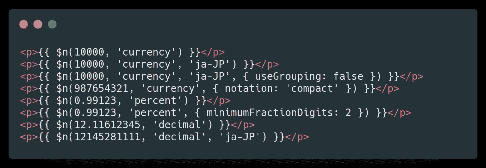

结果如下:

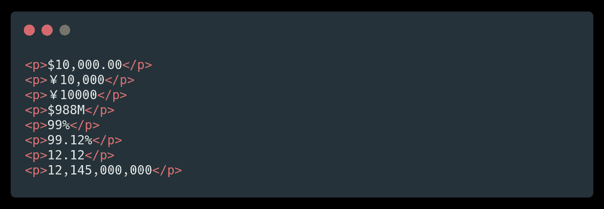

# 结论

即使您不打算从一开始就为您的应用程序支持不同的语言环境，但是在规划应用程序时考虑国际化并添加支持国际化的 i18n 策略是一个很好的实践。

正如你之前看到的，实现非常简单，当针对不同市场本地化应用的时候，它将节省大量的时间和精力。

*更多内容看*[***plain English . io***](http://plainenglish.io/)