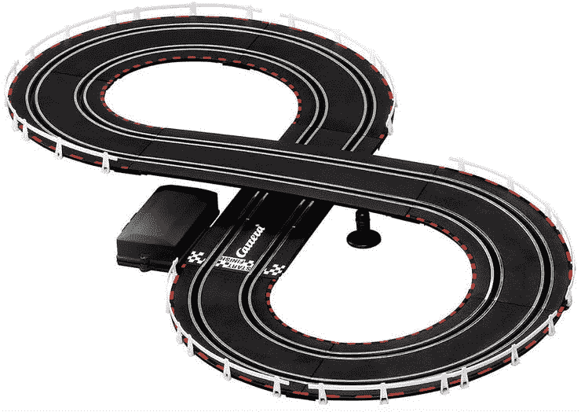
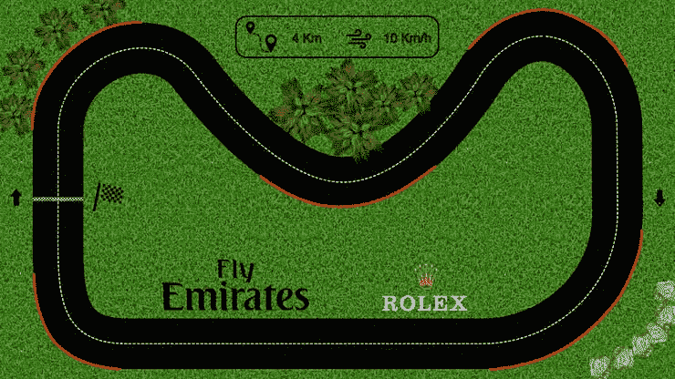
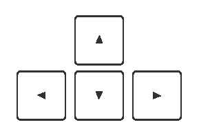
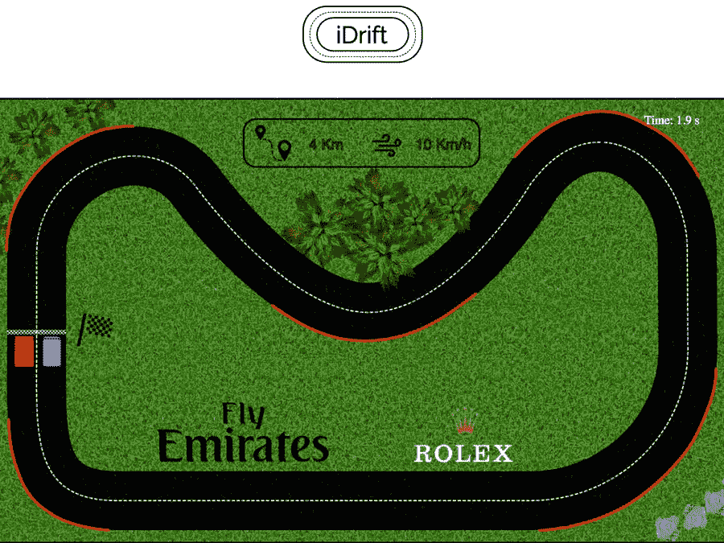

# 构建在线赛车游戏 iDrift

> 原文：<https://javascript.plainenglish.io/idrift-3d7c6b7cdcd1?source=collection_archive---------24----------------------->

## 一个全新的赛车游戏，类似于旧的遥控赛车电路

# 介绍

这个项目的目的是开发一个[在线游戏](https://idrift.herokuapp.com/)(请给网页几秒钟时间充电)，类似于老式的 RC 汽车电路，其中的部件只有 1 个自由度(图 1)。这里考虑了两个。



**Figure 1** Old RC car circuits

# 发展

为了创建网站和嵌入式游戏，使用了 HTML、CSS 和 JavaScript 编程语言。网站的页眉、页脚和类似控制台的图像都是用 HTML 添加的。前面元素的每一个个性化(大小、颜色……)都是使用 CSS 实现的。最后，JavaScript 允许用户和游戏本身之间的交互。此外，每次点击按钮时增加一个动态行为。

沿着这一节，将解释游戏的核心功能。这个描述将不仅包括服务器细节，还包括游戏范围限制，棋子和一些通用工具，允许用户控制汽车，暂停，恢复，重置和静音游戏。

## **服务器**

它没有在 GitHub 的静态网页中运行游戏，而是被认为是在 web 服务器(Heroku)中运行，这样它就可以允许动态内容，例如:带有玩家姓名的最高分数列表。由于时间限制，并且因为 Heroku 的免费帐户不会保存最近生成的信息超过一天，所以没有包括在内。

关于实施的更多细节，请点击[这里。](https://github.com/warcraft12321/iDrift/blob/gh-pages/server.js)

## **游戏限制**

为了限制汽车在道路上的运动，设计了几个多边形，使它们的形状与背景图像中的草地重合(图 2)。做了这个，汽车就不允许跨过去了。

```
const polygon = [[270,141],[291,144],[308,153],[320,161],[332,173],[343,188],[352,198],[362,208],[371,219],[381,233],[391,245],[403,254],[417,269],[430,283],[446,296],[460,311],[476,322],[488,332],[504,344],[517,353],[531,361],[544,367],[559,374],[574,382],[590,385],[606,390],[624,392],[641,393],[659,393],[676,392],[695,389],[711,384],[740,375],[760,364],[780,352],[825,319],[854,293],[883,262],[906,232],[935,194],[957,164],[976,139],[989,131],[1001,123],[1015,118],[1030,118],[1045,121],[1055,124],[1066,130],[1075,136],[1083,147],[1092,155],[1100,167],[1107,179],[1113,190],[1117,206],[1121,223],[1123,238],[1123,260],[1124,407],[1122,439],[1116,465],[1109,482],[1101,500],[1090,515],[1079,530],[1065,544],[1053,556],[1039,567],[1017,581],[996,590],[971,599],[936,604],[903,606],[874,605],[842,605],[814,602],[784,602],[750,604],[715,605],[236,608],[210,604],[199,599],[193,596],[187,593],[181,587],[175,581],[171,571],[165,559],[163,547],[161,534],[159,520],[158,252],[159,226],[166,210],[174,193],[182,182],[194,168],[209,157],[226,150],[243,144],[254,141]];
```

每个多边形由一系列依次相连的点(x 和 y 坐标)组成。为了实时测试汽车的位置是否不在任何定义的多边形内，实现了以下功能:

```
function isPointInPoly(point, vs) { let x = point[0], y = point[1]; let inside = false;
    for (let i = 0, j = vs.length - 1; i < vs.length; j = i++) {
        let xi = vs[i][0], yi = vs[i][1];
        let xj = vs[j][0], yj = vs[j][1]; let intersect = ((yi > y) !== (yj > y))
            && (x < (xj - xi) * (y - yi) / (yj - yi) + xi);
        if (intersect) inside = !inside;
    } return inside;
}
```

无论前面的条件是否得到验证，它都返回一个布尔值。



**Figure 2** Circuit designed using Pixelmator Pro

有关实施的更多详情，请点击[此处](https://github.com/warcraft12321/iDrift/blob/gh-pages/website/index.html)。

## **游戏棋子**

每块的形状如下所示(图 3)。前面的线代表汽车的前部。


**Figure 3** Game piece. Front face highlighted with a vertical black line

下面，是部分代表了游戏棋子的一些属性。即它的宽度、高度、速度、角度、运动角度和它的当前位置。

```
function Component(width, height, color, x, y, type) { this.type = type;
            if (type === "image") {
                this.image = new Image();
                this.image.src = color;
            }
            this.width = width;
            this.height = height;
            this.speed = 0;
            this.angle = 0;
            this.moveAngle = 0;
            this.x = x;
            this.y = y;
.
.
.
        }
```

通过点击顶部或底部箭头之一，用户改变汽车的加速度模块(常数值= 2)。这是由重力速度变量给出的。

```
if (myGameArea.keys && myGameArea.keys[38]) {myGamePiece.speed = 2; carSound1.play(); if(gravitySpeed1 < 7){gravitySpeed1 += 0.1;}}
if (myGameArea.keys && myGameArea.keys[40]) {myGamePiece.speed = -2; carSound1.play(); if(gravitySpeed1 > -7){gravitySpeed1 -= 0.1;}}
```

因此，棋子移动的速度由下式给出:

```
finalSpeed = this.speed + gravitySpeed1;
```

并且位置不仅根据汽车的速度更新，而且根据角度更新:

```
this.x += (this.speed + gravitySpeed1) * Math.sin(this.angle);
this.y -= (this.speed + gravitySpeed1) * Math.cos(this.angle);
```

这 3 个值每 20 毫秒更新一次。

有关实施的更多详情，请单击此处的[。](https://github.com/warcraft12321/iDrift/blob/gh-pages/website/index.html)

## **启动、暂停、重启&静音**

游戏界面中有 4 个按钮，允许用户开始游戏、暂停、重启和静音。作为一个例子，下面显示了每当玩家暂停游戏时执行的功能。其余 3 个遵循类似的方法。

```
function pauseGame() { if (pauseGameAux === false) {
        document.getElementById("pause").style.width = "30px";
        document.getElementById("pause").setAttribute("src","../img/play.png"); pauseGameAux = true;
        myGameArea.stop();
        music.muted = true;
        music.pause(); } else if(pauseGameAux === true) { document.getElementById("pause").style.width = "45px";
        document.getElementById("pause").setAttribute("src","../img/pause.png");
        if(muteAudioAux === false){
            music.muted = false;
            music.play();
        }
        pauseGameAux = false;
        myGameArea.restart(); }
}
```

它首先检查游戏是否处于暂停模式。如果不是，则按钮标志更新为暂停模式；游戏画面定格，音乐停止。反之亦然。

关于实施的更多细节，请点击[此处](https://github.com/warcraft12321/iDrift/blob/gh-pages/website/index.html)。

## **命令**

这个游戏有 4 个基本命令(图 4)。如果您单击顶部箭头，您将能够向前移动。通过点击指向底部的按钮，如果你向前移动棋子，你将会先后退或减速。侧箭头可以让你向左或向右转动棋子。



**Figure 4** Keyboard controllers

## **结论**

开发了一款功能齐全的单人网络游戏。该电路经过精心设计，类似于图 2 所示的老式遥控汽车游戏。生活不能全是解决问题。我们应该找到激励我们的东西。



**Figure 5** iDrift screenshot

[](https://github.com/warcraft12321/iDrift) [## warcraft12321/iDrift

### Permalink 无法加载最新的提交信息。一个全新的赛车游戏，类似于旧的遥控赛车电路…

github.com](https://github.com/warcraft12321/iDrift) 

[https://idrift.herokuapp.com/](https://idrift.herokuapp.com/)

*更多内容请看*[*plain English . io*](http://plainenglish.io/)