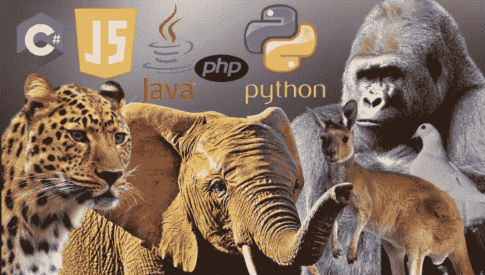

# 如果编程语言是动物？

> 原文：<https://javascript.plainenglish.io/if-programming-languages-were-animals-49da7df15616?source=collection_archive---------8----------------------->

## 难以忽视的迷人关系。

Image by author

当我还是编码界的新手时，我的创造力和想象力正处于巅峰。尽管我喜欢探索和使用所有的编程语言，但我知道一个残酷的事实，那就是它们仅仅是执行逻辑来运行程序的工具。

掌握某种语言仅仅意味着一个人对它的语法和优缺点的熟悉程度。本质上，在编程语言下哼唱是一个人的核心解题技巧。

在 inception，我也对这个问题感到困惑，*“我应该学习什么编程语言？”*最常见的回答是，*“看情况吧。”*嗯，这些模糊的答案当时对我没有任何好处，但却驱使我以自己的方式去更深入地理解每一个答案。

我们已经和动物相处了很长时间。作为一个动物爱好者(猫和狗除外)，我用自己的方式将每种语言与动物联系起来，以记住它们的特征。以下是我对如何看待编程语言的类比和各自的推理。

编程语言中确实存在动物；只需要一双特别的眼睛就能看到，哈哈。快乐阅读！

# 蟒蛇像鸽子

众所周知，这是一种简单快速的语言。它的用户友好性使其可扩展用于各种应用。doves 温顺的天性与 python 同步，因为它提供了出色的库支持。鸽子是和平的象征，Python 也在不同领域如后端开发和人工智能行业中竞争形成和谐。就像鸽子是社会性的，成群结队，大小不一，Python 也为众多系统和应用程序提供帮助。常见的例子包括 SurveyMonkey、Pinterest、YouTube 和 Instagram。

德芙散发着合作与希望。Python 通过关注代码可读性和简单的 OOP 特性来解决这个问题。Dove 的温顺本质类似于 python 的快速测试想法和构建原型的便利性。

鸽子容易受惊，由于速度较慢，python 是一种解释型编程语言，由于全局解释器锁，它的数据库访问层和不成熟的线程属于同一类别。

# Java 像大象

Source: [nytimes](http://www.nytimes.com)

Java 在大型组织中备受青睐，这就是为什么大象看起来是完美的选择。他们可能不是动物王国的领袖，但大象的威严和结构足以保持或动摇相对的联系。Java 同样过于稳定，被公司企业所采用。

此外，大象非常沉着，对自己的自给自足了如指掌。多亏了 JVM 特性，Java 也提供了高度的平台独立性。

大象没有天敌，这种冷静的动物对此心知肚明。类似地，Java 有自己的安全机制来管理对类的访问。它还通过不允许显式指针来做到这一点。

大象在社群中茁壮成长，并通过持续的低频咕噜声与它们的同类保持联系。Java 模仿它，遵循自动垃圾收集和内存分配例程，使它成为分布式计算的缩影。

大象天性和蔼可亲，很少会变得暴力和愤怒。Java 通过其开源库和 API 支持类似的行为，用于各种任务，包括解析 XML、网络和数据库实用程序。

此外，驯服一头大象可能是一件代价高昂的事情，Java 的内存管理和堆栈分配系统也是如此。

# C#作为猎豹

说出任何后端开发，微软都以 C#的形式给出了它的特性。

猎豹有杀手的本能，并得到他们想要的。C#同样可以使用共享的代码库，并且很容易更新。

猎豹被认为是世界上最快的陆地哺乳动物，C#的快速执行和编译时间紧随其后。此外，它们没有指针，不像它们的 C 或 C++系列那样更安全。猎豹喜欢独处，但也喜欢社交，这反映在 C#在 Windows 中的开发能力及其与。NET 库。

C#是面向对象和面向组件的，它最大限度地促进了类型安全。这让我想起了猎豹在外出狩猎和出于某种动机时是多么的害羞和谨慎。

# 作为袋鼠的 JavaScript

Source: [Thoughtco](https://www.thoughtco.com/kangaroo-facts-4685082)

袋鼠有细长有力的腿，这有助于它跳跃得更快。客户端 JavaScript 在竞争中毫不逊色，因为它们无需在 web 浏览器中编译即可运行。袋鼠有 6 种不同的类型，JavaScript 的家族也因为其多功能性而分成许多种类。例如:打字稿、ClojureScript 等。

袋鼠腹部有一个袋子来支撑它们的宝宝；同样，JavaScript 与其他语言配合得非常好，并且有几个像 Greasemonkey 这样的插件来进一步扩展它们的功能。

# PHP 像大猩猩一样

Source: [Conversation](https://theconversation.com/the-more-male-gorillas-look-after-young-the-more-young-theyre-likely-to-have-107137)

我认为大猩猩是未经雕琢的强壮动物，有很大的潜力。PHP 在其生态系统和扩展的强大框架方面也是巨大的，如 cake、Codeigniter 和 Laravel。大猩猩最不注意自己的外表；PHP 在速度和安全性方面也有漏洞，它可以自己改进。当危机或危险出现时，大猩猩有 16 种不同的报警方式。无论是短暂的吠叫，捶胸顿足，还是趾高气扬。这可能与 PHP 使用 Xdebug 的简单调试有关，Xdebug 跟踪调用并允许分析来发现瓶颈。

# 我疯了吗？

说实话，我笑自己变戏法动物编程语言。总之，编程社区的出现及其密集的用例可能会让初学者感到困惑。我希望以轻松的方式概括我所使用的语言的特点。然而，这并不是一个非常详细的指导个人编程之旅的指南，但可以成为获得表面介绍的催化剂。干杯！

想继续关注我和其他优秀作家的作品吗？抓住加入的机会:

 [## 通过我的推荐链接加入灵媒——火星女孩

### 作为一个媒体会员，你的会员费的一部分会给你阅读的作家，你可以完全接触到每一个故事…

medium.com](https://medium.com/@themarsgirl80/membership) 

## **更多来自作者:**

 [## 你最后一年的项目不能是你的产品——句号

### 这个真实的故事是一个改变人生的警告。

levelup.gitconnected.com](https://levelup.gitconnected.com/your-final-year-project-cannot-be-your-product-full-stop-6596e0900b60)  [## 为什么埃隆·马斯克的“两条”学习法则对你不起作用

### 只有 1%的企业家会成功

entrepreneurshandbook.co](https://entrepreneurshandbook.co/why-elon-musks-two-learning-rules-wont-work-for-you-fe87709e1e98)  [## 区块链:肆无忌惮搅动房地产的魔杖？

### 智能合约正在动摇对你有利的投资。

themakingofamillionaire.com](https://themakingofamillionaire.com/blockchain-a-magic-wand-to-outrageously-stir-real-estate-9592603d9d8) 

*更多内容看* [*说白了。在这里注册我们的*](http://plainenglish.io/) [*免费周报*](http://newsletter.plainenglish.io/) *。*