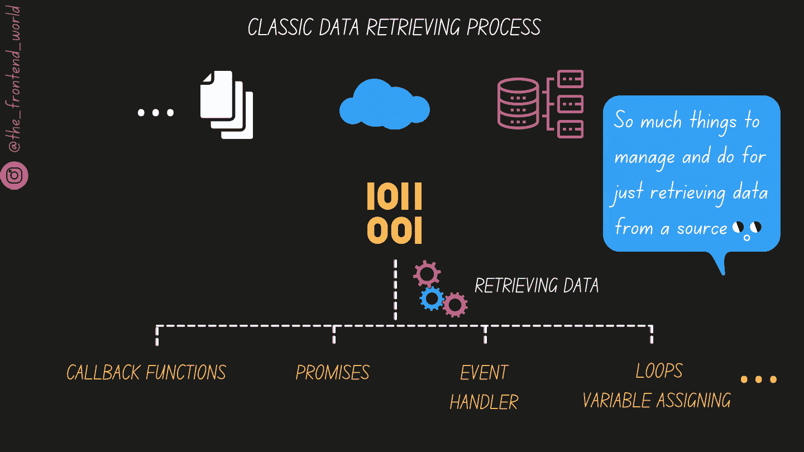
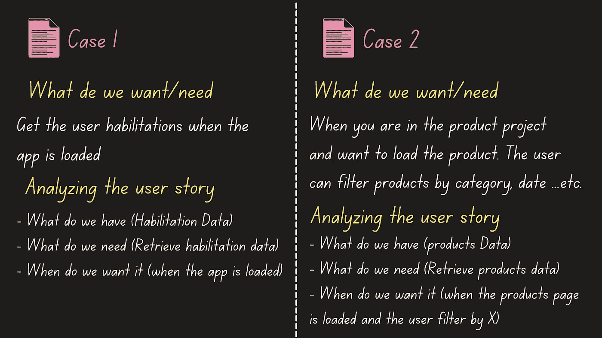
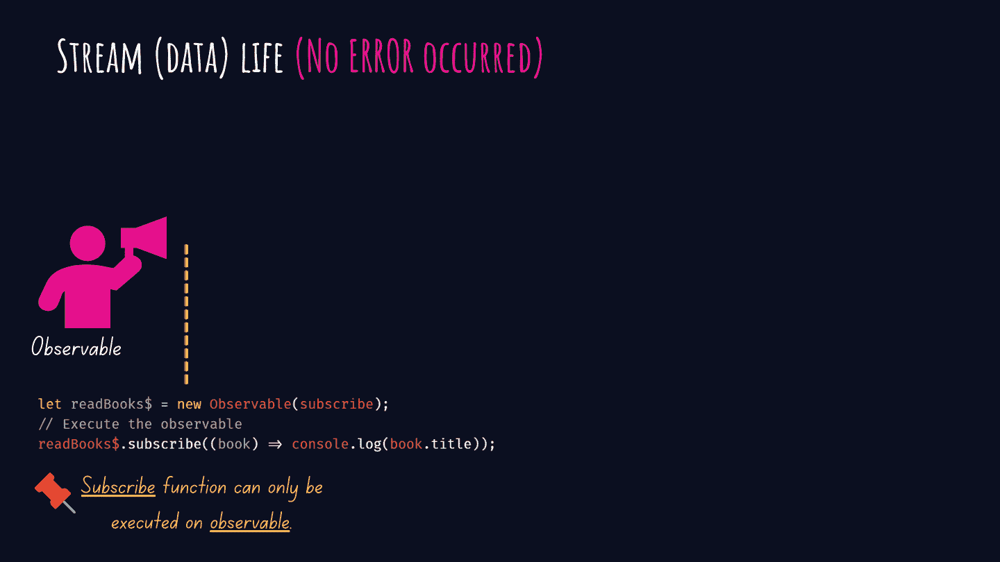
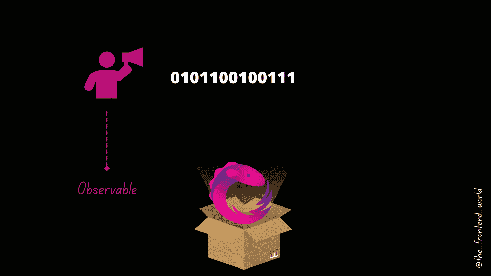

# 如果 RxJS 这个词让你不舒服，这篇文章送给你！

> 原文：<https://javascript.plainenglish.io/if-the-word-rxjs-makes-you-uncomfortable-this-article-is-for-you-b27780240b28?source=collection_archive---------1----------------------->

## RxJS 模式是当今开发人员的必备知识。

RxJS 模式现在很流行，因为 web 应用程序中的数据管理和操作对每个应用程序都至关重要。

谁没有从 API 或应用程序中的任何来源检索数据？在本文中，我将介绍:

*   上下文、数据
*   RxJS 以及为什么使用它？
*   什么时候用？
*   奖金( ***窃窃私语:结束时*** )

我在这篇文章中传递的最重要的信息是 RxJS 的大视图，通过我的动画和解释风格让你熟悉和舒适！

> **这篇文章有点长，但相信我，它是值得的。**
> 
> **准备好了？拿一杯咖啡，你或水，请给我你的思想和你的注意力！**

# 一、语境

故事从一个叫做**数据的关键词开始。**没有数据就没有 app。在网络世界中，数据是异步的。当您调用一个 API 或数据源时，会有连接时间、查询时间、互联网速度时间…以及更多使数据异步检索的变量。

***异步*** 是指我们没有立即接收到数据，在得到数据之前无法停止 app。所以我们所做的就是调用和做其他事情，直到我们得到结果(数据)，并在回调函数中用它做我们想做的事情。

以下是在 RxJS 之前，经典的数据检索方法是如何工作的，以及为什么它是痛苦的:

By FAM

这个过程是痛苦的。更容易出错，长时间调试。仍然没有提到操作部分，将结果格式化为您的应用程序所需的对象。因此，使用这种经典方法，我们需要从 A 到 Z 手动处理大量数据。

RxJS 通过其 ***非常、非常、非常*** 丰富的 API，为数据检索和操作提供了一个更加简化、可读性更强的解决方案，来拯救开发人员。

顺便说一下，RxJS 受到了[设计模式的启发:可重用面向对象的元素](https://www.amazon.com/Design-Patterns-Elements-Reusable-Object-Oriented/dp/0201633612)。我不打算详细介绍这本书的概念，因为我的文章的目标是给你一个关于 RxJS 的清晰概念，所以让我们专注于这个目标。(耳语:如果你要求的话，也许在另一篇文章中)。

好吧，好吧:

*   我们知道传统的数据检索是多么的痛苦和耗时
*   RxJS 带来了什么让事情变得更简单？

这是下一部分。

# 二- RxJS

在继续介绍 RxJS 带来的变化之前，让我们先快速了解一下它意味着什么。

*   ***R:*** 代表无功
*   ***X:*** 代表分机
*   ***JS:*** 当然，我们的流行语言 JavaScript ( *窃窃私语:嗯，事实上，rjs 库是用 TypeScript 编写的，但最后仍然是 JavaScript*😉)

## 三个短语中的 RxJS 模式是什么？

*   ***声明性数据访问模式***
*   **动作模式上的*检索***
*   ***动作模式上的形状(操纵我前面已经讲过的数据)***

## **现在，RxJS 模式方法有哪些变化？**

By FAM

`***subject***`是一个可观测值列表，可以为多个 观察者产生相同的值。也称`***multicast***`。

`***Observable***`的工作是当新的价值观出现时。他立即通知 ***他的***`***observer***`*。与主体的区别在于`***Observable***`可以为一个 ***单个***`***observer***`*产生价值。也称`***unicat***`。**

**`***his***`表示订阅该可观察对象的观察者(*可观察对象不是疯子，他不会大声喊叫，我把这个信息告诉了每个人……*😁)**

**观察者实际上除了订阅发送他需要的数据并等待数据的可观察对象之外什么也不做。(*懒汉*)**

**如果你熟悉承诺，那么你可能会想(嗯，这看起来很像一个承诺，只是另一个花哨的名字，不是吗？👿)**

**嗯，你说得对，这很相似，但承诺有其局限性。它不是一个每次都能更新的信息流。承诺回答 ***一个值*** 。这里我们进入一个重要的问题，即 ***“何时使用 RxJS？”*****

# **III-何时使用 RxJS(承诺或可观察方法)**

**RxJS 是一种超级被动的方法，很受欢迎。这并不意味着我们应该忘记承诺，只使用 rjs。承诺仍然有它的位置。让我给你两个场景:**

****

**By FAM**

****每个案例的合适解决方案是什么？****

**我从一位有能力的老师那里学到了这种分析 3 个主要问题的方法，我很高兴我做到了。我与你分享它，因为它对我有很大的帮助。我希望对你也是如此。**

*   ****我们有什么？****
*   ****我们需要什么？****
*   **我们什么时候要？**

**这非常有助于找到要实施的正确解决方案。**

## **案例 1**

**在这个场景中，我们有每个用户的适应训练数据。因此，需要一个 **HabilitationService** 来检索给定用户的权限。但是这里最重要的是 ***当*** 动作应该在什么时候触发的问题。**

**1-当应用程序加载时，用户被重定向到身份验证页面。**

**2-用户通过身份验证。然后，我们可以根据用户权限加载应用程序。**

**3-用用户应该看到和访问的正确内容显示应用程序。**

**4-就是这样，我们只需要用户适应训练一次(在开始的时候)**

## *****解*****

**在这种情况下，一个承诺就足以实现这一需求。这是因为我们只需要调用 HabilitationService 一次就可以获得登录用户的权限。**

## **案例 2**

**在这种情况下，我们仍然需要获取数据。这次是产品列表。我们的数据库上有产品。我们知道我们想要在产品页面上显示这些产品。这里的不同因素是**时*时。*** 我们希望在打开产品页面时获得产品列表，这还不是我们希望能够根据用户标准过滤产品列表的全部。**

## **解决办法**

**如案例 1，将需要一个产品服务。但这次我需要一个可观察的人。加载时，该页面将按照默认标准过滤产品。每当用户更改过滤器时，我们会将新的标准发送到产品 API，新的数据会通知我们的观察者，产品列表也会更新。**

# **【额外收获】—操纵数据和塑造数据呢？**

**如果您一直关注我，您会注意到我谈到了 RxJS 如何简化整个过程，包括操纵我们从数据源获得的结果。**

**这要感谢丰富的 RxJS ***操作者。*** 那是让我爱上 RxJS 的点之一。**

## **RxJS 世界里的算子是什么？**

**算子只是操纵由可观察对象产生的数据的函数。它的力量依赖于返回另一个可观测的。为什么？因为它会返回一个新的可观察值，所以您可以快速地将您的数据提炼和重塑为您所需要的。您的数据不会在使用该服务的组件中进行处理，但会接收准备显示的数据！构建应用最重要的原则之一是:分离关注点。服务工作是联系 API 并为您准备数据。该组件准备好数据并显示它。**

## **[快速信息]**

**Angular 团队已经决定将 RxJS 包含在 Angular 中，并在整个框架中大量使用它(不需要在 Angular app 上安装 RxJS)。像谷歌这样的大公司是不会做出这样的决定的，不是吗？谷歌对 RxJS 的潜力和增长充满信心。**

# **最后的想法…**

**我当然不是在推销 RxJS 的使用。我告诉过你一些事实。默认情况下，这不是最好的解决方案(正如我们在两个场景中看到的)。对于企业应用程序，我认为不使用它们是不可避免的。**

**对于每个刚接触 RxJS 的人来说，不要害怕它。观察者只不过是一个简单的对象，它实现了三种方法(`next()`、`error()`和`complete()`)。如果你有一个实现这些方法的对象，那么你就有了一个观察者。同样的道理也适用于可观察的事物。您可以通过用`Observable.create()`方法创建自己的来定制它们。**

**我将在下一篇文章中介绍一个实用指南，其中包含具体的技术示例和大量代码🤖**

*****【更新】——如约而至！*****

**[**一级**](https://levelup.gitconnected.com/practical-rxjs-guide-to-learn-rxjs-for-life-part-i-63645a10100f?source=your_stories_page-------------------------------------) **已出，短预告:****

****

**By FAM (All rights reserved)**

**[**二级出，**](/practical-rxjs-guide-to-learn-rxjs-for-life-part-ii-8e7b2fd84de7?source=your_stories_page-------------------------------------) **预告片:****

****

**By FAM (All rights reserved)**

**[**三级**](/practical-rxjs-guide-to-learn-rxjs-for-life-88f2ee508d5c?source=your_stories_page-------------------------------------) **正出****短预告:****

****

**By FAM (All rights reserved)**

****终于，四级快到了！****

***【更新】:4 级出***

** [## 实用 RxJS 指南终身学习 RxJS！

### 第 4 级:深入理解 RxJS 模式(高级++)

javascript.plainenglish.io](/practical-rxjs-guide-to-learn-rxjs-for-life-58cd5c7f2b68)** 

****抱歉**让这篇文章有点长。这通常不是我的风格，但相信我，这是值得的。 ***RxJS 是每一个开发者必备的，*** 不仅仅是前端。RxJS 模式也适用于 Java 和其他技术。**

**对它有一个全面的了解对于用它编码是至关重要的；否则，我们会看到事情不工作，不知道为什么，从而在调试上浪费了大量时间。**

**亲爱的读者，感谢你在我生命中的存在。**

****让我们联系一下** [**中**](https://medium.com/@famzil/)**[**Linkedin**](https://www.linkedin.com/in/fatima-amzil-9031ba95/)**[**脸书**](https://www.facebook.com/The-Front-End-World)**[**insta gram**](https://www.instagram.com/the_frontend_world/)**[**Youtube**](https://www.youtube.com/channel/UCaxr-f9r6P1u7Y7SKFHi12g)**或************

******参见我新出的关于网络要素和一般文化的电子书。******

*******更多内容请看*[***plain English . io***](http://plainenglish.io/)******