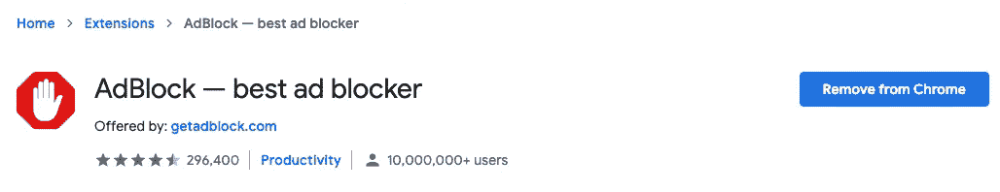

# 如果你是一名程序员，对自己作为员工的收入不满意，试试这些

> 原文：<https://javascript.plainenglish.io/if-youre-a-programmer-dissatisfied-with-your-income-as-an-employee-try-these-42da33a126af?source=collection_archive---------12----------------------->

## 现在就开始在家工作赚钱。

Photo by [Chiara Daneluzzi](https://unsplash.com/@danez1?utm_source=medium&utm_medium=referral) on [Unsplash](https://unsplash.com?utm_source=medium&utm_medium=referral)

如果你是一个优秀的程序员，并且想靠你的工作来赚钱，这些内容会很有帮助。在这篇文章中，你会发现如何成为一名程序员赚钱的不同方法。

# **1。成为自由程序员**

Image credit: Screenshot by the author.

对于任何想开始通过编程赚钱的人来说，这是一个很有价值的想法。

如今，你可以找到几个自由职业者的网站，并注册提供他们的编程服务。此外，一些著名的网站，如 Upcity.com 和 Glassdoor.com，为你提供了在互联网上轻松编程赚钱的机会。

你可以在上面提到的这些网站上注册并找到某项工作需要程序员的人。你应该只申请和提供你的服务给多人来换取金钱。

# **2。创建网站和应用程序进行销售**

你是一个有能力创建惊人和美丽的网站的程序员吗？如果是，要知道你在编程领域挣钱的可能性很大。您可以为个人或公司创建网站，并将其销售给他们的客户。

作为网站程序员的另一种赚钱方式是为特定目的创建专业网站，优化它们，然后卖给有兴趣拥有自己网站的人。

你可以使用社交媒体为你的网站做广告和寻找客户。或者，你可以通过开发和销售不同用途的网站来创建在线业务。

你可以利用 Flippa.com 来销售你的应用程序或网站。**。**

# **3。创建网站赚钱**

除了创建网站销售，你还可以创建自己的某个主题或特定目的的网站，并利用货币化平台从中获利。

你可能已经注意到，今天互联网上有各种各样由程序员开发的网站，每个月都赚了很多钱。所以从编程中赚钱真的是一个很赚钱的想法。

你可以使用像 Google Adsense 这样的平台将你的网站货币化，通过这个平台显示的点击量和浏览量来赚钱。

# **4。创建游戏**

游戏是一种有效的放松方式。然而，游戏开发者并没有被排除在从他们惊人的创造中赚钱的可能性之外。

所以你可以用你的游戏赚钱。你所要做的就是为公司展示广告，然后收到钱作为回报。

# **5。开发插件或扩展**

也可以通过为 WordPress 或者 Google chrome 扩展开发插件，用编程挣钱。嗯，插件有额外的平台特性，这使得它们的使用很有趣。

所以，如果你的插件有 WordPress 用户非常感兴趣的特性，你肯定能从中获得很多钱。你可以用免费包开发插件来吸引用户的兴趣，用付费包开发更高级的功能。

事实上，你真的可以从中赚很多钱，因为考虑到你的插件的特点和优势，计划的价格将是你的选择。

想象一下，如果 Adblock 是基于订阅的，至少每月 1 美元。

Image credit: Screenshot by the author.

# **6。为网站/博客创建平台创建主题**

作为程序员，另一个赚钱的方法是为 Blogger、WordPress、Wix 等平台开发主题。,

你可以利用你的知识创造主题，吸引这些平台用户的注意力和兴趣，并确保他们以你自己确定的价格购买。

除了美观和吸引人之外，主题还需要可编辑，并具有丰富的功能，从而增加更多人购买的机会。

【Elegantthemes.com】例如查查 T2。

# **7。将您的应用货币化**

如果你为自己开发应用程序，但不出售它们，要知道也有可能从中获利。

如今，访问量最大的应用程序(大多)都有公司广告，它们的管理员从广告公司那里获得资金。

但是，你也可以利用广告平台通过点击量和浏览量来赚钱。比如 Google AdMob 就是一个平台，提交你的申请，收到真金白银。但是，您需要访问您的应用程序才能获胜。因为你有越多的权限，你就有越多的钱。

# **8。参与其他程序员的项目**

一些程序员有丰富的项目创意，可以赚很多钱，但这对于一个程序员来说可能非常复杂和困难。

然后，需要邀请其他程序员来帮助他们开发这个项目。因此，如果你收到这样的邀请，不要拒绝，接受它并收取一定的费用来帮助开发这个项目，或者达成协议，在项目结束并开始赚取一些零钱后接收金钱。

# **9。竞赛**

作为一名程序员，另一种赚钱的方式是参加编程竞赛。如果你觉得自己有能力参加竞赛，这是一种你可以选择的通过编程赚钱的方式。

首先，你可以访问 Codechef.com 和 Topcoder.com，参加比赛，在编程领域赚钱。

# **10。创建一个 YouTube 频道**

如果你是一个有能力教其他人编程的程序员，这个想法很适合你。YouTube 是一个视频网站，一个在线电视，在这里你可以创建自己的频道来教授某个主题，并从中获得报酬。

因此，你可以教很多人如何编程，并从谷歌广告、在线推广或捐赠的视频课程中赚钱。

# **11。建立一个编程博客怎么样？**

在编程领域创建一个博客可以让你赚到比你想象的更多的钱。从博客中赚钱的方法有很多，但展示广告是最常见的。

也许你已经在几个编程博客的不同地方看到过编程广告。这些广告来自希望提高品牌知名度的公司。然而，博客所有者从这些广告中获得佣金。

你也可以进一步探索这个想法，并建立一个关于编程的博客，提供编程技巧，并通过访问获得利润，因为没有访问。显然，你什么也得不到。

你可以从这些想法中选择一个，现在就开始在家工作赚钱，确保额外收入。这篇文章中提到的一些想法可能对你有用，但对其他人无效。因此，你应该评估这些想法，找出哪些对你开始用编程赚钱有用。

*更多内容尽在*[***plain English . io***](http://plainenglish.io/)