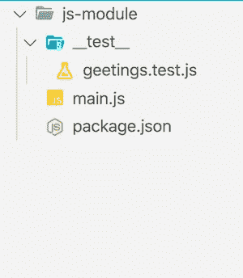
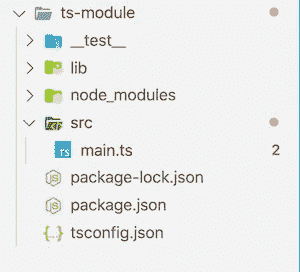

# 我不再使用 JavaScript 了

> 原文：<https://javascript.plainenglish.io/im-not-using-javascript-anymore-6851c707b3d1?source=collection_archive---------3----------------------->


PC: embroker

在过去的几年里，我几乎停止了编写 JavaScript。你可能会问为什么。不代表我不喜欢 JavaScript。但是，有一个更好的 JavaScript 版本， **TypeScript** 。是的，我已经开始用 TypeScript 开发我所有的库和应用程序。它也包括后端。

在本文中，我将尝试回答为什么应该使用 TypeScript 而不是 JavaScript 这个问题。本文不讨论 JavaScript 的优点和缺点。而不是只关注 TypeScript 中好的部分。


## 第一章。开始

你可能知道，每个故事都有开始的地方。很久以前我就从事打字工作。然而，有时我不喜欢它。有时候，我觉得，这太难维持，所以我跳过它。然而，当我开始研究[棱角分明的](https://angular.io/)时。我没有忽略打字稿特权。所有代码都是用 TypeScript 编写的。甚至例子都是用打字稿给出的。TypeScript 是 Angular 的第一个也是最后一个选择。所以我必须提高我的打字稿知识。

我的第一反应是不好。这只是我，我不喜欢事情强加给我。但正如我提到的，我别无选择。因为那时我们正在一个大图书馆工作。我必须支持许多利益相关者(在这种情况下是开发人员)。很快我意识到，代码越长越大。它减少了我花时间解释事情的努力。我的第一印象就是这样改变的。

## 第二章。如何以及从哪里开始

好了，现在我开始喜欢 TypeScript 了。事情仍然不清楚。我是技术负责人之一。我必须创建新的库和实用程序。做某件事很容易。但是从头开始构建需要您对该语言的理解。虽然，TypeScript 是 JavaScript。但是，生命周期有点不同。创建 JavaScript 需要一些其他的**。js** 文件和一个[节点包管理器(npm)](https://www.npmjs.com/) 。巴别塔，如果你想用最新的 ECMA 标准来写代码的话。



**folder structure**

如您所见，您有一个包含源代码的 **main.js** 。 **__test__** 包含所有的测试用例以及 **package.json** ，要打包的元数据。

```
**// main.js**const greetings = (name) => `Hello, ${name}`;module.exports = {
  greetings,
};**// package.json**{
  "name": "js-module",
  "version": "1.0.0",
  "description": "",
  "main": "main.js",
  "scripts": {
    "test": "node __test__/geetings.test.js"
  },
  "keywords": [],
  "author": "xdeepakv",
  "license": "ISC"
}**// geetings.test.js**const assert = require("assert");
const { greetings } = require("../");assert.strictEqual(greetings("Deepak"), "Hello, Deepak");
```

很简单对吧。是的，也许这是这个世界上最简单的模块之一。但是 TypeScript，你需要一些额外的 decorators(文件)比如 [TypeScript config](https://www.typescriptlang.org/docs/handbook/tsconfig-json.html) 。您确实需要设置编译器选项。

一开始，TypeScript 社区是新的。所以我很难找到正确的配置。与此同时，许多人在 T2 面临类似的问题。基本的 TypeScript 资源还可以。但是，仅仅用适当的 CI/CD 来构建库是不够的。

**注意:**我将在后面的章节中解释分步向导来构建 TypeScript 模块。暂时拿着啤酒。

## C 半抗原 3。建造什么

经过长时间的研究和讨论，我们最终确定了我们的库的启动/搭建。下一个问题是，我们应该使用 TypeScript 构建什么。只有基本的前端库。我们确实有一些命令行工具，一些后端应用程序。我们应该如何制定选择语言(js/types)的指南？因为我们已经从上次的工作中得到了积极的反馈。所以我们决定尽可能多地建造。我们开始构建库，react 组件，CLI 工具，甚至我更进一步。我用 TypeScript 和 GraphQL 构建了一些后端应用。如果你想了解更多，请查看我的文章[build-a-scalable-graph QL-server-using-TypeScript](https://deepak-v.medium.com/build-a-scalable-graphql-server-using-typescript-and-apollo-server-4c116ed1425e)。

## 第四章。为什么使用 TypeScript

JavaScript 中不好的部分在 TypeScript 中得到了解决，变成了好的部分。开玩笑的。TypeScript 并没有试图解决 JavaScript 不好的部分。然而，它试图最小化由那些坏零件引起的错误/失误。在另一种意义上，它通过提供更好的支持来补充 JS 不好的部分。

## 第五章。打字稿的优点

1.  **开始一个新的项目配置:** TypeScript 有 [CLI](https://www.typescriptlang.org/download) 在项目中创建新的配置。`tsc --init`
2.  **支持所有浏览器和 ECMA 标准:** TypeScript [编译器选项](https://www.typescriptlang.org/tsconfig#compilerOptions)你可以提供目标 ECMA 标准。
3.  **定义源文件夹(包含):**自从在 node.js 上工作，一切都是”。js”。最大的挑战是将源代码与脚本的其余部分分离开来。TypeScript config 使它变得非常简单。它还支持包含和排除选项。同时有了 [**路径**](https://www.typescriptlang.org/tsconfig#paths) 的支持，你就不用再写冗长的导入语句了。
4.  对严格规则的支持:在使用 TypeScript 之前，我必须使用 [**eslint**](https://eslint.org/) 和另一个 linter 模块来启用一些基本规则，比如避免空值。然而，TypeScript 也支持这样的基本规则。有很多这样的[规则](https://www.typescriptlang.org/tsconfig#alwaysStrict)可以重用。如果你正在寻找更多的规则。您可能想要检查 [typescript-eslint](https://github.com/typescript-eslint/typescript-eslint) 来用 typescript 扩展 **eslint** 。
5.  **向后兼容性:** TypeScript 由微软提供支持。它的社区非常强大。他们经常发布，同时他们有更好的向后兼容性。现在，从一个版本到另一个版本的过渡非常顺利(当我使用 TypeScript 2 时，情况并非如此)。
6.  **JavaScript 支持:**如果你用的是 TypeScript，不代表你不能用 JavaScript。总之，TypeScript 是 JS 的超集。TypeScript 支持 JavaScript。你只需要在 tsconfig 中启用 **allowJS** 标志。
7.  **JavaScript 的超集:**这是我开始使用 TypeScript 的最大关键点。打字稿总是在前面，并与 ECMA 标准对齐。当 ECMA 标准发布新的规格。它是在浏览器中实现之前以类型脚本的方式添加的。对于那些不知道 ECMA 标准的人。请阅读这个维基。

**例子:**

*   [类](https://www.typescriptlang.org/docs/handbook/classes.html)
*   [公共、私有和受保护修饰符](https://www.typescriptlang.org/docs/handbook/classes.html#public-private-and-protected-modifiers)
*   [枚举](https://www.typescriptlang.org/docs/handbook/enums.html)
*   [字符串模板](https://www.typescriptlang.org/docs/handbook/basic-types.html#string)
*   `[async](https://www.typescriptlang.org/docs/handbook/release-notes/typescript-1-7.html#asyncawait-support-in-es6-targets-node-v4)` [/](https://www.typescriptlang.org/docs/handbook/release-notes/typescript-1-7.html#asyncawait-support-in-es6-targets-node-v4) `[await](https://www.typescriptlang.org/docs/handbook/release-notes/typescript-1-7.html#asyncawait-support-in-es6-targets-node-v4)` [支持 ES6 中的目标(节点 v4+)](https://www.typescriptlang.org/docs/handbook/release-notes/typescript-1-7.html#asyncawait-support-in-es6-targets-node-v4)
*   [生成器](https://www.typescriptlang.org/docs/handbook/release-notes/typescript-2-3.html#async-iteration)/异步迭代器 ts 2.3
*   ES6 导入

要阅读更多关于 TypeScript 中引入的变化/特性的信息，请阅读 [this](https://github.com/Microsoft/TypeScript/wiki/Breaking-Changes) 。

## 第六章。快乐结局/续…外卖

像其他故事一样，这段旅程也有自己的结局。到目前为止，我对 TypeScript 的使用很满意。但这并不意味着，我已经到此为止了。我开始寻找另一种语言，比如 Deno，并探索各种选择。但是，这个社区还很年轻，还需要时间来成长。但似乎很有希望。我相信它会持续更久。


Photo by [Alex](https://unsplash.com/@alx_andru?utm_source=medium&utm_medium=referral) on [Unsplash](https://unsplash.com?utm_source=medium&utm_medium=referral)

## 如何创建脚本模块

正如我所承诺的，我将一步一步地告诉你如何创建一个 TypeScript 模块。下面是将上述 create JavaScript 模块转换为 TypeScript 的步骤。

**1。添加打字稿** : `npm i — save-dev typescript`

**2。初始化类型脚本配置:** `npx tsc --init`

**3。更新文件夹结构:**



ts-module

**4。将基本配置更新为 tsconfig.json:**

```
{
  "compilerOptions": {
    "target": "es5",
    "module": "commonjs",
    "strict": true,
    "esModuleInterop": true,
    "rootDir": "./src", **/* define src directory*/**
    "outDir": "./lib" **/* define js output directory*/**
  }
}
```

**5。在 *package.json* 和 *main.ts* :** 中添加构建脚本

```
**// main.ts****export const greetings = (name: string) => `Hello, ${name}`;****// package.json**{
  "name": "js-module",
  "version": "1.0.0",
  "description": "",
  **"main": "lib/main.js",**
  "scripts": {
    **"build": "tsc",**
    "test": "node __test__/geetings.test.js"
  },
/// rest of the code.}
```

您已经创建了一个基本的类型脚本库。要创建高级模块，我将推荐使用 [tsdx: Zero config CLI](https://github.com/formium/tsdx) 。

谢谢，我希望你喜欢这篇文章。请竖起大拇指支持和关心。干杯！

## 更新:

1.  已更新 5.5(严格规则)— **tslint** 已失效/被取消。感谢[戈登](https://medium.com/u/43cdde8f004?source=post_page-----6851c707b3d1--------------------------------)的提醒。