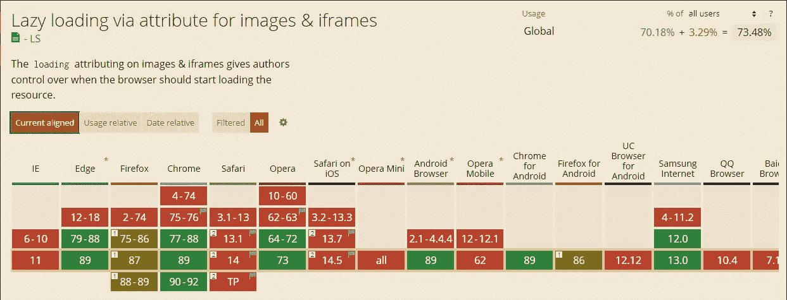

# 使用 HTML 不使用任何 JavaScript 的图像延迟加载

> 原文：<https://javascript.plainenglish.io/image-lazy-loading-using-html-without-any-javascript-8cbae93f7aea?source=collection_archive---------9----------------------->

## 让我们通过仅使用 HTML 延迟加载我们的图像来提高性能。


Photo by [Jefferson Santos](https://unsplash.com/@jefflssantos?utm_source=medium&utm_medium=referral) on [Unsplash](https://unsplash.com?utm_source=medium&utm_medium=referral)

如今，大多数 web 开发人员使用大量的图片，以使网站对用户更具吸引力。但是，与其他元素相比，图像的尺寸更大，加载时间也更长。想象一下，一个页面上有 10 张图片，这将完全降低你的网站速度，影响性能。

这就是为什么延迟加载这个术语开始起作用了。它允许我们仅在用户滚动到元素时加载元素(仅当它们在视口中可见时)。因此，这会阻止一次加载所有元素。它将只加载必要的元素。这对性能和页面加载时间都有好处。

在本文中，我们将向您展示如何在不使用 JavaScript 的情况下仅使用 HTML 来延迟加载您的图像。所以让我们开始吧。

# HTML 示例

在我知道可以使用 HTML 延迟加载图像之前，我已经在 JavaScript 中使用了[交叉点观察器 API](https://developer.mozilla.org/en-US/docs/Web/API/Intersection_Observer_API) 来做这件事。在我看来有点复杂。如果您对使用交叉点观察器 API 感兴趣，可以在我下面的文章中查看。

[](/lazy-loading-images-with-vanilla-javascript-9e5e5a246df2) [## 用普通 JavaScript 延迟加载图像

### 通过延迟加载图像提高性能

javascript.plainenglish.io](/lazy-loading-images-with-vanilla-javascript-9e5e5a246df2) 

幸运的是，现在我们有了一个可以在 HTML 中使用的本地惰性加载 API。这要简单得多，你只需要在你的图像标签中使用属性`loading="lazy"`。

这里有一个例子:

```
****
```

就这样，现在图像只有在视口中可见时才会加载(当用户滚动到它时)。你只需要定义属性`loading`并给它赋值`lazy`。

有三个值可以传递给属性`loading`:

*   *lazy* :仅当图像在视口中可见时加载图像(当用户可以看到它时)。
*   *急切*:如果要直接加载图像。
*   *自动*:浏览器默认。

除此之外，我们在 HTML 中使用的这个惰性加载 API 带有另一个属性`onload`。该属性将函数作为一个值。

下面是一个例子:

```

```

属性`onload`只会在图像加载时调用警告功能。

看看下面的 Codepen 示例:

Codepen by the author.

正如您在 Codepen 示例中看到的，只有当图像可见并且用户滚动到它时，图像才会加载。这就是为什么当你滚动到图像时，警告会在图像加载后出现。

# 浏览器支持

不幸的是，属性`loading`并不被所有的浏览器所支持。但是，您仍然可以在支持的浏览器中使用它。

添加它不会影响不支持的浏览器中的图像。



Capture by author from [CanIuse](https://caniuse.com/).

# 结论

如果你想提高性能和减少加载时间，延迟加载图片是你的网站需要考虑的重要事情之一。

在 HTML 中使用 lazy loading 属性对我来说更容易，即使不是所有的浏览器都支持它。

感谢您阅读这篇文章。希望你觉得有用。

**更多阅读**

[](/10-useful-web-development-tools-that-you-should-know-a1a0277b91f3) [## 你应该知道的 10 个有用的网络开发工具

### 你可能不知道的了不起的网络开发工具。

javascript.plainenglish.io](/10-useful-web-development-tools-that-you-should-know-a1a0277b91f3) 

*更多内容尽在*[***plain English . io***](https://plainenglish.io/)